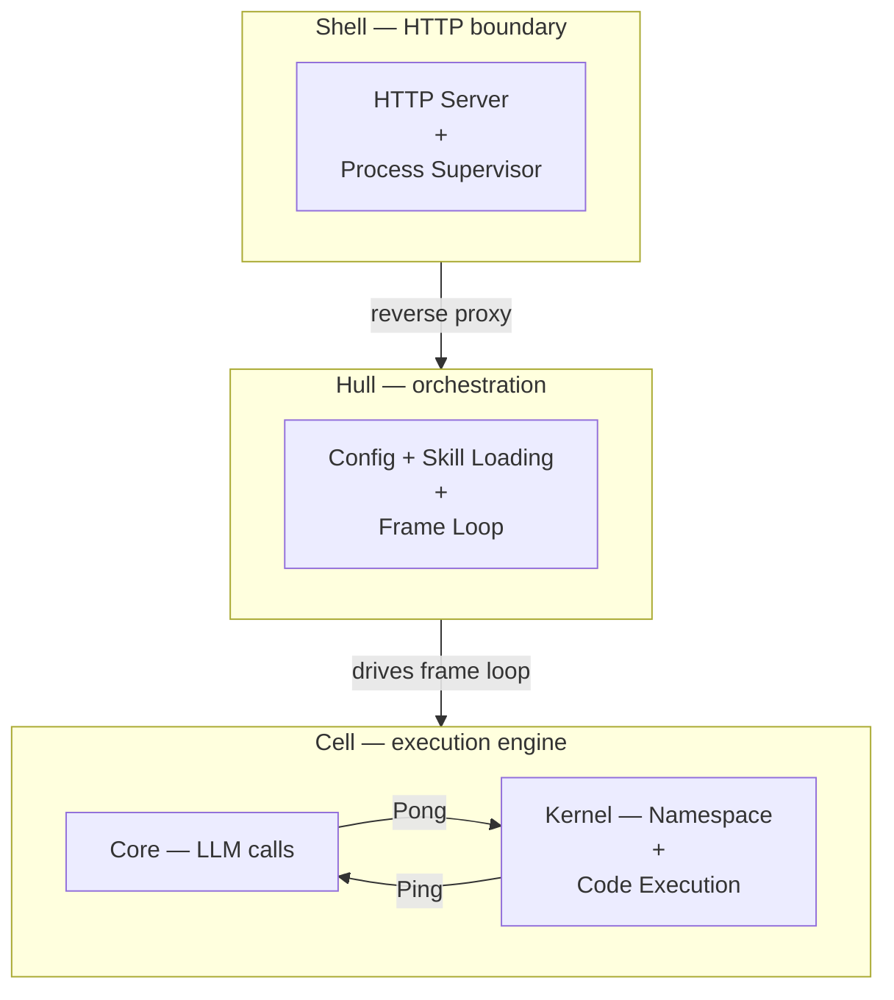

# Vessal — Vessel for AI

**Turing-complete · Embodied · Efficient · Evolving**

An agent runtime where Python is the only way to act.

[](LICENSE)[](https://python.org)

[Whitepaper](references/whitepaper/)

[Quick Start](#quick-start) · [Architecture](#architecture) · [Skills](#skills) · [CLI Reference](#cli-reference) · [Configuration](#configuration) · [Container Deployment](#container-deployment) · [HTTP API](#http-api)


## The Problem

Every major agent framework gives the LLM a menu of functions and lets it pick. When the agent needs composition, conditionals, or loops, the framework discovers that tool-calling cannot express basic program logic — so it reinvents `if`, `for`, and `def` in its own ad-hoc way. The gap between a finite automaton and a Turing machine cannot be crossed by adding more menu items.

**Vessal's answer: give the agent a Code, not a Menu.** Python is the sole action mechanism — not "a code interpreter among other tools," but the *only* way to act. The upper bound of what the agent can do is the programs the model can write. That bound rises with every generation of LLMs. The framework itself never becomes the bottleneck.


## Quick Start

### Prerequisites

- Python >= 3.12
- [uv](https://docs.astral.sh/uv/) (recommended) or pip
- An API key from any OpenAI-compatible provider (OpenAI, Anthropic via proxy, DeepSeek, local models, etc.)

### Install globally (once)

```bash
# Recommended
uv tool install vessal

# Or with pipx
pipx install vessal
```

### Create a new agent

```bash
vessal init my-agent
cd my-agent
```

`vessal init` automatically creates a `.venv` and installs dependencies. Pass `--no-venv` to skip this step.

> **Tip:** `vs` is a shorthand for `vessal`. All commands work with either name — `vs start`, `vs stop`, `vs skill init`, etc.

### Configure the LLM

```bash
cp .env.example .env
```

Edit `.env` with your provider details:

```
OPENAI_API_KEY=sk-...
OPENAI_BASE_URL=https://api.openai.com/v1
OPENAI_MODEL=gpt-4o
```

Any OpenAI-compatible API works. For example, DeepSeek:

```
OPENAI_API_KEY=sk-...
OPENAI_BASE_URL=https://api.deepseek.com
OPENAI_MODEL=deepseek-chat
```

### Start the agent

```bash
vessal start
```

You'll see:

```
Shell server started: http://0.0.0.0:8420
  Log viewer: http://localhost:8420/logs
  Chat UI: http://127.0.0.1:8420/skills/chat/
```

**Open the Chat UI in your browser** — that's your conversation interface. Type a message, and the agent wakes up, writes Python, executes it, observes the results, and replies. Frame by frame, it works through your request until it's done.

The Log viewer shows the raw frame stream — what the agent sees, thinks, and executes each step.

### What just happened?

Vessal runs in a loop called **SORA** (State, Observation, Reasoning, Action):

1. **State** — A Python namespace (dict) that persists across frames
2. **Observation** — The namespace is rendered into text the model can read
3. **Reasoning** — The LLM reads the observation and decides what to do
4. **Action** — The LLM writes Python code; the system executes it, mutating state

Each cycle is one **frame**. The agent keeps running frames until it decides to sleep. Your next message wakes it again. See the [whitepaper](references/whitepaper/) for the full derivation.


## Architecture

Three layers. Strict one-way dependency.

**Cell** is the execution engine — render state, call the model, execute code. Inside Cell, **Core** handles LLM calls and **Kernel** manages the namespace. Swap Core and you swap the model. The namespace Kernel holds *is* the agent.

**Hull** is the orchestration layer — reads configuration, loads Skills, drives the frame loop. Hull turns a generic engine into a concrete agent with a name, a role, and capabilities.

**Shell** is the boundary — HTTP server, process supervisor, companion launcher. It exposes the web UI and API endpoints, and proxies everything to Hull.



**The Ping-Pong protocol** is the fixed contract inside Cell. The Kernel renders the namespace into a **Ping** (system prompt + frame history + signals) and sends it to the LLM. The LLM returns a **Pong** (reasoning trace + Python code + optional assertion). The Kernel executes the code and records the result. The protocol never changes — Skills extend capabilities, models can be swapped, but every frame follows this same structure.

The three together form **ARK** (Agent Runtime Kit). Vessal is a distribution built on ARK: the base system plus standard Skills plus defaults.


## Skills

All agent capabilities come from Skills. ARK provides only the execution mechanism. What the agent can do — and what it can *see* — is determined by its loaded Skills.

A Skill can have up to three layers:

- **Methodology** — A `SKILL.md` guide the LLM reads on demand. Many Skills are pure methodology with no code.
- **Code** — Python methods for things pure code generation can't do (network calls, database ops, hardware control).
- **Perception** — A `_signal()` method that injects summary information into every frame. Load a task Skill and the agent sees task progress; unload it and that information disappears.

### Built-in Skills

| Skill | Description | Default |
|-------|-------------|---------|
| `tasks` | Hierarchical task management | Yes |
| `pin` | Pin namespace variables for observation | Yes |
| `chat` | Web-based chat UI for human conversation | Yes |
| `heartbeat` | Periodic wake-up timer | Yes |
| `memory` | Cross-session key-value storage | |
| `pip` | Install Python packages at runtime | |
| `search` | Web search and page reading | |
| `audio` | Audio-to-text transcription | |
| `vision` | Image understanding | |
| `ui` | Animated agent avatar and interactive page environment | |
| `skill_creator` | Scaffold new Skills from within the agent | |

Enable a Skill by adding it to `hull.toml`:

```toml
[hull]
skills = ["tasks", "pin", "chat", "heartbeat", "memory", "search"]
```

### Creating a Skill

```bash
vessal skill init my-skill
```

This creates a scaffold:

```
skills/my-skill/
    __init__.py     Skill class (tools + signals)
    SKILL.md        Usage guide for the LLM
```

The agent can also create Skills for itself at runtime using the `skill_creator` Skill. See [Chapter 3 of the whitepaper](references/whitepaper/03-skills.md) for the full Skill model.


## CLI Reference

### Essential

| Command | Description |
|---------|-------------|
| `vessal init <name>` | Scaffold a new agent project |
| `vessal start` | Start the agent server (Shell + Hull + companions) |
| `vessal stop` | Stop the agent |

### Skill Development

| Command | Description |
|---------|-------------|
| `vessal skill init <name>` | Create a Skill scaffold directory |
| `vessal skill check <path>` | Validate Skill structure; add `--test` to run tests |

### Container Deployment

| Command | Description |
|---------|-------------|
| `vessal build` | Build a Docker image from the agent project |
| `vessal run <name>` | Start a container from a built image |

### Scripting & Automation

These commands are for programmatic access — shell scripts, CI pipelines, or other programs talking to a running agent.

| Command | Description |
|---------|-------------|
| `vessal send <message>` | Post a message to the agent's chat inbox |
| `vessal read` | Poll the agent's chat outbox for replies |
| `vessal status` | Query agent state (idle/active, frame count) |
| `vessal once --goal "..."` | Single-run mode: inject goal, run one cycle, exit |

All commands accept `--port <N>` (default: 8420) and `--dir <path>` (default: current directory).


## Configuration

### hull.toml

The agent's main configuration file, generated by `vessal init`.

```toml
[agent]
name = "my-agent"
language = "en"

[cell]
max_frames = 100              # Max frames per wake cycle
# context_budget = 128000     # Token budget (match your model's context window)

[core]
timeout = 60                  # LLM call timeout (seconds)
max_retries = 3

[core.api_params]             # Passed through to chat.completions.create()
temperature = 0.7
max_tokens = 4096

[hull]
skills = ["tasks", "pin", "chat", "heartbeat"]
skill_paths = ["skills/"]
# compress_threshold = 50     # Context pressure signal threshold (%)

[gates]
# Safety gate configuration (see Gates section below)
```

### .env

API credentials. Supports any OpenAI-compatible provider:

```
OPENAI_API_KEY=sk-...
OPENAI_BASE_URL=https://api.openai.com/v1
OPENAI_MODEL=gpt-4o
```

### SOUL.md

The agent's identity and behavioral preferences. This file becomes part of the system prompt. The agent can modify `SOUL.md` at runtime to accumulate experience — changes persist across sessions.

```markdown
# my-agent Agent Identity

## Role
You are a general-purpose assistant.

## Behavioral Preferences
- Prefer Python standard library; avoid unnecessary dependencies
- Verify paths exist before operating on files

## Accumulated Experience
(The agent appends learned experience here during runtime)
```

### Gates

Safety hooks that review code before execution and state before sending. Generated by `vessal init` in `gates/`:

- `gates/action_gate.py` — Inspects code before `exec()`. Return `(False, "reason")` to block.
- `gates/state_gate.py` — Inspects rendered state before sending to the LLM. Return `(False, "reason")` to block.


## Container Deployment

```bash
# Build a Docker image (reads agent name from hull.toml)
cd my-agent
vessal build

# Start the container
vessal run my-agent

# Expose on a different port
vessal run my-agent --port 9000

# Pass API keys at runtime (never baked into the image)
vessal run my-agent -e OPENAI_API_KEY=sk-... -e OPENAI_BASE_URL=https://api.openai.com/v1
```

The agent's `data/` directory is persisted in a Docker named volume — container restarts do not lose state.


## HTTP API

A running agent exposes these endpoints on its port (default 8420):

| Endpoint | Description |
|----------|-------------|
| `GET /status` | Agent state (idle/sleeping, frame count, wake reason) |
| `GET /frames?after=N` | Frame stream as JSON (incremental) |
| `GET /logs` | Frame log viewer (HTML) |
| `POST /wake` | Inject a wake event |
| `POST /stop` | Graceful shutdown |
| `GET /skills/chat/` | Chat web UI |
| `POST /skills/chat/inbox` | Deliver a message to the agent |
| `GET /skills/chat/outbox` | Retrieve agent replies |


## Documentation

- [Whitepaper](references/whitepaper/) — The SORA model, three-layer architecture, Skill model, Frame protocol, cache coordination, and training theory, derived from first principles


## License

Apache License 2.0. See [LICENSE](LICENSE).
