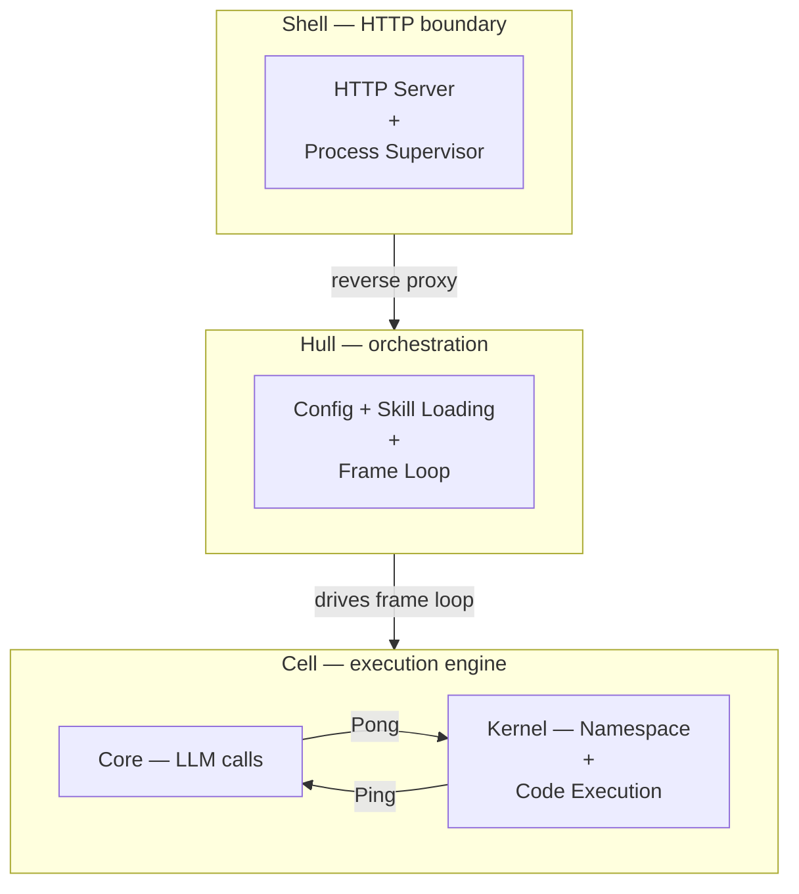
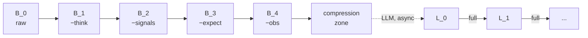

# Vessal — Vessel for AI

**Turing-complete · Embodied · Efficient · Evolving**

An agent runtime where Python is the only way to act.

[](LICENSE)[](https://python.org)

[Whitepaper](references/whitepaper/)

[Quick Start](#quick-start) · [Architecture](#architecture) · [Context Scaling](#context-scaling) · [Skills](#skills) · [SkillHub](#skillhub) · [CLI Reference](#cli-reference) · [Configuration](#configuration) · [Container Deployment](#container-deployment) · [HTTP API](#http-api)


## 🎯 The Problem

Every major agent framework gives the LLM a menu of functions and lets it pick. When the agent needs composition, conditionals, or loops, the framework discovers that tool-calling cannot express basic program logic — so it reinvents `if`, `for`, and `def` in its own ad-hoc way. The gap between a finite automaton and a Turing machine cannot be crossed by adding more menu items.

**Vessal's answer: give the agent a Code, not a Menu.** Python is the sole action mechanism — not "a code interpreter among other tools," but the *only* way to act. The upper bound of what the agent can do is the programs the model can write. That bound rises with every generation of LLMs. The framework itself never becomes the bottleneck.


## ⚡ 60-Second First Agent

```bash
uv tool install vessal         # or: pipx install vessal
vessal create                  # interactive wizard — Enter to accept defaults
cd my-agent && vessal start
# Console opens at http://127.0.0.1:8420/console/
```

That's it. Open the Console in your browser, chat in the left pane, watch the agent's current frame in the right pane (collapsible). Edit `SOUL.md` and the next turn picks it up without restart. Edit `skills/*.py` and the affected skill reloads in place. Changes to `hull.toml` surface as a yellow "restart required" banner in the Console top bar.

---

## 🚀 Quick Start

### Prerequisites

- Python >= 3.12
- [uv](https://docs.astral.sh/uv/) (recommended) or pip
- An API key from any OpenAI-compatible provider (OpenAI, Anthropic via proxy, DeepSeek, local models, etc.)

### Install globally (once)

```bash
# Recommended
uv tool install vessal

# Or with pipx
pipx install vessal
```

### Create a new agent

```bash
vessal create
cd my-agent
```

`vessal create` runs an interactive wizard that scaffolds the project, sets up `.env`, and gitignores your secrets. For a non-interactive scaffold, `vessal init my-agent` also works and accepts `--no-venv` to skip virtual-env creation.

> **Tip:** `vs` is a shorthand for `vessal`. All commands work with either name — `vs start`, `vs stop`, `vs skill init`, etc.

### Configure the LLM

If you didn't fill the three LLM values during `vessal create`, edit `.env` directly (the wizard writes it with English placeholders):

```
OPENAI_API_KEY=sk-...
OPENAI_BASE_URL=https://api.openai.com/v1
OPENAI_MODEL=gpt-4o
```

Any OpenAI-compatible API works. For example, DeepSeek:

```
OPENAI_API_KEY=sk-...
OPENAI_BASE_URL=https://api.deepseek.com
OPENAI_MODEL=deepseek-chat
```

### Start the agent

```bash
vessal start
```

You'll see:

```
Vessal agent running.
  Console: http://127.0.0.1:8420/console/
  Stop:    vessal stop
```

**Open the Console in your browser** — that's your unified interface. The left pane is chat; the right pane shows the agent's current frame (collapsible). Type a message, and the agent wakes up, writes Python, executes it, observes the results, and replies.

### What just happened?

Vessal runs in a loop called **SORA** (State, Observation, Reasoning, Action):

1. **State** — A Python namespace (dict) that persists across frames
2. **Observation** — The namespace is rendered into text the model can read
3. **Reasoning** — The LLM reads the observation and decides what to do
4. **Action** — The LLM writes Python code; the system executes it, mutating state

Each cycle is one **frame**. The agent keeps running frames until it decides to sleep. Your next message wakes it again. See the [whitepaper](references/whitepaper/) for the full derivation.


## 🏗️ Architecture

Three layers. Strict one-way dependency.

**Cell** is the execution engine — render state, call the model, execute code. Inside Cell, **Core** handles LLM calls and **Kernel** manages the namespace. Swap Core and you swap the model. The namespace Kernel holds *is* the agent.

**Hull** is the orchestration layer — reads configuration, loads Skills, drives the frame loop. Hull turns a generic engine into a concrete agent with a name, a role, and capabilities.

**Shell** is the boundary — HTTP server, process supervisor, companion launcher. It exposes the web UI and API endpoints, and proxies everything to Hull.



**The Ping-Pong protocol** is the fixed contract inside Cell. The Kernel renders the namespace into a **Ping** (system prompt + frame history + signals) and sends it to the LLM. The LLM returns a **Pong** (reasoning trace + Python code + optional assertion). The Kernel executes the code and records the result. The protocol never changes — Skills extend capabilities, models can be swapped, but every frame follows this same structure.

The three together form **ARK** (Agent Runtime Kit). Vessal is a distribution built on ARK: the base system plus standard Skills plus defaults.


## 📈 Context Scaling

Every agent framework eventually hits the same wall: the frame log keeps growing, and no context window is large enough. Chopping the oldest frames off the front is the easy answer — and the wrong one. It destroys the prefix cache that inference engines rely on, and it silently loses the continuity the agent needs to stay coherent over long sessions.

Vessal's frame stream is built for the long run. Compression runs automatically inside the Kernel on two clocks. **Mechanical stripping** peels fields off aging frames on a fixed schedule — `think`, then `signals`, then `expect`, then `observation` — each removed at a bucket boundary, with zero LLM calls involved. **Semantic summarization** fires at layer boundaries: once a bucket of stripped frames fills, the model folds it into a structured record and promotes it to the next layer. Layers compound: four frames collapse into one L₀ record, four L₀ records into one L₁, and so on. The structure is LSM-tree compaction applied to a context window.



Amortized cost is O(1) per frame, capacity grows logarithmically, and ten million frames fit in eight to ten layers. Every raw frame is also appended to static storage as it is produced, so nothing is ever lost — compression only shapes the active working window. The derivation and cache economics live in [whitepaper §6.4.2](references/whitepaper/06-cache.md).


## 🧩 Skills

All agent capabilities come from Skills. ARK provides only the execution mechanism. What the agent can do — and what it can *see* — is determined by its loaded Skills.

A Skill can have up to three layers:

- **Methodology** — A `SKILL.md` guide the LLM reads on demand. Many Skills are pure methodology with no code.
- **Code** — Python methods for things pure code generation can't do (network calls, database ops, hardware control).
- **Perception** — A `_signal()` method that injects summary information into every frame. Load a task Skill and the agent sees task progress; unload it and that information disappears.

### Built-in Skills

| Skill | Description | Default |
|-------|-------------|---------|
| `tasks` | Hierarchical task management | Yes |
| `pin` | Pin namespace variables for observation | Yes |
| `chat` | Web-based chat UI for human conversation | Yes |
| `heartbeat` | Periodic wake-up timer | Yes |
| `memory` | Cross-session key-value storage | |
| `pip` | Install Python packages at runtime | |
| `search` | Web search and page reading | |
| `audio` | Audio-to-text transcription | |
| `vision` | Image understanding | |
| `ui` | Animated agent avatar and interactive page environment | |
| `skill_creator` | Scaffold new Skills from within the agent | |

Enable a Skill by adding it to `hull.toml`:

```toml
[hull]
skills = ["tasks", "pin", "chat", "heartbeat", "memory", "search"]
```

### Skill Directory Layout

Each agent project uses a three-directory layout:

```
skills/
  bundled/   — preinstalled Skills (copied from Vessal at init time)
  hub/       — Skills downloaded from SkillHub
  local/     — Skills you develop yourself
```

### SkillHub

SkillHub is the curated Skill registry at [vessal-ai/vessal-skills](https://github.com/vessal-ai/vessal-skills).

```bash
# Search for skills
vessal skill search web

# Install a skill from SkillHub
vessal skill install browser

# Install from a Git URL (unverified)
vessal skill install https://github.com/someone/my-skill.git

# Update all hub-installed skills
vessal skill update

# List installed skills
vessal skill list --installed

# Uninstall a hub skill
vessal skill uninstall browser
```

The agent can also search and install Skills at runtime via `skills.search_hub('keyword')` and `skills.download_skill('name')`.

### Creating a Skill

```bash
vessal skill init my-skill
```

This creates a scaffold in `skills/local/my-skill/`:

```
skills/local/my-skill/
    __init__.py           Re-exports the Skill class
    skill.py              SkillBase subclass with protocol conventions
    SKILL.md              Usage guide for the LLM (v1 frontmatter)
    requirements.txt      Skill-local Python dependencies
    tests/__init__.py
    tests/test_my-skill.py  Placeholder test
```

The generated `SKILL.md` uses the v1 frontmatter format:

```yaml
---
name: my-skill
version: "0.1.0"
description: "(functional description, ≤15 words)"
author: ""
license: "Apache-2.0"
requires:
  skills: []
---
```

Run `vessal skill check <path>` to validate a Skill before publishing. Add `--test` to also run its test suite.

To publish to SkillHub: `vessal skill publish <path>`

The agent can also create Skills for itself at runtime using the `skill_creator` Skill. See [Chapter 3 of the whitepaper](references/whitepaper/03-skills.md) for the full Skill model.


## 📋 CLI Reference

### Essential

| Command | Description |
|---------|-------------|
| `vessal init <name>` | Scaffold a new agent project |
| `vessal start` | Start the agent server (Shell + Hull + companions) |
| `vessal stop` | Stop the agent |
| `vessal --version` | Print installed version |
| `vessal check-update` | Check PyPI for a newer release |
| `vessal upgrade` | Upgrade vessal (auto-detects uv / pipx / pip) |

### Skill Development

| Command | Description |
|---------|-------------|
| `vessal skill init <name>` | Create a Skill scaffold in `skills/local/` |
| `vessal skill check <path>` | Validate Skill structure; add `--test` to run tests |
| `vessal skill publish <path>` | Validate and guide submitting a PR to SkillHub |

### SkillHub

| Command | Description |
|---------|-------------|
| `vessal skill search <keyword>` | Search the SkillHub registry |
| `vessal skill list` | List Skills grouped by bundled/hub/local; add `--installed` for hub only |
| `vessal skill install <name\|url>` | Install from SkillHub or a Git URL; add `-g` for global install |
| `vessal skill uninstall <name>` | Remove a hub-installed Skill |
| `vessal skill update [name]` | Re-fetch from original source; omit name to update all |

### Container Deployment

| Command | Description |
|---------|-------------|
| `vessal build` | Build a Docker image from the agent project |
| `vessal run <name>` | Start a container from a built image |

### Scripting & Automation

These commands are for programmatic access — shell scripts, CI pipelines, or other programs talking to a running agent.

| Command | Description |
|---------|-------------|
| `vessal status` | Query agent state (idle/active, frame count) |
| `vessal once --goal "..."` | Single-run mode: inject goal, run one cycle, exit |

All commands accept `--port <N>` (default: 8420) and `--dir <path>` (default: current directory).


## ⚙️ Configuration

### hull.toml

The agent's main configuration file, generated by `vessal init`.

```toml
[agent]
name = "my-agent"
language = "en"

[cell]
max_frames = 100              # Max frames per wake cycle
# context_budget = 128000     # Token budget (match your model's context window)

[core]
timeout = 60                  # LLM call timeout (seconds)
max_retries = 3

[core.api_params]             # Passed through to chat.completions.create()
temperature = 0.7
max_tokens = 4096

[hull]
skills = ["tasks", "pin", "chat", "heartbeat"]
skill_paths = ["skills/bundled", "skills/hub", "skills/local"]

[gates]
# Safety gate configuration (see Gates section below)
```

### .env

API credentials. Supports any OpenAI-compatible provider:

```
OPENAI_API_KEY=sk-...
OPENAI_BASE_URL=https://api.openai.com/v1
OPENAI_MODEL=gpt-4o
```

### SOUL.md

The agent's identity and behavioral preferences. This file becomes part of the system prompt. The agent can modify `SOUL.md` at runtime to accumulate experience — changes persist across sessions.

```markdown
# my-agent Agent Identity

## Role
You are a general-purpose assistant.

## Behavioral Preferences
- Prefer Python standard library; avoid unnecessary dependencies
- Verify paths exist before operating on files

## Accumulated Experience
(The agent appends learned experience here during runtime)
```

### Gates

Safety hooks that review code before execution and state before sending. Generated by `vessal init` in `gates/`:

- `gates/action_gate.py` — Inspects code before `exec()`. Return `(False, "reason")` to block.
- `gates/state_gate.py` — Inspects rendered state before sending to the LLM. Return `(False, "reason")` to block.


## 🐳 Container Deployment

```bash
# Build a Docker image (reads agent name from hull.toml)
cd my-agent
vessal build

# Start the container
vessal run my-agent

# Expose on a different port
vessal run my-agent --port 9000

# Pass API keys at runtime (never baked into the image)
vessal run my-agent -e OPENAI_API_KEY=sk-... -e OPENAI_BASE_URL=https://api.openai.com/v1
```

The agent's `data/` directory is persisted in a Docker named volume — container restarts do not lose state.


## 🌐 HTTP API

A running agent exposes these endpoints on its port (default 8420):

| Endpoint | Description |
|----------|-------------|
| `GET /status` | Agent state (idle/sleeping, frame count, wake reason) |
| `GET /frames?after=N` | Frame stream as JSON (incremental) |
| `POST /wake` | Inject a wake event |
| `POST /stop` | Graceful shutdown |
| `GET /skills/chat/` | Chat web UI |
| `POST /skills/chat/inbox` | Deliver a message to the agent |
| `GET /skills/chat/outbox` | Retrieve agent replies |


## 📚 Documentation

- [Whitepaper](references/whitepaper/) — The SORA model, three-layer architecture, Skill model, Frame protocol, cache coordination, and training theory, derived from first principles


## 📄 License

Apache License 2.0. See [LICENSE](LICENSE).
