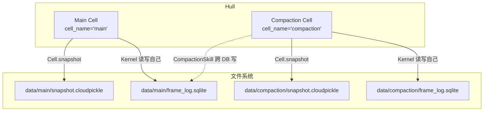
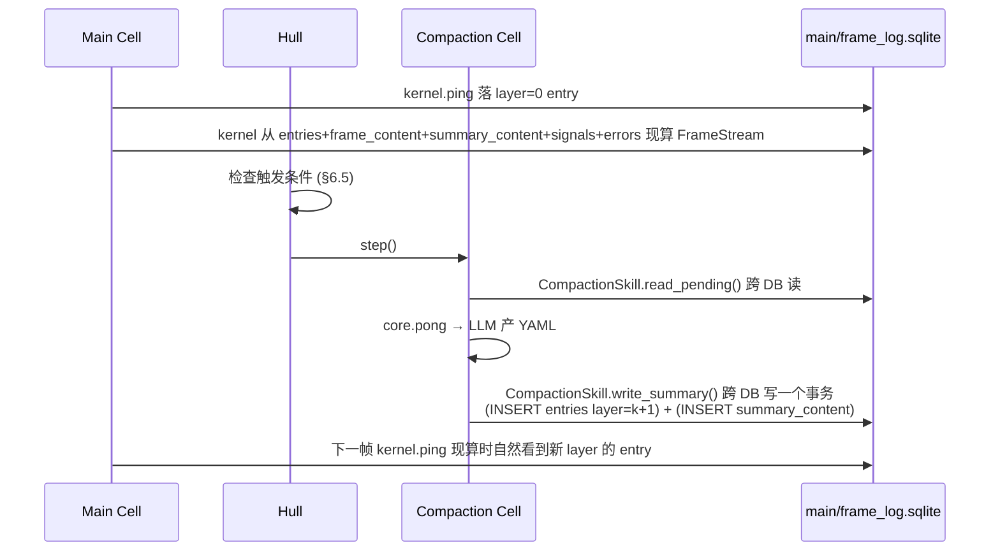
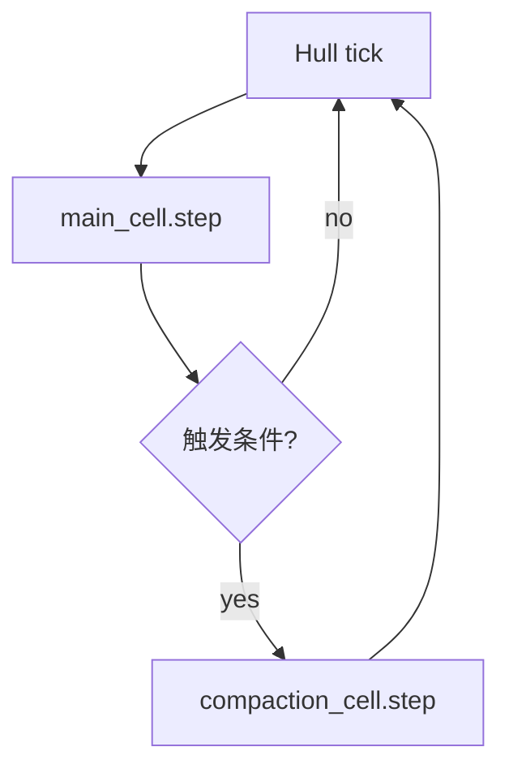
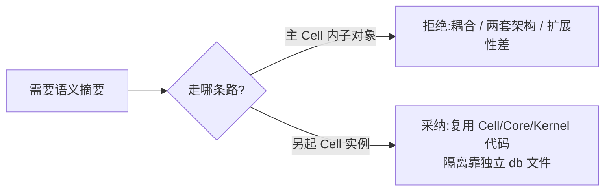

# 06 · 压缩 Cell

§00 提到 Hull 里另有一个完整的 Cell 实例做语义摘要，跨 DB 把 layer≥1 的 entry 写进主 Cell 的 frame_log。本章把这件事拆开：压缩 Cell 是什么（§6.1）；它怎么跨 DB 写主 Cell 的 frame_log（§6.2）；CompactionSkill 的 API（§6.3）；Schema v1 YAML（§6.4）；Hull 怎么调度两条循环（§6.5）；失败与降级（§6.6）；为什么压缩是另一个 Cell 而不是主 Cell 内部的类（§6.7）。

## 6.1 压缩 Cell 是什么

**压缩 Cell = 另一个完整的 Cell 实例**，复用同一份 `Cell` / `Core` / `Kernel` 代码，只是构造参数不同：

| 维度 | 主 Cell | 压缩 Cell |
|---|---|---|
| `cell_name` | `"main"` | `"compaction"` |
| `system_prompt` | 业务 Agent 的系统提示 | 压缩专用：「读这些待压条目，输出 schema v1 YAML 摘要写进主 Cell 的 frame_log」 |
| 预装 Skill | 业务 Skill（chat / search / vision / ...） | 只有 `CompactionSkill`；它持有主 Cell 的 db_path |
| `db_path` | `<project>/data/main/frame_log.sqlite` | `<project>/data/compaction/frame_log.sqlite` |
| `llm_config` | Agent 用的模型（可贵一点） | 压缩模型（可便宜 / 上下文长） |

不是新类、不是特殊类。Hull 里 `cells: list[Cell]`，主 Cell 和压缩 Cell 都在里面：



两个实例各自走完整的 `Cell.step() → state_gate → core.pong → action_gate → kernel.ping` 五步。主 Cell 生成业务 operation；压缩 Cell 生成的 operation 是"调 CompactionSkill 把待压条目摘成 YAML、写主 Cell 的 frame_log"。

## 6.2 跨 DB 写：CompactionSkill 拿主 Cell 的 db_path

每个 Cell 的 Kernel **只认自己的 db**（kernel/§4.3 的硬约束）。所以压缩 Cell 的 Kernel 不能也不该写主 Cell 的文件。跨 DB 写发生在 **CompactionSkill 内部**：它构造时接受主 Cell 的 db_path，自己 `sqlite3.connect(...)` 第二条连接：

```python
class CompactionSkill(BaseSkill):
    def __init__(self, main_db_path: str):
        self._main_db_path = main_db_path
        # 主 db 的连接在每次 write 时 open / close,或开持久连接 + WAL —— 实现细节
```

**唯一的单向依赖**：压缩 Cell 知道主 Cell 的 db 文件路径（构造期由 Hull 注入参数），主 Cell 完全不知道压缩 Cell 存在。压缩挂了主 Cell 不联动；主 Cell 挂了压缩 Cell 自己也没事。



两条循环的全部沟通走一份 SQLite 文件（main/frame_log.sqlite）+ append-only 协议。**没有任何 Python 对象共享**：G / L / Kernel 实例 / Cell 实例都各自一套。

### 一致性

主 Cell 的 Kernel 每帧 ping 渲染时在**一个 SQLite 事务里**读完五张表（kernel/§4.10）。压缩 Cell 写主 db 时也在一个事务里 INSERT entries + INSERT summary_content。SQLite 的事务隔离保证主 Cell 永远看不到"entries 行存在但 summary_content 还没提交"的半成品状态 —— 写者要么全成要么全滚。

SQLite 默认 WAL 模式允许"一写多读"并发，所以主 Cell 的现算读不会被压缩 Cell 的写阻塞太久（毫秒级），反之亦然。

## 6.3 CompactionSkill 的 API

```python
class CompactionSkill(BaseSkill):
    def read_pending(self) -> PendingView:
        """从主 db 拉所有还没被上层覆盖的 entry,按层分组。"""
        ...

    def write_summary(self, layer: int, n_start: int, n_end: int,
                      schema_version: int, body: str) -> None:
        """事务内 INSERT entries (layer, n_start, n_end) +
                       INSERT summary_content (layer, n_start, schema_version, body)。"""
        ...
```

只有两个方法。压缩 Cell 的 LLM 在 operation 里组合调用：

```python
# 压缩 Cell 第 17 帧的 operation 示例(LLM 在 think 里已经决定要做什么)
view = compaction.read_pending()
group = view.groups[0]                       # 选 L_0 上若干条做成 L_1
yaml_body = """
range: { n_start: 12, n_end: 15 }
intent: "安装 lighthouse 并跑审计"
operations:
  - { n: 12, what: "pip install lighthouse-web" }
  ...
"""
compaction.write_summary(
    layer=group.layer + 1,
    n_start=group.n_start,
    n_end=group.n_end,
    schema_version=1,
    body=yaml_body,
)
```

### 没有 `advance_watermark`

老版本设计里有第三个方法 `advance_watermark(layer, upto)` 来推进"已压到哪"的指针。**这次砍掉**：上层 entry 的存在本身就是"下层这段已经被消费"的证据（kernel/§4.9 R2）。多一张 watermark 表是冗余 —— 写过 layer=1 的 [12..15] entry 之后，主 Cell 现算 frame_stream 时自动跳过 layer=0 的 [12..15] 区间。

少一张表，少一类不一致风险。

### `PendingView` 结构

```python
@dataclass
class PendingGroup:
    layer:   int                # 源层(0 表示原帧组合,1 表示 L_1 条目组合,...)
    n_start: int                # 组内最小 n
    n_end:   int                # 组内最大 n
    items:   list[dict]         # 组内每条 entry 的原始内容,按 n 升序

@dataclass
class PendingView:
    groups: list[PendingGroup]
```

`items` 里每项的字段由源层决定：

- **layer=0**：每项是一帧的关键字段（`think` / `operation` / `expect` / `obs_stdout` / `obs_error_format_text` / `verdict_value` / signals 摘要）。CompactionSkill 已按预算裁剪过（典型：每帧给压缩 LLM ~500 tokens 而不是原始 stdout 全文）。
- **layer≥1**：每项是 `summary_content.body` 整段 YAML 文本。压缩 LLM 读的是"上一层摘要"。

`groups` 的边界由 `read_pending()` 内部按 `k`（默认 4）划分。LLM 在 think 里决定本帧处理几个 group（通常一两个，避免一帧超预算）。

### 原子保证

每次 `write_summary` 调用就是一个自包含的 SQLite 事务：方法内部 open conn → `BEGIN` → INSERT entries → INSERT summary_content → `COMMIT` → close。LLM 在一条 operation 里多次调用 `write_summary` 会产生多个独立提交的事务；如果 operation 中途失败，已提交的 entries 不会回滚 —— 这是正确行为，因为每个 layer-N entry 都是一条自洽的（entries 行 + summary_content 行）原子记录，残留半个 layer 的危险不存在。

Kernel 不参与这件事。CompactionSkill 用 stdlib `sqlite3.connect` + `BEGIN`/`COMMIT`，全部责任在 Skill 自己手里 —— BaseSkill 协议、Kernel 的 frame finalization 都没有为此扩展（R6 · Native Mechanism First：sqlite3 已经提供了原子提交）。

```python
def write_summary(self, layer, n_start, n_end, schema_version, body):
    conn = sqlite3.connect(self._main_db_path, isolation_level=None)
    conn.execute("PRAGMA foreign_keys=ON")
    try:
        conn.execute("BEGIN")
        conn.execute(
            "INSERT INTO entries(layer, n_start, n_end) VALUES (?,?,?)",
            (layer, n_start, n_end),
        )
        conn.execute(
            "INSERT INTO summary_content(layer, n_start, schema_version, body) "
            "VALUES (?,?,?,?)",
            (layer, n_start, schema_version, body),
        )
        conn.execute("COMMIT")
    except Exception:
        conn.execute("ROLLBACK")
        raise
    finally:
        conn.close()
```

## 6.4 Schema v1 YAML

`summary_content.body` 是一段 YAML，schema_version=1 时五个顶层键固定：

```yaml
range:      { n_start: 12, n_end: 15 }
intent:     "一句话说明这组 entry 在干什么"
operations: [{ n, what }, ...]                # 按 n 递增；layer≥1 时 n 是源 entry 的 n_start
outcomes:   [{ n, ok, note }, ...]            # 每个 operation 的结局
artifacts:  [{ name, type, from_n }, ...]     # 产出物、关键变量,供下一层链接
notable:    ["便于回忆的事实", ...]
```

骨架固定，措辞自由。**Kernel 不解析这个 YAML**（kernel/§4.2 不变量 I-3 写死）—— 它只是个字符串，主 Cell 的 Core Composer 直接把整段文本塞进下一帧的 messages。

为什么是 YAML 不是 JSON：

1. 多行可读，人工审阅友好。
2. LLM 产出更稳定（不用担心字符串里的引号逃逸）。
3. 折叠到下一层时（layer=2 read_pending 拉 layer=1 的 body），整段文本直接送给 LLM 即可，不需要重新序列化。

### Schema 演化

`summary_content.schema_version` 是整数。如果将来 Schema v2 改了顶层键，**新版本的 layer≥1 entry 标 v2，老版本的 entry 仍标 v1**。Kernel 不做兼容工作 —— 它只透传字符串。Composer 拿到 v1 / v2 混合的 entry 列表时，按各自版本格式化（这是 Composer 的事，不是 Kernel 的事）。

## 6.5 Hull 调度策略

Hull 同时管两个 Cell。**主 Cell 每 tick step 一次**（受 Console / Supervisor 控制可能有间隔）。**压缩 Cell 事件驱动**：每次主 Cell 完成一帧后，Hull 检查触发条件：



触发条件就一条：**主 db 里某层有 ≥ k 条尚未被上层覆盖的 entry**。

```sql
-- 检查 layer=L 是否有 k 条没被 layer>L 覆盖的 entry
SELECT COUNT(*) FROM entries e
WHERE e.layer = ?
  AND NOT EXISTS (
    SELECT 1 FROM entries u
    WHERE u.layer > e.layer
      AND u.n_start <= e.n_start
      AND u.n_end   >= e.n_end
  );
```

任一层 L（从 0 开始扫）返回 ≥ k 就调一次 `compaction_cell.step()`。一帧只调一次 —— 即使同时有 layer=0 和 layer=1 累积，也是这次压缩 Cell 的 LLM 自己决定先处理哪个 group；Hull 不做分片。

### 为什么不轮询

轮询方案（"每 100ms 查一下条件"）的三宗罪：

1. **延迟**。主 Cell 刚写完一帧，必须等下一个轮询 tick 才能触发；事件驱动下是 µs 级。
2. **CPU 空转**。没事可做时轮询还在跑 SQL。
3. **复杂度**。轮询要多维护一个定时器状态机，事件驱动是"主 Cell step 完 → 检查 → 可能 step 压缩 Cell"，一条线。

事件驱动的代价是"一条主 Cell 的 step 返回路径上多一次条件检查 SQL"。这是单条小查询，ms 级可忽略。

### `k` 的选择

默认 `k=4`，给"4 条 layer=0 → 1 条 layer=1"、"4 条 layer=1 → 1 条 layer=2"……这条 LSM-style 几何级数。每加一层 4 倍压缩，跨 5 层就是 4^5 = 1024 倍 —— 对应"L_5 一条覆盖 1024 帧"。`k` 写在压缩 Cell 的 system_prompt + CompactionSkill 的 `read_pending` 分组逻辑里。

为什么是 `k=4` 而不是 2 或 8？经验值 —— 4 在"压缩比 vs 摘要保真度"之间是常见甜蜜点。LLM 一次能可靠摘要的输入条数大约就是 3-5 条，再多上下文窗口压力大且摘要质量下降。需要不同 trade-off 时改 system_prompt + 配置即可，不动代码。

## 6.6 共启共停与降级

**共启**：Hull 构造时两个 Cell 一起 new、一起 bootstrap ping、一起加进 `self.cells`。任一构造失败（SQLite 初始化失败、LLM 配置无效、CompactionSkill 找不到主 db_path）→ Hull 整体构造失败。不存在"只起主 Cell 不起压缩 Cell"的半成品。

**共停**：Hull 接到关停信号时，两个 Cell 的 step 都被中断、各自的 SQLite 一起刷盘、各自的 snapshot.cloudpickle 一起写。两个 Cell 是独立 db，关停顺序无关（先 commit 哪个都行）。

**降级**：压缩 Cell 挂掉（LLM 长期失败、Skill 抛异常不断）**不联动主 Cell**：

- 主 Cell 继续跑。Kernel 每帧 ping 现算 frame_stream 时看到的就是"压缩 Cell 最后成功到的状态"。
- layer=0 entry 会越积越多。主 Cell 的 ping 越来越胖（FrameStream 里 layer=0 条目越来越多）。
- 如果 FrameStream 总 token 超出 llm_config 的 context 上限，Core 在 API 层抛 context-too-long。主 Cell 把它当 `protocol_error` 处理，Hull 的调度层有权决定暂停主 Cell、等压缩恢复，或换长上下文模型。

**"压缩挂了只影响体积、不影响正确性"** —— 这是两条循环通过 SQLite 解耦、不共享内存对象的直接结果。如果压缩是主 Cell 内部的对象，它挂了就是主 Cell 挂了。

## 6.7 为什么不是主 Cell 内部的类

考虑过的方案：主 Cell 内部持有一个 `FrameStreamCompactor` 类，由主 Cell 的 step() 第 5 步显式调 `compactor.ingest / project`。被否定，三个理由：

**耦合**。主 Cell 每帧都要"等压缩完再进下一轮"，即使压缩逻辑重、LLM 调用慢也得顶着。行动流程和压缩流程互不相关 —— 差一两帧不影响主 Cell 决策。

**两套架构**。主 Cell 的其他步骤都走 `Core.pong → Kernel.ping` 协议，Compactor 却是完全不同的对象 —— 它自己的 LLM 调用、prompt、state、错误处理全要重写。等于在一个 Cell 里塞两套不同架构。

**扩展性**。未来如果还要"子 Agent"（专门跑搜索 / RAG / 总结），如果走"主 Cell 内部子对象"路子，每加一种都要在 Cell 里开口子；走"另起一个 Cell 实例"的路子，子 Agent 就是 `cells[N]`，复用同一份 Cell 代码，隔离由独立 db 文件保证。

结论：**压缩就是一个 Agent；Agent 的唯一形态是 Cell；所以压缩就是一个 Cell**。没有第二种"特殊类"。



## 6.8 未来扩展：多 Cell 协作

Hull 的 `cells: list[Cell]` 为未来留了口子。同样的模式可以承载：

- **子 Agent**："搜索 Agent"是另一个 Cell，system_prompt 专跑搜索；主 Cell 的 Skill 把任务丢给它、读它 db_path 下的结果。
- **观察者 Cell**："审计 Agent"定期扫主 Cell 的 frame_log，写审计报告。
- **多语言 Agent**：一个英语 Cell 一个中文 Cell，通过特定 Skill 在彼此 db 上读写完成对话。

这些不是现在要实现的东西，但架构上 `list[Cell]` + 独立 db_path + 跨 DB Skill 已经支持。**没有特殊类、没有框架魔法** —— 就是多个 Cell 实例各自独立跑、跨 Cell 通信走 Skill 在文件层握手。

## 本章小结


压缩 Cell = 复用同一份 `Cell` / `Core` / `Kernel` 代码、构造参数不同的另一个 Cell 实例。各自一份 SQLite + snapshot 文件住在 `<project>/data/<cell_name>/`。跨 DB 写发生在 `CompactionSkill` 内部 —— 它持主 Cell 的 db_path、自己开第二条 sqlite3 连接、把 layer≥1 的 entry + summary_content 在一个事务里 INSERT 进主 db。没有 `table_prefix`、没有 `cold_summaries`、没有 `watermark`：layer 字段本身刻画"覆盖到哪"，上层 entry 的存在就是下层被消费的证据。Hull 事件驱动调 `compaction_cell.step()`：主 Cell 每帧后查一次"某层是否累积 ≥ k 条未覆盖 entry"。压缩挂了主 Cell 不联动 —— 唯一可见影响是 frame_stream 变胖。**压缩是一个 Agent，Agent 的唯一形态是 Cell，所以压缩就是一个 Cell**。
