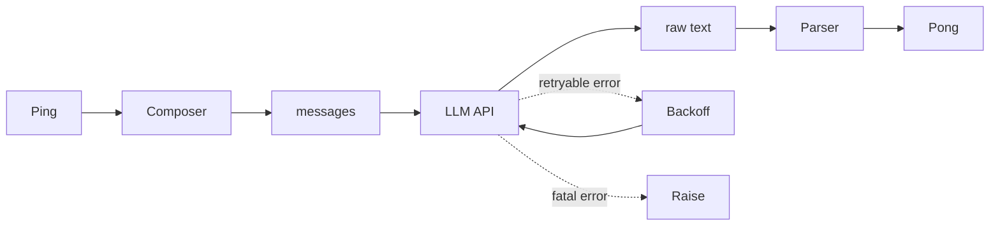
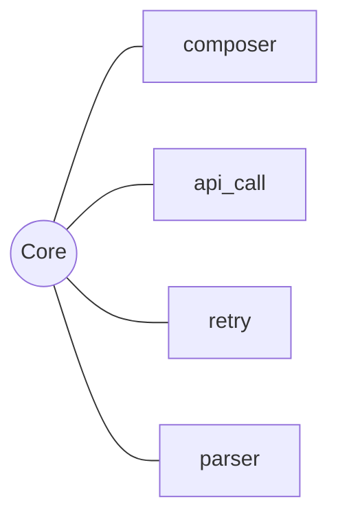

# 00 · 心智模型

Core 是 LLM 的边界适配器。它对外只暴露一个原语 `pong`，每次被调用做一件事：接收 Cell 传入的结构化 Ping，在 Composer 里按固定顺序编排成 OpenAI 兼容的 messages，调 LLM API（失败按分类重试），对返回文本做 `<think>/<action>/<expect>` 标签解析，返回 Pong 结构体。Core 自身无状态；不维护对话历史；不缓存响应；每次调用彼此独立。

本章勾出整体样貌，不展开实现细节。读完应当拿到三件东西：`pong` 这个原语的输入、输出、内部步骤（§0.1）；Core 为什么只吃结构化 Ping、不吃字符串（§0.2）；四个子模块的分工（§0.3）。

## 0.1 原语 pong

`pong(ping, llm_config) -> Pong`。Core 的全部对外表面就这一行签名。

`ping` 是 Cell 传入的结构化 Ping 对象：`system_prompt: str` + `state: PingState(frame_stream: FrameStream, signals: dict[tuple, dict])`。结构的由来见 kernel/§00 §0.1，此处只需知道 state 有两部分 —— 低频不变的 frame_stream（Kernel 每帧从 SQLite 五张表现算的 LSM 风格投影）和每帧重写的 signals（按 `(class_name, var_name, scope)` 聚合）。

`llm_config` 是 Cell 每帧灌进来的 **完整 LLM 调用契约**：`LLMConfig(api_key, base_url, model, api_params)`。四个字段构成一次 LLM 调用所需的全部信息 —— `api_key` / `base_url` 决定打到哪家 endpoint、`model` 决定调哪个模型、`api_params` 决定推理参数（temperature / max_tokens / extra_body / ...）。Core 不读 `os.environ`，不持有"启动期默认值"，每一帧的调用语义完全由当帧传入的 LLMConfig 决定。

为什么把连接参数（api_key / base_url）也放进 llm_config？因为 model 和 endpoint 在 OpenAI 兼容生态里是绑定的：本地 Qwen 走 `192.168.x.x:8001`，Anthropic 走 anthropic.com，Provider 切换天然带着 endpoint 切换。把 endpoint 视为"启动期常量"等于假设"Agent 全生命周期只用一家 Provider"，这与白皮书 §05 多 Provider 适配的目标矛盾。LLMConfig 一致地把四个字段当作"逐帧可变值"对待 —— 即使当前阶段每帧都灌同一个 LLMConfig，未来用 cheap_config / smart_config 做逐帧切换时，零新机制即可启用。

LLMConfig 的字段所有权由 Hull 在 `_init_phase_1` 阶段从 `.env` + `hull.toml` 一次性解析得到，启动时打印一行有效配置（api_key 脱敏）；之后 Cell 持有这个值，每次 `core.step()` 调用时整体作为参数传入。Core 自己不持有 LLMConfig 状态，构造时只接 `timeout` / `max_retries`（网络策略，与 LLM 内容正交）。

返回值 `Pong` 是结构体（白皮书 §4 的 Pong 一级结构）：

```python
@dataclass
class Pong:
    think: str
    action: Action

@dataclass
class Action:
    operation: str    # Python 代码字符串
    expect: str       # 断言代码字符串,可空
```

`pong()` 的内部流程：



四步定序：

1. **Compose**：Composer 按三区顺序（system_prompt / frame_stream / signals）把 Ping 编排成 `[{"role":"system",...}, {"role":"user",...}]` 这样 LLM 能解析的 messages 列表。当前阶段都是文本 content；未来多模态时 user content 可变为 content block 列表。details 见 §01。
2. **API call**：`client.chat.completions.create(model=llm_config.model, messages=..., **llm_config.api_params)`。client 从 `_client_cache` 按 `(api_key, base_url, timeout)` 懒创建。返回 `message.content` 文本。
3. **Retry on classified errors**：APITimeoutError / APIConnectionError / InternalServerError / RateLimitError 走指数退避；其它（AuthenticationError / BadRequestError / ...）立刻抛出。见 §02。
4. **Parse**：`parse_response(text)` 抽取 `<think>/<action>/<expect>`，返回 Pong。ParseError 当作 fatal（不重试），上浮给 Cell。见 §03。

`pong()` 的全部对外功能就这条链。它不决定 Agent 想什么 —— 那是 LLM；不决定什么时候调 —— 那是 Cell；不管 frame_stream / signals 怎么从 SQLite 现算出来 —— 那是 Kernel。

## 0.2 为什么 Core 只吃结构化 Ping

历史上 Core 吃的是已经渲染好的字符串（`cell.py:116-121` 里直接 `"\n\n".join([frame_stream, signals])`）。新设计把这一步挪进 Core —— Composer 是 Core 内部的组件，Ping 以结构体形式过边界。

这个迁移有三个理由：

**理由 1：cache adapter 需要结构信息**。白皮书 §6.4.3 的 adapter pattern 要求 renderer 产出统一中间表示、adapter 按引擎加 cache 标记（Anthropic `cache_control` 打在 system_prompt 末尾；RadixAttention 无需标记；Prompt Cache 按 module 注册）。如果 Core 只收字符串，adapter 就没法在段边界插标记。

**理由 2：多模态扩展点**。当 signals 里某个 skill 的 signal 是 `{"type":"image","data":...}` 而不是文本时，编排 messages 不再是简单的 `"\n\n".join`，而是要构造 `{"role":"user","content":[{"type":"text",...},{"type":"image_url",...}]}`。这种扩展只能由一个专门的 Composer 组件吃下，让 Kernel 继续输出结构化数据、Core 的 Composer 负责翻译。

**理由 3：分工单一**。Kernel 的职责是**代码运行与命名空间**；Core 的职责是**与大模型相关的一切操作**。字符串化是和大模型交互的协议层细节，属于 Core 不属于 Kernel。把它从 Kernel 拆出来挪到 Core，两个子系统的边界干净：Kernel 不认 LLM，Core 不认 Python exec。

后果：Kernel.ping 返回的 Ping 里，`state.frame_stream` 是 `FrameStream` 对象（Kernel 每帧从五张表现算），`state.signals` 是 `dict[tuple, dict]`；Core 的 Composer 负责把这两个结构串成 messages。不变的 `system_prompt` 依然以字符串形态传递 —— 它本来就是预渲染的固定文本。

## 0.3 四个子模块

Core 的内部结构：



**composer**（§01）。结构化 Ping → messages。三区顺序固定：system_prompt / frame_stream / signals；signals 内按 skill 再分区、按 skill 内 signal 子项再分区；每区用横线标题明显分隔。未来多模态扩展点也落在这里。名字取自产出（**messages 的编排器**），不是输入形态 —— 文本与多模态都是它的目标输出。

**api_call**（§02 的一半）。`client.chat.completions.create()` 的薄封装。`model` 取 `llm_config.model`，`messages` 由 Composer 产出，`llm_config.api_params` 整体 `**unpack` 传入；client 按 `(api_key, base_url, timeout)` 从 `_client_cache` 懒创建。记录 prompt_tokens / completion_tokens（usage dict 返给 Cell 由 Cell 写 JSONL）。

**retry**（§02 的另一半）。纯函数模块 `retry.py`：`is_retryable_error(exc) -> bool` 与 `calculate_backoff_seconds(attempt, exc) -> float`。无副作用、可独立测试。retryable 四类：APITimeoutError / APIConnectionError / InternalServerError / RateLimitError。其它一律 fatal。

**parser**（§03）。纯函数模块 `parser.py`：`parse_response(text: str) -> Pong`。正则抽 `<think>/<action>/<expect>` 三个标签；重复标签取最后一个（reasoning 模型在 `<think>` 里可能产出示例 `<action>` 标签，取最后一个是通用容错）；`<action>` 必须存在且非空白，否则抛 ParseError。

四个模块互相独立：composer 不知道 retry；parser 不知道 api_call；retry 是纯函数无依赖；api_call 只通过 openai SDK 调网络。Core 类本身只是它们的 orchestrator。

为什么是这四个、不是更多或更少？因为 LLM 边界的原子职责就这四件事：**输入编排**（composer）、**协议调用**（api_call）、**网络容错**（retry）、**输出反序列化**（parser）。多一个职责意味着侵入 Kernel（命名空间）或 Cell（编排），少一个职责意味着 Core 不完整。

## 0.4 后续章节安排

剩下的章节把 `pong` 原语的每一步都拆到字节级。

§01 composer —— 结构化 Ping → messages 的编排器：三区顺序、信号分区规则、分隔符格式、多模态扩展点。

§02 api_and_retry —— OpenAI 兼容 API 调用细节；`llm_config` 注入规则（model 谁定 / messages 谁定 / 其余谁定 / base_url / api_key 谁定）；可重试分类的判据；指数退避公式；RateLimitError 的 retry-after 字段优先策略。

§03 parser —— `<think>/<action>/<expect>` 正则规则；重复标签取最后一个的容错理由；ParseError 的两种触发条件。

§04 cache_adapter —— 白皮书 §6.4.3 的 Core 侧落地：Anthropic breakpoint 插入点、RadixAttention 零标注路径、Prompt Cache 模块注册接口；三条路径共用同一个 Composer 产出。

§07 digest —— 全部机制的电报体浓缩，便于一页纸 review。

主线阅读顺序 §01 → §02 → §03 → §07。§04 是 §01 的 cache 侧深化，读完主线后单独读。
