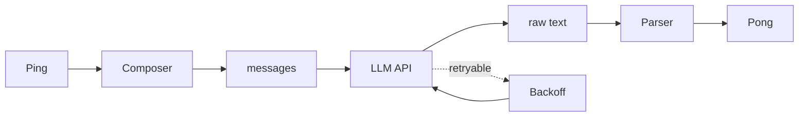

# 07 · 汇总

电报体。一页纸讲完 Core。

## 主循环

`pong(ping, llm_config) → Pong`。一个原语。对外只此一个。

```python
@dataclass
class Pong:
    think: str
    action: Action

@dataclass
class Action:
    operation: str    # Python 代码字符串
    expect: str       # 断言代码字符串,可空
```

一级是 think + action；action 拆 operation + expect。白皮书 §4。

### 四步定序



1. **Compose**：结构化 Ping → messages 列表（§01）。
2. **API call**：`client.chat.completions.create(model, messages, **llm_config)`（§02）。
3. **Retry**：四类可重试错误走指数退避；其它 fatal（§02）。
4. **Parse**：`<think>/<action>/<expect>` 正则抽，返回 Pong（§03）。

Core 无状态。不维护对话历史。不缓存响应。每次调用彼此独立。

## 职责归属

| 参数 | 谁定 | 从哪来 |
|---|---|---|
| `base_url` | 环境 | `OPENAI_BASE_URL` |
| `api_key` | 环境 | `OPENAI_API_KEY` |
| `model` | Core | `OPENAI_MODEL` |
| `messages` | Core | Composer 产出 |
| `temperature` / `max_tokens` / ... | Cell | llm_config |

连接走环境变量，推理参数走 llm_config。换 Provider → 改 env；换参数 → 改 llm_config；Core 代码永不触。

**分工不侵入**：Kernel 负责代码运行与命名空间；Core 负责与大模型相关的一切操作。字符串化是协议层的事，归 Core。

## Composer

结构化 Ping → messages 的编排器。名字取自**产出**，不是输入形态 —— 文本与多模态都产出 messages。

### 三区顺序固定

```
system_prompt → frame_stream → signals
```

按变化频率从低到高。白皮书 §6.3 P2 Stability Layering 的直接推论。前面越稳定、后面越易变，KV cache 命中率才能最大化。

**不变式**：system_prompt 在 message[0]，state 全体在 message[1]。不拆、不交叉、不插 tool_call。

### signals 的二级分区

signals 是 `dict[(class_name, var_name, scope), dict]`。渲染两级：

- **一级**：按 `(class_name, var_name)` 分组。跨 Skill 用 `══════ var (cls) ══════` 强分隔。
- **二级**：Skill 内按 signal 子项分组，用 `── key ──` 弱分隔。

scope（"G"/"L"）不出现在渲染里，只是聚合键的去重维度。

### 分隔符

| 级别 | 格式 |
|---|---|
| 区 | `══════ title ══════`（六个等号） |
| 子项 | `── key ──`（两个长横） |

刻意显眼。LLM 看到 `══════` 就知道区边界，看到 `── ──` 就知道同区内子项。

### 多模态扩展点

单一分发：`_render_value(v)` 看 v 的类型，文本走 JSON-like，图像走 image content block，音频走 audio content block。加模态只改这一个分支 + 新增一个 `_to_xxx_content_block`。Kernel / Cell / parser 都不受影响。

多模态出现时，user content 从字符串变成 content block 列表。Composer 这个名字对两种形态通用。

## api_call

薄到极致。一行 `self._client.chat.completions.create(model=..., messages=..., **llm_config)`。不做参数预处理、不做响应解析、不做缓存、不做日志、不做流式。

usage（`resp.usage`）由 Core 作为 `usage: dict` 返给 Cell，Cell 写 JSONL。Core 自己不碰文件系统。

## retry

纯函数模块 `retry.py`：

```python
def is_retryable_error(exc) -> bool: ...
def calculate_backoff_seconds(attempt: int, exc) -> float: ...
```

### 四类可重试

| 异常 | 理由 |
|---|---|
| APITimeoutError | 瞬时慢 |
| APIConnectionError | 网络抖动 |
| InternalServerError (5xx) | 服务端瞬时故障 |
| RateLimitError (429) | 限流窗口问题 |

其它一律 fatal：AuthenticationError / BadRequestError / NotFoundError / PermissionDeniedError / ParseError / 非 openai 异常。

### 指数退避

```python
BASE_DELAY = 1.0
MAX_DELAY  = 30.0
MAX_RETRIES = 3

delay = min(BASE_DELAY * (2 ** attempt), MAX_DELAY)
```

RateLimitError 优先用响应 header 的 `retry-after`（服务端比客户端准），超过 MAX_DELAY 回退到指数退避。

3 次是延迟 vs 成功率的经验拐点（累计 ~15s，边际收益 < 5%）。

### 纯函数的理由

- **可独立测试** —— 传 exception 入、bool / float 出。
- **分类规则可审计** —— 不与 api_call 纠缠。
- **职责边界干净** —— retry 只答"该重试吗 / 睡多久"。

retry 不知道 Provider、不知道请求内容、不知道业务语义 —— 这些无知是设计。

## Parser

纯函数模块 `parser.py`：`parse_response(text) -> Pong`。

### 正则

```python
_TAG_PATTERN = re.compile(r"<(action|think|expect)>(.*?)</\1>", re.DOTALL)
```

反向引用 `</\1>` 强制开闭同名。`re.DOTALL` 让 `.` 匹配换行。

### 映射

| 标签 | 字段 | 必需性 | 缺失处理 |
|---|---|---|---|
| `<action>` | `Pong.action.operation` | 必需 | ParseError |
| `<think>` | `Pong.think` | 可选 | `""` |
| `<expect>` | `Pong.action.expect` | 可选 | `""` |

### 重复标签取最后一个

reasoning 模型（R1 / QwQ / o1）常在推理中写示例 `<action>`，最后再给定稿。取最后一个是通用容错。非 reasoning 模型每标签一次，行为等价。

### ParseError 两个触发点

1. 没有 `<action>` 标签。
2. `<action>` 内容是 whitespace。

### ParseError 是 fatal

不重试。理由：同 prompt + 同 model 大概率同错；Cell 的 protocol_error 是更合适的处理点（下一帧 Agent 能看到自己的错误自行调整）；不掩盖模型表现问题。

### 为什么不上 JSON / strict XML

Python 代码里 `<` / `>` / 引号 / 反斜杠遍地。JSON 要求转义，LLM 经常转错；strict XML 要求 escape，LLM 经常忘。`<action>...</action>` 用 non-greedy `.*?` + 反向引用，对代码内容里的 `<` / `>` 完全无感，鲁棒性高一个数量级。

## Telemetry

Core 不做 adapter pattern。每次 `pong()` 调用结束后返 `(Pong, usage: dict)`，Cell 写一行 JSONL 到 `<cell_data_dir>/cache_metrics.jsonl`：

```json
{"frame": 42, "prompt_tokens": 1234, "completion_tokens": 567,
 "cached_tokens": 800, "elapsed_seconds": 1.23, "attempts": 1,
 "ts": "2026-04-29T13:45:21+00:00"}
```

`cached_tokens` 来自 `response.usage.prompt_tokens_details.cached_tokens`（OpenAI prompt caching 已经返），Provider 不返时落 0。

为什么不做 adapter pattern：YAGNI（OpenAI 兼容覆盖所有 Provider）+ R6（OpenAI 已经返回 cached_tokens 不需要 framework 包装）+ 耦合代价大。未来需要 Anthropic-specific cache_control 时再单写 PR 引入。详见 §04。

## 四件武器

Core 不发明。借生态现成工具：

- **openai SDK** —— OpenAI 兼容协议的事实标准。
- **stdlib re** —— 正则解 tag，re.DOTALL + 反向引用足够。
- **Python 异常体系** —— retry 的分类就是 isinstance 判断。

维护者信号：若看到 Core 代码像自己发明的"新机制"，多半是设计错位。应能还原到这三件之一。

## 不变量一览

- 对外只有一个原语 `pong(ping, llm_config) → Pong`。
- Core 无状态。每次调用独立。
- `base_url` / `api_key` 从环境变量走 OpenAI SDK；`model` 来自 `OPENAI_MODEL`；`messages` 由 Composer 产出；其余参数由 `llm_config` 注入。
- Composer 三区顺序不变：system_prompt / frame_stream / signals。
- signals 二级分区：`(class_name, var_name)` → 子项。分隔符 `══════` / `── ──`。
- scope 不出现在渲染里，只是聚合键的去重维度。
- Composer 同时是多模态扩展点。文本与 image / audio content block 共用同一组件。
- api_call 是薄封装；retry 是纯函数；parser 是纯函数。三者独立。
- retry 四类：APITimeoutError / APIConnectionError / InternalServerError / RateLimitError。其它 fatal。
- 指数退避 `min(BASE_DELAY * 2^attempt, MAX_DELAY)`；RateLimitError 优先用 `retry-after` header。
- 最多 3 次重试。
- parser 重复标签取最后一个。`<action>` 必需且非空白，否则 ParseError。
- ParseError 是 fatal，不重试，上浮给 Cell 作 protocol_error。
- Core 返 `(Pong, usage: dict)`，不碰文件系统。
- Cell 把 usage 写一行 JSONL 到 `<cell_data_dir>/cache_metrics.jsonl`。
- JSONL 字段七个：`frame / prompt_tokens / completion_tokens / cached_tokens / elapsed_seconds / attempts / ts`。`response.usage is None` 时跳过本行。
- Core 不渲染 UI、不决定 Agent 想什么、不决定何时调 —— 那些分别是 Console、LLM、Cell 的事。
- Core 不发明，只编排 openai SDK + re + Python 异常。

全书终。Core 边界到此闭合。
