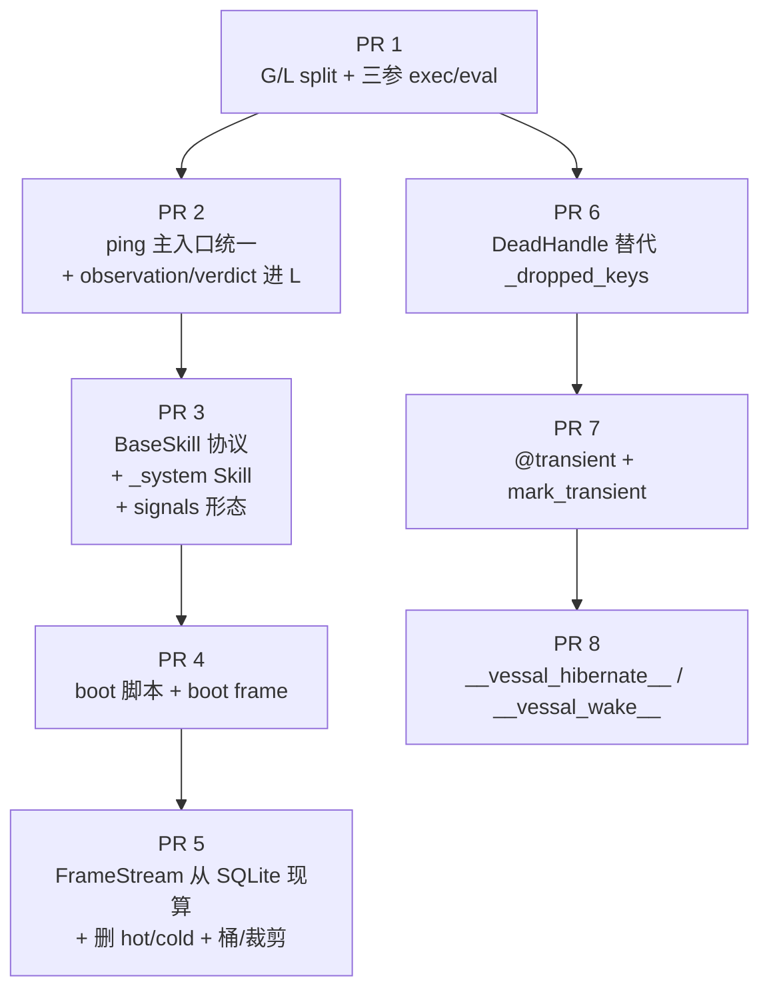

> **Status — Archived 2026-04-29.** All 8 PRs + the Compaction Cell described
> below are merged onto `develop`. This file is preserved as historical record;
> for the live spec, read `docs/architecture/{kernel,cell,core}/`.
>
> Merged PRs:
> - PR 1 — G/L split + 三参 exec/eval (#27)
> - PR 2 — single ping primitive + observation/verdict (#28)
> - PR 3 — BaseSkill protocol + _system + signals (#29)
> - PR 4 — boot script + boot frame (#30)
> - PR 5 — SQLite-backed FrameStream (#31)
> - PR 6 — Cell boundary + active resources (#32)
> - PR 7 — spec realignment, schema v8 (#33)
> - PR 8 — whitepaper R4 alignment (#34)
> - Compaction Cell — second Cell instance, CompactionSkill (#35)
>
> ---

# Kernel Refactor Plan — 把当前实现拉回 docs/architecture/

> **状态**：草稿待 Zale 审。
> **范围**：仅 Kernel 与 Cell 的 snapshot/restore 边界。Hull / Shell / Console / Skills 业务侧不在本计划。
> **底线**：每个 PR self-contained、必删旧机制、PR 之间不留 dead code 或并存兜底。

---

## 0. 起点（commit `26bc87a`，分支 `feature/relocate-kernel-tests-b`）

§5.4 lenient restore 已落地（`UnresolvedRef` + `LenientUnpickler` + boot frame `obs_diff_json` 披露通道）。
§4 SQLite frame_log 五张表 schema 已落地（`entries / frame_content / summary_content / signals / errors`）。
§3.7 linecache 注册 + 重启 reload 已落地。

剩下的部分**全部还没对齐**。下一节是漂移清单。

---

## 1. 现状 vs Spec 漂移摘要

### 1.1 命名空间（§2）

| 维度 | spec | 现状 |
|---|---|---|
| 字典数 | `G` + `L` 两个 | 单一 `ns` |
| `exec` 调用 | `exec(code, G, L)` 三参 | `exec(code, ns)` 两参 |
| `eval(expect)` | `eval(expr, G, copy(L))` | `evaluate_expect(..., ns)` 两参 |
| snapshot 范围 | `cloudpickle.dumps(L)` | `cloudpickle.dumps(ns)` 整盘 |
| restore 范围 | `cloudpickle.loads → L`，G 由 boot 脚本重建 | `cloudpickle.loads → ns` 整盘 |
| 「预设资产」位置 | G（导入 + 实例化挂入） | 同 ns，与 Agent 状态混在一起 |

### 1.2 主入口（§1）

| 维度 | spec | 现状 |
|---|---|---|
| 对外入口 | 单一 `ping(pong, namespace) -> Ping` | `prepare()` + `step()` + `exec_operation()` + `eval_expect()` + `render()` + `update_signals()` 多个并存 |
| 调用方 | Cell 直接调 `kernel.ping(pong, {"globals": G, "locals": L})` | Cell 拼凑 `prepare()` 与 `step()`，自己决定时序 |
| `pong=None` 分支 | spec 内化在 `ping` 里 | Cell 侧分支判断 |

### 1.3 observation / verdict / signals 的形态（§3 + §6）

| 维度 | spec | 现状 |
|---|---|---|
| observation 落点 | `L["observation"] = {stdout, stderr, diff, error}` | 散落：`_stdout` / `_error` / `_diff` / `_errors` / `_actual_tokens_*` 等多个 ns key |
| verdict 落点 | `L["verdict"] = {value, error}` | `_verdict` 单 key |
| signals 形态 | `L["signals"] = dict[(class_name, var_name, scope), payload]` | `L["_signal_outputs"] = list[(title, body)]` |
| Skill 协议 | `BaseSkill` 子类 + `signal: dict` 实例属性 + `signal_update()` 方法 | duck-typed `_signal() -> (title, body)`，无基类 |
| 系统信号通道 | 内置 `_system` Skill 的 signal | 散键：`_wake` / `_frame_type` / `_context_pct` / `_budget_total` / 等等 |
| Skill 落地位置 | 一律 `skills/` 包下，`_system` 也不例外 | 散在 Hull / Console / Skill 各处 |

### 1.4 Boot 流程（§7）

| 维度 | spec | 现状 |
|---|---|---|
| 启动步骤 | 4 步无分支：建空 L → 跑 boot 脚本装 G → (restart) `cloudpickle.loads(L)` → 写 boot frame | 分支：`Kernel.__init__` 里要么 `_init_namespace()` 要么 `restore()`，没有 boot frame |
| boot 脚本 | 真的跑一段 `from skills.X import XSkill; x = XSkill(); ...` 在 `(G, G)` 上 | 硬编码 `_init_namespace()` 里的 `ns["_xxx"] = ...` 一长串字典赋值 |
| boot frame | 每次启动都写一条 layer=0 entry，n = n_prev+1 | 完全不存在 |
| restart 披露 | boot frame 的 `obs_diff_json`（基线 = `{}`）+ `UnresolvedRef.__repr__` | 无（lenient 已对齐，但披露通道没落地） |

### 1.5 FrameStream（§4.8-§4.10）

| 维度 | spec | 现状 |
|---|---|---|
| 数据结构 | `FrameStream.entries: list[Entry(layer, n_start, n_end, content)]` 单表 | hot zone (k 帧) + cold zone (n 层) 双区 LSM 内存结构（`frame_stream.py`） |
| 存储位置 | SQLite 五张表（已对齐） | 双重：SQLite 写了，但 read 走 `ns["_frame_stream"]` LSM 内存表 |
| 渲染时机 | 每帧从 SQLite 现算 | 从内存 LSM 算，SQLite 只是 sink |
| 装配规则 | R1 layer DESC + n_start ASC；R2 上层覆盖优先 | "机械剥离" + bucket 字段裁剪 |
| 字段裁剪 | 不做 —— spec §4.8 "数据结构跟着逻辑走，不跟着优化技巧走" | 有 B_0..B_4 桶机制 |
| 渲染时间预算 | 不存（Core 的事） | `_context_pct` / `_budget_total` / `_context_budget` / `_token_budget` 四个 ns key |

### 1.6 §5.5 活资源三档出口

| 档 | spec | 现状 |
|---|---|---|
| 档 1 `DeadHandle(kind, origin, reason)` | per-key 替换；snapshot 不整体失败 | **缺**。当前是 ns-wide `_dropped_keys` filter（dump 整 ns 失败 → 过滤掉所有不可 pickle 的 key → 注入 `_dropped_keys` / `_dropped_keys_context` 列表 → 再 dump） |
| 档 2 `@transient` 装饰器 + `kernel.mark_transient(name)` | 标记的 key 直接跳过 snapshot | **缺** |
| 档 3 `__vessal_hibernate__` / `__vessal_wake__` dunder | 对象自定义优雅交接，允许副作用 | **缺** |

### 1.7 应该删的 vestigial 代码（盘点）

| 位置 | 内容 | 删除理由 |
|---|---|---|
| `kernel.py:55-68` | `_picklable(obj)` helper | DeadHandle 落地后不再 ns-wide filter |
| `kernel.py:294-308` | `_dropped_keys` / `_dropped_keys_context` 注入 | 同上 |
| `kernel.py:303-307` | `_find_creation_operation()` helper | 服务于 `_dropped_keys`，一并删 |
| `render/signals/dropped_keys.py` | 给 `_dropped_keys` 渲染 UI | 同上 |
| `kernel.py:107-160` `_init_namespace()` | 硬编码一堆 `_xxx` key | boot 脚本接管后整段删 |
| `kernel.py:158-160` `_protected_keys` | exec 后自动恢复被 Agent 删的系统 key | spec 不要求；G/L 拆分后 Agent 写不到 G，无需保护 |
| `kernel.py:155 / 389` `ns["sleep"] = self.sleep` | 把方法塞进 ns | spec 里 sleep 由 `_system` Skill 暴露 |
| `kernel.py:336-346` legacy snapshot layout 探测 + 自动重写 | 双 cloudpickle 段（header + ns）兼容 | snapshot 形态稳定后删 |
| `kernel.py:363-388` `_migrate_snapshot()` | v6→v7 schema 兼容 | snapshot 只 dump L 后这套迁移逻辑作废 |
| `frame_stream.py` 整文件 | 双区 LSM 内存结构 | SQLite 现算落地后整文件删 |
| `kernel.py` 中 `_compaction_k` / `_compaction_n` 注入 | hot/cold 配置 | LSM 删了之后这两个 key 也作废 |
| `_context_pct` / `_budget_total` / `_context_budget` / `_token_budget` 四 key | 渲染预算 | spec §1.4 明确 "Kernel 不字符串化、不算 token 预算" |
| `_frame_type` / `_render_config` / `_dropped_frame_count` | 渲染配置 / 帧类型标记 | 同上，Core 的事 |
| `_wake` ns key | Hull 写入唤醒原因 | spec §6.2: 走 `_system` Skill 的 signal |

---

## 2. PR 拆分总览



主链：PR 1 → 2 → 3 → 4 → 5 是协议骨架重写。
副链：PR 1 → 6 → 7 → 8 是 §5.5 三档出口。两条链在 PR 1 之后可并行（PR 6 不依赖 2-5）。

---

## 3. PR 详细规划

### PR 1 · 命名空间拆分 G / L + 三参 exec / eval

**Layer**：Cell（仅 Kernel 内部 + Cell 边界）
**Responsibility**：Kernel 的命名空间从单一 `ns` 拆成 `G`（预设不变资产）+ `L`（Agent 活状态），与 spec §2 对齐。Cell 暴露 `namespace` 字典外壳。
**Change**：
- `Kernel.__init__` 状态从 `self.ns: dict` 改为 `self.G: dict` + `self.L: dict`
- `Kernel.namespace` 计算属性返回 `{"globals": self.G, "locals": self.L}`
- `executor.execute(operation, ns, ...)` 改签名为 `execute(operation, G, L, frame_number, ...)`，内部走 `exec(code, G, L)` 三参
- `expect.evaluate_expect(expect, ns, ...)` 改签名为 `evaluate_expect(expect, G, L, frame_number, ...)`，内部走 `eval(expr, G, copy(L))`
- `Kernel.snapshot(path)` 只 `cloudpickle.dumps(self.L)`
- `Kernel.restore(path)` 只 `cloudpickle.loads → self.L`；G 由调用方在调 restore 之前通过 boot 脚本（暂时由当前 hardcoded `_init_namespace()` 等价物充当）已经装好

**File touched**：
- `src/vessal/ark/shell/hull/cell/kernel/kernel.py` — 主体改写
- `src/vessal/ark/shell/hull/cell/kernel/executor.py` — 三参 exec
- `src/vessal/ark/shell/hull/cell/kernel/expect.py` — 三参 eval
- `src/vessal/ark/shell/hull/cell/cell.py` — proxies 改 `cell.G` / `cell.L`
- `src/vessal/ark/shell/hull/cell/kernel/render/` — 渲染读 L，不再读 ns
- 测试 `tests/unit/kernel/test_*.py`

**Delete**：
- legacy snapshot layout 探测代码（`kernel.py:336-346`）
- `_migrate_snapshot()` 中 schema-mismatch 兼容（暂保留 `frame_stream` 重置的 fallback 一行，整体在 PR 5 删除）

**Test invariants**：
- `exec(L["x"] = 1)` 后 `G` 不变
- `eval("L['y'] := 2")` 不污染原 L（浅拷贝隔离）
- snapshot+restore 循环：L 还原；G 由 init 重建；snapshot 文件只含 L
- 删除 Skill 模块再 restore：UnresolvedRef 出现在 L 而不是 G

**风险**：所有现有测试都假定单一 ns。需要全量改测试。

---

### PR 2 · 主入口统一为 `ping(pong, namespace) -> Ping` + observation/verdict 进 L

**Layer**：Cell
**Responsibility**：Kernel 对外暴露 §1 spec 的 `ping(pong, namespace) -> Ping` 单一原语。observation / verdict 落到 `L["observation"]` / `L["verdict"]` 标准位置。
**Change**：
- 新方法 `Kernel.ping(self, pong, namespace) -> Ping`，内部走 spec §1.2 五步（pong=None → 跳 ②③）
- ②③④⑤ 中间产物按 spec 形态落到 L：
  - `L["observation"] = {"stdout", "stderr", "diff", "error"}`
  - `L["verdict"] = {"value", "error"}`
  - `L["signals"]`（PR 3 才切到三元组形态，本 PR 保留 list[(title,body)] 过渡）
- `Cell.step()` 简化为 `self.kernel.ping(pong, self.kernel.namespace)`，删 `prepare()` / `step()` / `_commit_frame()` 的多入口分裂

**File touched**：
- `kernel.py`：删 `prepare`、`step`、`render`、`exec_operation`、`eval_expect`、`update_signals`、`_commit_frame`、`_build_frame_write_spec` 的独立入口；折成 `ping()` 内部步骤
- `cell.py`：`step()` 调用收敛到一行 `kernel.ping(...)`
- `core/`：Composer 改读 `L["observation"]` / `L["verdict"]` 而非 `_stdout` / `_error` / `_verdict`
- `render/`：读 L 标准 key

**Delete**（同 PR 内删除，不留过渡）：
- `_stdout` / `_error` / `_errors` / `_diff` / `_actual_tokens_in/out` / `_verdict` 这些散键
- `_dropped_frame_count` / `_frame_type` / `_render_config` / `_context_pct` / `_budget_total` / `_context_budget` / `_token_budget` 渲染预算键
- `_protected_keys` 自动恢复机制（exec 写不到 G，没必要保护）

**Test invariants**：
- 单帧 ping → L 里出现 `observation` / `verdict` 两个 key，结构与 spec 严格一致
- `pong=None` → ②③ 跳过；④⑤ 跑；L 里出现 `signals` 但不出现 `observation` / `verdict`
- Cell 不再持有任何"渲染时机"逻辑

**风险**：Core 的 Composer 模板要全量重写。考虑在本 PR 一并修，或拆出 PR 2.5 单独搞 Composer（**待 Zale 决定**，见 §5 决策点 D2）。

---

### PR 3 · BaseSkill 协议 + `_system` Skill + signals 形态切换

**Layer**：Cell + Skills（建立 `skills/` 包结构）
**Responsibility**：落地 §6 Skill 协议；用内置 `_system` Skill 接管系统信号；signals 输出切到三元组形态。
**Change**：
- 新增 `src/vessal/skills/__init__.py`、`src/vessal/skills/system/__init__.py`，暴露 `SystemSkill`
- 新增 `BaseSkill` 基类（在 `src/vessal/skills/_base.py` 或类似位置）：`signal: dict` 实例属性 + `signal_update()` 方法
- `SystemSkill` 承接 `_wake` / restart 事件：
  - `set_wake(reason)` → 更新 `self.signal["wake"]`
  - boot frame 写入时填 `self.signal["restart"]`（最近一次启动事件）
- Kernel 第 ④ 步：扫 `G ∪ L` 里所有 `BaseSkill` 子类实例，调 `signal_update()`，按 `(class_name, var_name, scope)` 聚合到 `L["signals"]`
- 现有 `_signal()` duck-typed Skill（如有）迁移到 `BaseSkill`
- `Kernel.update_signals()` 改名为内部 `_signal_scan()`，从 ping 第 ④ 步内部调用

**File touched**：
- 新建 `src/vessal/skills/_base.py`、`src/vessal/skills/system/__init__.py`
- `kernel.py`：第 ④ 步重写
- `render/signals/`：BASE_SIGNALS 整套大幅瘦身（base signals 中只剩"扫 BaseSkill 实例"这一条 —— 其余都是历史 vestigial）
- Hull：从直接写 `ns["_wake"]` 改为 `G["_system"].set_wake(reason)`
- Console / Cell tracer：消费方按新 signals 三元组形态读

**Delete**：
- `_wake` ns key（移到 `_system.signal["wake"]`）
- `_signal_outputs` ns key（合并到 `L["signals"]`）
- `BASE_SIGNALS` 列表里所有非系统类信号（`errors_signal` / `verdict_signal` / `namespace_dir_signal` 等都改由对应 Skill 的 `signal_update` 提供，或移到 `_system` 的 signal 块里）
- duck-typing `_signal()` 协议（彻底切到 `BaseSkill` + `signal_update`）

**Test invariants**：
- `L["signals"]` 形态：`dict[(class_name, var_name, scope), payload_dict]`
- `_system.signal["wake"]` 在 Hull 写入后 next ping 出现在 signals 三元组里
- 同名 var_name 在 G + L 同时存在时按 LEGB（L 优先、G 跳过）

**风险**：现有 Skill（chat / file / web_search 等）需要逐一迁移。可能需要单独 PR 3.5 处理 Skill 迁移（**待 Zale 决定**，见决策点 D3）。

---

### PR 4 · boot 脚本 + boot frame

**Layer**：Cell + Hull
**Responsibility**：落地 §7 启动流程的 4 步无分支链路；每次启动写一条 boot frame。
**Change**：
- Hull 新增 boot 脚本生成器：拼出 `from skills.system import SystemSkill\n_system = SystemSkill()\nfrom skills.chat import ChatSkill\nchat = ChatSkill()\n...` 这样的真实 Python 脚本字符串
- Kernel.__init__ 重构成 4 步：
  1. `self.L = {}`
  2. `exec(boot_script, self.G, self.G)` —— 第二参与第三参同字典，把名字落进 G
  3. (restart) `self.L = LenientUnpickler.load(blob)`
  4. 写 boot frame（layer=0，n = n_prev+1）走 §4.6 标准事务
- boot frame 字段映射严格按 §7.6：
  - `pong_think = ""`
  - `pong_operation = <真实 boot 脚本>`
  - `pong_expect = "True"`
  - `obs_stdout = <Skill __init__ print 汇总>`
  - `obs_diff_json = diff({}, L_restored)` — UnresolvedRef 通过 `__repr__` 自我披露
  - `verdict_value = "true"`
- `Cell.__init__` 不再传 `snapshot_path`、由 Kernel 自己根据 db_path 决定是否 restart

**File touched**：
- `kernel.py`：__init__ 重构
- `hull/`：boot 脚本组装
- `frame_log/writer.py`：可能加一个 `write_boot_frame(spec)` 便利方法（非必需）

**Delete**：
- `_init_namespace()` 整方法 —— boot 脚本接管
- `Cell` 中拼凑 init 的 mixin（`hull_init_mixin.py` 中与 Kernel 状态有关的部分）

**Test invariants**：
- 冷启动后 `entries` 表恰好一行（n=1，layer=0）
- restart 后新增一行 boot frame，n = 上次 max(n_start) + 1
- restart 后 `frame_content.obs_diff_json` 列出所有 L key，UnresolvedRef 出现在对应位置
- boot frame 是普通 layer=0 entry，没有 `kind` 列、没有特殊字段

---

### PR 5 · FrameStream 从 SQLite 现算 + 删 hot/cold/桶/裁剪

**Layer**：Cell（仅 Kernel）
**Responsibility**：渲染 `Ping.state.frame_stream` 改走 §4.10 的 SQLite 事务读路径；删整套 hot/cold LSM 内存结构。
**Change**：
- 新增 `kernel/frame_log/reader.py`（或 `render/frame_stream.py`）：
  - `def render_frame_stream(conn) -> FrameStream` 按 §4.10 伪码实现：可见性 NOT EXISTS SQL → 拉 frame_content / summary_content / signals → 装 dataclass
- 装配规则严格按 §4.9（layer DESC + n_start ASC + 上层覆盖优先）
- Kernel ping 第 ⑤ 步调 `render_frame_stream(self._conn)` 而非读 `ns["_frame_stream"]`

**File touched**：
- 删 `kernel/frame_stream.py` 整文件
- 删 `kernel/render/` 中所有桶 / 裁剪逻辑
- 新增 reader
- `kernel.py`：__init__ 不再注入 `_frame_stream` / `_compaction_k` / `_compaction_n`
- 测试 `tests/unit/kernel/test_frame_stream*.py` 重写

**Delete**：
- `frame_stream.py` 全文件
- `_frame_stream` ns key
- `_compaction_k` / `_compaction_n` ns key
- `render/` 中"机械剥离 / 桶字段裁剪"代码
- 旧测试 `test_frame_stream_lsm.py` 等

**Test invariants**：
- 100 帧无压缩时 frame_stream 装 100 条 layer=0 entry，顺序按 n_start ASC
- 写一条 layer=1 [1..16] 之后，frame_stream 不出现 [1..16] 内的 layer=0 entry，但出现 [17..]
- 装配在一个 SQLite 事务内完成（用 `conn.in_transaction` 探针验证）

**风险**：装配规则的 NOT EXISTS SQL 性能需要小压力测试（万级帧）。

---

### PR 6 · DeadHandle 替代 `_dropped_keys`

**Layer**：Cell（仅 Kernel snapshot）
**Responsibility**：落地 §5.5 档 1，把 ns-wide drop 换成 per-key 替换。
**Change**：
- 新增 `src/vessal/ark/shell/hull/cell/kernel/dead_handle.py`：
  ```python
  class DeadHandle:
      __slots__ = ("kind", "origin", "reason")
      def __init__(self, kind, origin, reason):
          self.kind, self.origin, self.reason = str(kind), str(origin), str(reason)
      def __repr__(self):
          return f"<DeadHandle {self.kind} from {self.origin}: {self.reason}>"
      def __getattr__(self, name):
          raise RuntimeError(f"dead handle ({self.kind}) cannot be used: {self.reason}")
      def __call__(self, *a, **kw):
          raise RuntimeError(f"dead handle ({self.kind}) cannot be used: {self.reason}")
  ```
- `Kernel.snapshot(path)` 改为：
  ```python
  to_dump = {}
  for k, v in self.L.items():
      try:
          cloudpickle.dumps(v)
          to_dump[k] = v
      except Exception as e:
          to_dump[k] = DeadHandle(
              kind=type(v).__name__,
              origin=k,
              reason=f"{type(e).__name__}: {e}",
          )
  body_bytes = cloudpickle.dumps(to_dump)
  ```
- 一次性试 dump 整个 L，失败再降级到 per-key：避免 N 次 dump 的开销（参考 spec §5.5.2 "大多数活资源 Agent 不会跨帧长期持有"）

**Delete**：
- `_picklable(obj)` helper（kernel.py:55-68）
- `_dropped_keys` / `_dropped_keys_context` 注入逻辑（kernel.py:294-308）
- `_find_creation_operation()` helper（kernel.py:349-361）
- `render/signals/dropped_keys.py` 整文件 —— DeadHandle 通过 `obs_diff_json` 自我披露，不需要专门的 signal renderer

**Test invariants**：
- L 里塞一个 `open(...)` 文件句柄 + 一个普通 dict → snapshot 不抛；restore 后该 key 是 DeadHandle，其他 key 正常
- DeadHandle 的 `__repr__` 在 boot frame 的 `obs_diff_json` 自然可见
- DeadHandle 一碰就抛（任何属性访问 / 调用）

---

### PR 7 · `@transient` 装饰器 + `kernel.mark_transient(name)`

**Layer**：Cell
**Responsibility**：落地 §5.5 档 2 opt-in 跳过机制。
**Change**：
- 新增 `src/vessal/ark/shell/hull/cell/kernel/transient.py`：
  ```python
  def transient(cls):
      cls.__vessal_transient__ = True
      return cls
  ```
- `Kernel.mark_transient(self, name: str)`：把 name 加进 `self._transient_names: set[str]`
- snapshot 时跳过：
  - L key 满足 `getattr(type(v), "__vessal_transient__", False)` → 跳过
  - L key 在 `self._transient_names` → 跳过
- restore 时这些 key 不存在，"和第一次见到一样"
- 暴露给 Skill 作者：`from vessal.kernel import transient`

**File touched**：
- 新增 `transient.py`
- `kernel.py` snapshot 路径
- `__init__.py` 重新导出 `transient` / `mark_transient`

**Test invariants**：
- `@transient class DbConn` 实例放进 L → snapshot+restore 后该 key 不存在
- `kernel.mark_transient("conn")` 后该 key 不存在
- 没标的 key 正常存

---

### PR 8 · `__vessal_hibernate__` / `__vessal_wake__` dunder

**Layer**：Cell
**Responsibility**：落地 §5.5 档 3 优雅交接协议。
**Change**：
- snapshot 路径：对每个 L value 检查 `hasattr(v, "__vessal_hibernate__")`，有则：
  ```python
  try:
      state = v.__vessal_hibernate__()
      to_dump[k] = ("__vessal_hibernated__", type(v), state)  # 标记 + 类引用 + state
  except Exception as e:
      to_dump[k] = DeadHandle(kind=type(v).__name__, origin=k, reason=f"hibernate raised: {e}")
  ```
- restore 路径：发现 `("__vessal_hibernated__", cls, state)` 三元组：
  ```python
  try:
      obj = cls.__new__(cls)
      obj.__vessal_wake__(state)
      L[k] = obj
  except Exception as e:
      L[k] = UnresolvedRef(cls.__module__, cls.__qualname__, f"wake raised: {e}")
  ```

**File touched**：
- `kernel.py` snapshot/restore 路径
- 测试场景：mock 一个带 hibernate/wake 的 HttpSkill 类

**Test invariants**：
- hibernate 正常 + wake 正常 → restart 后对象按 state 重建，行为等价
- hibernate 抛 → DeadHandle 出现在 L
- wake 抛 → UnresolvedRef 出现在 L
- snapshot 不因为 hibernate / wake 失败整体爆炸

---

## 4. 顺序与并行性

```
时间轴 →

PR 1 ─┬─ PR 2 ── PR 3 ── PR 4 ── PR 5
      │
      └─ PR 6 ── PR 7 ── PR 8
```

主链 1→2→3→4→5 必须串行。
副链 1→6→7→8 可与主链并行。
预计总时长：8 个 PR，每个 1-3 天，整体 2-3 周。

---

## 5. 决策点（待 Zale 拍板）

**D1：refactor-plan.md 自身位置**
当前放在 `docs/architecture/refactor-plan.md`。是否合适？或者放 `docs/architecture/_meta/refactor-plan.md` 更显临时性？

**D2：PR 2 是否要拆出 Composer 子 PR**
PR 2 主入口统一会让 Core 的 Composer 模板全部要重写（读 `_stdout`/`_error` 改读 `L["observation"]`）。两个选项：
- **(a)** PR 2 内一并修 Composer，PR 体量大但状态一致
- **(b)** PR 2.5 单独搞 Composer，PR 2 期间 Composer 短时降级到读旧字段（需要桥接代码）

**D3：PR 3 是否要拆出"现有 Skill 迁移"子 PR**
现有 chat / file / web_search 等 Skill 用 duck-typed `_signal()` 协议。BaseSkill 落地后逐一迁移。两个选项：
- **(a)** PR 3 一次性全量迁移
- **(b)** PR 3.5 单独迁移每个 Skill，PR 3 内只搭 BaseSkill 框架 + `_system`，其他 Skill 暂时 duck-typed 共存

**D4：PR 4 boot 脚本是 Hull 拼还是 Kernel 拼？**
spec §7.4 说 "需要构造参数的 Skill 通过环境变量或独立配置文件读，由 Hull 在拼这段 boot 脚本时把参数拼进去 ... Kernel 不发明配置加载机制"。
当前实现：Hull 调用 Kernel.__init__ 然后通过 `cell.set` 灌默认 Skill。spec 形态：Hull 把 boot 脚本字符串传给 Kernel，Kernel 在 (G, G) 上 exec。需要一处 API 设计决策：boot 脚本是 `Kernel(boot_script="...")` 构造参数，还是 `Kernel().bootstrap(script)` 单独方法？

**D5：PR 5 SQLite 渲染算法的实现位置**
新增的 `render_frame_stream(conn) -> FrameStream` 函数：
- **(a)** 放 `kernel/frame_log/reader.py` —— 与 writer 对称
- **(b)** 放 `kernel/render/frame_stream.py` —— 留在 render 模块下
我倾向 (a) —— frame_log 是源数据库，读写对称在一起更内聚。

**D6：vestigial 删除粒度**
某些 ns key（`_actual_tokens_in/out` / `_dropped_frame_count`）现在被 Console SPA 消费。删除时 Console 那一侧需要同步改。
- **(a)** 每个 PR 内同步改 Console
- **(b)** 先弃用、留 PR 9 统一清 Console 侧消费方
我倾向 (a)，避免出现 "Kernel 已删 Console 还在读" 的中间态。

**D7：是否引入 R5 修改声明**
spec / CLAUDE.md R5 要求每个 PR 描述声明 Layer / Responsibility / Change。本 plan 已经按此格式写。每个 PR 的实际描述（PR description on GitHub）也按此格式即可，无需进一步动作。

---

## 6. 注意事项

- 每个 PR 必须按 D1-D8 流程编写：先写复现测试 → 再写实现 → PR 描述里贴上 D2 五个 why、D3 同模式 grep 结论、D4 影响半径（如适用）。
- 每个 PR 必须删旧机制，不允许新旧并存（Zale 在 chat 中明确：「重构的时候必须把为了兼容前面机制的冗余代码、重复代码、多余代码全部删掉」）。
- 每个 PR 自带回归测试，禁止删测试以让 PR 通过（D6）。
- PR 之间禁止 squash 跨 PR：每个 PR 在 GitHub 上独立 squash-merge 进 develop。

---

## 7. 起步动作（plan 通过后）

1. 把本 plan 在 PR 之前 push 到 `develop`（或 `feature/refactor-plan` 单独 PR），先达成共识再写代码。
2. 第一刀切 `feature/kernel-gl-split`（PR 1）。
3. 之后按上图链路推进。
