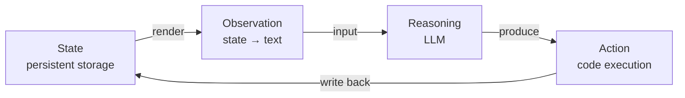
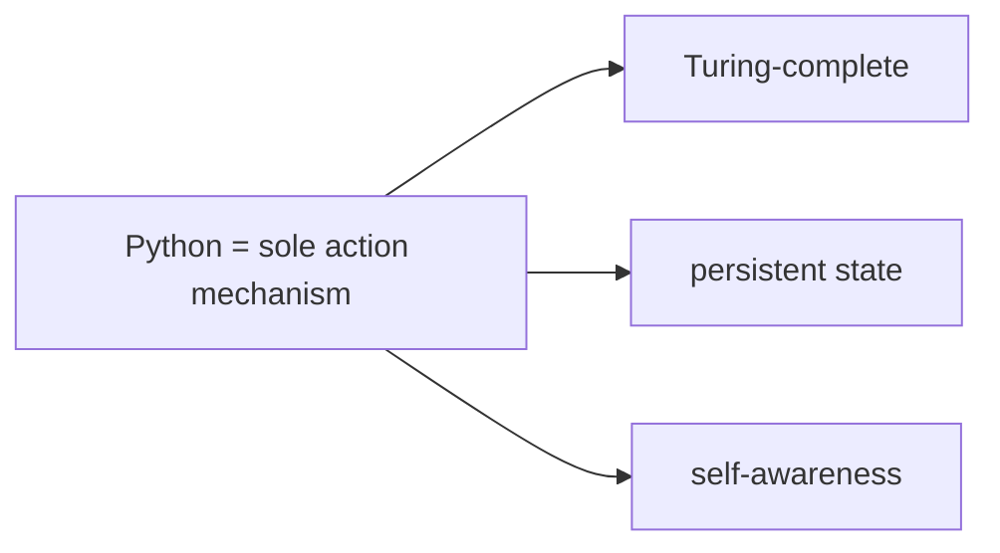
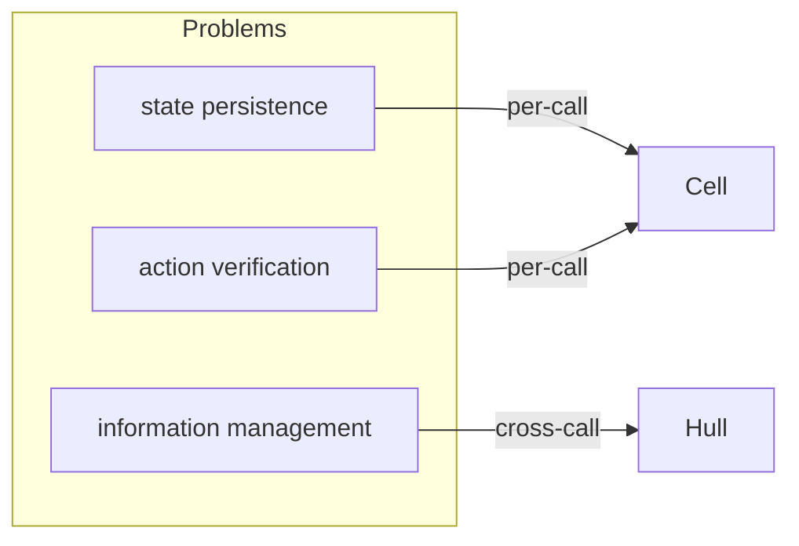

# 1. Problem and Choice

> **TL;DR.** Every mainstream agent framework hands the LLM a menu of functions. A menu is a finite automaton; real work needs a Turing machine. Vessal replaces the menu with a programming language and derives the rest of the system from that single choice.

## 1.1 Action Space

Every mainstream Agent framework today is doing the same thing: handing the LLM a menu of functions and letting it choose. The menu can be long — search, read file, call an API, query a database — but the nature of the thing never changes. The action space is a finite set.

This creates a fundamental impasse. When an Agent needs to "do A first, use A's result to decide between B and C, then repeat D until some condition is met," the framework discovers that the tool pattern cannot express the most basic program logic. So LangChain invented chain composition. AutoGen invented conversation routing. CrewAI invented task delegation. Each, independently and clumsily, reinvented `if`, `for`, and `def`.

The problem is not that the menu is too short. It is that a menu is the wrong form entirely. The gap between a finite automaton and a Turing machine cannot be closed by adding more states.

Vessal makes a different choice: instead of handing the Agent a finite menu of functions, it hands it a Turing-complete programming language.

## 1.2 SORA Loop

That choice rests on a more fundamental observation. An LLM has no persistent memory — when a call ends, everything resets. Yet an Agent's task may span hundreds or thousands of steps, requiring coherent state, perception, and decision-making throughout.

To drive a persistent task with a stateless engine, the system must supply four things outside the LLM:

**State.** Persistent storage independent of the model, giving the Agent continuity of identity and memory across steps.

**Observation.** A function that compresses state into a sequence the model can receive. Information the model cannot see does not exist; the quality of the observation function directly caps the quality of every decision.

**Reasoning.** The decision process that reads an observation and produces an action. This is the LLM's role. The specific model can be swapped out, but this step cannot be skipped.

**Action.** The mechanism by which decisions are applied to state. The expressive power of the action language sets the ceiling on what the Agent can accomplish.

These four elements form the **SORA loop** (State, Observation, Reasoning, Action). All of Vessal's architecture derives from these four.

## 1.3 Code as Action

In Vessal, the Agent's sole way of acting is to write and execute Python code. Not "a code execution tool." Not "a code interpreter as one tool among many." Python as the sole action mechanism. Assigning variables, calling APIs, reading and writing files, managing tasks — all of it happens through Python code the Agent writes itself.

Code runs inside a persistent namespace — a Python dictionary that survives across steps. When the Agent writes `x = compute(y, z)`, the namespace changes accordingly; the system records the exact diff, and the Agent sees those changes on its next step. Code operates directly on state, with zero information loss between intent and effect.

This single choice produces three structural consequences.

**Turing-complete action space.** Loops, conditionals, composition, abstraction, exception handling — a programming language provides all of these natively. The ceiling on what an Agent can do is the quality of the program it can write, not the contents of a framework's tool catalog. That ceiling rises with every generation of LLM; the framework itself will never become the bottleneck.

**Directly manipulable persistent state.** The namespace is not a conversation history. It is not a vector store. It is a Python dictionary, and the Agent reads, writes, deletes, and reorganizes its contents through code. State is transparent and controllable, sharing the same language as action.

**Self-awareness.** State is Python objects; action is Python code. The Agent uses the same mechanism to examine itself: listing variables, checking types, cleaning up intermediate results, inspecting execution history. Introspection requires no additional mechanism — it is the natural consequence of code and state sharing one language.

## 1.4 Runtime Problems

Within the SORA loop, Reasoning is provided by the LLM and Action is provided by the code executor. The runtime's job is to support State and Observation, and to enforce safety before Action executes. This breaks down into three concrete problems.

**State persistence.** The model is stateless; the runtime maintains the namespace. Before each call, the runtime selects information from the namespace and encodes it as input. After the call, it writes the code execution results back. The runtime is the model's external memory.

**Information management.** The namespace grows as the task progresses, but the model can only see a finite number of tokens at a time. The runtime decides what enters the context window. Mechanical decisions — ordering by time, truncating at capacity, shedding low-value fields on a fixed schedule — belong to the runtime. Semantic decisions — judging relevance, condensing many frames into one, naming the through-line of a task — can only be made by the model. The runtime invokes the model for semantic compression on the natural clock of the frame stream, not in response to ad-hoc pressure.

**Action verification.** Code execution carries full system permissions — HTTP requests, file operations, system commands. Before execution, the runtime runs structural checks through the Gate. This is the price of a Turing-complete action space: outbound behavior cannot be fully controlled. The Gate provides a best-effort safety barrier, not a guarantee.

These three problems — state persistence, information management, action verification — drive the three-layer architecture described in the next chapter.

