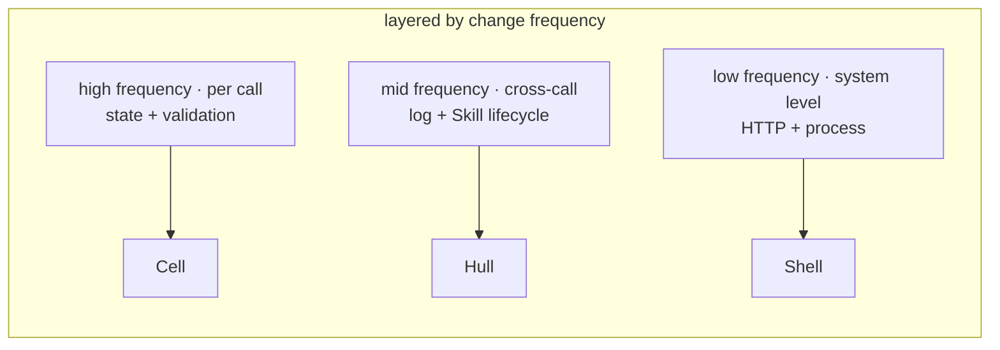
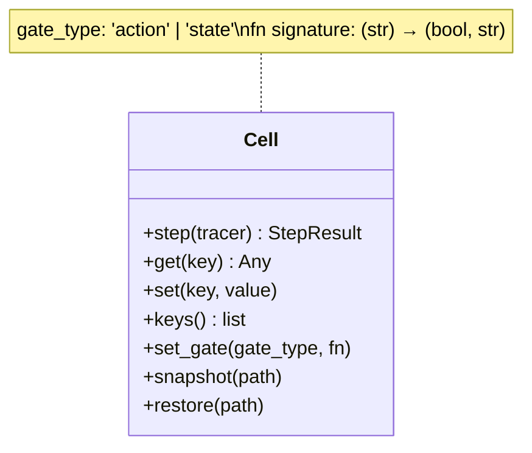
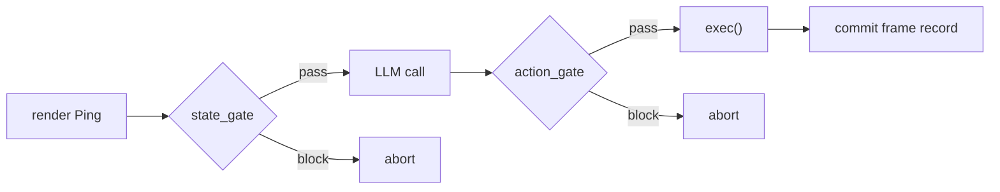
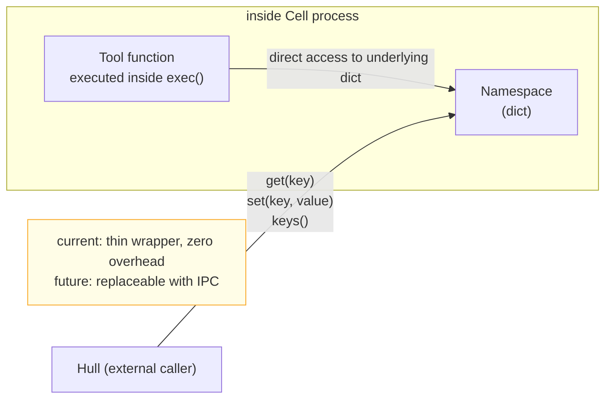
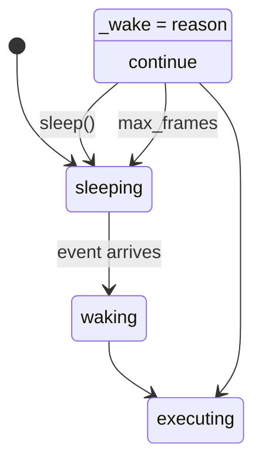
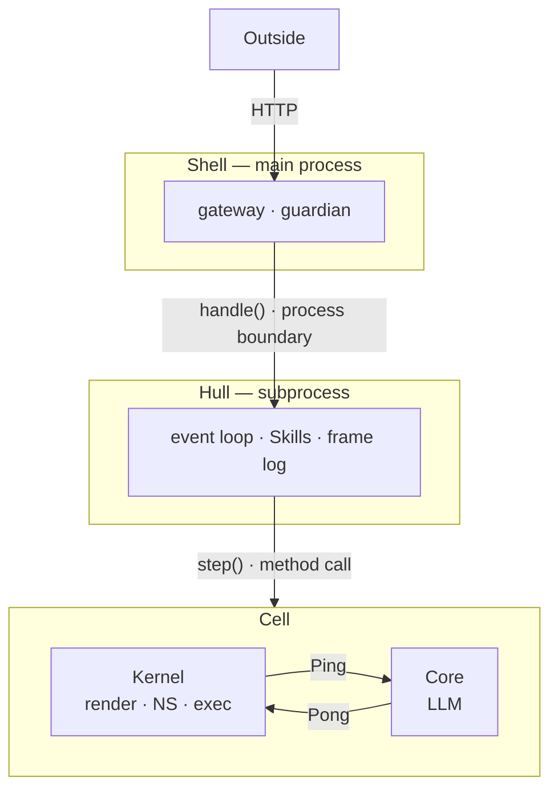
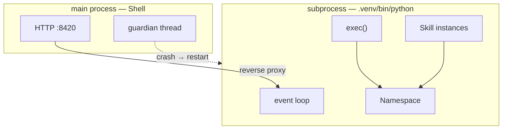
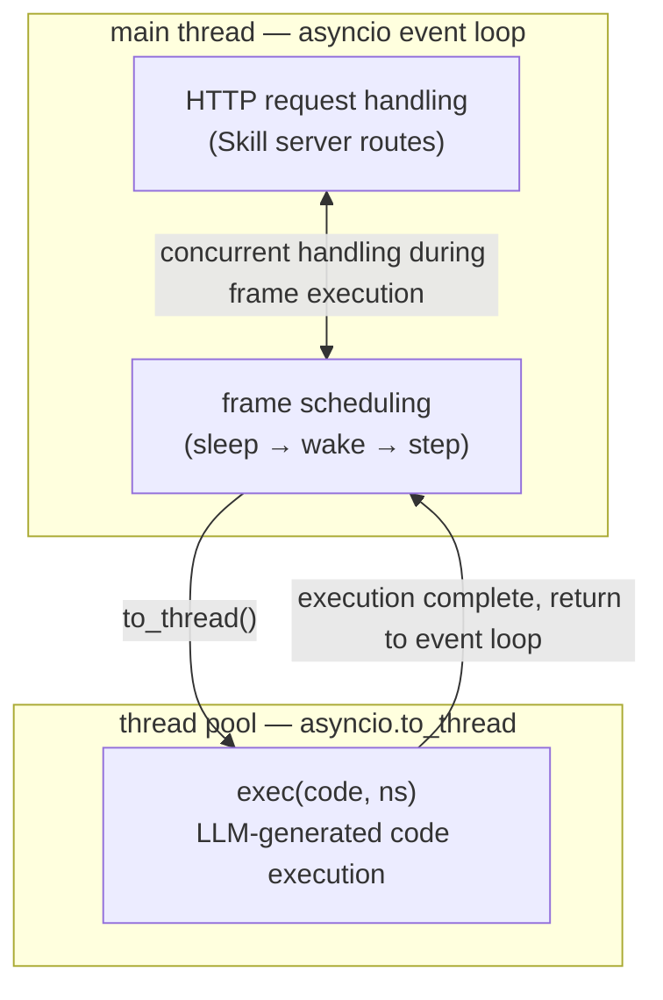
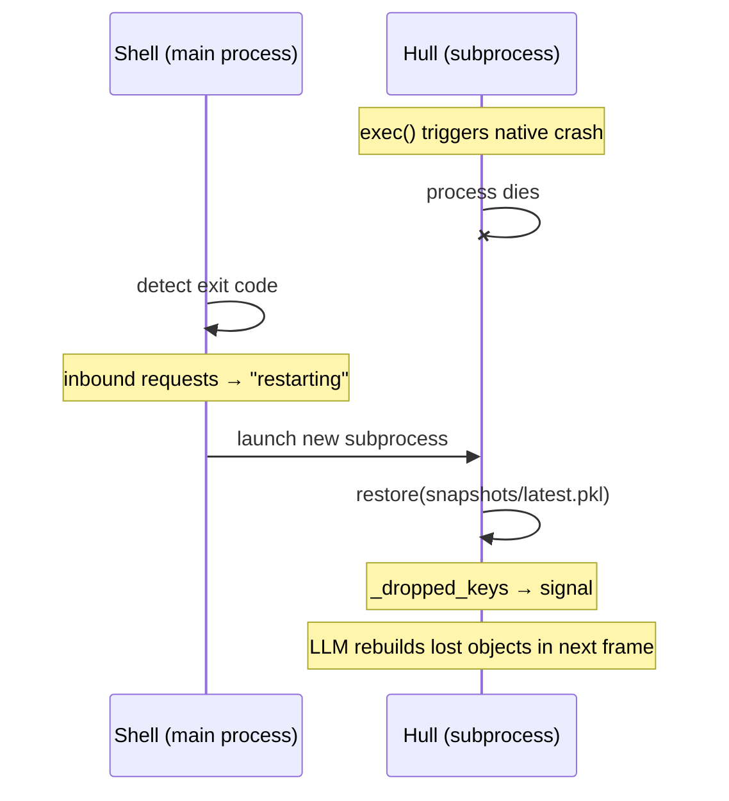

# 2. Architecture

> **TL;DR.** The three runtime problems — state, information, validation — change at different rates. Sorting them by frequency yields three layers: Cell for single-call computation, Hull for cross-call orchestration, Shell for the outside world. The layering is a consequence of the problem, not a stylistic choice.

The previous chapter started from the action-space problem and, through the SORA loop and code-as-action, derived three problems the runtime must solve: state persistence, information management, and action validation. This chapter organizes those three problems by change frequency and derives Vessal's three-layer architecture.


## 2.1 From Problems to Layers

The three problems change at different rates and carry different dependency scopes.

State persistence and action validation happen at the granularity of a single model call — read state and build input before each call, validate output and write results after. This is the innermost concern. It needs no knowledge of the outside world; it only handles one input-output cycle.

Information management and multi-step coordination happen between calls — maintaining the frame log, deciding when to compress, managing the lifecycle of extension modules. This is the middle concern. It governs the execution rhythm of the inner layer but has no need to touch network I/O.

Communication with the outside world — receiving HTTP requests, managing processes, handling OS signals — is the outermost concern. It must exist, because agents need to interact with the world. But it needs no understanding of what the agent is doing internally.

When concerns with different change rates share a single layer, modifying any one of them ripples through the others. This is the root of the "extensions invading the kernel" problem identified in the previous chapter. The solution is to give each concern its own layer, with minimal interfaces between them.

This yields three layers: **Cell** (computation), **Hull** (orchestration), **Shell** (boundary).




## 2.2 Cell — Computation Engine

Cell is the innermost layer, responsible for single-step computation. It receives input, calls the model, executes output, and returns a result. Cell is a function, not a system.

Cell's responsibility boundary:

What Cell does: render the namespace into LLM input (Ping), run state_gate to validate namespace structure, call the LLM to obtain reasoning output (Pong), run action_gate to validate the action before execution, execute the code in Pong, and commit the frame record.

What Cell does not do: know about events, know about scheduling, know how many frames have already executed, or know whether it will ever be called again. Cell handles only the current step.

**The Ping-Pong protocol.** Data flow in the frame loop follows a Ping-Pong structure. **Ping** is the state projection the system actively emits — the Kernel renders the namespace into a message sequence the LLM can process, representing "the system's perception of its environment." **Pong** is the LLM's response — containing a reasoning trace (think) and action instructions (action), representing "the reasoner's reaction to its perception." The naming follows network protocol convention: the initiating side sends a Ping; the other side replies with a Pong. The system is the initiator.

**The Cell protocol** — the interface Cell exposes to the outside:

`step(tracer) → StepResult` is the core method. It executes a single frame: render Ping → call LLM for Pong → gate validation → execute code → commit frame record. Returns StepResult (success or protocol error).

`get(key) / set(key, value) / keys()` are namespace access methods. The namespace is the agent's persistent state space — a key-value store. Tool functions inside Cell operate directly on the underlying namespace data structure when executing (because they run inside the Cell process, so direct access has zero overhead). External callers (Hull) access it through these three methods (because Cell may become an independent process in the future, at which point method calls can become IPC).

`snapshot(path) / restore(path)` serialize and restore the namespace. The namespace is serialized via cloudpickle, which supports functions, classes, lambdas, and closures. Code generated by the LLM may create non-serializable objects (open file handles, C extension objects, running threads). The snapshot degradation strategy: if full serialization fails, filter out non-serializable keys one by one, save the rest, and record the discarded key names. Better to lose partial data than to let the entire snapshot crash.

Cell has no registration interface for tools or signals. Hull writes objects into the namespace via `cell.set()`, and the Kernel discovers their capabilities automatically through duck-typing (checking attribute names rather than inheritance). Cell has no concept of what a Skill is — it only knows the objects in the namespace.

Cell's internal structure (Core, Kernel, Gate) is described in Cell's README. The whitepaper focuses solely on Cell's external interface — because the interface is an irreversible decision, while internal structure is a reversible implementation detail.



**The Gate system.** Cell has two internal gate controls. **state_gate** checks the validity of namespace state (structural validation) before the Ping is sent to the LLM. **action_gate** checks the safety of an action (behavioral validation) before the code in Pong is executed. Both gates run on configurable rules and support multiple modes: pass-all (default, behavior when no rules are defined), blocklist review, allowlist review, and human review. Hull can supply custom Python functions through Cell's exposed interface to override the default rules.



**The Kernel's outbound capability and its security cost.** The Kernel's code executor uses `exec()` to run Python code inside the namespace. Code generated by the LLM has exactly the same permissions as the host Python process — HTTP requests, system commands, file reads and writes, network connections.

This is the direct cost of a Turing-complete action space. An agent must be able to interact with the outside world; constraining outbound capability means constraining the expressiveness of the action space. Vessal deliberately does not impose outbound controls: Shell only governs inbound traffic (world → agent), while outbound traffic (agent → world) is emitted directly from the Kernel executor.

The sole security barrier is action_gate. It inspects code text before execution — a best-effort structural check. Code can construct requests dynamically (`url = base + path`), and the gate cannot predict actual runtime behavior. This is a conscious design trade-off: full outbound security guarantees are exchanged for an unconstrained ceiling on action capability.

**Why the namespace is not exposed directly as a dict.** In the current Python implementation, the namespace is a dict. Exposing a raw dict reference means all external callers hold the same memory reference and can read or write it arbitrarily. This has two consequences: first, Cell cannot be moved to a separate process — dict references cannot cross process boundaries. Second, Cell cannot intercept, validate, or log external namespace modifications. By accessing through `get/set/keys` methods, Cell preserves the option of becoming an independent process in the future, while in the current Python implementation these methods are thin wrappers over the dict with zero additional overhead.




## 2.3 Hull — Orchestrator

Hull is the middle layer, managing Cell and all extension modules (Skills). Hull is the agent's "operating system" — it schedules everything, coordinates everything, and performs no application-layer logic of its own.

Hull's responsibility boundary:

What Hull does: run the event loop (sleeping → waking → executing frame → sleeping), manage the loading, unloading, and lifecycle of Skills, maintain the frame log, route external requests to the appropriate Skill handlers, and call `Cell.step()` to execute frames. Compression is not Hull's concern — it runs inside the Kernel on the frame stream's own clock (§4.5, §6.4.2).

What Hull does not do: perform network I/O (all HTTP is handled by Shell), contain any application logic (no built-in heartbeat, no built-in timer, no built-in domain-specific behavior). Hull is pure infrastructure.



**The Hull protocol** — the interface Hull exposes to Shell:

`handle(method, path, body) → (int, dict | StaticResponse)` is the **only method** Hull exposes to Shell. A dict return value produces JSON; a StaticResponse return value produces a static file. When Shell receives an HTTP request, it passes it verbatim to `hull.handle()`. Hull dispatches internally by path: system routes (`/status`, `/frames`, `/wake`, `/stop`) are handled by Hull itself; routes registered by Skill servers (such as `/inbox`, `/outbox`) are forwarded to the appropriate handler.

Shell does not need to know which routes exist. Adding a Skill requires no changes to Shell. Shell is a fully generic HTTP gateway.

**Why Hull does not include a heartbeat.** A heartbeat is the logic of "wake the agent every N seconds." Structurally, this is identical to "wake the agent when a human message arrives" — both are event sources that monitor an external condition and inject an event into the event queue when the condition is met. If the heartbeat were built into Hull, every similar event source would have the same justification for being built in. The correct approach is for Hull to provide infrastructure for running Skill servers, with the heartbeat running as a Skill on top of that infrastructure.


## 2.4 Shell — Boundary

Shell is the outermost layer and the sole channel for inbound traffic to the agent. Shell's role is not "interface layer" — it is "inbound boundary layer."

Shell's responsibility boundary:

What Shell does: run an HTTP server, receive external requests, call `hull.handle(method, path, body)`, and encode Hull's return value as an HTTP response. Manage process lifecycle.

What Shell does not do: interpret request content, know which routes exist, know what a heartbeat is, what a Skill is, or what a frame is. Shell knows nothing about the agent's internals.

Shell's entire business logic can be expressed in pseudocode:

```
on HTTP request(method, path, body):
    status, response = hull.handle(method, path, body)
    return HTTP response(status, response)
```

**Inbound vs outbound.** Shell governs only inbound traffic — the outside world actively requesting the agent. Outbound traffic — the agent actively reaching out to the world — is emitted directly from the Kernel executor, bypassing Shell entirely. Outbound security is provided by action_gate's best-effort code inspection, not a complete guarantee. This trade-off is detailed in section 2.2.

**Shell's runtime role: gateway and guardian.** Shell does more than proxy HTTP — it is the agent's survival guarantee. Shell and Hull run in different OS processes (see section 2.7 for the OS perspective). Shell occupies the main process; Hull runs in a subprocess. If the Hull subprocess crashes — for example because LLM-generated code triggers a fatal error in a native library — Shell detects the crash, automatically restarts the Hull subprocess, and restores state from the most recent snapshot. The user sees "agent restarting" rather than "connection refused."

Shell is to Hull as Docker is to the application running inside a container. The application can crash; Docker does not. This is not merely an analogy — it is the same architectural pattern: a crashable workload wrapped inside a non-crashable guardian.

**Shell's replaceability.** The Docker analogy above is more than rhetoric — Shell *is* the container/OS itself, and the current Python implementation is just one incarnation of Shell. Shell's three responsibilities (isolation, gateway, guardian) are fulfilled by different technologies across deployment contexts: a Python subprocess in development, Docker namespaces when containerized, an RTOS in embedded deployments. Hull's `handle()` protocol stays constant; replace the entire Shell implementation and everything below Hull requires zero modification. Shell is the lowest-cost layer to replace in the entire architecture. Shell's embodiment implications and evolution path are detailed in chapter 5.


## 2.5 Containment Model

The relationship among the three layers is containment: Shell contains Hull, Hull contains Cell. Containment means the outer layer creates, owns, and manages instances of the inner layer. Shell creates Hull on startup; Hull creates Cell on startup.

Dependencies are strictly unidirectional: Shell depends on Hull (calling `hull.handle()`), Hull depends on Cell (calling `cell.step()`), and Cell depends on no outer layer. There are no reverse dependencies, no cross-layer calls.

But the two boundaries are qualitatively different.

**The Cell-Hull boundary is a hard connection.** Hull and Cell run in the same process. Hull interacts with Cell through method calls. When a Skill's tool functions execute inside Cell, they operate directly on the underlying namespace data structure. This boundary is tightly coupled — Hull is Cell's operating system, and they share a process space.

**The Hull-Shell boundary is a process boundary.** Shell and Hull run in different OS processes. Shell interacts with Hull through the `handle()` method; calls cross a process boundary via IPC. All of Hull's state — the namespace, Skill instances, the frame loop — lives in the Hull subprocess. Shell is a stateless HTTP gateway and guardian.



The process boundary falls between Shell and Hull, not elsewhere. Skill instances and `exec()` must reside in the same process — when LLM-generated code calls `chat.read()`, it operates directly on an in-memory object. Forwarding across processes would force every Skill call through serialization and deserialization, and non-serializable objects such as database connections and file handles cannot survive across frames. The Shell-Hull boundary is the thinnest interface in the entire architecture — just one method, `handle()` — so the cost of process isolation there is minimal.


## 2.6 Protocol as Architecture

The interfaces between the three layers are the irreversible decisions in the entire system. Code can be rewritten in Rust. File structure can be reorganized. But once a protocol has external dependents, it is very difficult to change.

**Cell protocol** (Hull calls Cell):
- `step(tracer) → StepResult` — execute a single frame (signal → Ping → gate → LLM → gate → Pong exec → commit)
- `get(key) / set(key, value) / keys()` — namespace access
- `set_gate(gate_type, fn)` — supply a custom gate rule function (gate_type: "action" | "state", fn signature: `(str) → (bool, str)`)
- `snapshot(path) / restore(path)` — serialize / deserialize

Cell has no registration interface for tools or signals. Hull writes objects into the namespace via `cell.set()`, and the Kernel discovers them through duck-typing. Cell has no concept of what a Skill is.

**Hull protocol** (Shell calls Hull):
- `handle(method, path, body) → (int, dict | StaticResponse)` — handle all inbound requests. dict returns JSON, StaticResponse returns a static file

**Shell protocol** (outside world calls Shell):
- HTTP. All requests are proxied to `hull.handle()`.

The Cell protocol has 7 methods. The Hull protocol has 1 method. The Shell protocol is standard HTTP.

**Compression test.** Cell executes single-step computation (Ping → LLM → Pong → exec). Hull orchestrates Cell and Skills, exposing the single `handle()` method to the outside. Shell proxies HTTP to `hull.handle()` and manages processes.


## 2.7 OS Perspective

The previous six sections addressed the logical layer — component responsibilities, interface protocols, dependency directions. This section descends to the physical layer: processes, threads, memory, disk. Logical architecture defines the boundaries and interfaces of components; physical architecture defines how they survive and die. Both must be understood together.

### Processes and Threads

The Kernel's `exec()` runs LLM-generated code, which can import any Python library — including native libraries with C extensions. Fatal errors in native libraries are not Python exceptions — `try/except` cannot catch them. They terminate the entire process. If `exec()` and the HTTP server share a process, a single native crash simultaneously kills the HTTP service and all agent state.

Process isolation is the only reliable containment boundary: each process has its own memory space and its own fate. Threads share a process's memory and fate — a fatal error in any thread kills the whole process.

Therefore Shell and Hull must run in separate processes.

### Two-Process Model

The Vessal runtime consists of two OS processes.

**The main process (Shell)** listens on the user-specified port (e.g., 8420), receives all HTTP requests, and forwards them to the Hull subprocess for handling. Shell executes no user code, imports no user-specified libraries, and holds no agent state. Its code path is short and fully controlled — it cannot trigger native crashes. Shell also carries guardian responsibility: it detects when the Hull subprocess exits, restarts it automatically, and returns "agent restarting" to all requests during the restart window.

**The subprocess (Hull + Cell + Kernel)** is launched using `.venv/bin/python` from the agent project directory. The frame loop, LLM API calls, `exec(code, ns)`, Skill instances, and the namespace all live in this process. `exec()` operates directly on the namespace dict; Skill methods are called directly in memory — there is no cross-process serialization or remote forwarding. Non-serializable objects such as database connections, file handles, and imported modules exist normally in this process's memory, surviving across frames, with behavior identical to a world without process isolation.

The two processes communicate via reverse proxy: the Hull subprocess runs an HTTP service on an internal port (or Unix socket), and Shell forwards incoming requests to it verbatim.



### Thread Model

Both processes share the same internal thread structure: the main thread runs an asyncio event loop that handles HTTP requests and frame scheduling. `exec()` runs in a thread pool via `asyncio.to_thread`, preventing it from blocking the event loop. HTTP requests remain responsive while a frame is executing — when a human sends a message through the chat UI, even if the agent is mid-execution, the message can be handled by the Skill server's route handler and written to the inbox.



### Memory

Main process (Shell): ~20 MB baseline. No agent state; memory usage is constant.

Subprocess (Hull): ~50–100 MB baseline (Python interpreter + Vessal code + Skill instances + namespace). Memory grows with agent behavior — importing large libraries (numpy ~150 MB), creating large data structures. On crash, the OS reclaims this memory.

### Disk

Each agent project is a self-contained directory with an isolated Python virtual environment:

```
my_agent/
    .venv/                  isolated Python environment created by vessal init
        bin/python          interpreter used to launch the Hull subprocess
        lib/.../site-packages/   Skill dependencies installed here
    snapshots/              namespace snapshots (timestamped .pkl files)
    logs/
        frames.jsonl        frame log (JSONL, all runs append here)
    data/
        vessal.lock         flock process lock
    skills/                 user Skills
    hull.toml               configuration
```

A Skill's `requirements.txt` is installed into the agent's own virtual environment via `agent/.venv/bin/python -m pip install`, leaving the host Python untouched. Dependencies from different agents never interfere with each other.

### Crash and Recovery

When the Hull subprocess crashes, Shell detects the subprocess exit, returns "agent restarting" to subsequent HTTP requests, and launches a new Hull subprocess. The new subprocess restores the namespace from the latest `.pkl` file under `snapshots/`. Non-serializable objects (database connections, file handles, etc.) are naturally lost during snapshot restoration and recorded in `_dropped_keys`. A "rebuild hint" signal informs the LLM which variables were lost; the LLM reconstructs them in the next frame.

Without process isolation, a crash kills the HTTP service — the channel between the outside world and the agent is severed completely, requiring manual restart. With isolation, Shell survives, recovery is automatic, and the user experiences only a brief interruption.



### Hall — Future Orchestration Layer

In a single-agent deployment, Shell wraps and runs one agent (Hull and its internal components). Multi-agent deployments require an orchestration layer — Hall. Hall is to Shell as Kubernetes is to Docker. Shell wraps a single agent; Hall orchestrates multiple Shells. Hall manages agent registration, message routing, and resource allocation without participating in any individual agent's internal operation. Hall's design is out of scope for this chapter; it is the natural extension of a mature single-agent process model.

### Evolution Path

The two-process model described in this section is the concrete implementation of Stage A (userspace application). When an agent runs inside a container (Stage B), Shell becomes the container's init process, process isolation is provided by container namespaces rather than subprocess, and Shell and Hull can run within the same process. When an agent runs on an embedded device (Stage C), Shell merges into the device firmware. Each stage requires replacing only the Shell implementation; everything below Hull is unchanged. The complete derivation of the evolution path and the hermit-crab model are covered in chapter 5.
