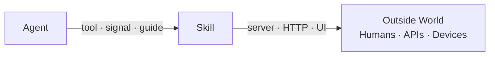
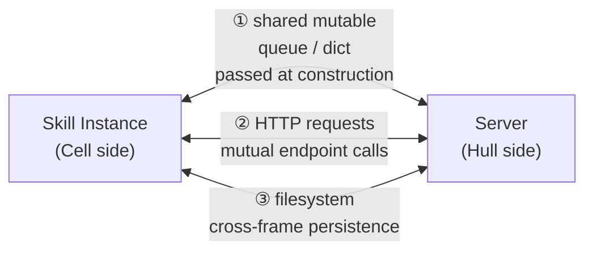
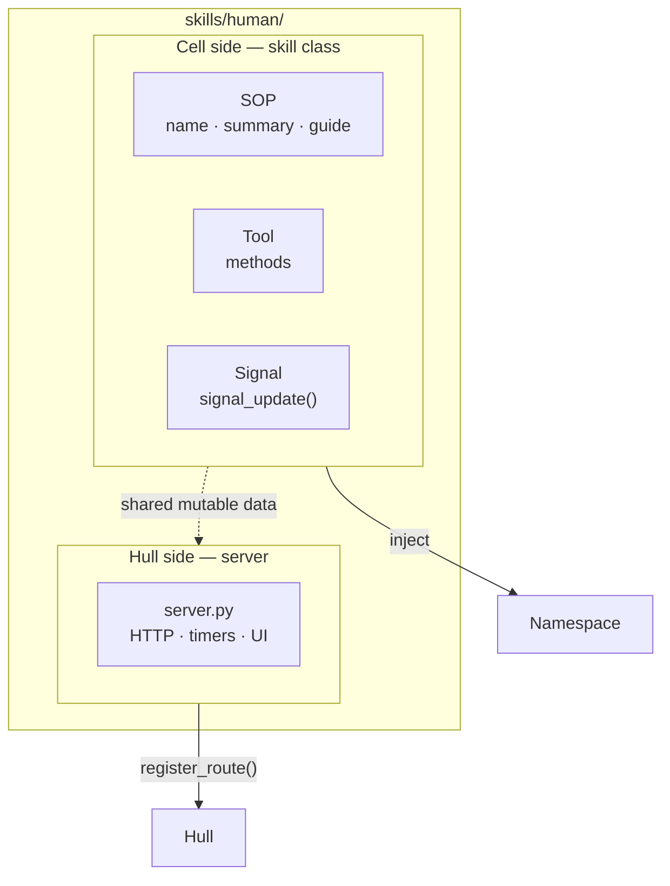
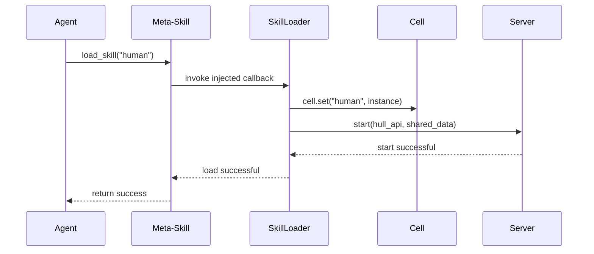
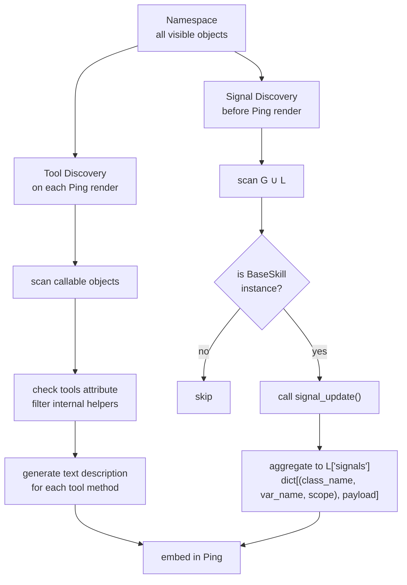
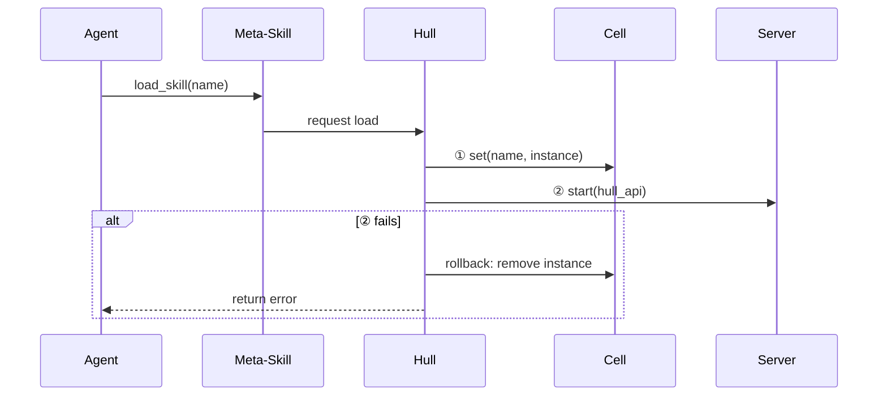

# 3. Skill Model

> **TL;DR.** A Skill is not "a capability" but an interface between the agent and the outside world, with two faces: tools and signals for the agent, a server for the world. Kernel-side BaseSkill-typed discovery, dual-track methodology, and meta-skills are what let Skills evolve independently of the runtime.

The previous chapter established the three-layer architecture: Cell for computation, Hull for orchestration, Shell for boundary. This chapter addresses a question that arises immediately from that layering: where does an Agent's capability extension — the Skill — belong?


## 3.1 Skill as Dual Interface

A Skill is not "an Agent's capability" — it is the **interface between an Agent and the outside world**.

A Skill has two faces. The **inner face** points toward the Agent (tools, signals, SOPs), defining what the Agent can do and what it can perceive. The **outer face** points toward the world (the server), defining how the outside world interacts with the Agent. Humans, other systems, external APIs — they all communicate with the Agent through a Skill's server. The Agent communicates with the outside world through a Skill's tools.

Skill design must serve both users simultaneously. Take the human skill as an example: the tool (`send_message`) is for the Agent; the server (web UI + HTTP routes) is for the human. "Human" is just one kind of external entity — it could equally be another Agent, an API service, or a hardware device.




## 3.2 Skill Composition

A Skill consists of two independent parts: the **skill class** (Cell side) and the **server** (Hull side). Both live in the skill directory, but they are separate code units managed independently by Hull.

### Skill Class (Cell Side)

The skill class is loaded into the Cell's namespace. It contains three kinds of components:

**SOP metadata.** Class attributes: `name` (unique identifier), `summary` (one-sentence description, shown by the meta-skill's `list_skills()`), and `guide` (path to the guide file). The guide is not injected into the system prompt — the system prompt is immutable. Instead, the Agent queries guide content on demand via the meta-skill's `query_guide(name)`.

**Tools.** Python methods. The class attribute `tools: list[str]` declares which methods are LLM-callable tools, filtering out internal helpers from the describe/ system's automatic scan.  Tool methods execute inside the Cell's Kernel with full system privileges.

**Signals.** Before rendering each Ping, the Kernel scans the namespace for BaseSkill instances and calls their `signal_update()` method. The method updates a dict with keys `(class_name, var_name, scope)` and payload values. Kernel aggregates all signals into `L["signals"]`, which is then rendered into the Ping. The `signal_update()` method takes no arguments and accesses instance state through `self`; it returns nothing (side effect is dict update). External data reaches the signal via mutable references passed in at construction time.

### Server (Hull Side)

The server is code separate from the skill class, with its lifecycle managed by Hull. The server is not a method on the skill class — it is a standalone file in the skill directory.

A server can do anything: HTTP routing, timers, web UI, message queue consumption, blockchain event listening. It can even be written in another language. Hull's only job is to start it and stop it.

The server is never loaded into the Cell — it does not need to be called by the LLM, and it does not appear in the namespace. It runs outside the Cell's frame loop and is unaffected by Cell sleep.

Communication between the server and the skill class flows through explicit channels: shared mutable data structures (e.g., a thread-safe queue passed to both at construction), HTTP requests, or the filesystem. They do not share `self` — they are independent objects.



The server registers HTTP endpoints via `hull_api.register_route(method, path, handler)`. Hull automatically prefixes every skill's routes with `/skills/{name}` — a skill that registers `/inbox` is accessible externally at `/skills/human/inbox`. The skill code never needs to know its own prefix. The same applies on unload.




## 3.3 Why the Server Must Be Separated from the Skill Class

The Cell is frame-driven: execute a frame, sleep, wait for an event, execute the next frame. The server runs continuously — handling HTTP requests around the clock.

If the server and tools shared a single class instance, concurrent access would be unavoidable: a server thread processing a request and the Cell executing a frame could simultaneously read and write the same `self` attributes. Python's GIL guarantees atomicity only at the bytecode level, not across composite operations.

Separation eliminates the problem entirely. All communication flows through explicit, thread-safe channels — queues, files, HTTP — and the concurrency hazard disappears.


## 3.4 Meta-Skill: The Skill Manager

How does an Agent discover and load Skills? Through a pre-installed **meta-skill** — the skill manager.

The meta-skill is injected directly into the namespace by Vessal's initialization process at Agent startup (bypassing the Agent's own `load_skill` flow). It exposes the following tools:

`list_skills()` — lists the `name` and `summary` of every available Skill, giving the Agent the information it needs to decide what to load.

`load_skill(name)` — loads the specified Skill (injects into Cell + starts the server). Returns an error message on failure.

`unload_skill(name)` — unloads the specified Skill (stops the server + removes from namespace).

`query_guide(name)` — reads the guide text for the specified Skill. Returns markdown content.

The meta-skill's existence is not in tension with the principle that "the Cell doesn't know about Skills." The meta-skill's tool functions internally call Hull's SkillLoader through an injected callback in the namespace; the Cell and Kernel themselves are unaware of what happens. This is entirely consistent with the existing `load`, `unload`, and `list_skills` functions in `hull/builtins.py` — the meta-skill is simply an upgrade from loose functions to a proper Skill with SOP.




## 3.5 How the Kernel Discovers Capabilities

The Kernel knows nothing about Skills. It knows two things:

**Tool discovery.** The Kernel's describe/ system scans all user-visible objects in the namespace each time it renders a Ping, generating text descriptions for callables and embedding them in the Ping. Once a skill instance is placed in the namespace via `set`, the describe/ system automatically discovers the methods listed in its `tools` attribute.

**Signal discovery.** Before rendering a Ping, the Kernel scans every value in the namespace. Any object with a callable `_signal` method is called; the returned `(title, body)` tuples are collected, and non-empty ones are embedded in the Ping under `══════ {title} ══════` section headers. The only condition checked is whether `_signal` exists and is callable — no registry, no dependency injection, pure duck-typing. Most Skills have no signal, and the scan naturally skips them.




## 3.6 Loading and Unloading

**Loading** is a two-phase process. (1) Hull injects the skill instance into the namespace via `cell.set(name, instance)`. (2) Hull starts the server found in the skill directory (if one exists), passing in the `hull_api` and shared data references. If phase two fails, the load immediately triggers an unload (rolling back phase one), and the error is surfaced to the Agent through the return value of the meta-skill's `load_skill()`.

**Unloading:** (1) Stop the server. (2) Remove the skill instance from the namespace. (3) Clean up any namespace keys declared by the skill.

Dynamic loading and unloading are triggered by the LLM through the meta-skill's tools.



**The system prompt is never touched.** Loading a Skill does not modify the system prompt. The Agent retrieves usage instructions on demand via `query_guide()`.


## 3.7 Skill Directory Structure

```
skills/human/
    __init__.py     exports HumanSkill class
    skill.py        HumanSkill class (SOP metadata + Tools + Signals)
    server.py       server code (separate from the skill class)
    sop.md          guide text (~500 words; 300–800 is normal)
```

Distributing a Skill is as simple as archiving this directory.

**Skill identity via class attributes.** A Skill declares its identity directly in the class body (`name`, `summary`, `guide`). There is no separate manifest file — the class is its own manifest. Hull reads these attributes at load time to register the Skill with the meta-skill's `list_skills()` index.

**Server crash recovery.** Hull monitors the server process or thread for unexpected exits. On a first failure Hull automatically restarts the server once. On a second failure Hull unloads the entire Skill and delivers a signal to the Agent notifying it which Skill was dropped and why. Caveat: a crash may leave shared data in a corrupted state — that is the server developer's responsibility to guard against.

**Open design question — inter-skill dependencies.** If Skill A relies on a tool or data structure provided by Skill B, there is currently no formal mechanism to declare or enforce that dependency. The options are: (a) require the operator to load Skill B before Skill A, documented in Skill A's guide; (b) add a `requires: list[str]` class attribute that Hull checks at load time; or (c) have Skill A's `__init__` call `hull_api.require("skill_b")` imperatively. The right answer depends on how common cross-skill dependencies turn out to be in practice.


## 3.8 Skill as Organ: Hardware Access

Section 3.1 noted that a Skill's outside world can be "a human, another Agent, an API service, or a hardware device." Section 3.2 noted that a server "can even be written in another language." These two design decisions combine naturally: the Skill model has built-in support for hardware integration.

Each hardware device maps to one Skill: tool methods are the control interface (`eye.capture()`, `hand.move()`), the server is the device driver (can be written in C or Rust, running continuously outside the frame loop), and the signal is the perception channel (hardware state changes enter the next frame's Ping via `signal_update()`).

Loading and unloading a Skill corresponds to attaching and detaching an organ. The Kernel's duck-typing discovery mechanism is indifferent to the Skill's implementation language or the underlying hardware. The Agent never needs to know whether a tool method is backed by an HTTP API or a motor controller.

When hardware has real-time requirements (motor control < 10 ms response), the server needs an independent real-time control loop, communicating with the Agent asynchronously via shared data and signals. This is solved within the existing Skill server model — the server runs outside the frame loop with its own thread or process. We reuse the existing model for now, and introduce a dedicated DeviceManager layer only if the need arises.

### The complete embodied model for hardware Skills is described in Chapter 5.
