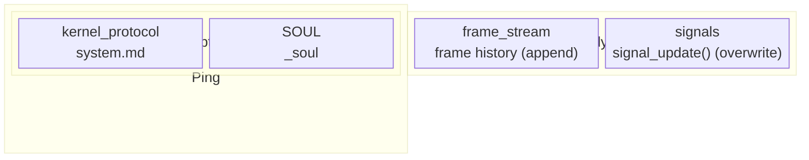
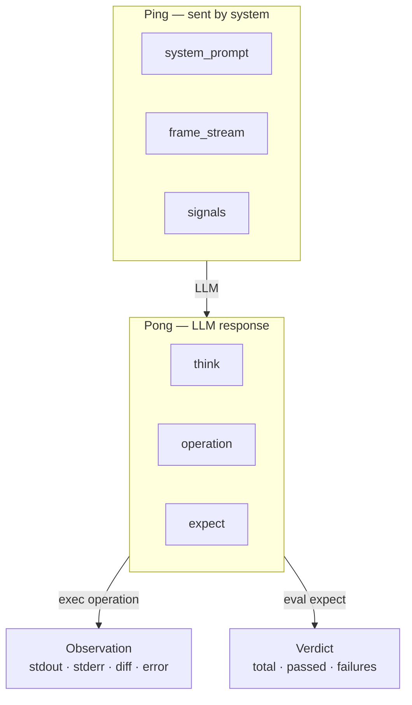
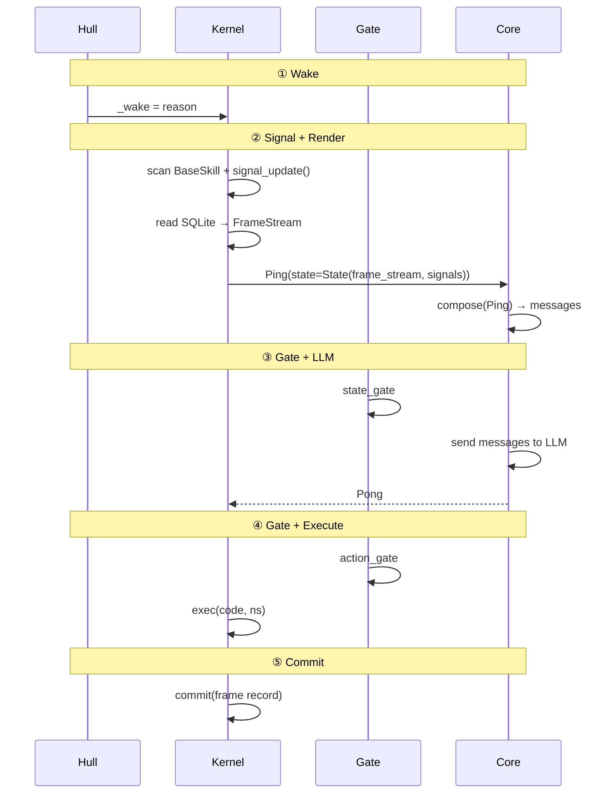
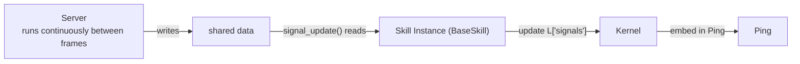
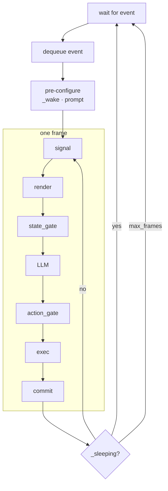
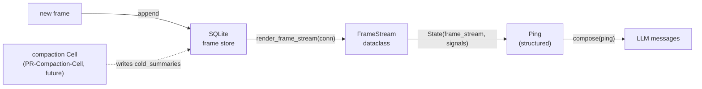

# 4. Frame Protocol

> **TL;DR.** A frame is the atom of Agent execution: one Ping from the runtime, one Pong from the model, one `exec()` of the code inside. The chapter specifies the protocol end to end, and shows how signals, sleep, and compression fit inside a structure that never changes.

This chapter describes the smallest unit of system operation: the frame. A frame is the atom of Agent execution.


## 4.1 Ping-Pong Structure

Every frame produces a Ping-Pong pair. The naming follows network protocol convention: the system (the initiating side) sends a Ping; the LLM (the responding side) returns a Pong.

**Ping** is structured as follows:

`system_prompt` (quasi-static): the protocol text (`system.md`) plus the Agent's identity (`SOUL.md`). Stable across frames; Hull refreshes it each frame to pick up any on-disk changes to `SOUL.md`.

`state` (dynamic): two components — `frame_stream` (the recent frame history, a replay of prior Ping-Pong pairs) and `signals` (the concatenated output of all signal sources).

The Ping is everything the LLM can see in a given frame. Rendering a Ping changes no state.



**Pong** is structured as follows:

`think`: the LLM's reasoning process (read-only; never executed).

`action`: composed of `operation` (Python code) and `expect` (assertion code). Operation is the action the LLM intends to take; expect is the LLM's prediction of the outcome.

Executing `operation` produces an **Observation**: stdout, stderr, diff (a structured list of namespace changes — each row is `{op, name, type}` where `op` is `+` for a new binding and `-` for a removed one), and error (the raw exception with `__traceback__` cleared, or null). Evaluating `expect` produces a sibling **Verdict**: total, passed, and a list of `failures` keyed by `kind` (`assertion_failed`, `expect_syntax_error`, `expect_unsafe_error`, `expect_runtime_error`). Observation and Verdict are siblings of the same frame, not nested; verdict is null when the frame's expect block was empty.




## 4.2 Frame Lifecycle

A frame begins at the moment the namespace is at rest — all side effects from the previous frame have been written, and signals have been updated.

**Phase 1: Wake.** Hull dequeues an event, records the reason via `cell.set("_wake", reason)`, and sets `_sleeping = False`. Hull also refreshes runtime-owned variables — `_system_prompt` and `_soul` — ensuring any changes to `SOUL.md` on disk are picked up before the frame begins.

**Phase 2: Signal Update + Render (Ping generation).** The Kernel scans G ∪ L for BaseSkill instances and calls their `signal_update()` method to update L["signals"]. Kernel then reads visible frame entries from SQLite via `render_frame_stream(conn)`, assembles a structured `FrameStream` dataclass, and returns `Ping(system_prompt=..., state=State(frame_stream=FrameStream, signals=dict))`. Core's `composer.compose(ping)` flattens the structured Ping into LLM messages. Signals reflect the state at frame start.

**Phase 3: state_gate + LLM (Pong generation).** The state gate validates the Ping contents. Once it passes, Core sends the Ping to the LLM and receives the Pong.

**Phase 4: action_gate + Execution.** The action gate checks the operation code in the Pong for safety. Once it passes, the Kernel executes the code and produces an Observation.

**Phase 5: Commit.** The frame record is committed to the frame log. A frame record contains: **frame number, pong (`think` + action (`operation` + `expect`)), observation (stdout + stderr + diff + error), and verdict (`{total, passed, failures}` or null when expect was empty).** Wake_reason is not duplicated per frame — it is set once at wake time and lives on the `_system` Skill's signal. The namespace reaches a new resting point.




## 4.3 Signal

A signal is perception data that namespace objects inject into the Ping. Before building a Ping, the Kernel scans G ∪ L for BaseSkill instances and calls their `signal_update()` method. Each Skill updates `L["signals"]`, which is a dict keyed by `(class_name, var_name, scope)` tuples with payload dicts as values. The aggregated signals dict is included in the structured `State` dataclass passed to Core. The `FrameStream` field of `State` is a structured dataclass populated by `render_frame_stream(conn)`, which reads the visible frame entries directly from SQLite — there is no Kernel-side string rendering pipeline.

Signals solve a specific problem: a Skill's server runs outside the frame loop and may receive new messages between frames. Signals provide an explicit channel for that information to appear in the next frame's Ping — the LLM doesn't have to go hunting for namespace changes.

`signal_update()` takes no arguments, reads instance attributes through `self`, and updates the signals dict. It accesses external data via mutable references — such as a message queue written by the server — passed in at construction time.




## 4.4 Frame Chain and Sleep

After being woken, an Agent may execute several frames before going back to sleep. Hull's event loop:

```
wait for event → dequeue event → pre-configure (_wake, load prompt) → frame loop (signal→render→gate→LLM→gate→exec→commit) → sleeping? → yes: return to wait / no: continue frame loop
```

The Agent enters sleep by calling `sleep()`, which sets `_sleeping = True`. Hull detects this and stops the frame loop, then waits for the next event.

Hull enforces a hard upper bound via `max_frames_per_wake` to guard against infinite loops.




## 4.5 Compression

The frame log grows with every frame, and eventually no window is large enough to hold it. Truncation drops information; semantic compression keeps the important parts and discards the rest.

**Current state (as of PR 5).**

Hull's internal compaction worker — including `HullCompactionMixin`, its thread pool, and all bucket-shifting logic (`B_0`..`B_4`) — has been deleted. Layer≥1 (cold zone) entries are not currently produced. The SORA loop continues to operate with an unbounded raw frame stream read from SQLite each ping; Ping growth without compaction is spec-acceptable for the current implementation phase (§4.11).

Semantic summarization and hierarchical compaction remain the architectural target. They will be implemented as an independent compaction Cell (PR-Compaction-Cell, forthcoming). Framing compaction as a separate Cell keeps the main Cell's Kernel free of async tasks and LLM calls outside the SORA loop, which is the correct boundary.



**Design intent (unchanged).** The two-stage compression model — mechanical stripping in the hot zone, semantic summarization by the compaction Cell — remains the target design described in Chapter 6. The compaction Cell will reuse the same Cell / Core / Kernel code as the main Cell, configured with a compaction-specific system prompt and a distinct SQLite `table_prefix`. The two Cells share one SQLite file and communicate only through `cold_summaries` and `watermark` tables.

**Static storage.** Every raw frame is appended to SQLite as it is produced. "Not forgotten" means recoverable from static storage, not present in the Ping. Compression is about the working window, not about permanence.

**Forward reference.** Chapter 6 develops the full hierarchical compaction model — why physical position is allowed to diverge from logical time, how layers rewrite on a binary-counter cadence, and why the whole structure has O(1) amortized cost per frame and covers ten million frames in 8-10 layers.
