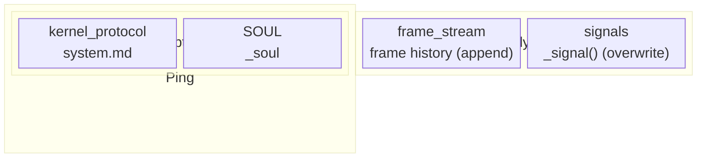
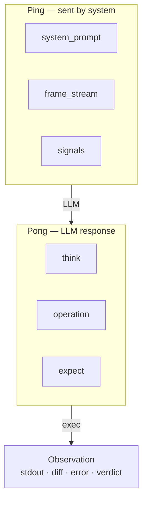
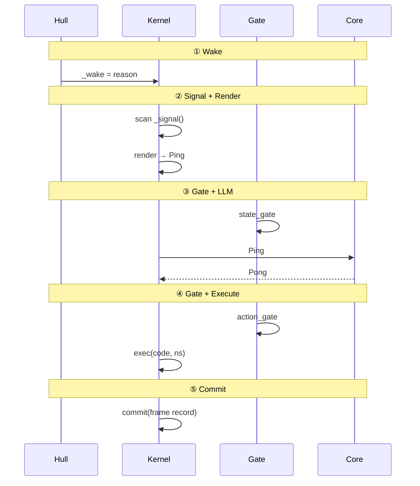
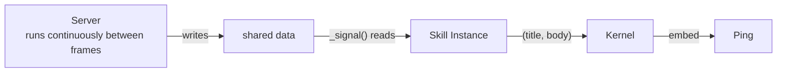
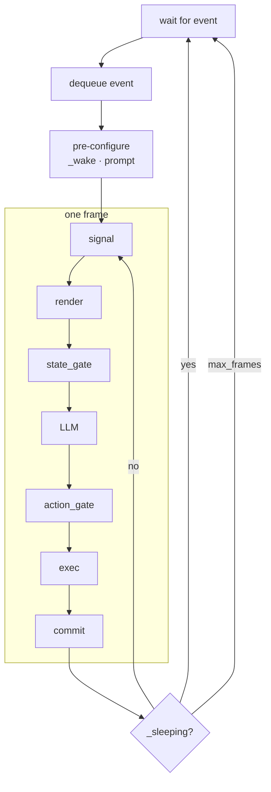
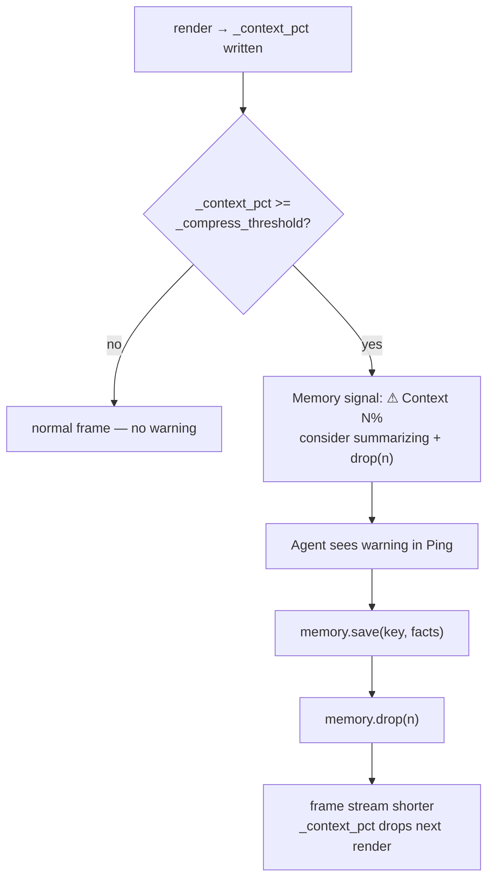

# 4. Frame Protocol

This chapter describes the smallest unit of system operation: the frame. A frame is the atom of Agent execution.


## 4.1 Ping-Pong Structure

Every frame produces a Ping-Pong pair. The naming follows network protocol convention: the system (the initiating side) sends a Ping; the LLM (the responding side) returns a Pong.

**Ping** is structured as follows:

`system_prompt` (quasi-static): the protocol text (`system.md`) plus the Agent's identity (`SOUL.md`). Stable across frames; Hull refreshes it each frame to pick up any on-disk changes to `SOUL.md`.

`state` (dynamic): two components — `frame_stream` (the recent frame history, a replay of prior Ping-Pong pairs) and `signals` (the concatenated output of all signal sources).

The Ping is everything the LLM can see in a given frame. Rendering a Ping changes no state.



**Pong** is structured as follows:

`think`: the LLM's reasoning process (read-only; never executed).

`action`: composed of `operation` (Python code) and `expect` (assertion code). Operation is the action the LLM intends to take; expect is the LLM's prediction of the outcome.

Executing the action produces an **Observation**: stdout, diff (namespace changes), error, and verdict (the result of evaluating expect).




## 4.2 Frame Lifecycle

A frame begins at the moment the namespace is at rest — all side effects from the previous frame have been written, and signals have been updated.

**Phase 1: Wake.** Hull dequeues an event, records the reason via `cell.set("_wake", reason)`, and sets `_sleeping = False`. Hull also refreshes runtime-owned variables — `_system_prompt`, `_soul`, and `_render_config` — ensuring any changes to `SOUL.md` on disk are picked up before the frame begins.

**Phase 2: Signal Update + Render (Ping generation).** The Kernel scans all namespace objects that have a `_signal` method and calls them to update. The rendering pipeline then projects the namespace into a Ping: assembling the system prompt, replaying the frame history (frame_stream), embedding signal text, and trimming to fit the context budget. Signals reflect the state at frame start.

**Phase 3: state_gate + LLM (Pong generation).** The state gate validates the Ping contents. Once it passes, Core sends the Ping to the LLM and receives the Pong.

**Phase 4: action_gate + Execution.** The action gate checks the operation code in the Pong for safety. Once it passes, the Kernel executes the code and produces an Observation.

**Phase 5: Commit.** The frame record is committed to the frame log. A frame record contains only: **frame number, action (operation + expect), and observation (stdout + diff + error + verdict).** Think and wake_reason are excluded — think goes to the audit trace; wake_reason is set once at wake time and does not need to repeat in every frame. The namespace reaches a new resting point.




## 4.3 Signal

A signal is perception data that namespace objects inject into the Ping. Before rendering a Ping, the Kernel scans every value in the namespace; any object with a `_signal` method is called, the returned `(title, body)` tuples are collected, and each non-empty result is embedded in the Ping under a `══════ {title} ══════` section header.

Signals solve a specific problem: a Skill's server runs outside the frame loop and may receive new messages between frames. Signals provide an explicit channel for that information to appear in the next frame's Ping — the LLM doesn't have to go hunting for namespace changes.

`_signal()` takes no arguments, reads instance attributes through `self`, and returns a `(title, body)` tuple or `None`. External data — such as a message queue written by the server — is accessed via a mutable reference passed in at construction time.




## 4.4 Frame Chain and Sleep

After being woken, an Agent may execute several frames before going back to sleep. Hull's event loop:

```
wait for event → dequeue event → pre-configure (_wake, load prompt) → frame loop (signal→render→gate→LLM→gate→exec→commit) → sleeping? → yes: return to wait / no: continue frame loop
```

The Agent enters sleep by calling `sleep()`, which sets `_sleeping = True`. Hull detects this and stops the frame loop, then waits for the next event.

Hull enforces a hard upper bound via `max_frames_per_wake` to guard against infinite loops.




## 4.5 Compression

The frame log grows with each frame, consuming tokens. The Kernel trims the oldest frames when rendering exceeds the context budget — but mechanical truncation loses information. The right response is semantic compression: extracting the important content before the frames are gone.

**Trigger.** Hull reads `compress_threshold` from the `[hull]` section of `hull.toml` (default: `50`) and writes it to the namespace as `_compress_threshold`. After each render, the Kernel writes the current context fill percentage to `_context_pct`. The Memory skill's `_signal()` reads both values every frame. When `_context_pct >= _compress_threshold`, the signal emits a warning:

```
⚠ Context 62% — consider summarizing old frames then memory.drop(n)
```

This warning appears in the next frame's Ping, where the Agent can see it and act.

**Agent response.** When the Agent receives the context pressure warning, it follows a two-step procedure using the Memory skill:

1. **Save key information.** Call `memory.save(key, value)` to persist important findings, decisions, or context from the oldest frames into cross-session storage.
2. **Drop the summarized frames.** Call `memory.drop(n)` to physically remove the oldest `n` frames from the in-memory frame stream. The `drop()` call prints a confirmation prompt before executing. Cold storage (the JSONL log) is unaffected — full history is preserved on disk.

After `drop(n)`, the frame stream is shorter. On the next render, `_context_pct` drops naturally, and the warning clears.



**Only the LLM can perform semantic compression; the runtime can only do mechanical truncation.**

This model places the compression decision inside the Agent's own frame loop, requiring no special frame type or system prompt switch. The Agent compresses when it decides to — prompted by a signal, using the same code-execution mechanism as all other actions.

**Forward reference.** Chapter 6 examines the cache economics of this approach and develops the preferred strategy: three-segment reverse compression, where the oldest frames are kept as original text (protecting the KV cache prefix), a middle segment is compressed into summaries, and the most recent frames are kept verbatim as working memory. That design preserves cache hit rate while recovering token budget — a significant improvement over naive front-truncation.
