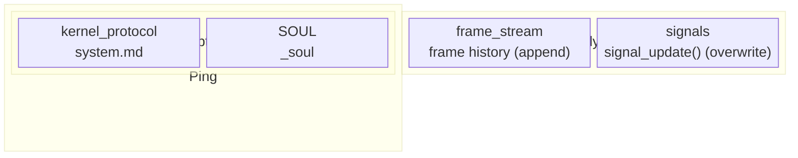
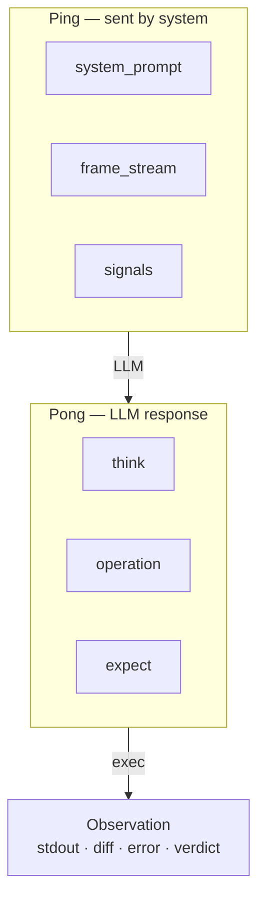
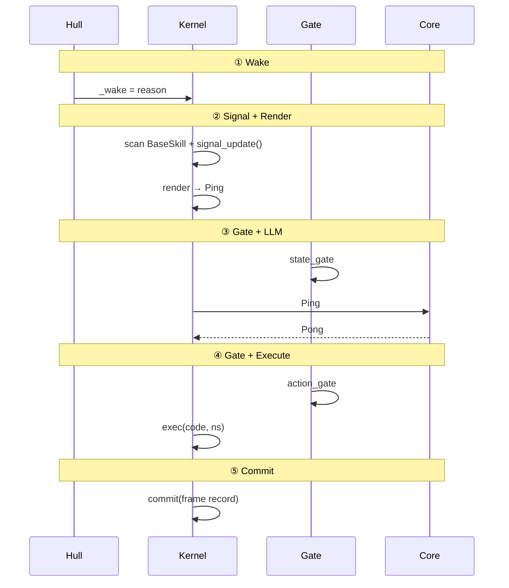
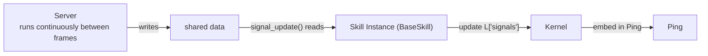
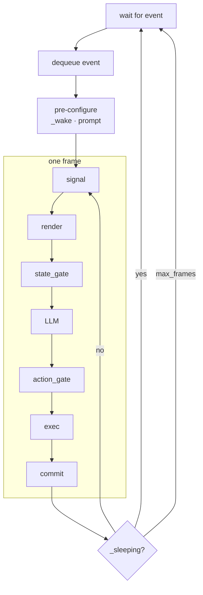

# 4. Frame Protocol

> **TL;DR.** A frame is the atom of Agent execution: one Ping from the runtime, one Pong from the model, one `exec()` of the code inside. The chapter specifies the protocol end to end, and shows how signals, sleep, and compression fit inside a structure that never changes.

This chapter describes the smallest unit of system operation: the frame. A frame is the atom of Agent execution.


## 4.1 Ping-Pong Structure

Every frame produces a Ping-Pong pair. The naming follows network protocol convention: the system (the initiating side) sends a Ping; the LLM (the responding side) returns a Pong.

**Ping** is structured as follows:

`system_prompt` (quasi-static): the protocol text (`system.md`) plus the Agent's identity (`SOUL.md`). Stable across frames; Hull refreshes it each frame to pick up any on-disk changes to `SOUL.md`.

`state` (dynamic): two components — `frame_stream` (the recent frame history, a replay of prior Ping-Pong pairs) and `signals` (the concatenated output of all signal sources).

The Ping is everything the LLM can see in a given frame. Rendering a Ping changes no state.



**Pong** is structured as follows:

`think`: the LLM's reasoning process (read-only; never executed).

`action`: composed of `operation` (Python code) and `expect` (assertion code). Operation is the action the LLM intends to take; expect is the LLM's prediction of the outcome.

Executing the action produces an **Observation**: stdout, diff (namespace changes), error, and verdict (the result of evaluating expect).




## 4.2 Frame Lifecycle

A frame begins at the moment the namespace is at rest — all side effects from the previous frame have been written, and signals have been updated.

**Phase 1: Wake.** Hull dequeues an event, records the reason via `cell.set("_wake", reason)`, and sets `_sleeping = False`. Hull also refreshes runtime-owned variables — `_system_prompt`, `_soul`, and `_render_config` — ensuring any changes to `SOUL.md` on disk are picked up before the frame begins.

**Phase 2: Signal Update + Render (Ping generation).** The Kernel scans G ∪ L for BaseSkill instances and calls their `signal_update()` method to update L["signals"]. The rendering pipeline then projects the namespace into a Ping: assembling the system prompt, replaying the frame history (frame_stream), embedding signal text, and trimming to fit the context budget. Signals reflect the state at frame start.

**Phase 3: state_gate + LLM (Pong generation).** The state gate validates the Ping contents. Once it passes, Core sends the Ping to the LLM and receives the Pong.

**Phase 4: action_gate + Execution.** The action gate checks the operation code in the Pong for safety. Once it passes, the Kernel executes the code and produces an Observation.

**Phase 5: Commit.** The frame record is committed to the frame log. A frame record contains only: **frame number, action (operation + expect), and observation (stdout + diff + error + verdict).** Think and wake_reason are excluded — think goes to the audit trace; wake_reason is set once at wake time and does not need to repeat in every frame. The namespace reaches a new resting point.




## 4.3 Signal

A signal is perception data that namespace objects inject into the Ping. Before rendering a Ping, the Kernel scans every value in the namespace; any object with a `_signal` method is called, the returned `(title, body)` tuples are collected, and each non-empty result is embedded in the Ping under a `══════ {title} ══════` section header.

Signals solve a specific problem: a Skill's server runs outside the frame loop and may receive new messages between frames. Signals provide an explicit channel for that information to appear in the next frame's Ping — the LLM doesn't have to go hunting for namespace changes.

`signal_update()` takes no arguments, reads instance attributes through `self`, and updates the signals dict (spec §6). It accesses external data via mutable references — such as a message queue written by the server — passed in at construction time.




## 4.4 Frame Chain and Sleep

After being woken, an Agent may execute several frames before going back to sleep. Hull's event loop:

```
wait for event → dequeue event → pre-configure (_wake, load prompt) → frame loop (signal→render→gate→LLM→gate→exec→commit) → sleeping? → yes: return to wait / no: continue frame loop
```

The Agent enters sleep by calling `sleep()`, which sets `_sleeping = True`. Hull detects this and stops the frame loop, then waits for the next event.

Hull enforces a hard upper bound via `max_frames_per_wake` to guard against infinite loops.




## 4.5 Compression

The frame log grows with every frame, and eventually no window is large enough to hold it. Truncation drops information; semantic compression keeps the important parts and discards the rest. In Vessal, compression is a Kernel-internal concern: it runs automatically on the clock of the frame stream, driven by the structure of the log itself rather than by Agent reasoning.

**Two stages, two cadences.**

The Kernel separates compression into two mechanisms that never collide:

- **Mechanical stripping.** Zero LLM calls. As a frame ages through fixed-size buckets in the hot zone, the Kernel strips fields on a fixed schedule — `think` first, then `signals`, then `expect`, then `observation` — until only the operation code remains. Every step is deterministic and happens at a bucket boundary, so bytes only shift at moments the cache is already invalidating anyway.
- **Semantic summarization.** One LLM call per batch. When a full bucket of stripped frames reaches the compression zone, the Kernel submits them to the LLM, which produces a structured summary under a fixed schema. That summary enters the cold zone as a new `L_0` record. When `L_0` itself fills, its contents collapse into an `L_1` record. The cascade continues for as many layers as the session needs.

The two stages are orthogonal. Mechanical stripping deals with information decay inside the hot zone; semantic summarization extracts patterns across buckets once the hot zone has nothing more to discard.

**Kernel-autonomous, main loop never blocks.**

Compression is an async task. The SORA loop does not wait for it and does not even see it. Buckets are Kernel namespace variables; when a summarization returns, the Kernel reassigns the variables and the next frame renders against the new layout. If the LLM is slow, new frames pile up in `B_0`, which is allowed to exceed its nominal size; shifts resume the moment the compression zone clears.

No `compress_threshold`, no context-pressure signal, no Agent-visible compression procedure. The Agent does not need to know compression is happening any more than a programmer needs to think about L1 cache eviction.

```mermaid
flowchart LR
    NEW["new frame"] --> B0["B_0 full"]
    B0 -->|shift| B1["B_1 — think"]
    B1 -->|shift| B2["B_2 — signals"]
    B2 -->|shift| B3["B_3 — expect"]
    B3 -->|shift| B4["B_4 — obs"]
    B4 -->|shift| CZ["compression zone"]
    CZ -.->|LLM, async| L0["L_0 record"]
    L0 -->|k full| L1["L_1"]
    L1 -->|k full| LDOT["..."]
```



**Why an LLM at all.** Mechanical stripping can only remove what a schema tells it to remove. It cannot tell that three consecutive attempts at a task should collapse into one line ("three tries to connect; DNS resolution was the problem"). That kind of cross-frame induction requires a model. The design rule: **only the LLM does semantic compression; the runtime does mechanical truncation and nothing else.**

**Static storage.** Every raw frame is appended to disk as it is produced. "Not forgotten" means recoverable from static storage, not present in the Ping. Compression is about the working window, not about permanence.

**Forward reference.** Chapter 6 develops the full hierarchical compaction model — why physical position is allowed to diverge from logical time, how layers rewrite on a binary-counter cadence, and why the whole structure has O(1) amortized cost per frame and covers ten million frames in 8-10 layers.
