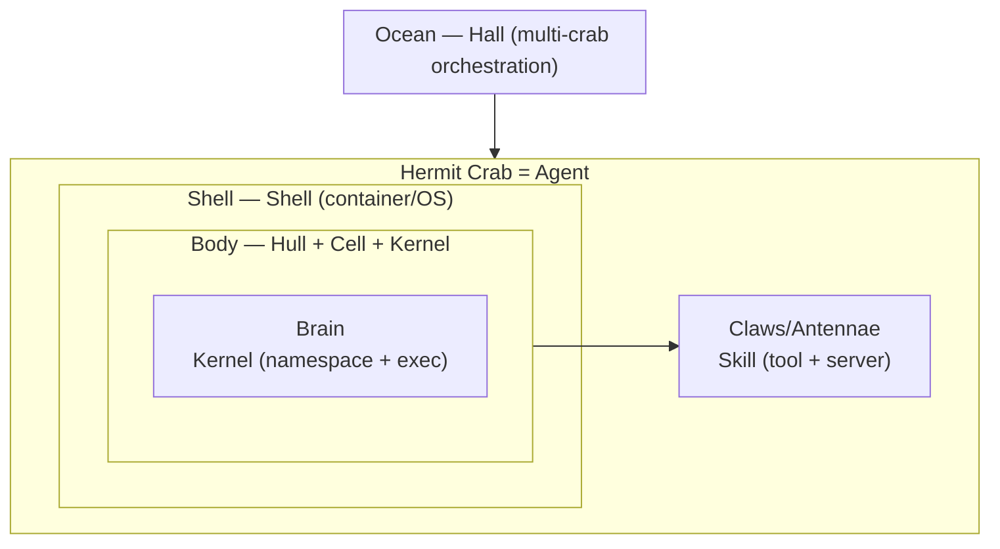
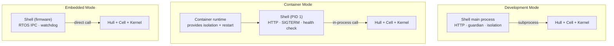
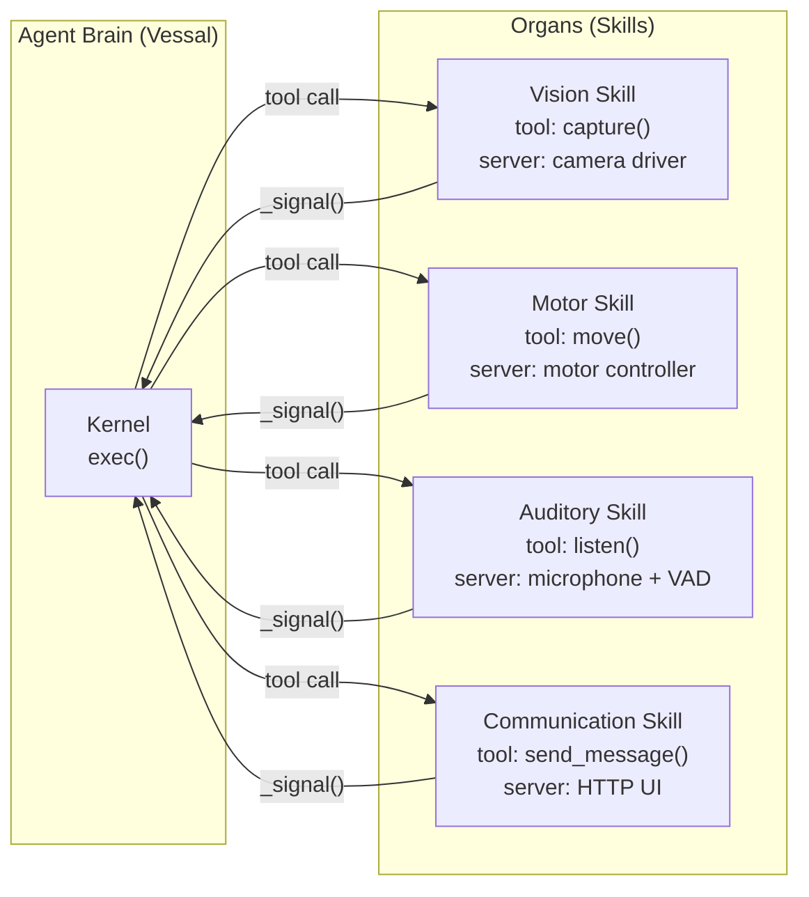
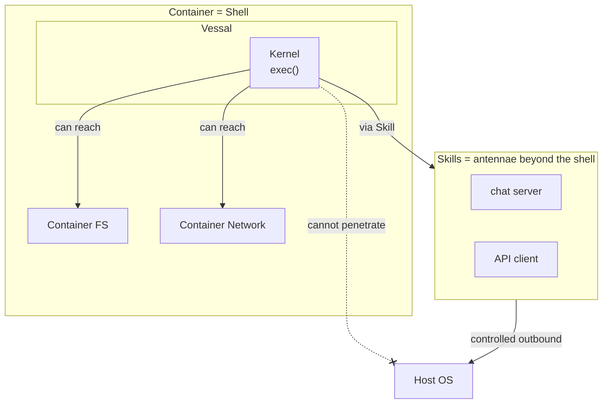
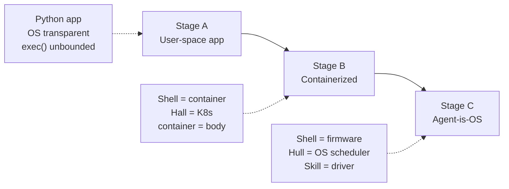
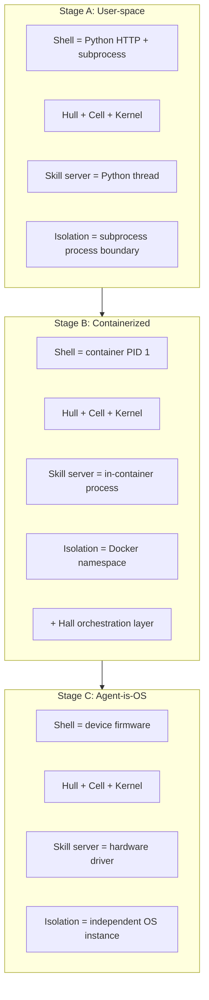
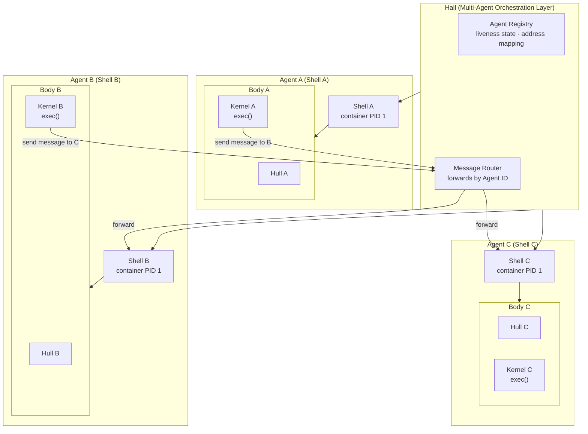
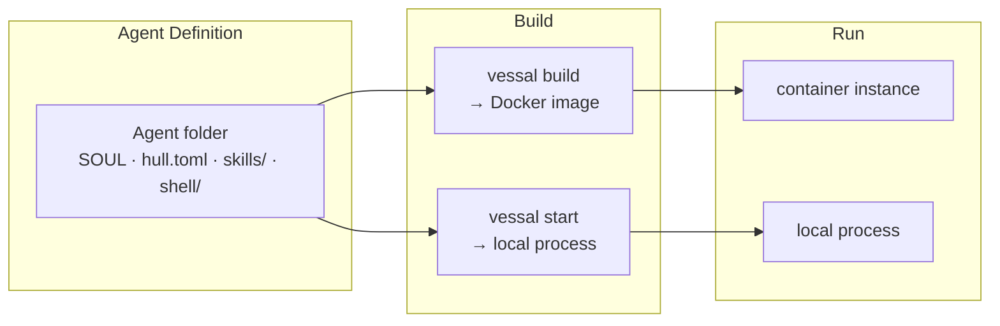

# 5. Embodiment and Evolution

The first four chapters established the cognitive architecture of an Agent: Cell computes, Hull orchestrates, Shell provides boundaries, Skills extend capabilities, and frames drive execution. But all of this rests on a hidden assumption: the runtime environment is transparent.

The OS provides processes, a filesystem, a network stack, and hardware access. Every layer of this whitepaper consumes those capabilities, yet nowhere has the OS's role been explicitly modeled. This chapter closes that gap.


## 5.1 The Gap

Two decisions made earlier in this whitepaper have an implication that has not yet been drawn out.

First: "Shell is to Hull as Docker is to the application inside the container" (§2.4). That analogy is not decorative — it means Shell plays the same architectural role as a container runtime.

Second: "The server can even be written in other languages. Hull only manages starting and stopping it." (§3.2). That means a Skill server can be a C or Rust driver communicating directly with hardware.

Both threads point to the same conclusion: Vessal's architecture naturally supports embodiment. When each Agent runs in its own container, and when an Agent controls physical hardware through Skills, the OS is no longer transparent infrastructure — it becomes part of the Agent's body. This chapter makes that explicit and traces the implications through three deployment stages.


## 5.2 The Hermit Crab Model

Vessal's mascot is the hermit crab (codename: Crab). This is not a decorative choice. The hermit crab's anatomy maps precisely to Vessal's architectural layers.

**The shell = Shell = container/OS.** A hermit crab does not grow its own shell. It finds a suitable one and moves in. The shell provides protection (isolation), but it is not part of the crab. When the crab grows, it swaps into a larger shell.

**The body = Hull + Cell + Kernel = cognitive core.** The soft, vulnerable parts that need protection. The body can move from one shell into another without any loss of function. Portability comes from the clean separation between body and shell.

**Claws/antennae = Skills = organs.** The crab interacts with the world beyond its shell through its appendages. Antennae sense the environment (signals); claws manipulate objects (tools). Different crabs have different claws — loading and unloading a Skill is installing and removing an organ.

**Shell-swapping = replacing the Shell implementation.** During development, use a lightweight Python process shell (flexible, low-overhead). In production, swap to a Docker container shell (hardened, isolated). On a robot, swap to an embedded OS shell (compact, real-time). The body stays the same; only the shell changes.



This model is more than metaphor. It expresses the core architectural invariant: **an Agent's cognitive core and its runtime environment are separable.** The seam of that separability is the `handle()` protocol — the single point of contact between body and shell.

The following four sections unpack the engineering implications of this model.


## 5.3 Shell as an Abstraction Level

§2.4 used Docker as a metaphor to describe Shell's role. But it is not a metaphor — **Shell is the container/OS itself.** The current Python HTTP server plus subprocess is simply one implementation of Shell.

Shell has three responsibilities: isolation (a Hull crash does not affect the inbound channel), gateway (HTTP proxy), and guardianship (detecting crashes and restarting). In different deployment modes, those three responsibilities are carried by different technologies:

**Development Mode (standalone).** subprocess provides process isolation, the Python HTTP server acts as the gateway, and a Python thread handles guardianship. Everything is implemented in Python. This is the two-process model described in §2.7.

**Container Mode (container).** Docker namespaces provide isolation, container port mapping plus a lightweight proxy serve as the gateway, and the container restart policy handles guardianship. Shell degrades to the container's init process (PID 1), taking on container-specific duties: SIGTERM handling, zombie process reaping, and health-check endpoints. In this mode Hull does not need to run in a subprocess — isolation is provided by the container, so Shell and Hull can share the same process.

**Embedded Mode (embedded).** An independent OS instance provides isolation, RTOS IPC serves as the gateway, and watchdog hardware handles guardianship. Shell is integrated into the device firmware.

What all three modes share: **Hull's `handle()` protocol does not change.** Hull always sees `handle(method, path, body)`; it has no knowledge of which technology Shell uses underneath. You can swap out the entire Shell implementation and nothing below Hull requires modification.

This is a direct corollary of the "protocol as architecture" principle (§2.6). `handle()` is an irreversible decision; Shell's implementation technology is reversible. Shell is the cheapest layer in the entire architecture to replace — the pseudocode in §2.4 is only three lines.



Shell's multiple implementations correspond to this directory structure:

```
shell/
  CONTEXT.md
  protocol.py             # handle() protocol definition (shared by all implementations)
  standalone/             # current implementation: Python HTTP + subprocess
  container/              # container implementation: Dockerfile + entry script + lightweight gateway
  embedded/               # embedded implementation: RTOS integration
```


## 5.4 Skill as Organ

§3.1 describes a Skill as "the interface between an Agent and the outside world," where the outside world can be "a human, another Agent, an API service, or a hardware device." §3.2 says a server "can do anything… and can even be written in other languages."

These two design decisions, taken together, mean the hardware access model is already implicit in the Skill model. Each hardware device maps to a Skill:

**Inner face (tool).** The Agent invokes hardware capabilities through code: `eye.capture()` takes a photo; `hand.move("forward", 0.5)` moves the platform.

**Outer face (server).** The device driver, running continuously outside the frame loop, can be written in C or Rust.

**Signal.** Hardware state changes enter the next frame's Ping via `_signal()`. `eye._signal()` returns detected objects; `ear._signal()` returns speech-to-text results.



Loading and unloading a Skill is installing and removing an organ. The meta-skill's `load_skill("camera")` is giving the Agent eyes. The Agent need not know whether `chat.send_message()` sits on top of HTTP or a motor controller — Kernel's duck-typing discovery mechanism is indifferent to implementation language or underlying hardware.

A note on model limits: when hardware imposes real-time requirements (motor control response under 10ms), the frame loop's scheduling cadence may not be fast enough. In those cases, the server needs its own independent real-time control loop that communicates with the Agent asynchronously through shared data and signals, rather than waiting on the Agent's frame-by-frame decisions. This is solvable within the existing Skill server model — servers run outside the frame loop and have their own threads or processes. Start with the existing Skill model; introduce a dedicated DeviceManager layer only if real-time demands warrant it.


## 5.5 exec() and the Body Boundary

§2.2 acknowledged the cost of exec() permeability: LLM-generated code has full permissions in the host process, and outbound behavior cannot be fully controlled. In the user-space application stage, an Agent's exec() can indeed reach all resources on the host OS.

Containerization changes that equation.

A container wraps Shell + Hull + Cell + Kernel as a whole. What exec() reaches is no longer the host OS, but the container boundary:

- Filesystem: the container's FS, not the host's
- Network: the container network; outbound traffic can be controlled with network policies
- Processes: the container's process namespace; cannot affect other Agents

An Agent can do anything it likes inside its own shell — that is precisely the meaning of a Turing-complete action space — but it cannot penetrate the shell to affect the outside world (except by extending antennae and claws beyond the shell through Skills).

Container isolation is enforced by the OS kernel, and application-layer code cannot bypass it. This is more fundamental than placing an outbound proxy at the Kernel layer: a proxy is application-layer inspection (dynamic code generation and low-level socket calls can circumvent it), whereas container isolation is kernel-layer enforcement (cgroups + namespaces; there is no bypass). Chapter 7 makes this concrete: the GRPO parallel sampling approach requires k isolated environments, making container boundaries a training prerequisite, not just a deployment convenience.




## 5.6 Evolution Path

Vessal's relationship with the OS evolves through three stages:

**Stage A: User-space application (current).** Vessal is a Python application; the OS is transparent. exec() has no boundary constraints. Shell uses subprocess for process isolation. Developers run `vessal start` on their local machine.

**Stage B: Containerized (medium-term goal).** One container per Agent. Shell = container entry point (PID 1). Hall = container orchestrator (analogous to Kubernetes). The container is the Agent's body boundary; exec() penetration stops at the container wall. Skill servers run inside the container and are exposed externally through container ports.

**Stage C: Agent-is-OS (long-term goal).** Embedded and robotics scenarios. Shell merges into device firmware. Hull becomes a genuine OS scheduler. Skill servers are hardware drivers directly. The entire OS serves a single Agent.





The changes required to move from A to B: Shell gains containerized deployment support (Dockerfile, entry scripts); the Hall layer is designed and implemented (multi-Agent orchestration); Shell's guardian logic is coordinated with the container restart policy.



The changes required to move from B to C: replace the Shell implementation with an embedded version (RTOS APIs replace subprocess); Hull gains device enumeration and hot-plugging; Skill servers gain real-time capability; the `.venv` assumption is dropped (the entire OS exists to serve this single Agent).

Each transition requires only replacing the Shell implementation and adding an outer orchestration layer. Hull + Cell + Kernel remain untouched. That is the engineering value of the hermit crab model: the body can swap shells.


## 5.7 Agent Definition

An Agent's definition includes its Shell configuration. The Agent folder describes not only the cognitive core (SOUL.md, hull.toml, skills/) but also declares what kind of shell it needs:

```
my-agent/
    SOUL.md               identity and personality
    hull.toml             Hull config + Shell type + resource requirements
    skills/               Skill directory
    shell/                Shell configuration (Shell-type-specific files)
        Dockerfile        used in container mode
```

`vessal start` launches the standalone Shell directly in development mode. `vessal build` uses the Shell type specified in hull.toml to produce deployment artifacts (Docker images, embedded firmware packages).



An Agent definition is self-contained. Given an Agent folder, you can build and run it in any supported Shell mode. This mirrors the experience of the container ecosystem: applications ship with a Dockerfile that declares how to build their runtime environment. An Agent ships with a description of its shell; Hall or the operator reads that description and selects or constructs the appropriate shell accordingly.
