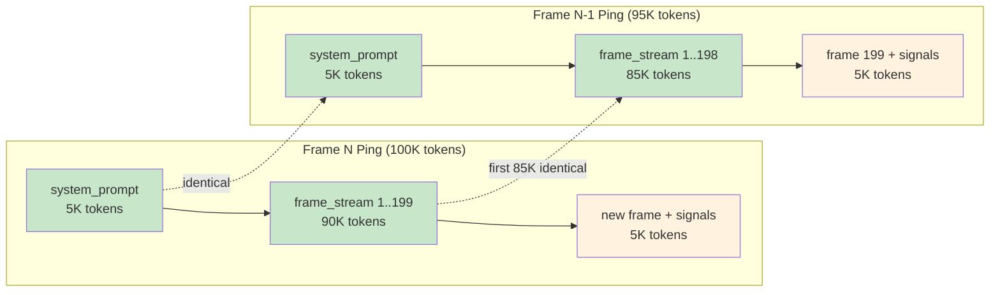
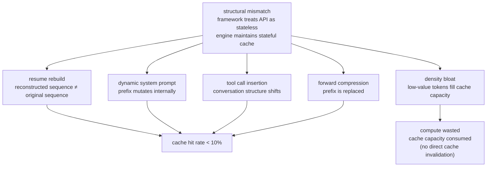
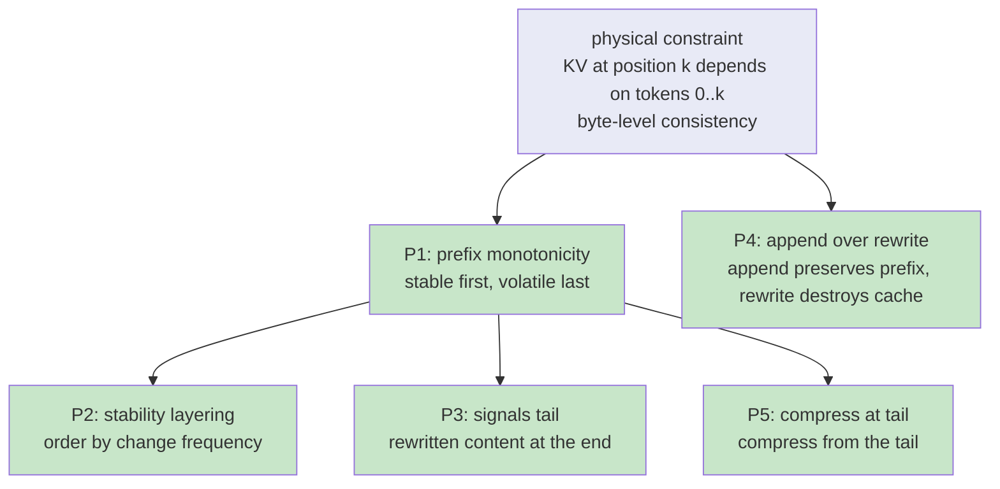
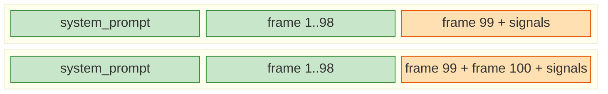
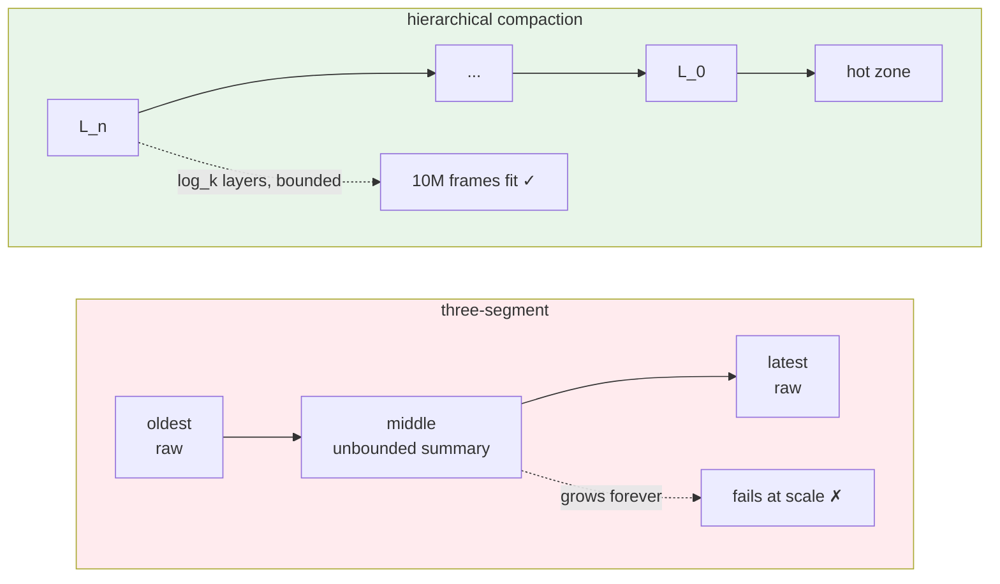
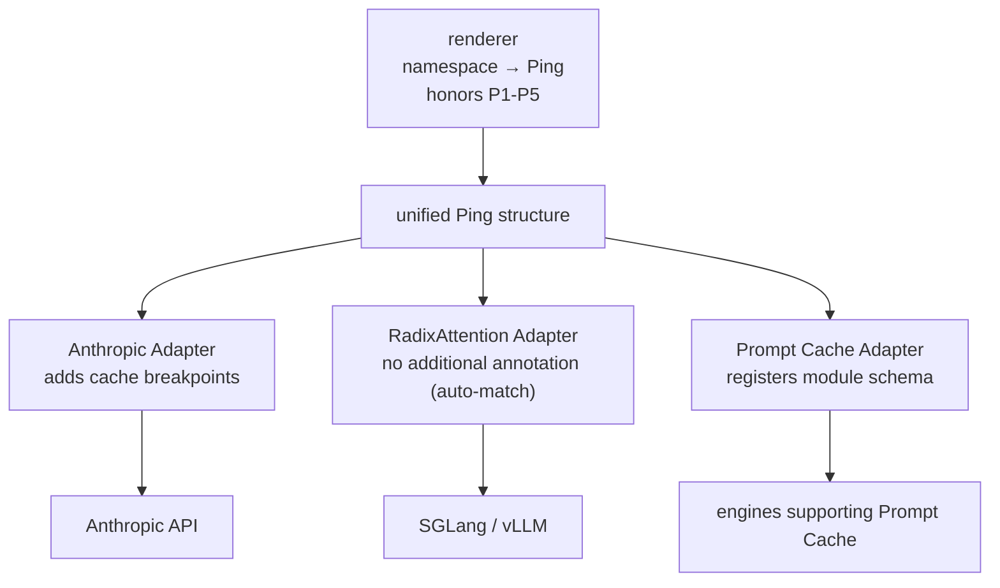
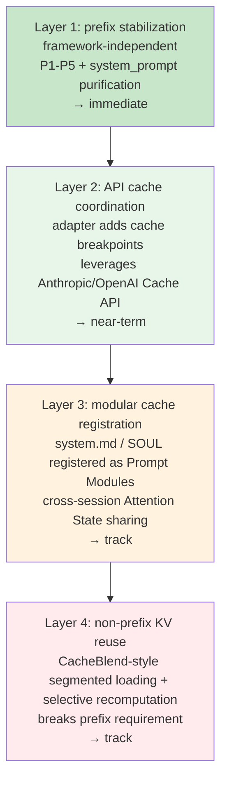
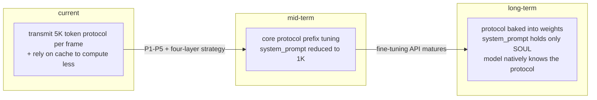
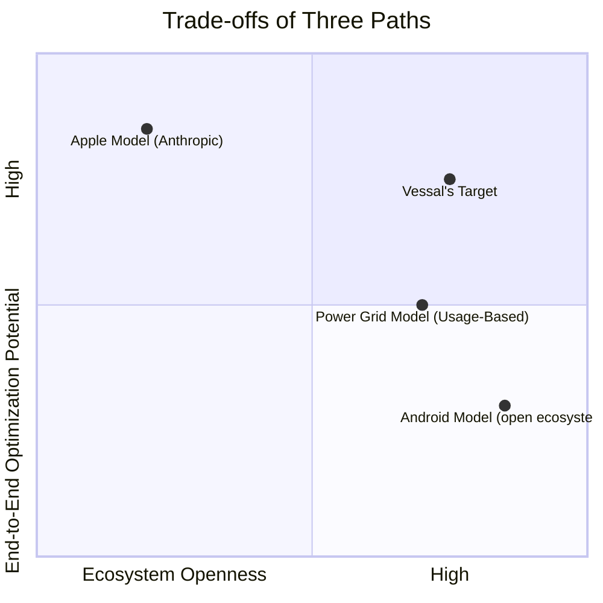

# 6. Cache Coordination

> **TL;DR.** Modern agent frameworks systematically destroy the KV cache that inference engines maintain, and users pay for the computation twice. Five destruction patterns, all avoidable, reduce to five context-construction principles (P1–P5). Applied to Vessal, they yield a purified system_prompt, hierarchical compaction of the frame stream, and a clean path from framework-only tricks to end-to-end model–engine coordination.

The previous chapters answered how an Agent thinks and acts. This chapter answers a question the entire industry has overlooked: how much of the computation behind that thinking is simply wasted?

The answer is unsettling. The computation that current Agent frameworks trigger on inference engines far exceeds what the task itself requires — not because models are too large or contexts too long, but because a structural fracture exists between Agent frameworks and inference engines. The two have evolved independently, with no information channel between them. The KV Cache that inference engines carefully maintain gets systematically destroyed by the way Agent frameworks construct their contexts.

This chapter begins from that fracture, derives Vessal's cache-aware context construction principles, and lays out a complete roadmap from near-term optimizations to long-term vision.


## 6.1 The Hidden Tax

In the Agent era, the core resource is not tokens — it is computation.

Every token entering a Transformer triggers Key and Value matrix computations at every layer, then attends to all preceding tokens. A 100K-token context on a 70B-parameter model involves hundreds of billions of floating-point operations during prefill.

But most of that computation is redundant. In a 200-frame session, the Frame 200 Ping and the Frame 199 Ping may share 95% of their content — the same system prompt, the same first 198 frame records, with only the final frame newly added. The inference engine is fully capable of reusing the computed results for the first 95%, performing real computation only for the new 5%.

This capability is called **Prefix Cache**.

**KV Cache** is an optimization within a single inference pass. When generating the (N+1)th token, the Key/Value tensors for the preceding N tokens have already been computed and cached, eliminating redundant work. This reduces generation-time computation from O(n²) to O(n). Every modern inference engine implements KV Cache — it is the basic infrastructure of Transformer decoding.

**Prefix Cache** is a cross-request optimization. If request B shares its first M tokens exactly with a prior request A, then the first M positions of A's KV Cache can be handed directly to B. B's prefill only needs to begin at token M+1. This reduces prefill cost from O(M) to O(1) — provided the prefix matches exactly.

The "exact match" requirement is extraordinarily strict: **byte-level identity**. Not semantic similarity, not approximate equivalence — every single token must match precisely. The reason is physical: in a Transformer's Attention mechanism, the KV value at position k is a function of all tokens at positions 0 through k. Change a single character at position 1000 and every KV value from position 1001 onward must be recomputed, even if the text after 1001 is identical to the previous request.



Ideally, the Frame N request would hit the 95K-token prefix left by Frame N-1, performing prefill only for the 5K new tokens. In practice?

SGLang developers who measured cache hit rates across mainstream Agent frameworks on a local serving engine described the numbers as "dismal." Claude Code's resume functionality causes KV Cache misses entirely. The session's context construction approach, they concluded, "was never seriously designed for cache reuse from the start."

This is the hidden tax. Users pay for 100K tokens; the inference engine runs prefill on 100K tokens. But if the cache hit rate is 80%, the engine only needs to prefill 20K tokens. The remaining 80K in computation is wasted — users overpay, engines overburn, and neither side knows.

Global compute growth can no longer keep pace with the token demand that Agents generate. The real solution is not cheaper tokens — it is ensuring that the same tokens trigger less computation. Raising Prefix Cache hit rate from 5% to 80% leaves the token count the user pays for unchanged while reducing the engine's actual computation by an order of magnitude.

The question is: why are hit rates so low?


## 6.2 Five Destruction Patterns

The root cause is a structural mismatch.

**The Agent framework's worldview**: the LLM API is a stateless function, `response = llm(full_context)`. Each call passes the complete context so the model has maximum information for optimal decisions. How that context is organized — what goes in it — is the framework's business, driven by task requirements.

**The inference engine's worldview**: I maintain an expensive KV Cache. Whenever your request's prefix matches what I have cached, I can skip enormous amounts of computation. But this requires one thing — the prefix must be byte-level identical. Please do not casually modify the front of the context.

The two worldviews are incompatible. The Agent framework does not know what the engine has cached; the engine does not understand the Agent's session semantics. This is not a bug in any particular framework — it is an architectural blind spot across the entire Agent ecosystem.

There are five concrete destruction patterns.

**Pattern 1: Resume rebuild.** When a session is interrupted and then resumed, the framework reconstructs the context from persistent storage. The reconstructed result is semantically equivalent, but the token sequence may differ entirely — field ordering changed, timestamps updated, certain intermediate states lost. The inference engine performs prefix matching and finds nothing. The entire KV Cache is invalidated. This is the specific scenario SGLang developers singled out when criticizing Claude Code.

**Pattern 2: Dynamic system prompt.** Per-frame injections of skill prompts, status markers, and dynamic configuration embedded inside the system prompt. Since the system prompt is the very front of the Ping, any change at any interior point invalidates the Prefix Cache for everything that follows — including the entire frame history.

**Pattern 3: Tool call insertion.** A conventional dialogue-style Agent's context follows the pattern `[system, user, assistant, user, assistant, ...]`. Each tool call inserts a chunk of tool output into the middle of the conversation, shifting the position of every subsequent message. Positions shift, KV values change, caches are invalidated.

**Pattern 4: Forward compression.** When context exceeds the window budget, the traditional approach is to compress the oldest content — replacing the beginning of the conversation history with a summary. This directly alters the context prefix. Every cached KV entry fails to match from the very first token.

**Pattern 5: Density bloat.** Repeatedly transmitting already-processed context, re-parsing already-confirmed tool call results, maintaining a conversation history that balloons in size but collapses in information density. This does not directly destroy the cache, but it wastes computation and cache capacity all the same.



Vessal's frame architecture sidesteps two of the five patterns by construction. The frame loop is not dialogue-shaped, so Pattern 3 (tool call insertion) cannot happen. The FrameRecord format is structured and bounded, so Pattern 5 (density bloat) never gets off the ground — low-value tokens have nowhere to accumulate. Patterns 1, 2, and 4 — the three that actually invalidate cache — are what this chapter addresses.

More importantly, these patterns reveal a symmetric information gap.

Agent frameworks hold the information engines need: which context segments are invariant within a session, which are appended frame by frame, which are rewritten each frame. This information is sufficient for the engine to make optimal cache decisions.

Inference engines hold the information frameworks need: what is currently cached, how much cache capacity remains, which entries are approaching eviction. This information is sufficient for the framework to construct cache-friendly requests.

Neither side's information has ever crossed the boundary. That is the ultimate cause of wasted computation.


## 6.3 Deriving Principles from Constraints

The byte-level consistency requirement of Prefix Cache is a physical constraint, not a software limitation. It is rooted in the Transformer's Attention mechanism: the KV value at position k is a function of tokens 0 through k. Change any preceding token and every KV value that follows must be recomputed.

This constraint will not disappear through algorithmic improvements or hardware upgrades. As long as the fundamental computation pattern of Attention holds, the constraint holds.

From this single constraint, five context construction principles can be derived. They are not a collection of best practices — they are logical consequences of the constraint. Violating any one of them necessarily degrades cache efficiency.

**P1: Prefix Monotonicity**

> The token sequence prefix of a Ping must remain byte-level consistent across frames. Any content that changes between frames must be placed after all content that does not.

Derivation: if Frame N's Ping prefix differs from Frame N-1's, the engine cannot perform prefix matching and KV Cache is invalidated from the point of divergence. Therefore all invariant content must come first, all variable content last. This is not a preference — it is a necessary condition for cache hits.

**P2: Stability Layering**

> Context is ordered by increasing change frequency: session-invariant (protocol, identity) → frame-appended (frame history) → frame-rewritten (signals). Cache breakpoints are set at layer boundaries.

Derivation: P1 requires stable first, volatile last. Going further, if the variable content itself has different rates of change, it should be ordered from lowest to highest frequency. Frame history grows by appending (low change frequency — only the tail grows); signals are rewritten every frame (high change frequency). Therefore frame history comes before signals. The boundary between layers is the natural location for a cache breakpoint.

**P3: Signals Tail**

> All frame-level rewritten content (signals, dynamic state) must be placed at the tail of the Ping and must not be embedded inside any stable segment.

Derivation: a direct corollary of P1 and P2. If rewritten content is embedded inside a stable segment, even a single changed character invalidates every KV Cache from that position to the end of the Ping — including all the stable frame history that follows. Signals tail is not a layout preference; it is the only means of preventing cascading cache invalidation.

**P4: Append over Rewrite**

> Prefer append-based context growth mechanisms; avoid rewriting existing content.

Derivation: an append adds new tokens to the end of the existing sequence without changing the position or content of any existing token. All existing KV Cache remains valid. A rewrite modifies existing tokens; everything from the modification point onward is invalidated. Accordingly, the state segment of a Ping should grow by appending wherever possible. The frame stream (frame_stream) appends one frame record per frame, satisfying P4 naturally.

**P5: Compress at Tail**

> When context exceeds budget and compression is required, compress from the tail (newest content) and protect the integrity of the prefix region.

Derivation: the traditional approach compresses the oldest content — deleting or summarizing the beginning of the conversation history. This directly alters the Ping prefix, invalidating all KV Cache. Compressing from the newest content instead leaves the original text of older frames intact, keeping their corresponding KV Cache valid. Newly added frames have not yet been cached, so compressing them incurs no cache loss. P5 is a specialization of P1 for the compression scenario: compression is not a special-case operation — it too must honor prefix immutability.



The five principles have clear derivation relationships. P1 and P4 follow directly from the physical constraint. P2, P3, and P5 are corollaries of P1 applied to specific scenarios — layering, signal placement, and compression strategy. The entire system flows from one constraint, with no ad hoc assumptions and no empirical rules.


## 6.4 Vessal's Design Response

Chapter 4 defined the structure of a Ping: `system_prompt + state(frame_stream + signals)`. Now examine that structure through the lens of cache efficiency.

```
Ping
├── system_prompt (quasi-static)
│   ├── kernel_protocol (system.md)     — fixed within session
│   ├── SOUL (_soul)                     — fixed within session
│   └── skill protocol (_prompt() return value) — depends on skill implementation
└── state (dynamic)
    ├── frame_stream                     — one record appended per frame
    └── signals (signal_update() dict aggregate) — rewritten each frame
```

Mapping each segment against the five principles:

| Segment | Change frequency | Principles satisfied | Issue |
|---------|-----------------|---------------------|-------|
| kernel_protocol | fixed within session | P1 ✓ P2 ✓ | none |
| SOUL | fixed within session | P1 ✓ P2 ✓ | none |
| skill protocol `_prompt()` | depends on implementation | P1 ✗ P3 ✗ | **embedded inside system_prompt — any dynamic change destroys the prefix** |
| frame_stream | appended per frame | P1 ✓ P4 ✓ | none; append-based growth is naturally cache-friendly |
| signals | rewritten per frame | P2 ✓ P3 ✓ | none; already at the tail of the Ping |



> Green = cache hit (prefix is byte-level identical); orange = new computation (appended frame + signals). Frame N's Ping hits the KV Cache left by Frame N-1, performing prefill only for the newly added tail content.

Vessal's frame architecture has three natural advantages.

First, **linear append of the frame stream**. Frame stream appends one FrameRecord to the tail each frame without modifying existing content. This keeps the prefix — from system_prompt through every frame record up to the previous frame — byte-level consistent across frames. P1 and P4 are satisfied naturally. This is decisively superior to dialogue-style Agent contexts, where each tool call inserts content in the middle.

Second, **signals already at the tail**. Signals sit at the very end of the Ping; rewriting them each frame leaves every preceding segment's cache untouched. P3 is satisfied naturally.

Third, **structured frame records**. FrameRecords have a determinate format (frame number, action, observation), which avoids the density bloat problem endemic to dialogue-style Agents — low-value tokens do not accumulate, so cache capacity is not consumed by redundant content.

There is, however, one structural weakness: the return value of `_prompt()` is embedded inside system_prompt. If any Skill's `_prompt()` introduces dynamic content, then from that position onward — through the rest of system_prompt, the entire frame_stream, and all signals — every KV Cache entry is invalidated. system_prompt sits at the very front of the Ping; a single change point destroys everything.

Two solutions exist. The conservative approach: constrain `_prompt()` at the protocol level to return only fixed strings. The radical approach: remove `_prompt()` from system_prompt entirely.

Vessal takes the radical approach.


### 6.4.1 System Prompt Purification

Design decision: **system_prompt retains only absolutely invariant content**.

Concrete measures:

First, the `_prompt()` mechanism moves from system_prompt to the signals region. Skill behavioral guidance no longer injects into system_prompt; instead it travels through the `signal_update()` channel, landing at the tail of the Ping. This eliminates every source of change from inside system_prompt.

Second, commonly used Skills are promoted to system builtins. Their protocol text no longer flows through `_prompt()` or `signal_update()`; it is hardcoded directly into system_prompt as static content at the same level as kernel_protocol and SOUL.

Third, loading non-builtin Skills does not affect system_prompt. Their guidance travels through signals; their runtime state is surfaced through signals. system_prompt is entirely unaffected by Skill loading and unloading.

The purified Ping structure:

```
Ping
├── system_prompt (completely invariant within session)
│   ├── kernel_protocol (system.md)
│   ├── SOUL (_soul)
│   └── builtin skill protocols (hardcoded text)
└── state
    ├── frame_stream (appended per frame)
    └── signals (rewritten per frame)
        ├── signal_update() output for each BaseSkill instance
        └── behavioral guidance from _prompt() for non-builtin skills
```

Under this structure, system_prompt does not change at any point during the session's lifetime. It is the absolute anchor of Prefix Cache — every frame's Ping prefix matches exactly from the very start of system_prompt. Combined with the append-based growth of frame_stream, the valid cache region extends from system_prompt all the way through the last frame record of the previous frame.

To borrow CPU cache terminology: system_prompt is the hot data that permanently resides in L1 Cache and is never evicted. frame_stream is the data in L2 Cache growing linearly along a timeline, cold only at the tail. signals are register-level ephemeral data that miss on every access. Ordered from highest to lowest cache affinity, this is a precise implementation of P2 (Stability Layering).


### 6.4.2 Hierarchical Compaction

§6.4.1 made `system_prompt` byte-stable for the lifetime of the session. What remains is the frame stream — a structure that has to keep growing. A ten-million-frame session will not fit in any context window, no matter how large. Compression is unavoidable. The real question is how to compress without wrecking the prefix cache, and how to compress in a way that itself scales as the session runs longer.

> **Implementation note (as of PR 5).** Hull's internal compaction worker (`HullCompactionMixin`, thread pool, bucket-shifting logic) has been deleted. Neither mechanical stripping nor semantic summarization is currently active; the frame stream grows unbounded in SQLite and is read in full each ping via `render_frame_stream(conn)`. Layer≥1 cold-zone entries are not yet produced. The full hierarchical compaction model described in this section remains the architectural target and will be implemented as an independent compaction Cell (PR-Compaction-Cell). The rest of this section describes that target design.

**Why a three-segment model is not enough.**

An earlier Vessal design proposed `[oldest raw | middle summary | latest raw]`: preserve the prefix, preserve recent working memory, and compress the middle. This obeys P5 at small scale. Two flaws surface as soon as sessions run long:

- **Middle grows without bound.** Sessions extend monotonically. No matter what ratio the summary achieves, middle keeps accumulating. At ten million frames it overruns any window.
- **The oldest/middle boundary is ill-defined.** No principled rule says where oldest ends and middle begins. Whatever heuristic is picked becomes an arbitrary implementation choice that varies between runs.

The deeper problem is that three-segment compression has a single axis: space. It compresses once. It has no mechanism to compress the compressed output, which is what open-ended operation demands. **Compression has to be recursive.**

**The key move: physical position ≠ logical time.**

The trick is to separate two orderings that frameworks usually conflate:

- *Logical time* orders frames by when they happened. The oldest frames should be compressed first — that is just freshness.
- *Physical position* orders content by where it sits in the Ping. Content at the prefix gets cache hits; content at the tail does not.

The insight is to let these two orderings disagree on purpose. Compressed material is *placed by how recently it was last rewritten*, not by the age of the content it represents. The layer that has sat untouched the longest goes closest to the prefix, regardless of whether it holds frame 1 or frame 10,000,000.

Log-structured file systems and LSM-tree databases have exploited this for decades: on-disk layout is not chronological layout. The index that maintains logical order is cheap; the savings from stable physical layout are enormous. Hierarchical compaction borrows that trick wholesale.

**Three zones.**

```mermaid
flowchart LR
    SP["system_prompt<br/>invariant"] --> LN["L_n<br/>deepest cold layer"]
    LN --> LDOT["..."]
    LDOT --> L0["L_0<br/>shallowest cold layer"]
    L0 --> CZ["compression<br/>zone"]
    CZ --> B4["B_4"]
    B4 --> B3["B_3"]
    B3 --> B2["B_2"]
    B2 --> B1["B_1"]
    B1 --> B0["B_0<br/>raw, newest"]
    B0 --> SIG["signals<br/>rewritten per frame"]

    style SP fill:#c8e6c9
    style LN fill:#c8e6c9
    style LDOT fill:#c8e6c9
    style L0 fill:#dcedc8
    style CZ fill:#fff3e0
    style B4 fill:#fff3e0
    style B3 fill:#fff3e0
    style B2 fill:#fff3e0
    style B1 fill:#fff3e0
    style B0 fill:#ffe0b2
    style SIG fill:#ffccbc
```



Left to right, rewrite frequency increases monotonically. The pairing of rewrite frequency with physical position is the load-bearing invariant of the entire design.

- **Cold zone — `L_0 … L_n`.** Logarithmic layers of semantic summaries. L_0 is the shallowest; each deeper layer summarizes k entries of the layer above it. Deeper layers have exponentially longer rewrite periods and behave, for practical purposes, as permanent prefix.
- **Hot zone — `B_0 … B_4` plus a compression zone.** The recent window, held either raw or partially stripped. `B_0` holds the k newest frames in full. Each older bucket has already shed a field via mechanical stripping. The compression zone queues k frames awaiting LLM summarization into a new L_0 entry.
- **Signals.** Rewritten every frame, at the tail. Never cached. Covered by P3.

A fourth zone lives off the Ping:

- **Static storage.** Every raw frame is appended to disk as it is produced. This is the absolute backing store. "Not forgotten" means recoverable from static storage, not present in the Ping. In-Ping structure is an active working window; durability is somebody else's job.

**Two-stage compression.**

Compression decomposes along a second, orthogonal axis — who is doing the work:

| Stage | Triggered at | Cost | What it does |
|---|---|---|---|
| Mechanical stripping | bucket boundaries (hot zone) | zero LLM calls | Deterministic field removal along a fixed schema |
| Semantic summarization | layer boundaries (cold zone commits) | one LLM call per k entries | Cross-frame pattern extraction into a fixed schema |

Mechanical stripping handles information decay inside the hot zone: as a frame ages from bucket to bucket, less-referenced fields are shed on a fixed schedule. Semantic summarization handles pattern extraction across buckets: once the compression zone fills with k stripped frames, the LLM folds them into a single summary, which becomes a new L_0 entry. The two stages never overlap — they act on disjoint parts of the structure at disjoint moments.

**Stripping gradient.**

Fields fall away in order of cross-frame reference frequency:

| Bucket | Dropped | Kept |
|---|---|---|
| B_0 (k newest) | — | full: `think`, `operation`, `expect`, `observation`, `signals` |
| B_1 | `think` | `operation`, `expect`, `observation`, `signals` |
| B_2 | `signals` | `operation`, `expect`, `observation` |
| B_3 | `expect` and verification metadata | `operation`, `observation` |
| B_4 | `observation` | **complete operation code** |
| compression zone | — | k stripped frames queued |
| → L_0 | whole bucket collapsed | one schema-v1 record |

`B_4` keeps the operation code in full, not a signature. "What I did" is the minimum faithful residue of a frame, and keeping full code over four frames costs little. Everything more expensive — model reasoning, verification metadata, observations — has already gone.

The alignment that makes this work: every stripping step happens at a bucket boundary, i.e., on the same clock as compaction. No bucket ever mutates mid-life. The only moments the prefix bytes can shift are compaction events themselves — not every frame, not arbitrary points in between.

**Semantic schema.**

Every semantic summarization produces a record in a fixed structured form:

```yaml
range: "t=N..M"            # frame-number interval covered
intent: "..."              # the batch's overall intent (one sentence)
operations: [...]          # ≤4 operation summaries
outcomes: "..."            # what actually happened (1-2 sentences)
artifacts: [...]           # ≤4 persistent outputs (files, variables, IDs)
notable: "..."             # optional: errors, anomalies, surprises
```

The schema is recursive. At L_0, `operations` summarizes four raw frames. At L_1, `operations` summarizes four sub-themes — each being the `intent` of an L_0 entry beneath it. Fields stay fixed; semantic abstraction rises with depth. That is what makes the structure scale: the shape of a record does not change from layer to layer.

Bounded list widths (both `operations` and `artifacts` capped at four) keep record length nearly constant, so layers at the same depth stay structurally comparable across sessions.

**Compaction rule.**

One rule, applied at every layer:

> When a layer holds k entries, the oldest k collapse into a single entry in the layer below, and the layer resets.

Cascading is strict serial. Layer `L_{i+1}` consumes the output of `L_i`; running them in parallel would race on a semantic dependency. Cascade depth is bounded by `log_k(total frames)` — on the order of 8-10 steps for ten million frames at k = 4.

**Shift gating.**

Semantic summarization does not live inside the main SORA loop. It runs in a **second Cell instance** — the compaction Cell — that reuses exactly the same Cell / Core / Kernel code as the main Cell, but is configured with a compaction-specific system prompt, a single `CompactionSkill`, and a distinct SQLite `table_prefix`. The two Cells share one SQLite file and communicate only through two system-level tables, `cold_summaries` (written by compaction, read by main) and `watermark` (per-layer consumption pointer). This is not an ad-hoc "background task": it is a full Agent in its own right, whose job happens to be compressing frames rather than serving the user. Framing compaction as another Cell keeps the framework surface minimal — there is no second abstraction to maintain — and generalizes cleanly to future sub-agents (search workers, audit Cells, etc.), which simply join the Hull's `cells: list[Cell]`.

The SORA loop never blocks on compaction. When compression lags behind frame production, the system must neither drop frames nor corrupt layer order. One invariant handles both:

> A bucket shift is permitted only when `len(B_0) ≥ k`, the compression zone is empty, and no compaction task is in flight.

If any precondition fails, the shift is deferred. New frames keep arriving at `B_0`, which is allowed to exceed k for as long as necessary. This is classical pipeline backpressure: a stalled downstream lets the upstream buffer grow until drainage catches up. When compression completes and the compression zone clears, the pending frames shift in a single batch — possibly advancing multiple buckets at once.

The split of labor between the two Cells is clean: **mechanical stripping** is a deterministic pure function, so it belongs to the main Cell's Kernel and runs every frame as part of the free `FrameStream` projection; **semantic summarization** is an LLM call, so it belongs to the compaction Cell and advances whenever Hull detects pending work. The main Cell's Kernel simply reads whatever layer state is currently committed in `cold_summaries` / `watermark` at the moment of its own `ping()`. Because both reads and the compaction commit happen inside SQLite transactions, the main Cell never observes a half-written layer.

**Classical algorithm backing.**

The structure is not new. It is the union of four well-known patterns:

| Pattern | Origin | Contribution |
|---|---|---|
| LSM-tree compaction | LevelDB, RocksDB, Cassandra | Layered compaction with fixed per-layer capacity k; two decades of industrial validation |
| Exponential Histograms (DGIM, 2002) | Streaming algorithms | `O(log² N / ε)` space bound for sliding-window statistics |
| Binary counter amortized analysis (CLRS) | Algorithm analysis | Proves layer i is rewritten every `k^(i+1)` frames — O(1) amortized cost per frame |
| Fenwick tree | Data structures | Linear physical layout with implicit logarithmic depth |

Between them, these four give a complete correctness argument: capacity is bounded, per-frame cost is constant, and every layer's physical position is stable at a cadence matched to its rewrite period.

**Rewrite cadence.**

At k = 4, one frame per second, layer i rewrites every `k^(i+1)` frames:

| Layer | Rewrite period (frames) | Wall clock at 1 frame/s |
|---|---:|---|
| L_0 | 4 | 4 s |
| L_2 | 64 | ~1 min |
| L_4 | 1,024 | ~17 min |
| L_6 | 16,384 | ~4.5 h |
| L_8 | 262,144 | ~3 d |
| L_11 | ~16.8M | ~194 d |

Deep layers are effectively permanent. A change at L_11 has not happened even once during 194 days of continuous operation. From the cache's point of view, it is indistinguishable from `system_prompt`.

**Coverage and cache economics.**

At k = 4 with a hot zone of roughly two dozen frames, covering ten million frames takes 8-10 layers. The Ping never needs to exceed that bound, no matter how long the session runs.

Per-frame cost breaks down as:

- `system_prompt` — never recomputed; absolute prefix.
- Cold zone — layer i invalidates every `k^(i+1)` frames. Summed over all layers, amortized cost per frame is O(1).
- Hot zone — byte-stable within each bucket lifetime. Shifts invalidate the hot zone at bucket boundaries (every k frames). Prefill cost is bounded by the hot zone size, which is constant.
- Signals — never cached, by design.

For almost every frame, prefill hits cache up to the end of the cold zone. Real computation is confined to a short tail of hot-zone frames and signals.

Compared to the three-segment model, hierarchical compaction:

- **Bounds total in-context size.** `log_k` layers versus unbounded middle.
- **Replaces a heuristic boundary with a binary counter.** Layer boundaries fall where the arithmetic says, not where a designer guesses.
- **Separates deterministic work from LLM work.** Most "compression" is schema-driven field removal; the LLM is reserved for genuine cross-frame induction.
- **Preserves P1-P5.** Bytes are stable within each bucket lifetime; signals stay at the tail; compression still advances from the tail, but the products age *toward* the prefix as they become increasingly permanent. Hierarchical compaction is the open-ended generalization of P5.




### 6.4.3 Adapter Pattern

Different inference engines implement cache optimization differently:

- **Anthropic** uses explicit cache breakpoints — the framework marks `cache_control` in the request, and the engine performs hash matching at those breakpoints
- **SGLang (RadixAttention)** uses radix tree automatic prefix matching — no explicit marking by the framework; the engine automatically finds the longest matching prefix
- **Prompt Cache (Yale/MLSys)** uses module registration — predefined Prompt Modules, not required to be prefixes; the engine reuses Attention State per module

If the Ping structure were specialized for each engine, Vessal's core would become bound to a specific engine's cache semantics, violating the architectural layering principle.

The solution: **Ping maintains a unified internal representation; the API adapter layer handles engine-specific cache annotation**.

The renderer is responsible for semantic correctness — constructing a structurally complete Ping from the namespace, honoring P1–P5.

The adapter is responsible for cache friendliness — reading the Ping's structural information (which segment is system_prompt, which is frame_stream, which is signals) and adding the appropriate cache annotations for the target engine.

For the Anthropic API: place the first cache breakpoint at the end of system_prompt (invariant within session), the second breakpoint just before the newest frame in frame_stream (append-based growth), and no breakpoint in signals (rewritten each frame).

For RadixAttention: no annotation needed at all. The Ping prefix is already guaranteed to be stable across frames by P1–P5; RadixAttention's radix tree will automatically find the longest matching prefix. Vessal's cache principles and RadixAttention's automatic matching are a perfect complement.

For Prompt Cache: register system.md, SOUL, and the builtin skill protocols as the engine's Prompt Modules, precomputing their Attention State. These modules are shared across sessions — different sessions use the same system protocol, and the Attention State is computed only once. Vessal's context is naturally structured in modules, which makes Prompt Cache especially advantageous for Vessal.




## 6.5 Roadmap

### Four-Layer Optimization Strategy

Organized by how much control the Agent framework has, cache optimization falls into four layers. Each layer builds on the previous, delivering incremental gains.

**Layer 1: Prefix stabilization.** Framework-independent — zero external dependencies. The core is applying P1–P5: guaranteeing cross-frame Ping prefix consistency, purifying system_prompt, and placing signals at the tail. The benefit at this layer is entirely determined by the quality of the framework's own context construction. Vessal acts on this immediately.

**Layer 2: API-level cache coordination.** Leverages inference engine provider Cache APIs (such as Anthropic's `cache_control`) to actively mark stable regions. This requires knowledge of the specific provider's cache mechanism, but does not require any change to the Ping's core structure — the adapter layer handles it. Vessal acts on this in the near term.

**Layer 3: Modular cache registration.** Register system.md, SOUL, and similar content as reusable Prompt Modules with the engine, enabling Attention State sharing across sessions. This requires inference engine support for module-based APIs in the style of Prompt Cache. Vessal tracks technical maturity and integrates when engine-side support matures.

**Layer 4: Non-prefix KV reuse.** CacheBlend-style mechanisms — load precomputed KV Cache even when the reusable text is not at a prefix position, then apply selective recomputation to correct cross-attention quality. This is the most flexible approach, breaking the "must be a prefix" constraint entirely. But it requires deep engine support, and the quality loss from selective recomputation must be evaluated. Vessal tracks research progress.



From Layer 1 to Layer 4, framework control decreases and engine dependency increases. But each layer's gains are independent — even doing only Layer 1, the prefill computation of a 200-frame session drops substantially.


### Metrics: Cache Hit Rate Monitoring

Without measurement there is no optimization.

The Anthropic API response includes three key fields:
- `cache_creation_input_tokens`: tokens written to cache by this request
- `cache_read_input_tokens`: tokens that hit the cache in this request
- `input_tokens`: input tokens actually computed by this request

Cache hit rate = `cache_read / (cache_read + cache_creation + input)`.

Vessal records per-frame cache metrics in the frame log, establishing a quantitative feedback loop: adjust context construction strategy → observe hit rate change → iterate. The implementation cost is minimal — extract the fields from the API response and write them to the frame log.

Over time, this data can also drive: runtime adaptive compaction (tune bucket/layer parameters when hit rate drops), per-layer analysis (compare cache behavior across hot zone, cold zone, and signals), and session health monitoring (hit rate trend as a proxy indicator of session quality).


### The Ultimate Path: Protocol into Parameters

Cache optimization solves "transmitted but computed less" — tokens still occupy the context, but the inference engine skips redundant computation through KV Cache reuse.

There is a more fundamental path: "not transmitted at all."

Vessal's system_prompt contains large amounts of stable content: the SORA loop protocol, frame execution specifications, Skill behavioral constraints, safety rules. These do not change between sessions or between users — they are the "operating manual" for Vessal as an Agent runtime. Every frame transmits this manual. Even at 100% cache hit rate, these tokens still occupy context window space, squeezing out the token budget available for the actual task.

If these protocols could be trained into model parameters through fine-tuning or prefix tuning, the effect would be equivalent to the model "natively knowing" how to operate within the Vessal framework. The token count in system_prompt would drop from thousands to hundreds or fewer. This saves not just tokens but cache space, freeing up context window for frame_stream and signals — the Agent's actual working content.

The prerequisite is a sufficiently stable Agent framework and protocol. Vessal's SORA loop and frame protocol are converging toward that stability. When capabilities like computer use can be trained into the model rather than constrained by thousands of tokens of prompting, Agent efficiency will undergo a qualitative shift.

Near-term, Vessal addresses "transmitted but computed less" through P1–P5 and the four-layer strategy. Mid-term, it explores prefix tuning or distillation experiments for core protocols. Long-term, when model fine-tuning APIs mature and framework protocols solidify, protocol into parameters will become the ultimate form of Agent framework optimization.

### Per-Cell and Per-Frame Model Routing

A second corollary of framing compaction as its own Cell is that model choice becomes a per-Cell configuration, not a global session setting. The main Cell may run a strong reasoning model with a mid-sized context window; the compaction Cell naturally runs a cheaper long-context summarization model, since its only job is folding k entries into one YAML record. Each Cell owns an independent `llm_config` (model, base URL, key, decoding parameters); neither inherits from the other. Because the two Cells interact purely through SQLite, nothing in the framework assumes they share a backend at all.

The same decoupling points at a longer-term direction: **per-frame model routing within a single Cell**. Different moments of the SORA loop have different cost profiles — routine tool dispatch is cheap, cross-frame reflection is expensive, compaction itself is bulk throughput. Once a Cell can declare "this frame runs on model A, the next on model B" based on a signal the Kernel surfaces, the framework gains a price/quality dial that is orthogonal to compaction. Nothing in P1–P5 or hierarchical compaction forbids it — Ping is a structured object, and which model consumes that object is a downstream Core decision. This is not implemented today, but the architecture already admits it: multi-Cell routing is the coarse version, per-frame routing is the fine version, and both reduce to "select the right model for the work at hand."




### Three Evolution Paths

Zooming out, the relationship between Agent frameworks and inference engines is evolving along three trajectories.

**Vertical integration (Apple model).** Anthropic controls the model, controls the Agent framework (Claude Code), and optimizes the inference stack end-to-end. Full internal control enables closed-loop cache optimization. The cost is the low ceiling of a closed ecosystem — third-party frameworks have no leverage under this model and can only passively adapt to API changes.

**Layered decoupling (Android model).** Agent frameworks are independent of the model layer; users freely choose their backend. Ecosystem diversity is high and competition is vigorous. The cost is that cross-layer optimization is blocked — the framework cannot see the engine's cache state, and the engine does not understand the framework's session semantics. Solving this requires a standardized coordination interface between layers. P1–P5 is the Agent framework's contribution to that standardization: regardless of the underlying engine, contexts constructed in accordance with these principles are cache-friendly.

**Usage-based billing (power grid model).** Regardless of which framework is used, billing is based on actual computation consumed. Price signals force framework developers to optimize token efficiency. This path does not directly solve the technical problem, but it creates the economic incentive that causes the technical problem to get solved.



Vessal's position: a cache-aware framework within an open ecosystem. It does not depend on any specific engine's optimizations (the adapter pattern guarantees engine neutrality), yet through P1–P5 and the four-layer strategy it maximizes cache efficiency at the framework level. This is the balance struck between the openness of the Android model and the optimization potential of the Apple model.

If a standardized Agent-Engine coordination interface is eventually established — frameworks declaring which segments are stable, engines feeding back which content is cached — Vessal's Ping structure is already prepared for it. Stability layering is the foundation for those declarations; cache hit rate monitoring is the receiving end of that feedback.


## 6.6 Technical Foundations

The principles and strategies in this chapter are not designed from thin air. They are grounded in the frontier research on KV Cache reuse. Six technologies form the evidence base for Vessal's design decisions.

**RadixAttention (SGLang, MLSys 2024).** Manages KV Cache with a radix tree, performing automatic longest-prefix matching with LRU eviction. Throughput gains up to 5×. Takeaway: engines already have the capability for efficient prefix matching. What Agent frameworks need to do is construct stable prefixes that give the engine something to match against. P1 is the formal statement of that requirement.

**Prompt Cache (Yale, MLSys 2024).** Defines Prompt Modules — predeclared reusable text segments with precomputed Attention States that are cached. Key breakthrough: not required to be a prefix. GPU inference TTFT reduced by 8×, CPU inference by 60×. Takeaway: Vessal's system.md, SOUL, and builtin skill protocols are natural Prompt Modules. Vessal's context is inherently structured as modules — a fundamental advantage over dialogue-style Agents.

**CacheBlend (LMCache, 2024).** Addresses KV reuse at non-prefix positions — loads precomputed KV Cache and selectively recomputes a small fraction of tokens to correct cross-attention quality. TTFT reduced by 2.2–3.3×. Takeaway: even when strict P1–P5 compliance is occasionally broken (e.g., a hot reload changes system_prompt), CacheBlend provides a repair path. This is the technical foundation for Layer 4.

**Anthropic Prompt Caching (API layer, 2024).** The closest commercial realization of Agent-Engine coordination. Explicit cache breakpoints + 20-block lookback + 0.1× cache-hit pricing + 5-minute TTL auto-refresh. Takeaway: this demonstrates the value of an information channel between Agent and engine — marking just a few breakpoints in a request can raise cache hit rates to a meaningful level. Vessal's Anthropic adapter directly leverages this mechanism.

**LESS (arXiv 2024).** Layers a recurrence cache on top of KV Cache compression, keeping evicted token information queryable. Takeaway: when the frame stream grows to the point of needing truncation, early frames need not be discarded outright — a low-rank representation can be retained. This requires model-level support and belongs to a mid-to-long-term direction.

**Infinite-LLM (arXiv 2024).** Separates the Attention layer into an independently schedulable resource unit and uses a cluster-level GPU memory pool to manage KV Cache, supporting 2000K-token contexts. Takeaway: represents the direction inference engines are heading — KV Cache moving from single-machine to distributed. Vessal's Ping structure design should not become an obstacle to integrating with distributed cache in the future.

These six technologies span the full spectrum from engine-side automatic optimization (RadixAttention) to API coordination (Anthropic) to modular registration (Prompt Cache) to non-prefix reuse (CacheBlend) to distributed architecture (Infinite-LLM). P1–P5 are favorable across every one of these directions. A context that honors prefix stability and structured layering extracts the maximum benefit from any cache mechanism the underlying engine employs.


## 6.7 Conclusion

Context construction is not only an information management problem — it is a problem of computational economics. Every token sequence an Agent framework produces directly determines the inference engine's computational load. In the Agent era, a framework that cannot write cache-friendly contexts is like a programmer who cannot write cache-friendly code: the waste falls not on its own resources but on the compute of the entire ecosystem.

Vessal found a structural advantage for computational efficiency inside the frame architecture itself — a linearly appending frame stream is a natural carrier for Prefix Cache. Building on that foundation, P1–P5 elevates this advantage from "accidental property" to "design guarantee." System prompt purification eliminates the last remaining source of cache destruction. Hierarchical compaction preserves the cache foundation as sessions run arbitrarily long, bounding in-context size at `log_k` layers with O(1) amortized cost per frame. The adapter pattern ensures that optimizations remain engine-agnostic.

All of this is Layer 1 and Layer 2 work — achievable independently at the framework level or with only API-layer cooperation. As inference engine cache mechanisms continue to evolve — Prompt Cache's modularization, CacheBlend's non-prefix reuse — Vessal's structured Ping is already positioned to integrate with deeper optimizations. When model fine-tuning capabilities mature, the core protocols in system_prompt can be trained into parameters, moving from "transmitted but computed less" to "not transmitted at all."

Ultimately, the information channel between Agent frameworks and inference engines will be opened. Frameworks will declare the stability structure of their context; engines will feed back the state of the cache. The two will no longer be strangers to each other, but partners in coordinated optimization. Vessal's P1–P5 principles and stability layering are the framework side's first step on that path.
