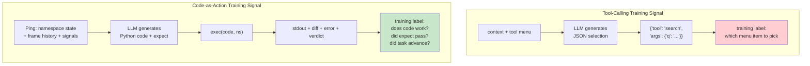
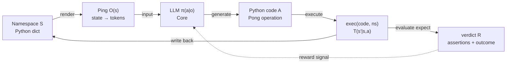
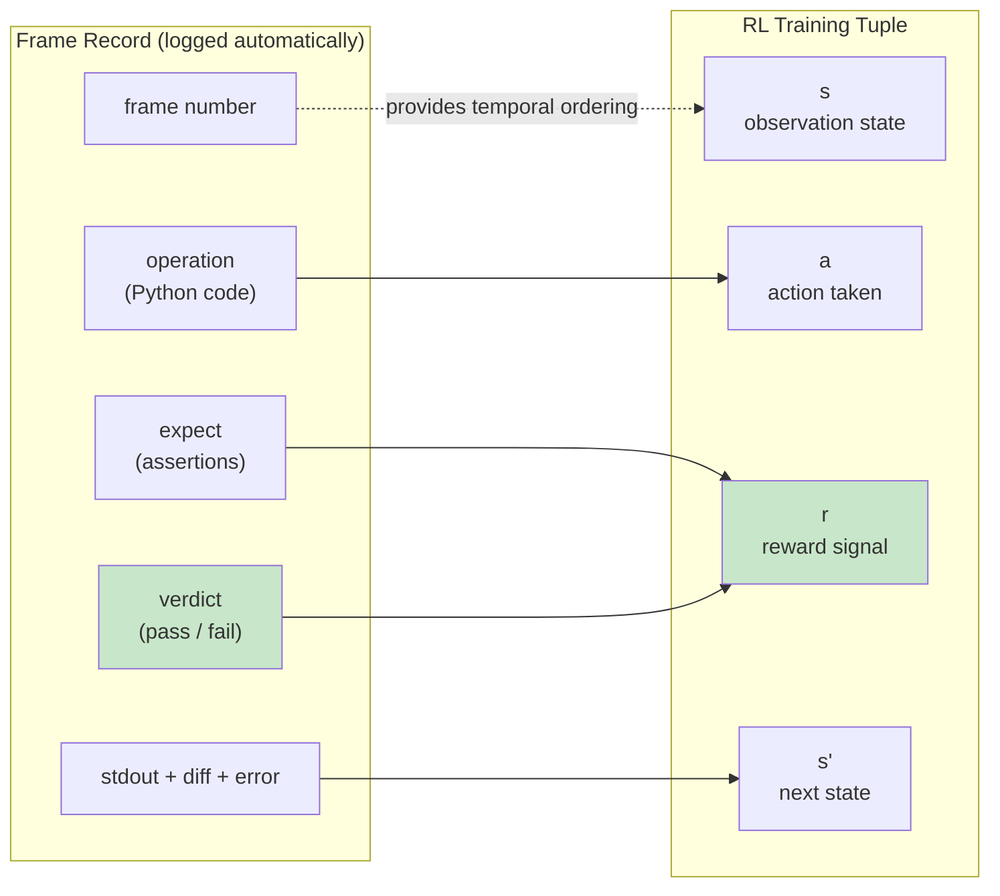
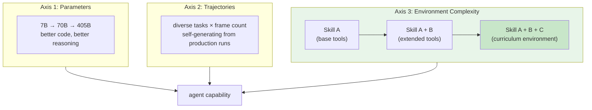
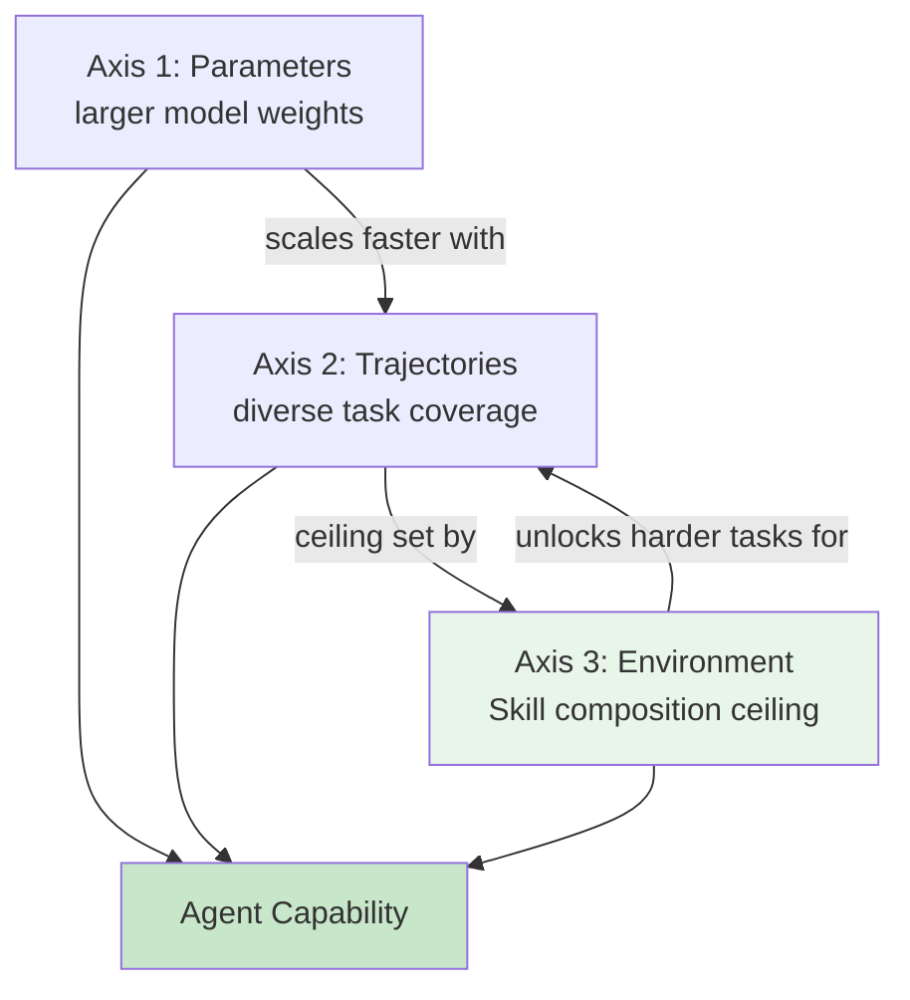
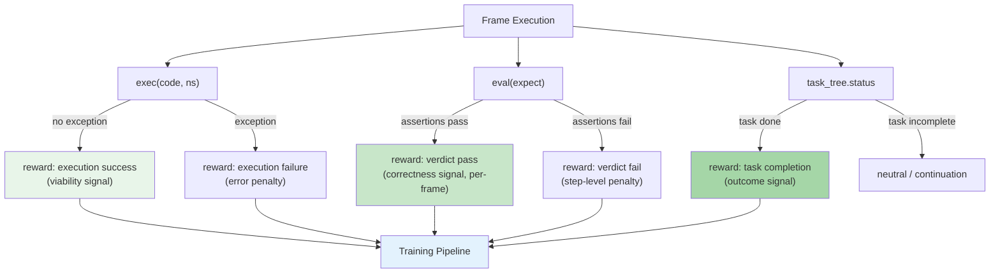
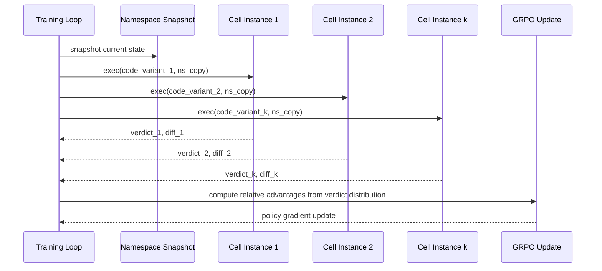
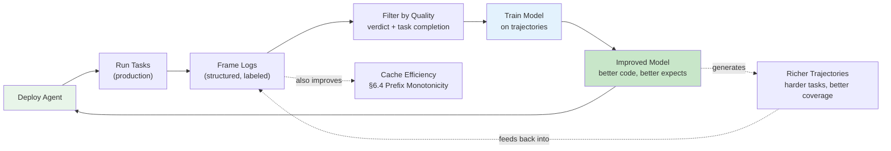

# 7. Training and Scaling

The previous chapter ended with a conjecture: the SORA protocol is stable enough that it could be trained into model weights. system_prompt shrinks. Context budget grows. The agent gets more room to work.

This chapter develops that conjecture into a complete argument. The SORA loop is not merely a runtime architecture — it is a naturally structured training environment for agent models. That claim requires derivation, not assertion. The derivation begins with the gap that current training pipelines leave open.

The chapter is organized to build the argument bottom-up. §7.1 establishes that a training gap exists and diagnoses its structural cause. §7.2 shows that the SORA loop satisfies the formal requirements of a Markov Decision Process — the standard mathematical substrate for RL. §7.3 shows that the frame record format is already an RL tuple. §7.4 identifies three scaling axes for agent capability, of which the third is novel to Vessal's architecture. §7.5 describes three reward channels the environment provides automatically. §7.6 shows how deployment and training form a virtuous cycle. §7.7 is honest about what remains unsolved. §7.8 anchors the argument in prior work.

## 7.1 The Training Gap

Models are trained on text and deployed as agents. This gap is not closing.

Pretraining teaches language. Given enough tokens, a model learns grammar, facts, reasoning patterns, even coding conventions. Supervised fine-tuning teaches conversation format — how to follow instructions, how to be helpful, how to structure a response. RLHF teaches preference alignment — which outputs humans rate more highly. Each of these is a real capability, and each is genuinely useful. None of them teaches multi-step planning and execution in a persistent environment.

The missing capability is not subtle. An agent that can produce a single brilliant response is not the same as an agent that can execute a ten-frame plan, observe the result of each step, correct its course when something breaks, and arrive at a coherent goal state. These are different skills. The training pipelines that produce the former do not, by construction, produce the latter.

Tool-calling frameworks compound the problem. The dominant paradigm for building agents today gives the model a structured menu of functions and asks it to select one. The model generates a JSON object specifying a tool name and arguments. The framework executes the tool. The cycle repeats. This action space is a finite set of discrete choices, while the model's natural output is a continuous sequence of tokens. Training on tool-call traces teaches menu selection. It does not teach problem-solving, because problem-solving — deciding which steps to take in what order, composing sub-solutions, handling unexpected intermediate states — cannot be expressed as a sequence of menu selections.

The bottleneck is the structure of the training signal, not the volume of data. Billions of text documents exist. Millions of human conversations exist. High-quality agent trajectories — recorded instances of a model successfully completing multi-step tasks through deliberate, executable reasoning — exist in the thousands. That scarcity is not primarily a data collection problem. It is an environment problem. Generating quality agent trajectories requires an environment that can execute actions, observe outcomes, and record the full sequence with consistent structure.

Current pipelines produce conversationalists, not agents. The missing piece is not a better dataset. It is a better environment.

The left side trains selection. The right side trains execution, verification, and multi-step reasoning. The difference in signal structure is categorical.

The scarcity of quality agent trajectories is structural, not incidental. Text is generated passively; conversations accumulate from deployment. Agent trajectories require an instrumented environment: one that can accept a code action, execute it, observe the result, and record the full sequence with consistent structure. The scale disparity is striking — the Common Crawl corpus contains hundreds of billions of documents, while SWE-Gym (ICML 2025) provides 2,438 labeled real-world software engineering trajectories as a significant dedicated effort. The entire published corpus of high-quality agent trajectories fits comfortably in a single afternoon of production deployment from a modestly active system. The fix is to build the environment so that RL-ready trajectories are the natural byproduct of ordinary operation.

## 7.2 SORA as Markov Decision Process

The SORA loop — State, Observation, Reasoning, Action — is a description of how the agent operates. What it turns out to be, when examined formally, is a Markov Decision Process. This is not a design choice. It is a discovery.

Before the formal mapping, it is worth noting why the MDP formulation matters for training, not just for theory. Standard pretraining and SFT are supervised learning problems: given input X, produce output Y. The loss is computed over individual samples, independently. There is no notion of a sequence of decisions leading to a goal, no credit that flows backward through time, no feedback from the environment about whether an action was productive. The model learns "what text looks like" and "what responses look like," but not "what decision sequences accomplish goals."

MDPs are the natural formalism for sequential decision-making under feedback. The entire apparatus of RL — policy gradients, value functions, temporal difference learning, actor-critic methods — exists to train agents in MDPs. By establishing that SORA is an MDP, we connect Vessal's runtime directly to the existing body of RL theory and algorithms. The question is not "how do we adapt RL to Vessal?" It is "which standard RL algorithms apply most naturally?"

A Markov Decision Process is defined by: a state space S, a transition function T(s'|s,a) determining how actions move states, an observation function O(s) mapping states to what the agent perceives, a policy π(a|o) governing how the agent selects actions given observations, and a reward function R(s,a,s') providing feedback after each transition. The agent's goal is to learn a policy that maximizes cumulative reward.

Map each component to Vessal:

| SORA | MDP Component | Vessal Realization |
|------|--------------|-------------------|
| State | S | Namespace (Python dict) |
| Observation | O(s) | Ping rendering |
| Reasoning | π(a\|o) | LLM (Core) |
| Action | A | Python code (Pong operation) |
| Transition | T(s'\|s,a) | exec(code, ns) |
| Reward | R(s,a,s') | Execution outcome + verdict |

Each mapping has a structural property worth examining.

**The namespace is fully observable state.** In most RL settings, the agent cannot see the full state — it sees only an observation, which is a partial or noisy view. In Vessal, the Ping renders the namespace explicitly. The agent can inspect every variable it has written. The state is not hidden behind a chat API that abstracts away what was previously computed. Full observability is a massive simplification for learning: the policy's input faithfully represents the world.

**exec() is a deterministic transition.** Given the same code and the same namespace, exec() produces the same result every time. Deterministic transitions are the RL researcher's dream: the environment is consistent. Off-policy learning becomes tractable. A trajectory collected yesterday is as valid a training signal today as when it was generated, because the same code on the same state would produce the same outcome.

**The action space is text.** The model generates Python code as token sequences. This is the model's natural output modality — the same modality it uses for everything else. There is no translation layer, no structured JSON encoding, no mapping from token sequences to discrete function indices. The policy's output is the action. This eliminates the awkward impedance mismatch that afflicts tool-calling architectures.

**Verdict is automatic per-frame reward.** The LLM writes `expect` assertions alongside each action. The runtime evaluates them and reports pass or fail. This is a reward signal that requires no human labeler, no separate reward model, and no post-hoc trajectory review. It is emitted by the environment itself, once per frame, with structured output.

This is not a metaphor. The SORA loop satisfies the formal requirements of an MDP. It can be trained with standard RL algorithms. That observation — falling directly from the architecture's structure — is the foundation for everything that follows.

There is a subtlety in how the policy maps observations to actions. The Ping is a rendering of the namespace into tokens — it is an information-lossy projection because not every variable can fit in the context window. In that strict sense, the agent operates on an observation, not the full state. But in practice, the agent controls what enters its own namespace (everything in the namespace was written by a prior Pong), so the observation is as complete as the agent has chosen to maintain. An agent that writes important results to clearly named variables will see them in subsequent Pings. An agent that clutters the namespace with large intermediate objects may not. The information management problem (§1.4) is ultimately the agent's own responsibility.

There is one more structural property worth naming explicitly: the Markov property itself. In a valid MDP, the next state depends only on the current state and the current action — not on the history of how that state was reached. The Vessal namespace satisfies this. exec(code, ns) writes deterministically to the namespace based on the current namespace contents and the executed code. The frame history in the Ping is a rendering convenience — it helps the LLM understand context — but the transition function does not read it. The state is the namespace. The transition is a function of the namespace and the code. The Markov property holds.

This matters for training because it means trajectories from different sessions, different agent instances, and different task contexts can all be pooled into the same training dataset. There is no session-specific hidden state that makes one trajectory incomparable to another. A transition (s, a, s') from a data processing task and a transition from an API integration task are formally equivalent training samples. The same RL update rule applies to both.

## 7.3 Structured Trajectories

The frame log is not a debug artifact. It is training data.

Every frame produces a frame record containing: frame number, action (operation + expect), and observation (stdout + diff + error + verdict). The frame record is the (s, a, r, s') tuple of RL, recorded automatically, in a consistent structured format, for every step of every task the agent runs.

The consistency of this structure deserves emphasis. One of the hard problems in training on agent trajectories is that different environments, different agent architectures, and different task types produce wildly different log formats. A trajectory from a LangChain agent looks nothing like a trajectory from an AutoGen conversation. Neither looks like a trajectory from a ReAct loop. Merging these into a single training corpus requires schema normalization, semantic alignment, and often manual curation. The resulting datasets are small, expensive, and quickly outdated.

Vessal's frame log format is fixed by the protocol. Every frame, in every task, in every deployment, produces a record with the same schema: frame number, operation, expect, stdout, diff, error, verdict. The schema does not change when a new Skill is loaded. It does not change when the task type changes. It does not change between agent versions. This structural consistency is what makes large-scale trajectory aggregation feasible without a data cleaning pipeline.

Consider what this means for data generation. In a tool-calling framework, an agent's run produces a conversation log — a sequence of natural-language messages interspersed with JSON tool calls and their outputs. To use that as training data, you need to identify which actions led to success, extract the trajectory structure, normalize the format, and produce quality labels. This requires non-trivial post-processing and, often, human review.

In Vessal, the frame log is already the RL tuple:

- **observation**: the Ping (what the agent saw)
- **action**: the Pong operation (what the agent did)
- **reward**: the verdict (did it work?)
- **next state**: the namespace diff (what changed)

The format is fixed and consistent across every task, every agent, every Skill configuration. There is nothing to normalize. Quality labels are provided by the verdict mechanism — an assertion that passes is a signal that the agent's reasoning was correct at that step.

The verdict provides what conversation-based agents cannot: **automatic quality labels at every step**. Not just at the end of a successful task, but for every individual frame. An agent that writes a correct data transformation gets a passing verdict on that frame. An agent that miscalculates an intermediate result gets a failing verdict on that frame. The credit assignment problem — which steps in a trajectory actually contributed to success? — becomes partially tractable because each step carries its own quality signal.

This is the property that makes Vessal's frame architecture naturally generative of training data. Ordinary operation produces structured, labeled trajectories. The agent does not need to be run in a special training mode. Every production deployment is also a data collection system.

The compression frame (§4.5) is particularly useful here. When the frame stream reaches the compression threshold and Hull triggers a compression frame, the resulting frame record contains the agent's own summary of what it accomplished and what it learned over the preceding sequence. This is a natural form of trajectory distillation: the agent's compressed understanding of a multi-frame sub-task, expressed as a namespace delta. Trained on compression frames as well as work frames, the model learns not just how to act but how to synthesize what it has done — a meta-cognitive capability that standard trajectory data does not contain.

The signal (§4.3) adds another layer. Before each Ping, Skills emit `_signal()` output that injects perception data — inbox messages, hardware state, external API responses. A frame record that includes signal context captures the full perceptual situation that led to each action, not just the namespace state. The trajectory carries richer information about why each action made sense in context. For multi-modal Skills (camera, audio), signal-annotated trajectories contain the perceptual grounding that makes actions interpretable to a training algorithm trying to learn when each action is appropriate.

## 7.4 Three Axes of Scaling

The classical scaling laws — Kaplan et al. (2020), Chinchilla (Hoffmann et al., 2022) — identify two axes: parameters and data. More parameters, more data, better models. This is roughly right for pretraining language models. For agent training, a third axis emerges.

**Axis 1: Parameters.** Larger models write better programs. A 70B model writes more correct Python than a 7B model, handles more edge cases, recovers from errors more gracefully. Vessal is model-agnostic — Core is swappable. Whatever model the field produces next, Vessal can run it. Parameter scaling is not Vessal's concern; it is the LLM ecosystem's concern. Vessal benefits from it automatically.

**Axis 2: Trajectories.** More diverse task trajectories improve generalization. An agent trained on Python data processing tasks will generalize better if its training also includes API integration tasks, file system operations, and multi-step reasoning chains. SWE-Gym (Pan et al., ICML 2025) demonstrated this directly: fine-tuning on fewer than 500 diverse agent trajectories produced +14% absolute improvement on SWE-Bench Verified. The frame log is self-generating: every task Vessal runs produces another trajectory. There is no separate data collection pipeline to build.

**Axis 3: Environment complexity.** This is the new axis. Skills define the environment. Loading different Skills into the same agent creates a different training environment — a different set of tools, a different perception channel through signals, a different set of tasks that become expressible.

A Vessal agent with only the base Skills sees a constrained world. Load a database Skill and it can now learn SQL generation and query optimization. Load a web browsing Skill and it can now learn multi-hop information retrieval. Load a code analysis Skill and it can learn static analysis and refactoring. Each Skill composition is a new environment, and environments can be composed deliberately into a curriculum.

This third axis matters because it makes curriculum learning a natural consequence of the architecture. You do not need to design a curriculum externally and inject it into training. You compose Skills in increasing complexity, collect trajectories at each stage, and train on those trajectories in order. The environment itself is the curriculum.

To be concrete: a training curriculum built from Skill composition might look like this. Stage 1: base Skills only, tasks limited to local computation and namespace manipulation. Stage 2: add a filesystem Skill, tasks now include reading, writing, and transforming files. Stage 3: add an HTTP client Skill, tasks now include API integration and error handling for network failures. Stage 4: add a task management Skill, tasks now span multiple frames with sub-goal tracking. At each stage, the agent collects trajectories that are impossible or meaningless without the new Skill — and those trajectories carry environment-specific signals that train capabilities the previous stage could not have produced.

The third axis also interacts with the first two. A larger model (axis 1) can handle more complex Skill compositions. More trajectory volume (axis 2) at each curriculum stage reduces overfitting to the specific tasks encountered. The three axes are not independent — they compound.

The three axes interact rather than add independently. Larger models (axis 1) scale faster with trajectory diversity (axis 2) — parameter capacity and trajectory coverage amplify each other. Environment complexity (axis 3) sets the ceiling: a constrained Skill set limits the diversity of reachable tasks, capping the benefit of additional trajectories regardless of model size.

## 7.5 RL from Environment Feedback

RLHF — Reinforcement Learning from Human Feedback — uses a human-trained reward model to evaluate outputs. It is effective. It is also expensive: humans must label comparisons, the reward model must be trained, and the reward model can be fooled. The deeper problem is that for agent tasks, humans are not the right evaluators. Humans cannot efficiently evaluate whether a specific Python transformation is correct, whether a multi-step data pipeline produces the right output, or whether an intermediate namespace state represents meaningful progress.

The environment can. Vessal's SORA architecture provides three distinct reward channels without a single human label.

**Channel 1: Execution success.** Code either runs or it does not. An exception terminates the frame with a non-empty error in the observation. A clean execution — even if the result is semantically wrong — is a viability signal: the code was syntactically correct, the referenced variables existed, the called functions accepted the arguments. This is a necessary condition for any productive frame, and it is available for free on every frame.

**Channel 2: Verdict.** The LLM writes assertions as part of every action: `assert result is not None`, `assert len(df) > 0`, `assert error_count == 0`. These are evaluated after execution. A passing verdict means the agent's prediction about its own action was correct. A failing verdict — even in the absence of a runtime error — means the action did not produce what the agent expected. This is a fine-grained correctness signal, provided by the agent's own self-model, without any external evaluator.

**Channel 3: Task completion.** Tasks are tracked through the namespace. A task tree that reaches "done" is an outcome-level signal: the full goal was achieved. This coarser signal is still valuable — it calibrates the per-frame signals against real task success, preventing reward hacking where an agent learns to write assertions that are easy to pass rather than assertions that are meaningful.

These three channels support both outcome-based RL (train on trajectories that complete tasks successfully) and process-based RL (train on frames where the verdict passes, regardless of overall task outcome). The deterministic transition function enables off-policy learning: trajectories collected in any prior session are valid training samples, because the same code on the same namespace state would have produced the same result.

The distinction between outcome-based and process-based RL is worth unpacking. In outcome-based RL, the reward is sparse: the agent receives a signal only when the task completes, and all intermediate frames are labeled retroactively based on whether the trajectory succeeded. This is simple but suffers from the credit assignment problem: a twenty-frame trajectory that fails has twenty frames of negative signal, even if nineteen of them were perfectly executed. In process-based RL, the reward is dense: each step receives a quality signal independent of the outcome. Lightman et al. (OpenAI, 2023) showed that dense per-step rewards outperform outcome-only rewards for math reasoning. The verdict is Vessal's per-step reward — automatic, environment-generated, available at every frame.

The combination of outcome and process signals is the key. Verdict pass rate filters for locally correct behavior. Task completion filters for globally effective behavior. A frame that passes its verdict but contributes to a failing trajectory is informative: it tells the training algorithm that local correctness is necessary but not sufficient. A frame that fails its verdict but belongs to a task that eventually succeeds is also informative: the agent recovered. Both signals are captured automatically in the frame log.

Self-play training follows naturally. Run the agent. Collect the frame log. Filter by verdict pass rate and task completion. Train on the filtered trajectories. Deploy the updated model. Repeat. No human annotators. No separate reward model. No specialized training infrastructure beyond what ordinary deployment already provides.

This is the generalization of a pattern that DeepSeek-R1 (DeepSeek, arXiv 2025, Nature 2025) established for math and code reasoning: when the environment can verify correctness — when there is a ground-truth oracle — RL from that environment can produce strong reasoning without human labels. DeepSeek-R1-Zero, trained with GRPO purely on verifiable execution rewards, improved AIME 2024 pass@1 from 15.6% to 71.0%. The oracle in that case was mathematical correctness. Vessal generalizes the oracle: any task for which the agent can write meaningful assertions becomes a verifiable environment.

The choice of RL algorithm matters for the practical training loop. GRPO (Group Relative Policy Optimization) is particularly well-suited to Vessal's structure. GRPO estimates policy gradient advantage from the relative performance of a group of sampled actions on the same input, rather than training a separate critic model. In the Vessal context: given a namespace state and a task, sample k different Python code snippets from the model, execute all of them in parallel isolated namespace copies, evaluate the verdict for each, and compute relative advantages from the verdict distribution. The deterministic transition function makes this tractable — each code snippet produces a fully reproducible outcome. No critic model is needed, no value function estimate, no bootstrapping from future states. The verdict distribution across the sample group is the baseline.

The Cell's passive, stateless interface (§2.2) makes this extension straightforward: a namespace snapshot is a dict copy, and each parallel Cell instance operates on its own copy. Cell's `exec(code, ns)` is the execution oracle. Running multiple Cell instances with the same namespace copy produces the group of trajectories GRPO needs. Namespace isolation is a natural consequence of Cell's design — the namespace is a plain Python dict, copying it requires no special protocol support.

The parallel structure is natural because namespaces are independent Python dicts. Copying a namespace is a dict copy. Each parallel execution is fully isolated. The deterministic transition means the same code on the same copy always produces the same verdict — the sample variance is entirely from the policy's output distribution, not from environmental noise. This is the ideal setting for GRPO.

## 7.6 The Virtuous Cycle

The relationship between deployment and training is not one-directional. It is a loop.

Deploy the agent. The agent runs tasks. Each task generates frame logs — structured, labeled, consistent. Filter the frame logs by quality: high verdict pass rates, successful task completions, clean execution records. Train the model on those trajectories. The updated model writes better code, writes better assertions, completes more tasks. Deploy the updated model. Better trajectories flow back into training.

This loop is not designed into the architecture as a feature. It is the natural consequence of two properties that were designed for other reasons: the frame record format (designed for cache-friendly context construction, §6.4) and the verdict mechanism (designed to give the agent a self-monitoring capability, §4.1). Training emerges from the intersection of these two existing properties.

The connection to §6.5 "protocol into parameters" is direct. As the agent model improves through training on Vessal trajectories, it begins to internalize the SORA protocol. The system_prompt's role shifts: instead of explaining how frames work, how to write expect assertions, how to interpret the Ping, it becomes a lightweight anchor. The agent already knows. system_prompt shrinks. The freed context budget goes to frame_stream and signals — the actual working content. More context for work means better decisions, which means better trajectories, which means better training signal.

The convergence point of this cycle is a model that natively understands the SORA loop. It writes Python without needing it explained. It writes expect assertions without being prompted. It reads a Ping and understands the frame structure without a protocol description in the system_prompt. The system_prompt might contain only the SOUL — identity and purpose — while everything about how to operate is already in the weights.

This is not a novel conjecture about fine-tuning. It is the same phenomenon that AlphaGo demonstrated for Go, that DeepSeek-R1 demonstrated for math, that Codex demonstrated for code completion: when a model is trained extensively in an environment, it internalizes the environment's structure. The SORA protocol is the environment's structure. Trajectories are the training signal. The cycle is the mechanism.

AgentTuning (Zeng et al., Tsinghua, ACL Findings 2024) demonstrated that SFT on diverse agent trajectories improves cross-task generalization. Their key finding — that training solely on agent trajectories without general data causes capability degradation — has a direct implication for the virtuous cycle: the training signal must be diverse enough to preserve general reasoning capabilities while specializing the model for SORA operation. The third scaling axis (§7.4) is what provides that diversity: each new Skill composition creates a training environment sufficiently different from the others that general capabilities are exercised, not overwritten.

The cache coordination architecture from Chapter 6 also feeds into this cycle in a non-obvious way. As the model internalizes the SORA protocol and system_prompt shrinks, prefix cache efficiency increases — the shorter, more stable system_prompt means more of the context budget is available for frame_stream, and the stable prefix spans more tokens of actual task content. Better cache efficiency means lower latency and lower cost per frame, which means more deployments are practical, which means more trajectories are collected. The cycle runs faster as the model improves.

There is also a quality compounding effect. Early in the cycle, the model produces trajectories with moderate verdict pass rates — reasonable code, imperfect assertions, occasional errors. The filtered training set is a subset of these. After one training iteration, the model writes tighter assertions that pass more reliably, and the fraction of frames that survive filtering increases. More frames survive filtering means more training signal per deployment-hour, which accelerates the next iteration. The cycle does not run at constant speed — it accelerates as quality improves.

This self-accelerating structure has a known analog in the pretraining literature: models trained on web text eventually produce higher-quality web text (as model-generated content becomes a larger fraction of internet data), creating a feedback loop between model generation and pretraining data quality. The Vessal training cycle is a tighter, more controlled version of the same dynamic — with the difference that the quality signal (verdict) is ground-truth rather than human-perceived quality, so the feedback loop is anchored to actual correctness rather than popularity or coherence.

## 7.7 Open Questions

Intellectual honesty requires naming what this chapter does not solve.

**Non-determinism in exec().** exec() is deterministic in the sense that the same code on the same state produces the same result. But agent tasks interact with the world: they make HTTP requests, read live data, call APIs with variable latency. Two runs of the same frame may produce different observations because the world changed between runs. Off-policy learning assumes the trajectory is a faithful record of what would happen again. When the environment is non-deterministic, that assumption weakens. The practical impact is bounded — most namespace operations are local and deterministic — but it is not zero.

**Credit assignment across multi-frame trajectories.** A task that takes twenty frames to complete has twenty frame records, each with a verdict. But some frames are setup, some are execution, some are error recovery. Which frames actually caused the task to succeed? The per-frame verdict provides local credit assignment. Global credit assignment — attributing outcome-level success to specific frames — remains difficult. Agent Lightning (Microsoft Research, 2025) specifically addresses this: after task completion, a credit assignment module determines how much each LLM request contributed to the outcome. Vessal's frame log provides the structured input that such a module requires, but the module itself is not yet built.

**Reward hacking.** An agent can learn to write assertions that are trivially true: `assert True`, `assert 1 == 1`, `assert result is not None` after assigning a non-None result unconditionally. These pass every verdict check while providing no signal about task progress. The verdict mechanism is only as good as the quality of the assertions the agent writes. A model that learns to game its own assertions has found a local optimum that defeats the reward signal. Mitigations exist — penalizing trivial assertions, requiring assertions about specific intermediate values, using a secondary evaluator — but none are implemented yet.

**Exploration vs. exploitation in production agents.** Training benefits from diverse trajectories: the agent should try different approaches, make recoverable mistakes, explore the solution space. Production deployment benefits from reliable behavior: the agent should do what works. These objectives conflict. A production agent optimized for task completion will converge on a narrow set of reliable patterns, producing low-diversity trajectories that train the model to converge further. Breaking this exploitation trap requires deliberate exploration mechanisms — temperature scheduling, diversity objectives, or separate exploration agents — that are not currently part of the architecture.

**Sandboxing for training.** §5.3 (Stage B containerization) notes that each agent running in its own container has exec() bounded by the container wall. This is a prerequisite for safe training data collection. An agent that can affect the host filesystem or external services during a training run introduces safety risks that undermine the entire self-play loop. For the GRPO parallel sampling approach described in §7.5, the risk is higher: k simultaneous exec() instances need k isolated environments. Stage B containers are not an optional enhancement for training deployments — they are a prerequisite. The training architecture described in this chapter implicitly assumes Stage B or equivalent isolation.

**Trajectory quality bootstrapping.** The virtuous cycle assumes that there are enough high-quality initial trajectories to begin training. A fresh deployment with no trajectory history has nothing to filter. The naive self-play loop fails to start: the baseline model produces low-quality trajectories, filtering removes most of them, training on the small remainder produces marginal improvement, and the next generation is only slightly better. This cold-start problem is familiar from other self-play systems. Practical solutions include: initializing from SFT on a small set of human-crafted trajectories before beginning RL, using a stronger frontier model to seed the trajectory collection, or lowering the quality filter threshold for early iterations and raising it as the model improves. None of these are built into the architecture yet.

**Behavioral drift under fine-tuning.** An agent model fine-tuned on Vessal trajectories may lose capabilities it had before fine-tuning — the SORA-specific training signal can overwrite general reasoning behaviors if the trajectory set is not diverse enough. AgentTuning (§7.8) identified this directly: training on agent trajectories without mixing in general alignment data degrades general performance. The virtuous cycle must include a component that monitors for capability regression and injects general-purpose data when drift is detected. This is a training pipeline engineering problem, not an architectural one, but the architecture must make it tractable — Vessal's structured frame logs need to be readable by quality monitoring systems that can flag abnormal behavioral patterns.

## 7.8 Technical Foundations

The argument in this chapter rests on a body of prior work in RL for reasoning and agents. The key references are grouped by contribution.

**DeepSeek-R1 (DeepSeek, arXiv 2025; Nature 2025).** The clearest prior demonstration that RL from a verifiable environment — without human labels — produces strong reasoning. Using GRPO on math and code tasks where correctness is machine-checkable, DeepSeek-R1-Zero achieved emergent self-verification and dramatic benchmark improvements. The paper established the pattern that Vessal generalizes: execution-grounded rewards can replace human annotation when the environment provides ground truth. GRPO (Group Relative Policy Optimization) avoids the critic model required by PPO, estimating advantage from group baselines instead — making it tractable for large-scale agent training.

**RLEF: Grounding Code LLMs in Execution Feedback with RL (ICLR 2025).** Demonstrates that RL from execution feedback — treating test pass/fail as the reward signal — produces strong code generation improvements over SFT baselines, with results generalizing to unseen problem types. Achieves state-of-the-art on competitive programming with both 8B and 70B models, reducing required samples by an order of magnitude over standard approaches. The key mechanism is the same as Vessal's verdict: the execution environment, not a trained reward model, generates the training signal. Notably, RLEF does not require human preference annotations at any stage — the environment is the annotator. This validates the core claim of §7.5 at the code generation task level.

**SWE-Gym: Training Software Engineering Agents and Verifiers (Pan et al., UC Berkeley / UIUC / CMU / Apple, ICML 2025).** First environment designed explicitly for training software engineering agents on real-world GitHub issues. Demonstrates that fewer than 500 diverse agent trajectories produce +14% absolute gains on SWE-Bench Verified, and that trajectory diversity — not just volume — drives generalization. No saturation observed at 491 training trajectories. Directly validates §7.4 Axis 2: trajectory scaling is limited by diversity before it is limited by count.

**Let's Verify Step by Step — Process Reward Models (Lightman et al., OpenAI, arXiv 2023).** Showed that per-step rewards outperform outcome-only rewards for math reasoning. Process supervision produces 78% solve rates on the MATH dataset versus significantly lower rates under outcome supervision. The finding has a direct structural parallel to the verdict mechanism: per-frame correctness signals (verdict) are process rewards; task completion is the outcome reward. Vessal provides both channels simultaneously, automatically.

**AgentTuning (Zeng et al., Tsinghua, ACL Findings 2024).** SFT on expert ReAct-style trajectories across six diverse agent tasks, mixed with general alignment data, enables cross-task generalization in open-weight models. Demonstrated that training solely on agent trajectories without general data causes capability degradation. The key lesson: trajectory diversity across tasks matters for generalization, and agent-specific training should not displace the model's general reasoning capabilities.

**AgentRL: Scaling Agentic RL with Multi-Task Training (arXiv 2025).** Asynchronous, multi-task RL framework for agentic settings. Introduces cross-policy sampling for exploration in multi-turn settings and task advantage normalization for stable multi-task training. Models trained from 3B to 32B parameters consistently outperform strong baselines. Validates the trajectory-collection approach at scale and provides algorithmic reference for the self-play loop described in §7.5.

**Agent Lightning (Microsoft Research, arXiv 2025).** Framework that decouples agent execution from RL training, enabling training of existing agents built on LangChain, AutoGen, and similar frameworks with minimal code changes. The credit assignment module — which attributes outcome-level reward to individual LLM calls — directly addresses the multi-frame credit assignment problem identified in §7.7.

**Constitutional AI / RLAIF (Bai et al., Anthropic, arXiv 2022).** Established that AI-generated feedback can serve as a reward signal for self-play training without human annotators at scale. The self-play loop in §7.5 is structurally similar: the agent generates its own quality signal (via verdict), and that signal is used to train the agent further. The alignment parallel is also present: an agent that consistently writes good assertions is an agent that has a calibrated self-model.

**Scaling Laws for Neural Language Models (Kaplan et al., OpenAI, 2020) and Chinchilla (Hoffmann et al., Google DeepMind, 2022).** The foundational scaling law papers. Kaplan et al. established power-law relationships between model size, dataset size, compute, and loss. Chinchilla revised the Kaplan compute-optimal frontier, showing that smaller models trained on more data often outperform larger models trained on less. Both papers identify parameters and data as the primary scaling axes — the baseline against which §7.4's third axis (environment complexity) is a novel addition. The key distinction: Chinchilla's data axis is static (a fixed training corpus), while Vessal's trajectory axis is dynamic (self-generating from ongoing deployments). Dynamic data generation means the trajectory scaling curve does not flatten as quickly as a static corpus does — new Skill compositions produce genuinely new distributions of tasks.

Collectively, these works converge on a common finding: when the environment provides ground-truth feedback — whether mathematical correctness, test pass/fail, or assertion-based verification — RL from that feedback produces stronger agents than SFT alone, often without any human annotation. Vessal's architecture is designed to be that kind of environment for arbitrary tasks.

## 7.9 Conclusion

The SORA loop was designed as a runtime. It was designed to give an agent persistent state, a clean observation channel, a Turing-complete action space, and a consistent frame structure. The MDP mapping in §7.2 was not designed — it was discovered. Every component of the SORA loop corresponds precisely to a component of the Markov Decision Process formalism: namespace as state, Ping as observation, Core as policy, exec() as transition function, verdict as reward.

The connection is not one-directional. The MDP mapping is not just a theoretical observation — it reshapes what is possible in the system's future. Because the SORA loop is an MDP, standard RL algorithms apply without adaptation. Because the namespace is fully observable state, the Markov property holds and trajectories are poolable. Because exec() is a deterministic transition, off-policy learning is valid. Because the verdict fires per-frame, process rewards are available at every step without human labeling. Each of these properties was designed for a runtime reason. Together, they constitute a training-ready environment.

Vessal's frame architecture does not merely run agents. It runs agents in a way that automatically generates structured, labeled, RL-ready training data at every step. The verdict mechanism provides per-frame process rewards without a reward model. The deterministic transition function enables off-policy training. Skill composition provides curriculum structure along an axis that classical scaling laws do not account for. The virtuous cycle — deploy, collect, filter, train, deploy — is a consequence of the architecture, not an addition to it.

The open questions in §7.7 are real. Non-determinism, credit assignment, reward hacking, exploration, sandboxing, and cold-start bootstrapping all require engineering attention before the full training loop can be operationalized. But the substrate is in place. The environment is already an MDP. The trajectories are already being collected. The reward signal is already firing on every frame.

The embodiment path from Chapter 5 adds a final dimension. As Vessal agents move from Stage A (userspace) to Stage B (containerized) to Stage C (agent-as-OS), the environments they operate in become increasingly diverse — and increasingly physically grounded. A Stage C agent controlling hardware generates trajectories that include motor commands, sensor readings, and physical state transitions. Those trajectories, structured in exactly the same frame record format as a pure-software agent's logs, extend the training distribution to embodied tasks. The same training loop applies. The same MDP formalism applies. The same verdict mechanism applies. The architecture does not change at the boundary between software and physical reality. That boundary is, ultimately, just another Skill.

What remains is to close the loop.
