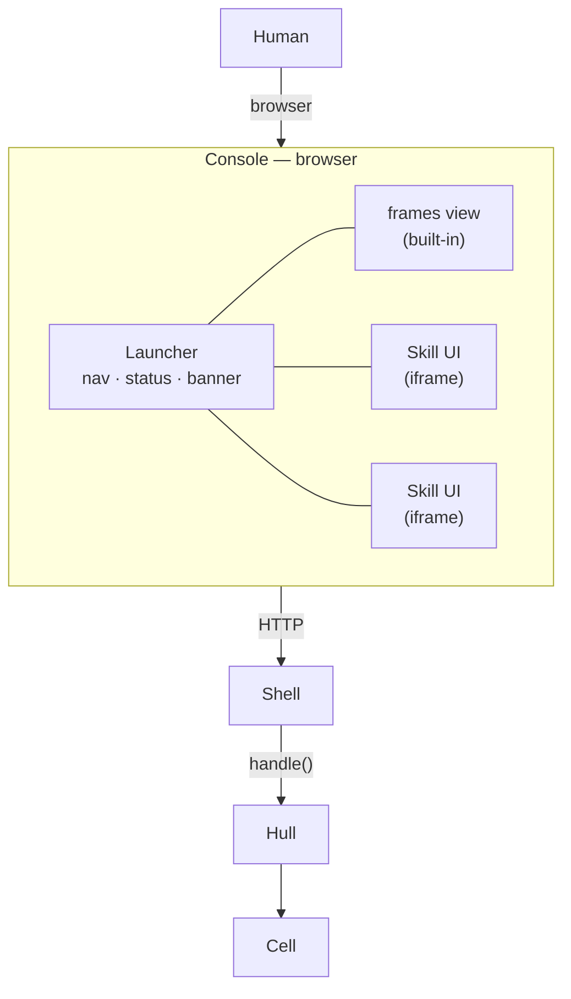
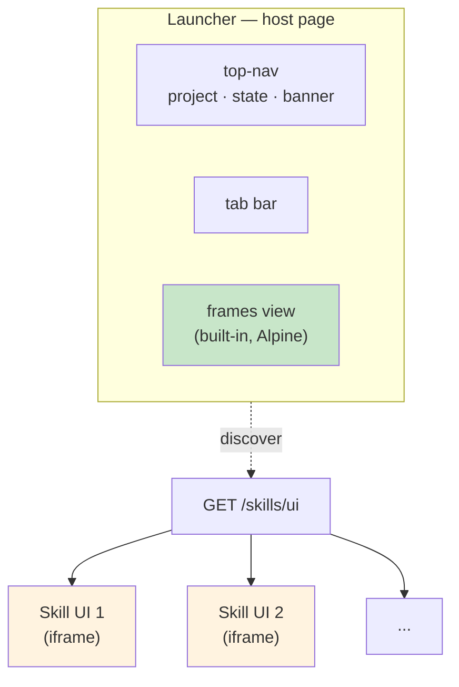
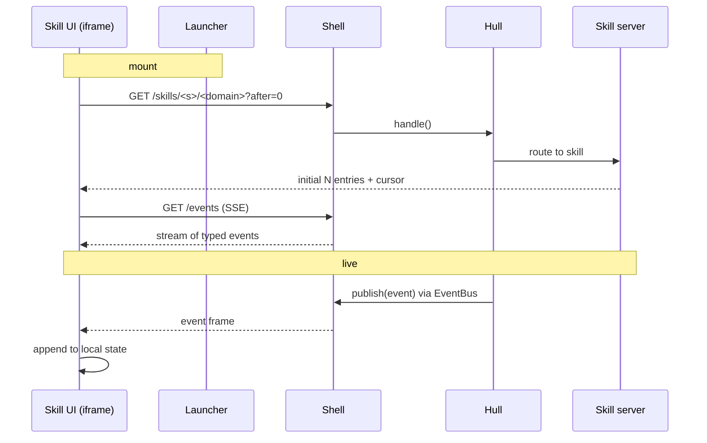

# 8. Console and the User-Facing Data Plane

> **TL;DR.** An agent that cannot be observed or commanded by a human is not yet a product. Console is the user-facing view of a running agent — and like Shell, it is a generic framework that knows nothing about what any specific agent does. Console is composed of a **Launcher** (navigation shell + base signals) and a union of **Skill-provided UIs** (plug-in tabs, loaded by iframe). Data reaches the browser through a single data-plane pattern: **hydrate (`?after=cursor`) + subscribe (SSE) + append-only local state**. Domain-specific adaptations are allowed only if they preserve that shape.

The previous seven chapters addressed what happens inside and behind an agent: action space, three-layer runtime, skills, frames, embodiment, cache, training. This chapter closes the loop outward — the surface a human actually looks at. Historically this surface grew by accretion in the Vessal codebase (three overlapping UIs coexisted before being consolidated), and the cost of that accretion forced the Console to be redesigned as a first-class concern rather than "whatever the last contributor shipped."


## 8.1 Why Console Deserves Its Own Layer

Shell is the inbound HTTP boundary (§2.4). It proxies requests to Hull and returns responses. It does not render HTML, does not own transport semantics beyond HTTP, and does not know what a frame is. That is correct for Shell.

But a human needs more than HTTP endpoints. A human needs: a window to watch the agent's SORA loop, a way to send messages, a way to manage installed skills, banners when something goes wrong. If each of those needs is addressed ad hoc — one team writes a log viewer, another team writes a chat UI, a third writes a launcher — the result is what this codebase actually saw: three overlapping implementations, each inventing its own transport, none retiring the others. Same code in multiple places (violating R1 of the Anti-Rot rules in CLAUDE.md).

Console is therefore promoted to a layer with its own responsibility boundary and its own contract.

Console's responsibility boundary:

**What Console does:** render the agent's observable state to a human; accept commands from the human; route each render/command to the correct backend endpoint; load Skill-provided UIs as plug-in tabs.

**What Console does not do:** run agent logic; own agent state; make decisions about what an agent should do; write view content that belongs to a Skill.

Console sits **above Shell** in the call graph — every Console HTTP request is terminated at Shell and forwarded to Hull exactly like any other inbound request. The Shell protocol (§2.6) is unchanged.




## 8.2 Launcher + Skill-Provided UI

Console's internal structure mirrors the backend. Where Shell is a generic HTTP gateway that contains zero knowledge of any specific Skill's routes, **Launcher is a generic UI shell that contains zero knowledge of any specific Skill's views**.

### Launcher — the UI shell

The Launcher provides four things and only four things:

1. **Top navigation** — brand, project name, and agent run state (sleeping / frame number / wake count).
2. **Banner** — global notifications (crash, LLM timeout, restart required).
3. **Tab bar** — one tab per mounted view (the built-in frames view plus one tab per Skill UI).
4. **Skill UI scanner** — on load, calls `GET /skills/ui` to discover available Skill UIs and mounts each as an iframe tab.

The Launcher writes **no view content**. If every Skill is uninstalled, the Launcher still runs; only the frames tab remains.

### The one built-in view: frames

Exactly one view is built into the Launcher: **frames** — the SORA loop's Ping-Pong stream (§4). The reason is architectural, not pragmatic: the frame log is the universal substrate of any Vessal agent. Observing it is the minimum requirement for an agent to be debuggable. An agent without skills is rare but legitimate; an agent without frames is not an agent.

All other views (chat, skill management, domain-specific dashboards) are Skill-provided. There is no built-in chat, no built-in log viewer, no built-in state dashboard.

### Skill UI — plug-in tabs

Each Skill may optionally ship a `ui/index.html` inside its directory. Hull exposes a discovery endpoint:

```
GET /skills/ui → {"skills": [{"name": "<skill>", "url": "/skills/<skill>/ui/index.html"}, ...]}
```

The Launcher mounts each discovered Skill UI as an `<iframe>` tab. The iframe is the mount boundary for three reasons:

1. **No shared JS stack.** A Skill can be written in Alpine, React, or plain HTML — without dragging the Launcher into its technical choices.
2. **Crash isolation.** A bug in one Skill UI cannot break the Launcher or other Skill UIs.
3. **Independent deploys.** Hot-reloading a Skill's UI assets does not invalidate the Launcher.

The cost is that cross-iframe communication requires `postMessage`. This is tolerated, not worked around: each Skill UI is expected to own its own data — opening its own SSE, fetching its own endpoints. The Launcher is **not** a shared data bus (see §8.3).



### The mirror to §2.4 and §3

| Backend | Frontend |
|---|---|
| Shell — generic HTTP gateway, knows no Skill routes | Launcher — generic UI shell, knows no Skill views |
| Skill server (Hull-side, HTTP routes) | Skill UI (Browser-side, iframe) |
| Only built-in route: system endpoints (`/status`, `/frames`, `/wake`, `/stop`) | Only built-in view: `frames` |

The symmetry is intentional. The same architectural rule — "the shell governs integration, not content" — appears on both sides of the HTTP boundary.


## 8.3 The Data Plane Contract

Every data domain (frames, chat outbox, status, skill state) follows the same three-rule pattern. This is the contract: violating it is treated as a bug.

### Rule 1 · Hydrate-then-subscribe

On mount, a view does two things in order:

1. **Hydrate**: fetch a bounded initial set — typically the most recent N entries — plus a cursor (a monotonic `ts`, frame `number`, or log line offset).
2. **Subscribe**: open an SSE channel that emits deltas strictly after the cursor. Incremental entries are appended to local state.

A view never calls a hydrate endpoint periodically as a refresh mechanism. Polling, when used at all, must carry `?after=<cursor>` and return only newer entries.

### Rule 2 · Append-only local state within a session

Within a browser session, local state for a domain only grows (modulo client-side trimming for memory). The frontend must not overwrite local state with "the latest full snapshot from the server" — that pattern is the primary cause of the rot analyzed in issue `20260418-console-dataflow-redesign.md` (optimistic user messages wiped by a poll that fetched only agent history).

### Rule 3 · Endpoint shape per domain

Each domain exposes up to three endpoints:

| Endpoint | Purpose | Required? |
|---|---|---|
| `GET /<domain>?after=<cursor>` | Hydrate + incremental poll | **Required** |
| `GET /events` (SSE, multiplexed) | Live stream | Required for real-time domains |
| `POST /<domain>` | Inject (user→agent direction) | Required only for inbound domains |

Every `GET /<domain>` endpoint **must** accept `after=` and **must** return entries in cursor order. This is the behavioral invariant R2 in CLAUDE.md's anti-rot rules refers to: when another caller copies the URL, the `after=` semantics travel with it or they break.

### Why SSE is multiplexed at Shell

A Skill UI could open its own SSE endpoint against its own Skill server, and there is no prohibition against doing so. But the Shell layer already runs a multiplexed `/events` channel that publishes typed events (`frame`, `agent_crash`, `gate_reject`, `llm_timeout`, `restart_required`). New global events are added there. A Skill's own SSE channel, if it exists, is for **Skill-private** events; it is never a replacement for the global bus.

This keeps the Launcher free of a shared transport layer (matching C6 of the redesign issue): the Launcher consumes the global SSE for its own top-nav / banner needs, and each Skill UI decides whether to consume the global SSE, open its own, or just poll with `?after=`.

### Data flow, end to end




### 8.3.1 The frames domain wire shape

The `/frames` endpoint and the `frame` SSE event payload use a flat shape that mirrors the SQLite `frame_content` columns defined in `docs/architecture/kernel/04-frame-log.md` §4.3. One source of truth for field naming spans disk, HTTP wire, and browser:

| Wire field | Type | Meaning |
|---|---|---|
| `n` | int | Frame number (= `frame_content.n` = `entries.n_start` for layer=0). |
| `layer` | int | Always 0 for hot-zone frames; reserved for future SQLite-sourced reads. |
| `n_start`, `n_end` | int | Both equal `n` for layer=0 (Entry-model invariant I-1). |
| `pong_think` | str | LLM thought text. May be empty. |
| `pong_operation` | str | Python code executed this frame. |
| `pong_expect` | str | Assertion code verified after operation. |
| `obs_stdout` | str | print() output + last expression value. |
| `obs_stderr` | str | stderr captured during operation execution (via `io.StringIO` redirect). |
| `obs_diff_json` | str | JSON-encoded namespace diff: a list of `{op, name, type}` rows. `op` is `+` (binding added) or `-` (binding removed); a rebind appears as adjacent `-`/`+` rows sharing `name`. |
| `obs_error` | str \| null | Operation traceback text from the errors table, or null. |
| `verdict_value` | object \| null | Verdict `{total, passed, failures}` dict, or null when the frame's expect was empty. Each failure carries `{kind, assertion, message}`; expect-block tracebacks are no longer projected as a separate wire field — failure detail lives inside `failures[]`. |
| `signals` | array | Per-Skill signal rows. Empty `[]` until SQLite-direct sourcing (PR 4). |

This is a clean break from the legacy nested shape (`pong.action.operation`, `observation.stdout`, `number`) — Hull no longer emits the old shape, and the Console no longer reads it. The flat shape is the contract.


## 8.4 Layer Responsibility Table

Every actor reads from and writes to exactly the layers listed below. Crossing more than one boundary is a protocol violation.

| Actor | Reads from | Writes to | Talks to |
|---|---|---|---|
| Browser — Launcher | `/status`, `/skills/ui`, `/events` | — | Shell HTTP only |
| Browser — Skill UI (inside iframe) | skill-specific `GET /<domain>?after=` | skill-specific `POST /<domain>` | Shell HTTP only |
| Shell | HTTP request | HTTP response | `hull.handle()` |
| Hull — router | incoming `(method, path, body)` | `(status, dict \| StaticResponse)` | Skill server handlers or system routes |
| Skill server | Skill-owned in-memory state | Skill-owned in-memory state; triggers `wake()` | Kernel (via shared mutable references or HTTP loopback) |
| Kernel | namespace | namespace; frame log | — |

**Invariants:**

- Browser never talks to Hull directly, never imports Launcher state across iframe boundaries, never holds references to Kernel objects.
- Launcher never knows which Skill UIs exist at build time — the list is discovered at load.
- A Skill UI never reaches into another Skill's endpoints. If cross-Skill coordination is needed, it goes through the agent's namespace, not through the browser.


## 8.5 Anti-Rot Discipline (Applied to Console)

The Console is the rot-prone layer in this codebase's history. The anti-rot rules in CLAUDE.md apply here with particular force:

- **R1 (Single Source of Truth)**: the frames renderer lives in exactly one file. A Skill UI that needs frame-like rendering imports it or calls the frames view — it does not copy the renderer.
- **R2 (Copy the invariants)**: any new caller of an existing `GET /<domain>` endpoint must pass `?after=<cursor>` on every call. Dropping the parameter is a bug, not an optimization.
- **R3 (No unowned retirement promises)**: no "keep in sync until SX.Y" comments. If two UI paths briefly coexist during a migration, the migration ticket is cited by URL.
- **R4 (Whitepaper as source of truth)**: any change to the data plane contract (§8.3) or the layer table (§8.4) is a whitepaper edit first and a code edit second.
- **R5 (Modification declaration)**: every Console PR declares its Layer as `Console`, its Responsibility (Launcher? Skill UI? New data-plane endpoint?), and the end state.


## 8.6 Evolution and the Current Migration

The Console layer's current state (as of the `20260418-console-dataflow-redesign` issue) contains residual rot from before this chapter was written: `ark/util/logging/viewer.html` still exists, `console_spa` hard-codes several views that should be Skill-provided, and one contract violation (the `?after=` drop in the chat outbox call) actively breaks user interaction. The migration path sanctioned by this chapter is:

1. **Define the contract** — this chapter.
2. **Strip the Launcher** — remove hard-coded `chat`, `state`, `logs`, `market` views; retain only top-nav + base signals + frames.
3. **Rewrite the frames view as a reactive component** — compatible with the Launcher's template lifecycle (no imperative DOM insertions into subtrees that can be torn down).
4. **Migrate chat to its Skill UI** — delete the `console_spa` chat implementation; mount `skills/chat/ui/` via iframe.
5. **Create the skills management UI** — originally labelled "market" in the Launcher; it is replaced by a Skill-provided UI whose tab label is the Skill's own name.
6. **Retire viewer.html and the `/logs` route** — together, in the same PR, with the frames view handling both roles.

Each step is a separate PR with its own R5 declaration. No step retires the old path before the new path is proven.

The bugs that motivated this redesign (lost user messages, empty Current Frame, placeholder logs view) are not fixed by patches. They are dissolved as side effects of the migration: when the chat view is owned by the chat Skill UI again, the `?after=` contract is honored automatically; when the frames view becomes reactive, the Alpine teardown no longer destroys imperatively inserted DOM; when logs merges into frames, the placeholder disappears.
