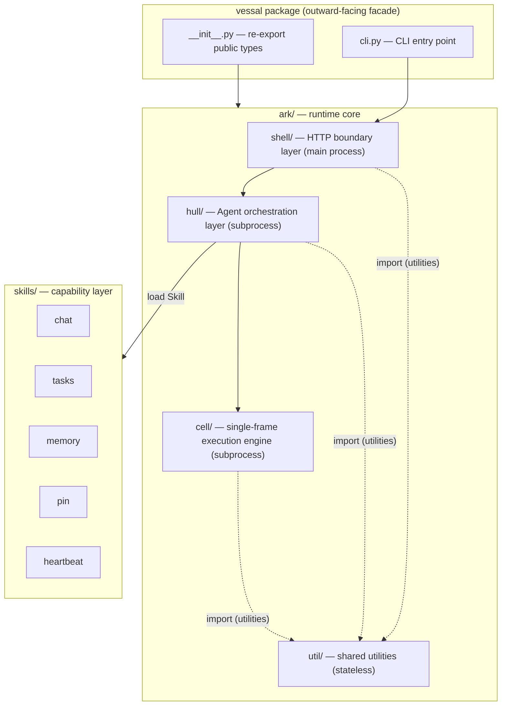
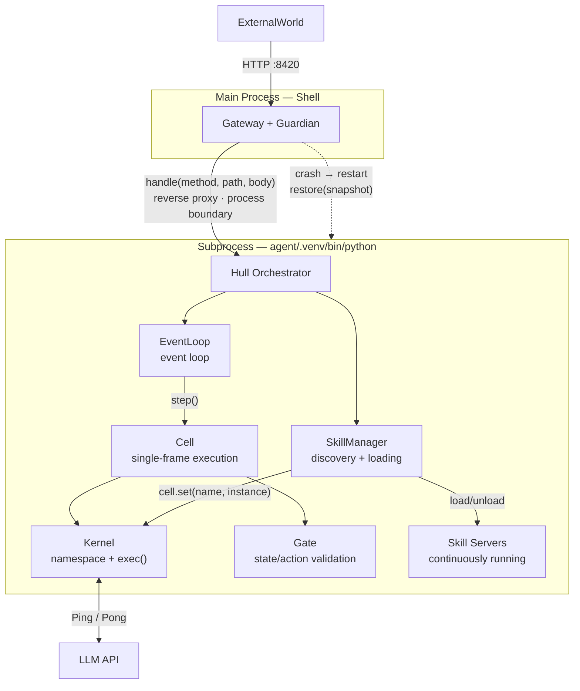
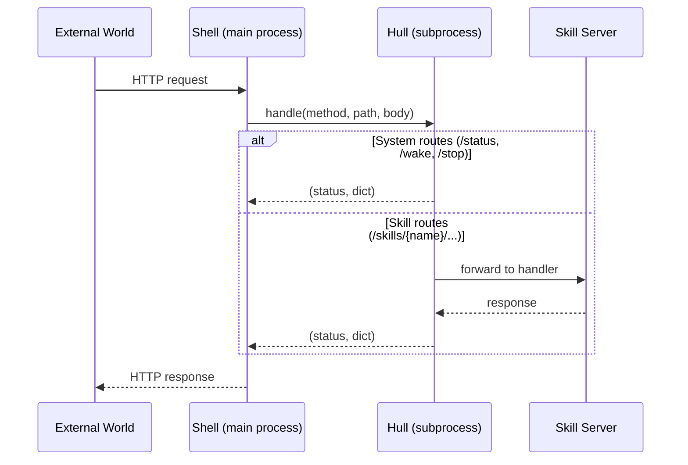
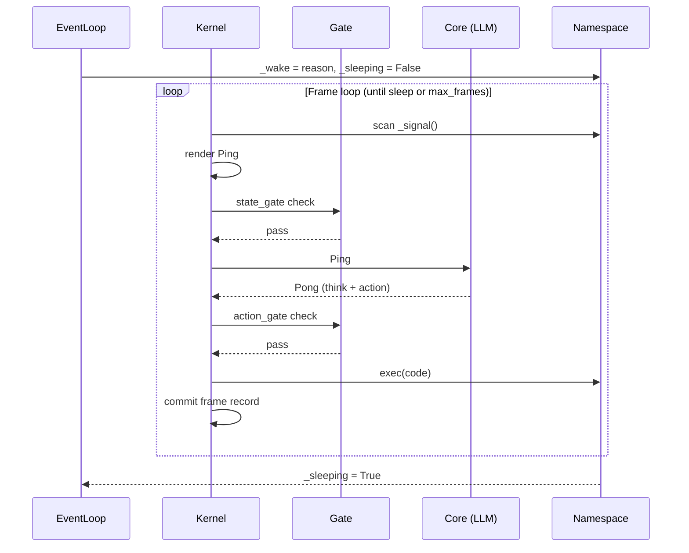
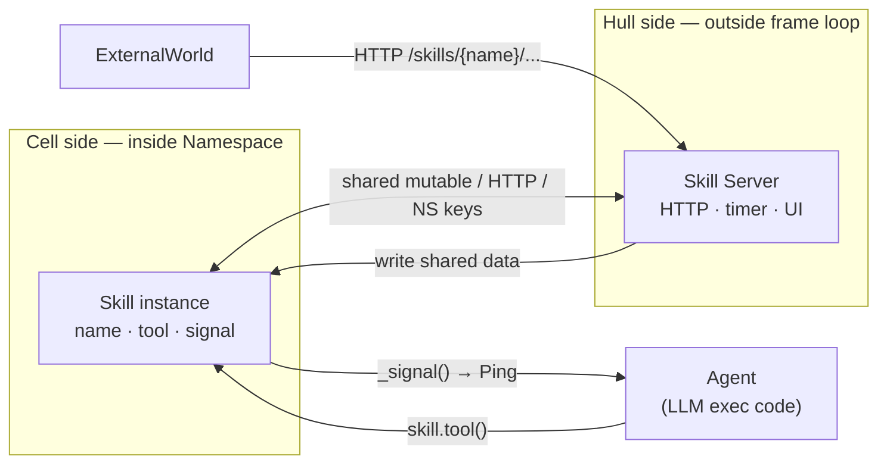
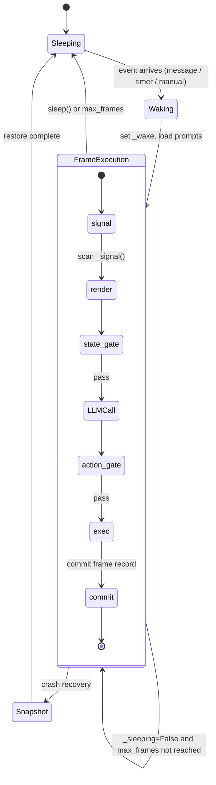

# Vessal

LLM-driven Agent runtime. Implements the SORA model (State, Observation, Reasoning, Action) and provides a hostable execution environment for Agent applications.

Responsible for:
- Exposing the top-level API (Cell, Core, Hull)
- Unified CLI entry point (`vessal` command)
- Exporting ARK core types for external consumers

Not responsible for:
- HTTP serving (→ `ark/shell/`)
- Agent orchestration logic (→ `ark/shell/hull/`)
- Single-frame computation (→ `ark/shell/hull/cell/`)
- Specific Skill implementations (→ `skills/`)

## Constraints

1. `__init__.py` only re-exports; contains no logic
2. `cli.py` only operates the runtime via Shell / Hull public APIs; does not access internal modules directly
3. Dependency direction is fixed: Shell → Hull → Cell, no reverse direction → `tests/architecture/test_dependency_direction.py`

## Design

Vessal exists to provide a unified Agent runtime so that application developers do not need to worry about frame scheduling, event loops, Skill lifecycle, or other low-level mechanisms — they can write Skills directly toward task goals. Without Vessal, every Agent project would need to independently solve state persistence, wake scheduling, LLM call management, and other concerns, resulting in large amounts of duplicated and non-reusable infrastructure code.

The project top level (`src/vessal/`) is the outward-facing facade of the entire package, not a feature implementation layer. It does only two things: re-exports ARK core types, and provides the CLI entry point. All real runtime logic sinks into the ARK subsystem. This design choice is intentional — top-level stability takes priority over flexibility; external consumers' `from vessal import Hull` import path does not change due to internal refactoring.

The alternative of placing the CLI implementation directly at the top level was rejected. CLI runtime commands (start, stop, send, etc.) need to access the Shell layer; developer tool commands (init, skill) need to access project scaffolding logic — neither belongs to the top-level responsibility. The current design delegates the implementation to `ark/shell/cli`, with the top level holding only the `main()` dispatch entry point, maintaining the invariant of no business logic at the top level.

Invariants: `__init__.py`'s `__all__` must stay in sync with ARK exports. The top level does not introduce new runtime dependencies. All CLI subcommand implementations live inside ARK; the top-level `cli.py` only does lazy-load forwarding.

Relationship between the two subsystems: ARK (`ark/`) is the runtime core; Skills (`skills/`) is the capability layer. ARK provides mechanism; Skills provide policy. The top level accesses both through public interfaces only, without reaching into their internals. See architecture details → `references/whitepaper/02-architecture.md`.

### Process Architecture

Shell and Hull run in different OS processes. The process boundary is drawn between them because exec() may trigger native crashes that must be isolated from the HTTP service.

### Data Flow: A Single HTTP Request

How an external request flows through the three layers after it arrives.

### Data Flow: A Single Frame Execution

The event-driven frame execution process.

### Skill's Position in the System

Skill spans both the Cell and Hull layers and acts as a two-sided interface between the Agent and the outside world.

### Agent Event Loop State Machine

The Hull event loop alternates between sleeping and executing.

## Status

### TODO
None.

### Known Issues
None.

### Active
None.
