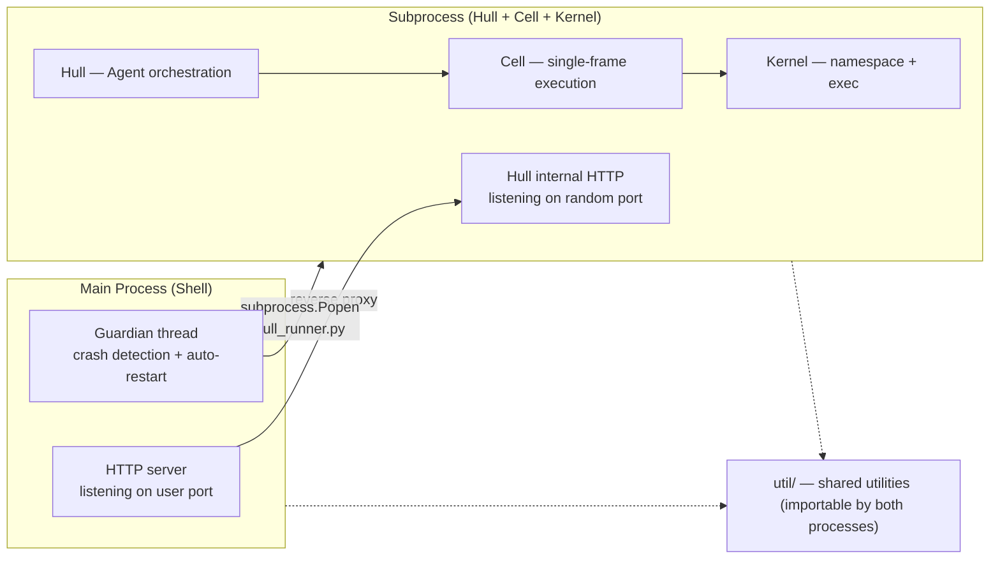
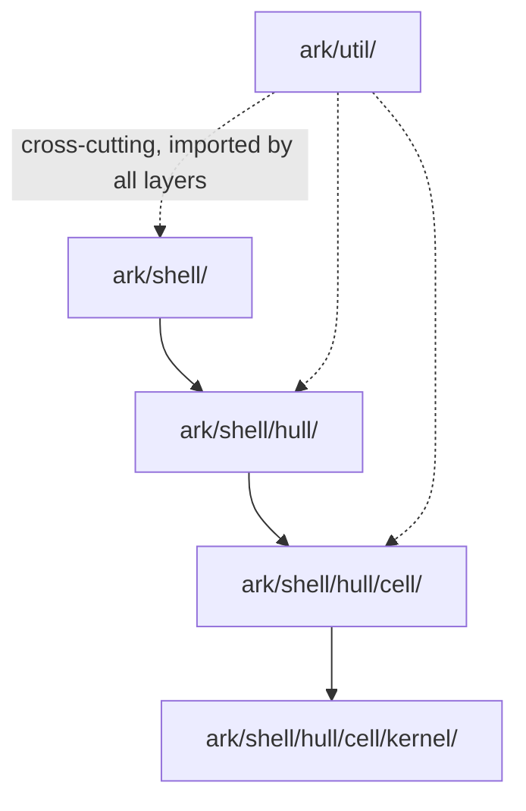

<!-- Generated by Formalin. Do not edit. Source: CONTEXT.md -->

# ARK

Agent Runtime Kit. Mechanism base for the three-layer concentric architecture (Shell → Hull → Cell); provides execution environment without business policy.

Responsible for:
- Exporting core types (Cell, Core, Hull) for use by the top level
- Defining and enforcing the three-layer dependency direction
- Providing shared utilities (Util) to all layers

Not responsible for:
- HTTP protocol details (→ `shell/`)
- Agent orchestration and frame scheduling (→ `shell/hull/`)
- Single-frame LLM inference computation (→ `shell/hull/cell/`)
- Specific Skill implementations (→ `src/vessal/skills/`)

## Design

ARK exists because the three concerns of an Agent runtime (HTTP boundary, orchestration scheduling, single-frame computation) differ significantly in complexity and rate of change, and must be physically isolated. If the three layers were mixed together, any change in one layer would ripple to the others, and dependency relationships could not be mechanically verified.

The choice of a three-layer concentric structure comes from an analysis of responsibilities. Shell handles the uncertainty of the external world (HTTP, process signals, filesystem) and needs frequent adaptation; Hull manages the Agent's lifecycle and Skill registration at a medium rate of change; Cell is a pure computation engine with the most stable interface. The concentric structure ensures that inner layers know nothing about outer layers — Cell does not know Hull exists, Hull does not know Shell exists. This property makes it possible to test and replace each layer independently.

At the OS level, a process boundary exists between Shell and Hull: Shell runs in the main process (HTTP gateway + guardian), Hull + Cell + Kernel run in a subprocess (started using the agent's `.venv/bin/python`). This boundary provides crash isolation — native fatal errors in LLM-generated code only kill the subprocess; Shell restarts automatically. See whitepaper 02-architecture.md section 2.7 for details.



The alternative of a flat module layout (shell.py + hull.py + cell.py) was rejected. A flat structure cannot prevent circular dependencies and cannot express the layered relationship. Directory structure is architecture documentation — seeing the nesting of `ark/shell/hull/cell/` makes the dependency direction immediately clear.



Key decision: Util as a cross-cutting concern is shared by all layers but does not depend on any layer. This avoids reimplementing common utilities such as logging, serialization, and type tools in each layer, while not breaking the dependency direction.

Invariants: The physical directory structure `shell/hull/cell/` encodes the dependency direction — Shell contains Hull, Hull contains Cell; outer layers may not reverse-depend on inner layers. Architecture tests automatically verify this invariant on every CI run.

Relationship with the upper layer: `vessal/__init__.py` re-exports Cell, Core, Hull through this layer's `__init__.py`, forming the user-visible public API. The directory nesting inside ARK is transparent to the top level.

## Public Interface

### class Cell

Stateful state machine (v4 Protocol).

### class Core

LLM call pipeline. Ping → LLM API → parse → Pong.

### class Hull

Agent runtime orchestrator: reads hull.toml, configures Cell, drives the event loop.


## File Structure

```
__init__.py          ark — Vessal Agent Runtime Kit public interface.
shell/  HTTP boundary layer. Parses external HTTP requests and proxies them to Hull, then returns Hull's responses to the caller.
util/  ARK shared utility layer. Provides stateless, pure-function general utilities for use by Cell, Hull, and Shell.
```

## Dependencies

- `vessal.ark.shell.hull`
- `vessal.ark.shell.hull.cell`
- `vessal.ark.shell.hull.cell.cell`
- `vessal.ark.shell.hull.cell.core`
- `vessal.ark.shell.hull.cell.core.core`
- `vessal.ark.shell.hull.cell.core.parser`
- `vessal.ark.shell.hull.cell.core.retry`
- `vessal.ark.shell.hull.cell.gate`
- `vessal.ark.shell.hull.cell.gate.action_gate`
- `vessal.ark.shell.hull.cell.gate.rules`
- `vessal.ark.shell.hull.cell.gate.state_gate`
- `vessal.ark.shell.hull.cell.kernel`
- `vessal.ark.shell.hull.cell.kernel.describe`
- `vessal.ark.shell.hull.cell.kernel.describe.binary`
- `vessal.ark.shell.hull.cell.kernel.describe.callables`
- `vessal.ark.shell.hull.cell.kernel.describe.collections`
- `vessal.ark.shell.hull.cell.kernel.describe.instances`
- `vessal.ark.shell.hull.cell.kernel.describe.primitives`
- `vessal.ark.shell.hull.cell.kernel.executor`
- `vessal.ark.shell.hull.cell.kernel.expect`
- `vessal.ark.shell.hull.cell.kernel.kernel`
- `vessal.ark.shell.hull.cell.kernel.render`
- `vessal.ark.shell.hull.cell.kernel.render._frame_render`
- `vessal.ark.shell.hull.cell.kernel.render._prompt_render`
- `vessal.ark.shell.hull.cell.kernel.render._signal_render`
- `vessal.ark.shell.hull.cell.kernel.render.prompt`
- `vessal.ark.shell.hull.cell.kernel.render.renderer`
- `vessal.ark.shell.hull.cell.kernel.render.signals`
- `vessal.ark.shell.hull.cell.protocol`
- `vessal.ark.shell.hull.event_loop`
- `vessal.ark.shell.hull.hull`
- `vessal.ark.shell.hull.hull_api`
- `vessal.ark.shell.hull.skill`
- `vessal.ark.shell.hull.skill_manager`
- `vessal.ark.shell.hull.skills_manager`
- `vessal.ark.shell.server`
- `vessal.ark.util.logging`
- `vessal.ark.util.logging.console`
- `vessal.ark.util.logging.frame_logger`
- `vessal.ark.util.logging.tracer`
- `vessal.ark.util.token_util`


## Tests

_No test directory._


## Status

### TODO
- [ ] 2026-04-09: Create independent CONTEXT.md for each sub-layer (Shell, Hull, Cell, Util)

### Known Issues
None.

### Active
None.
