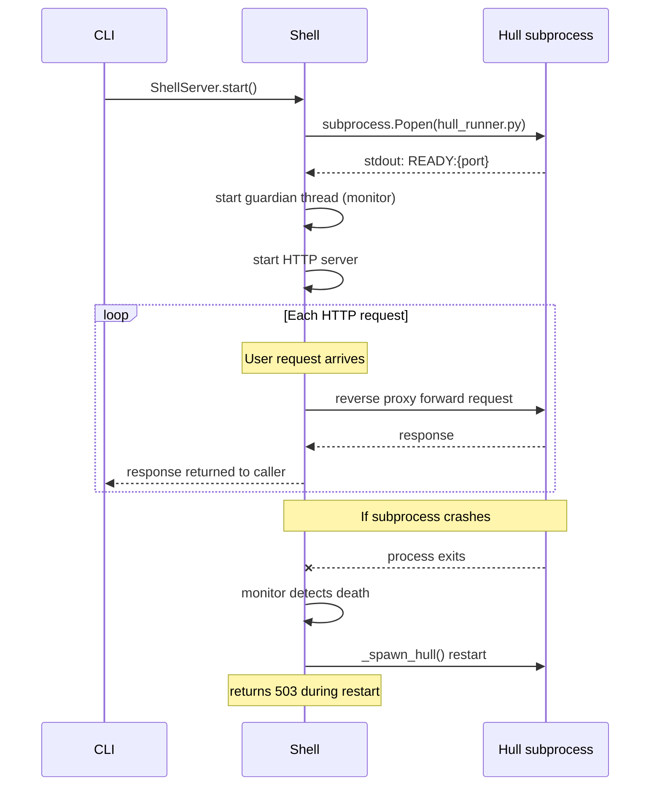

# Shell

HTTP boundary layer. Parses external HTTP requests and proxies them to Hull, then returns Hull's responses to the caller.

## Public Interface

- `cli.py` — runtime command implementations (vessal start / stop / init, etc.)
- `server.py` — HTTP server (ShellServer)
- `hull_runner.py` — Hull subprocess entry point (standalone adapter, binds to 127.0.0.1)
- `container/` — Shell containerization implementation (entry.py = Docker ENTRYPOINT adapter, binds to 0.0.0.0, handles SIGTERM, provides /healthz)
- `protocol.py` — handle() protocol type definitions (HandleResult = tuple[int, dict | StaticResponse]), shared by all Shell implementations

## Responsible for

- HTTP server startup and listening (main process, user-specified port)
- Request reverse-proxying to the Hull subprocess
- Response serialization (JSON or StaticResponse returned as-is)
- Hull subprocess guardianship (crash detection + auto-restart + returning "agent restarting" during restart)
- CLI entry point (vessal start / stop / send / status / read / init / skill)
- /logs endpoint (via Hull built-in routing): GET /logs → viewer.html, GET /logs/raw → JSONL content of the current run

Not responsible for:
- Business logic (handled by Hull)
- Frame execution (handled by Cell)
- Skill management (handled by Hull)
- Heartbeat scheduling (handled by vessal.skills.heartbeat.server)
- State maintenance (Shell is stateless; all state lives in Hull and Cell)

## Constraints

1. Shell does not import Cell or Kernel — dependency direction: Shell depends on Hull, Hull depends on Cell, no reverse
2. All public classes and functions must have complete docstrings and type annotations
3. Shell only interacts with Hull via Hull.handle(); it does not access Hull's internal attributes

## Design

Shell exists for two reasons. First, to isolate HTTP protocol details from Hull — Hull only sees a `(method, path, body_dict)` triple and knows nothing about HTTP headers or JSON encoding/decoding. Second, to provide process-level crash isolation — Shell runs in the main process, Hull runs in a subprocess (started via `subprocess.Popen` running `hull_runner.py` with `sys.executable`). LLM-generated code executes inside the Hull subprocess; fatal errors from native libraries (abort, segfault) only kill the subprocess. Shell's guardian thread detects subprocess exit and automatically restarts it, returning "agent restarting" to callers in the interim — users see a temporary HTTP 503 rather than "connection refused". Shell is to Hull what Docker is to the application running inside the container.

Steps for Shell to start the Hull subprocess: call `_spawn_hull()`, which starts `hull_runner.py` as a subprocess and waits for stdout to output a `READY:{port}` message (indicating the Hull internal HTTP service is ready), then `_ProxyHandler` begins forwarding requests to Hull's internal port. Before starting, Shell launches a guardian thread (monitor) that periodically checks subprocess status; if it finds the process has died, it automatically calls `_spawn_hull()` to restart.

Shell is a pure proxy and makes no routing decisions. It receives a request and forwards it as-is to the Hull subprocess (reverse proxy), without knowing what routes exist. The routing table lives inside Hull; Shell does not hold a copy.

ShellServer has three public methods: `start()` (non-blocking: starts HTTP thread + starts Hull subprocess + starts guardian thread), `serve_forever()` (blocks until shutdown is called), `shutdown()` (stops all threads + kills subprocess).

Decision to remove heartbeat scheduling from Shell: early versions of ShellServer held a heartbeat timer, but the timer is an Agent behavioral policy (how often to wake), not an HTTP protocol concern. Moving it to the heartbeat Skill made Shell stateless — it has no timers to initialize (only a guardian timer), no business background threads, and no scheduling side effects to worry about in tests.

Invariants: Every request that reaches the Shell HTTP server, regardless of path or method, must be forwarded to the Hull subprocess's HTTP service. Shell must not short-circuit before forwarding (except for protocol-level errors, such as body being None when Content-Length is missing, which will still be attempted). If the Hull subprocess is unavailable (during a crash), Shell returns 503 Service Unavailable.

Shell and Hull relationship: Shell depends on Hull; Hull does not know Shell exists. Type annotations use `TYPE_CHECKING` blocks to avoid runtime circular imports.

## Status

### TODO
- [ ] 2026-04-09: The companion process startup logic in `_cmd_start` in cli.py is too long; consider extracting

### Known Issues
- 2026-04-09: cli.py is currently 739 lines, exceeding the 500-line convention (not set as a hard constraint because the centralized CLI entry design requires a longer file)
- 2026-04-10: Daemon lifecycle identity model rebuild — PID file replaced with flock (data/vessal.lock); see flock identity model plan

### Active
- 2026-04-10: Refactor start/stop to flock identity model: foreground by default, --daemon optional for background, stop waits for process exit

### Completed
- 2026-04-10: Shell-Hull process isolation — Hull runs in a subprocess (subprocess.Popen hull_runner.py), Shell main process acts as HTTP gateway and guardian, including crash detection and auto-restart
