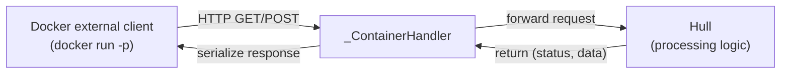

# Container

Docker container entry adapter. When Vessal runs as a Docker container, this module provides the bootstrap program, creates a Hull instance, and starts the HTTP service.

Responsible for:
- Hull instance creation and initialization (reads hull.toml from project_dir)
- HTTP server startup (binds to 0.0.0.0, externally accessible across the container)
- HTTP request routing and forwarding to Hull (for all non-/healthz routes)
- /healthz health check endpoint (does not go through Hull)
- SIGTERM signal handling (graceful shutdown)
- Image → volume file sync (sync_image_to_volume): full copy on first startup, image updates overwrite definition files, runtime data is untouched

Not responsible for:
- Agent execution (handled by Hull)
- Skill management (handled by Hull)
- Logging system (handled by vessal.util.logging; this module only outputs to stdout)

## Design

Container is a direct container wrapper around Hull — it only does initialization and HTTP proxying; all business logic is Hull's responsibility. Differences from hull_runner.py:

1. **Network binding**: hull_runner binds to 127.0.0.1 (Shell internal communication), Container binds to 0.0.0.0 (external container access)
2. **Signal handling**: hull_runner prints READY after handling SIGTERM, Container calls Hull.stop() directly
3. **Log output**: hull_runner outputs the READY signal to stdout for Shell to parse, Container outputs logs to docker logs

`_ContainerHandler.do_GET()` and `do_POST()` call `Hull.handle()`, which returns a `(status, data)` pair, then call `_respond()` or `_respond_json()` to serialize. Both response methods share the signature `(data, status=200)`.

## Public Interface

_No public interface declared._

## Tests

- `test_build.py` — test_build.py — vessal build context assembly tests.
- `test_entry.py` — test_entry.py — Container adapter HTTP handler tests.
- `test_sync.py` — test_sync.py — Image → volume sync logic tests.

Run: `uv run pytest src/vessal/ark/shell/container/tests/`

## Status

### TODO
None.

### Known Issues
None.

### Active
None.
