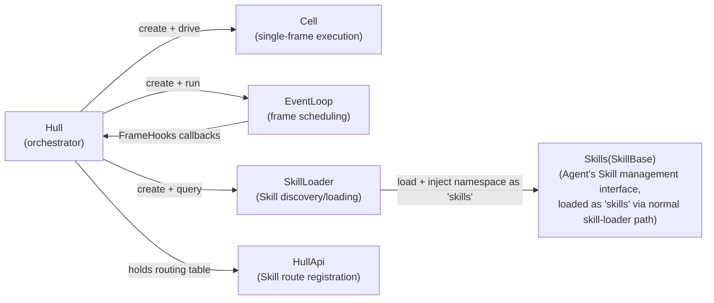
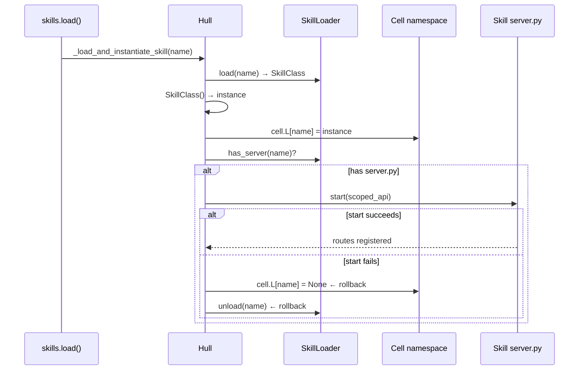
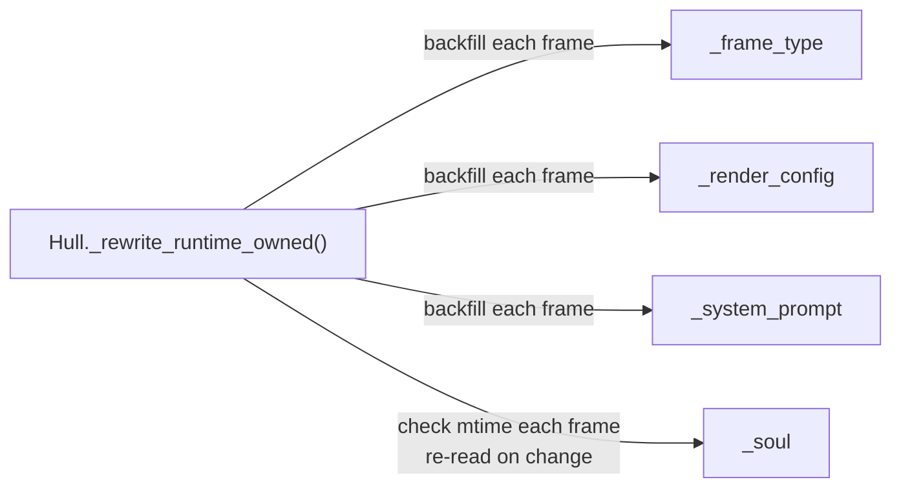

# Hull

Agent runtime orchestrator. Reads hull.toml config, initializes Cell, manages Skill lifecycle, event loop, and meta-skill scheduling.

Responsible for:
- hull.toml config parsing and Cell initialization
- Skill discovery, loading, instantiation, and unloading (via SkillLoader)
- Event loop driving (via EventLoop, wake/sleep lifecycle)
- Meta-skill registration (the `skills` Skill is loaded through the normal skill-loader path; there is no dedicated manager class; each frame outputs the available Skill list via _signal(), and injects the guide usage protocol via _prompt())
- HTTP request routing (handle() is Shell's sole entry point)

Not responsible for:
- HTTP serving (handled by Shell)
- Single-frame LLM calls (handled by Cell)
- Specific Skill logic (handled by individual Skill components)
- Heartbeat scheduling (handled by vessal.skills.heartbeat.server)

## Constraints

1. Hull does not import the Shell layer — dependency direction: Shell depends on Hull, Hull depends on Cell, no reverse
2. All public methods must have complete docstrings and type annotations
3. Shell only accesses Hull through its public methods (handle / wake / status / frames / next_alarm / run / step / stop / snapshot)
4. Hull writes `<snap>.skills.json` before `cell.snapshot()` and reads it before `cell.restore()` — this is the only place `sys.path`/`sys.modules` are mutated for Skill restoration; Cell must not do this

## Design

Hull runs in an independent subprocess (started by the Shell main process via `subprocess.Popen` running `runtime/subprocess_mode.py` with `sys.executable`). All Agent state — namespace, skill instances, frame loop — lives in this subprocess. `exec(code, ns)` operates directly on the namespace dict within this subprocess; skill methods are called directly in memory with no cross-process serialization. Database connections, file handles, imported modules, and other non-serializable objects persist normally across frames. When the subprocess crashes, Shell automatically restarts it and restores from a snapshot.

Hull exists to centralize the configuration work of turning a "generic Cell" into a "specific Agent". Cell is a pure engine that knows nothing about hull.toml, Skill paths, system prompts, or log directories. Without Hull, Shell would have to take on all initialization work, but Shell's responsibility is only the HTTP gateway and guardian; mixing the two would scatter startup logic everywhere.

Hull's shape is "configuration layer + lifecycle manager", not a God Object. It holds references to Cell, EventLoop, and SkillLoader, and operates through their public interfaces without crossing into their internals. This design rejected the alternative of "Hull directly manipulating Cell.L for routing" — routes are maintained dynamically in a `_routes` dict, Skill servers register via HullApi, Hull.handle() dispatches by table lookup, and the routing table and routing logic are independent of each other.

There are three key internal decisions. First, runtime-owned variables (`_frame_type`, `_render_config`, `_system_prompt`, `_soul`) are backfilled by Hull before each frame via `_rewrite_runtime_owned()`, rather than being maintained by Cell or the LLM. This ensures the Agent cannot change its own perspective by writing to these variables. `_soul` is special: each frame checks SOUL.md's mtime, and if the file has changed, it is re-read, so changes the Agent makes to SOUL.md take effect in the next frame. Second, Skills are loaded in two phases: first load the class, instantiate it, and inject into the namespace, then start the server; if the server fails to start, the first phase is rolled back to avoid leaving Skill instances without server support in the namespace. Third, heartbeat was moved out of Shell into the heartbeat Skill, making the ShellServer after Hull initialization a stateless HTTP proxy, simplifying testing and lifecycle management.

Invariants: Each `wake()` call ultimately produces a complete frame cycle — inject_wake, frame loop until `_sleeping` is set, snapshot save. EventLoop guarantees this process is not interrupted (unless max_frames_per_wake is exceeded). Hull.handle() returns 404 for all unknown routes without throwing exceptions, ensuring the Shell layer always receives a valid response.

Hull and Cell relationship: Hull creates Cell and operates through public interfaces (`cell.step()`, `cell.G`, `cell.L`, `cell.snapshot()`, `cell.restore()`). Hull does not import Kernel or Core — these are internal to Cell. Hull and EventLoop relationship: Hull creates EventLoop and injects callbacks via FrameHooks (before_frame, snapshot, run_compression); EventLoop does not know Hull exists.

### Three-Layer Information Distribution for Skills

Skills pass information to the Agent at different granularities through three channels:

- **_prompt() (persistent layer)**: returns a (condition, methodology) tuple; renderer injects into system prompt. Present every frame, cannot be squeezed out of context. Suitable for core rules of behavioral Skills.
- **guide (manual layer)**: a SkillBase attribute; Agent consults it on demand via `print(name.guide)`. Content includes method signatures, parameter descriptions, and usage examples. If lost, re-print; cost = 1 frame delay.
- **_signal() (reminder layer)**: returns a (title, body) tuple; appears in the auxiliary signal section each frame. Displays current status information, ending with a reminder to "print(name.guide) to see methods". Does not include method names.

Creation guidelines: description ≤ 15 characters, write only the function; _signal() does not expose method signatures; SKILL.md is the only place containing method signatures; _prompt() only contains behavioral rules. Changes to _prompt() must go through the file (unload → modify → reload); runtime dynamic modification is not allowed.

Skill modification policy: Agents may modify any Skill (including built-in ones). Built-in Skill modifications are overwritten on vessal package upgrades; for persistent modifications, create a same-named user Skill in skill_paths to override.

## Status

### TODO
None.

### Known Issues
- 2026-04-09: hull.py is currently 623 lines, exceeding the 500-line convention; needs splitting — suggest extracting internal utility functions such as `_load_gate_files`, `_activate_venv`, `_restore_latest_snapshot` into `hull_init.py`
- 2026-04-09: Skill protocol field `summary` has been renamed to `description` (SkillBase class attribute + SKILL.md frontmatter + SkillLoader.list() output); the old name is no longer valid
- 2026-04-12: SkillsManager rename complete — name changed from `_meta` to `skills`, methods `load_skill/unload_skill` changed to `load/unload`, `query_guide` deleted, namespace injection key changed from `_meta` to `skills`

### Active
- 2026-04-10: Signal protocol migration from _signal_output side effect to _signal() -> (title, body) tuple return value; renderer handles delimiter wrapping uniformly
- 2026-04-13: Output logger.warning when hull.toml does not configure [cell].context_budget (default 128000), prompting users to set it according to model window size
- 2026-04-12: _prompt() cognitive protocol — Skills can inject (condition, methodology) into system prompt via _prompt()
- 2026-04-12: Skill UX spec implementation — three-layer information distribution (_prompt/guide/_signal) written into SkillBase docstring and Hull CONTEXT.md

### Completed
- 2026-04-10: Hull process isolation — Hull runs in a subprocess (subprocess.Popen runtime/subprocess_mode.py), Shell main process acts as gateway and guardian
- 2026-04-14: SOUL.md hot reload — mtime detection each frame; changes take effect in the next frame after Agent modifies the file at runtime (hull.py _init_prompts + _rewrite_runtime_owned)
- 2026-04-14: Context lifecycle refactor — removed compression frame mechanism (event_loop/hull/prompts/tests), render trimming changed to physical frame deletion, Memory skill adds drop(n) + context pressure signal, hull.toml [cell].compress_threshold config (default 50)
