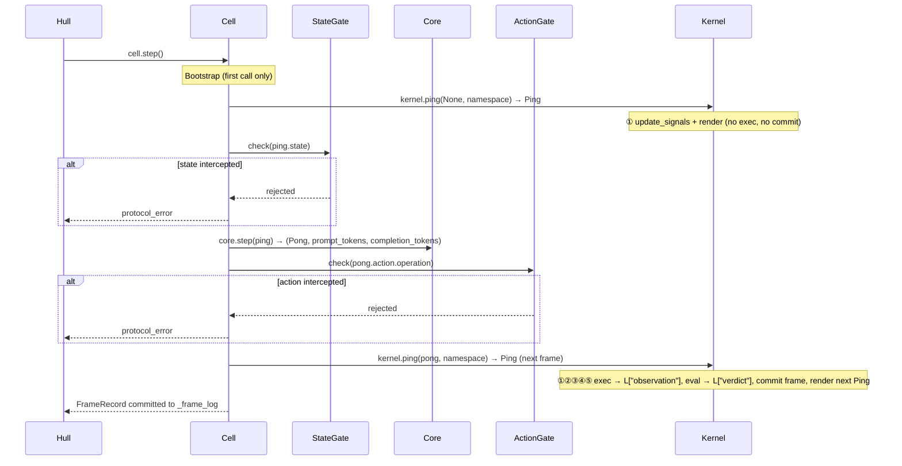

# Cell

Single-frame SORA execution engine. Encapsulates Kernel (execution) and Core (inference), driving one Ping → Core → Pong → Kernel → FrameRecord cycle via step().

Responsible for:
- Single-frame execution orchestration (step()): kernel.ping(None, ns) [bootstrap, first call only] → state_gate → core.step → action_gate → kernel.ping(pong, ns) [exec+commit+render]
- Lifecycle and mode switching for ActionGate and StateGate
- Read/write proxy for namespace (get / set / keys / ns pass-through to Kernel)
- Snapshot serialization and restore (pass-through to Kernel; Skill manifest is Hull's concern)
- Bootstrap: first call only calls kernel.ping(None, namespace) to produce the initial Ping before any LLM call
- Exposing cell.ping / cell.pong as read-only projections of the latest committed FrameRecord

Not responsible for:
- Automatic looping (handled by Hull EventLoop)
- HTTP serving (handled by Shell)
- LLM calls (handled by Core)
- Namespace execution and frame recording (handled by Kernel)
- protocol data structure definitions (defined in protocol.py)
- Skill manifest files (`<snap>.skills.json`) — written/read by Hull before cell.snapshot()/cell.restore()

## Constraints

Cell is a leaf: execution engine only. These constraints are executable — see `tests/architecture/vessal/test_cell_dependency_tree.py`.

1. Does not import Hull or Shell layer code — dependency direction: Hull depends on Cell, Cell depends on Core/Kernel, not the reverse
2. Does not import `vessal.ark.util.logging` — use `TracerLike` Protocol instead (`_tracer_protocol.py`)
3. Each step() call produces exactly one FrameRecord (committed by Kernel), or commits nothing on protocol_error
4. All public methods must have complete docstrings and type annotations
5. cell.py must not exceed 300 lines

## Forbidden imports

- `vessal.ark.util.logging` — use `TracerLike` Protocol instead (`_tracer_protocol.py`)
- `vessal.ark.shell.hull.*` (other than `cell` itself) — Cell must not know Hull exists

## Forbidden patterns

- `Core._DEFAULT_API_PARAMS` — private to Core; Cell passes `api_params=None` and reads `cell.max_tokens`
- `fs._hot[...]` — use `FrameStream.latest_hot_frame()` / `hot_head_len()` / `find_creation()`
- `gate._rules.clear()` — use `gate.replace_rules([])`
- `ns["_max_tokens"]` — banned; use `cell.max_tokens` or `ns["_token_budget"]`

## Invariants

- `ns["_frame"]` increments exactly once per frame, inside `_commit` (the private helper). The in-progress frame number is an explicit parameter passed through the call chain.
- `ns["sleep"]` is `Kernel.sleep` bound method. Re-bound by `_migrate_snapshot()` after restore so closures do not capture stale state.
- `ns["_errors"]` capped by `ns["_error_buffer_cap"]` (default 200) via `append_error()` in `_errors_helper.py`.
- `cell.ping` / `cell.pong` are projections from `FrameStream.latest_hot_frame()`, updated at the end of each `step()`.
- Compaction defaults K=16 / N=8 are defined once in `Kernel.__init__`; no other site sets them.
- Single-frame execution method: `Kernel.ping`, `Core.step`. Long-running loop: `run_forever` (Hull EventLoop). These names are enforced by `tests/architecture/vessal/test_cell_dependency_tree.py`.

## Design

Cell runs in a Hull subprocess. exec() is executed in a thread pool via asyncio.to_thread, without blocking the subprocess event loop (HTTP requests can still be handled during frame execution).

Cell exists to provide a single-frame execution unit with clear boundaries. Hull drives the loop, Cell executes frames — without the Cell layer, Hull would have to directly manipulate Kernel and Core internals, and Hull's responsibility would degrade from "orchestrating loops" to "implementing execution logic". Cell glues the inference half (Core) and the execution half (Kernel) together while shielding Gate logic, making it a clearly bounded glue layer.

Cell's shape is "stateful gated executor" rather than "stateless utility function collection". It holds four collaborating objects — Kernel, Core, ActionGate, StateGate — plus the current frame's Ping/Pong cache, but does not itself retain frame history — frame history is Kernel's responsibility. The alternative design of "Hull directly composing Kernel + Core" was rejected because Gate logic would have nowhere natural to live: putting it in Hull increases orchestration layer complexity; putting it in Kernel breaks Kernel's execution purity.

Two key internal decisions. First, step() calls kernel.ping(None, namespace) once on bootstrap to generate the initial Ping (signals + render only, no exec). On every subsequent step it calls kernel.ping(pong, namespace) once, which executes the Pong, commits the FrameRecord, and returns the next Ping in a single atomic call. Second, Gates are exposed to the outside via string properties (cell.action_gate = "safe"), so Hull does not need to know the concrete types of ActionGate/StateGate, reducing inter-layer coupling.

Invariants: each successful step() call (protocol_error is None) produces exactly one FrameRecord committed by Kernel; _ping is the output of the most recent kernel.ping() call; _pong always points to the current frame's LLM output (None before first LLM response); _actual_tokens_in/_actual_tokens_out are overwritten with real values when the API returns usage, otherwise remain None; on protocol exceptions _errors appends ErrorRecord("protocol", ...).

Cell and Hull relationship: Hull creates Cell, operates it via public interfaces step(), G, L, snapshot(), restore(), and does not access Cell internals. Cell and Kernel relationship: Cell calls kernel.ping(pong, namespace) (the single Kernel primitive), reads kernel.G and kernel.L, but does not directly operate on Kernel's internal Executor or Renderer. Cell and Core relationship: Cell calls core.step(ping), passes the resulting Pong directly to kernel.ping(); Core is stateless.

## Status

### TODO
None.

### Known Issues
- 2026-04-09: tests/test_cell.py is currently 581 lines, exceeding the 500-line convention — due to high test case density, not splitting for now

### Active
- 2026-04-09: FrameRecord schema v6 landed, added ping field (Ping.to_dict/from_dict), from_dict is compatible with v5.
- 2026-04-13: Core.step() returns (Pong, prompt_tokens, completion_tokens) tuple; Cell.step() overwrites _context_pct with real API token data (_actual_tokens_in/_actual_tokens_out); protocol exceptions written to _errors (ErrorRecord).
- 2026-04-28: Cell.step() uses kernel.ping(None, ns) for bootstrap (render-only, first call once) and kernel.ping(pong, ns) for every subsequent frame (exec+commit+render); kernel.prepare() and kernel.step() are deleted. Frame outputs land in L["observation"] (Observation dataclass) and L["verdict"] (Verdict | None).
