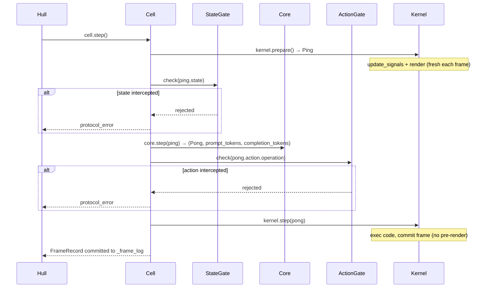

# Cell

Single-frame SORA execution engine. Encapsulates Kernel (execution) and Core (inference), driving one Ping → Core → Pong → Kernel → FrameRecord cycle via step().

Responsible for:
- Single-frame execution orchestration (step()): prepare, state_gate, core.step, action_gate, kernel.step
- Lifecycle and mode switching for ActionGate and StateGate
- Read/write proxy for namespace (get / set / keys / ns pass-through to Kernel)
- Snapshot serialization and restore (pass-through to Kernel)
- Frame perception generation (calls kernel.prepare() at the start of each frame to produce a fresh Ping)

Not responsible for:
- Automatic looping (handled by Hull EventLoop)
- HTTP serving (handled by Shell)
- LLM calls (handled by Core)
- Namespace execution and frame recording (handled by Kernel)
- protocol data structure definitions (defined in protocol.py)

## Design

Cell runs in a Hull subprocess. exec() is executed in a thread pool via asyncio.to_thread, without blocking the subprocess event loop (HTTP requests can still be handled during frame execution).

Cell exists to provide a single-frame execution unit with clear boundaries. Hull drives the loop, Cell executes frames — without the Cell layer, Hull would have to directly manipulate Kernel and Core internals, and Hull's responsibility would degrade from "orchestrating loops" to "implementing execution logic". Cell glues the inference half (Core) and the execution half (Kernel) together while shielding Gate logic, making it a clearly bounded glue layer.

Cell's shape is "stateful gated executor" rather than "stateless utility function collection". It holds four collaborating objects — Kernel, Core, ActionGate, StateGate — plus the current frame's Ping/Pong cache, but does not itself retain frame history — frame history is Kernel's responsibility. The alternative design of "Hull directly composing Kernel + Core" was rejected because Gate logic would have nowhere natural to live: putting it in Hull increases orchestration layer complexity; putting it in Kernel breaks Kernel's execution purity.

Two key internal decisions. First, step() unconditionally calls kernel.prepare() each frame to generate a fresh Ping, ensuring signals (unread messages, timestamps, etc.) are always up to date. kernel.step() is only responsible for exec + commit, no longer pre-rendering the next frame's Ping. Second, Gates are exposed to the outside via string properties (cell.action_gate = "safe"), so Hull does not need to know the concrete types of ActionGate/StateGate, reducing inter-layer coupling.

Invariants: each successful step() call (protocol_error is None) produces exactly one FrameRecord committed by Kernel (schema version defined by `FRAME_SCHEMA_VERSION` in `protocol.py`); _ping is the output of the current frame's prepare(), its semantics expire at frame end (regenerated next frame); _pong always points to the previous frame's LLM output; _actual_tokens_in/_actual_tokens_out are overwritten with real values when the API returns usage, otherwise remain None; on protocol exceptions _errors appends ErrorRecord("protocol", ...).

Cell and Hull relationship: Hull creates Cell, operates it via public interfaces step(), get(), set(), ns, snapshot(), restore(), and does not access Cell internals. Cell and Kernel relationship: Cell calls kernel.prepare() and kernel.step(), reads kernel.ns, but does not directly operate on Kernel's internal Executor or Renderer. Cell and Core relationship: Cell calls core.step(ping), passes the resulting Pong directly to Kernel; Core is stateless.

## Public Interface

### class Cell

Stateful single-frame execution engine. Step-based, does not auto-loop.

### class StepResult

Return value of Cell.step().

## Tests

- `test_auxiliary.py`
- `test_cell.py`
- `test_frame.py`
- `test_frame_projection.py`
- `test_protocol.py`

Run: `uv run pytest src/vessal/ark/shell/hull/cell/tests/`

## Status

### TODO
None.

### Known Issues
None.

### Active
None.
