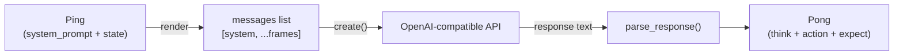
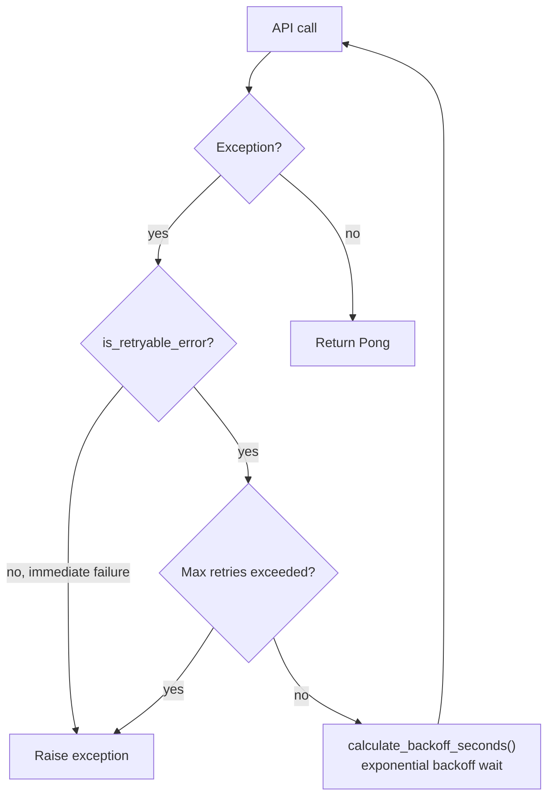

# Core

LLM inference interface. Converts Ping into OpenAI-compatible messages, calls the model API, and parses the response into Pong.

## Boundary

Core does:
- Receive a `Ping` and an `LLMConfig` per call (`step(ping, llm_config)`)
- Compose messages from Ping (system_prompt + frame_stream + signals)
- Call `chat.completions.create(model=llm_config.model, messages=..., **llm_config.api_params)`
- Parse `<think>/<action>/<expect>` from the response, return `Pong`
- Cache `openai.OpenAI` clients internally by `(api_key, base_url, timeout)` for connection reuse

Core does NOT:
- Read `os.environ` (the entire module has zero `os.environ.get` calls; pinned by `test_core_does_not_touch_environ`)
- Hold any startup-bound LLM state — every step() call re-receives full LLMConfig
- Hardcode API parameter defaults — temperature / max_tokens / extra_body all come from llm_config.api_params
- Touch SQLite (Kernel's job), tracer lifecycle (Hull's job), or boot scripts (Kernel's job)

## Constraints

1. Does not import Hull, Shell, or Kernel — depends only on the Cell protocol layer
2. run(ping) returns Pong or raises an exception; never returns None, never swallows exceptions
3. Retryable errors (APITimeoutError, APIConnectionError, InternalServerError, RateLimitError) use exponential backoff; all other errors are raised immediately
4. All public methods must have complete docstrings and type annotations
5. Core must not read `os.environ` — all LLM config arrives via LLMConfig parameter (pinned by test_core_does_not_touch_environ)

## Design

Core exists to decouple LLM calls from Kernel and Cell. Without Core, Cell would have to both orchestrate execution and handle network retries and response parsing, creating messy responsibilities that are hard to mock in tests. Core is the inference half, Kernel is the execution half; the two communicate via the Pong protocol.

Core's shape is "stateless pipeline" rather than "conversation manager". Each run() is an independent API call; it does not maintain multi-turn conversation history or cache responses — history is rendered by Kernel as frame_stream injected into Ping.state; Core only sees the current frame's perception. This design rejected the alternative of "Core maintaining messages history" because state management already lives in Kernel.ns; dual maintenance would cause state fragmentation.

Two key internal decisions. First, model compatibility is achieved via LLMConfig: Core receives the full LLM call contract (api_key, base_url, model, api_params) per call via step(ping, llm_config); Core only fixes messages (from Composer); all other parameters come from llm_config.api_params, so differences between Providers or models (max_tokens vs max_completion_tokens, extra_body, etc.) are entirely resolved by external configuration. Second, retry.py and parser.py are pure-function modules, independent from the Core class — is_retryable_error and calculate_backoff_seconds have no side effects; parse_response has no network dependencies; all can be tested independently.

Invariants: step(ping) either returns a valid Pong (with non-empty action.operation) or raises an exception; there is no scenario where a "successful call but unparseable response" returns a default value — ParseError propagates upward, handled by Cell. After retries are exhausted, the last exception is raised; callers can distinguish timeout from authentication failure.

Core and Cell relationship: Cell calls core.step(ping, llm_config), passes the returned Pong to Kernel. Core is unaware of Cell's existence or Kernel's existence. Core and parser relationship: core.step() calls parse_response() after successfully receiving an API response; ParseError propagates upward. Core and retry relationship: on each API call exception, classifies via is_retryable_error(), calculates wait time via calculate_backoff_seconds().

## Status

### TODO
None.

### Known Issues
- 2026-04-09: core/tests/test_core.py is currently 505 lines, exceeding the 500-line convention — due to high test case density, not splitting for now

### Active
None.
