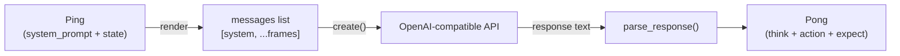
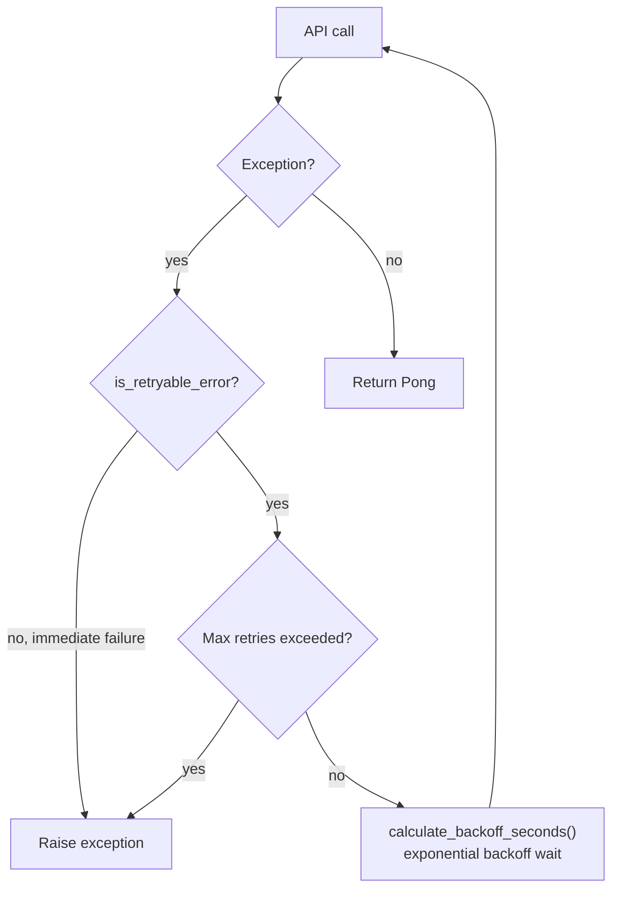

# Core

LLM inference interface. Converts Ping into OpenAI-compatible messages, calls the model API, and parses the response into Pong.

Responsible for:
- Rendering Ping (system_prompt + state) into a messages list
- OpenAI-compatible API calls (with exponential backoff retry)
- LLM response text parsing (extracting think / action / expect tags)
- Classifying retryable vs. non-retryable errors

Not responsible for:
- Namespace maintenance (handled by Kernel)
- Frame history recording (handled by Kernel)
- Gate logic (handled by Cell)
- Hardcoding API parameters beyond model selection (injected by caller via api_params)

## Design

Core exists to decouple LLM calls from Kernel and Cell. Without Core, Cell would have to both orchestrate execution and handle network retries and response parsing, creating messy responsibilities that are hard to mock in tests. Core is the inference half, Kernel is the execution half; the two communicate via the Pong protocol.

Core's shape is "stateless pipeline" rather than "conversation manager". Each run() is an independent API call; it does not maintain multi-turn conversation history or cache responses — history is rendered by Kernel as frame_stream injected into Ping.state; Core only sees the current frame's perception. This design rejected the alternative of "Core maintaining messages history" because state management already lives in Kernel.ns; dual maintenance would cause state fragmentation.

Two key internal decisions. First, model compatibility is achieved via api_params: Core only fixes model (from the OPENAI_MODEL environment variable) and messages; all other parameters are injected by the caller into create() via an api_params dict, so differences between Providers or models (max_tokens vs max_completion_tokens, extra_body, etc.) are entirely resolved by external configuration. Second, retry.py and parser.py are pure-function modules, independent from the Core class — is_retryable_error and calculate_backoff_seconds have no side effects; parse_response has no network dependencies; all can be tested independently.

Invariants: run(ping) either returns a valid Pong (with non-empty action.operation) or raises an exception; there is no scenario where a "successful call but unparseable response" returns a default value — ParseError propagates upward, handled by Cell. After retries are exhausted, the last exception is raised; callers can distinguish timeout from authentication failure.

Core and Cell relationship: Cell calls core.run(ping), passes the returned Pong to Kernel. Core is unaware of Cell's existence or Kernel's existence. Core and parser relationship: core.run() calls parse_response() after successfully receiving an API response; ParseError propagates upward. Core and retry relationship: on each API call exception, classifies via is_retryable_error(), calculates wait time via calculate_backoff_seconds().

## Public Interface

### class Core

LLM call pipeline. Ping → LLM API → parse → Pong.

## Tests

- `test_core.py`
- `test_parser.py`

Run: `uv run pytest src/vessal/ark/shell/hull/cell/core/tests/`

## Status

### TODO
None.

### Known Issues
None.

### Active
None.
