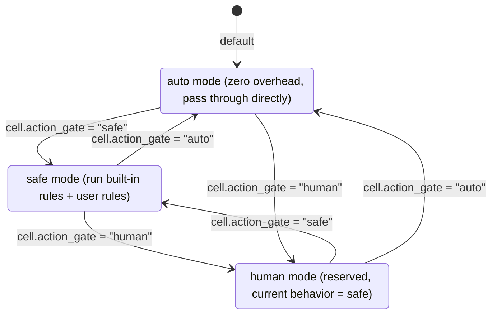
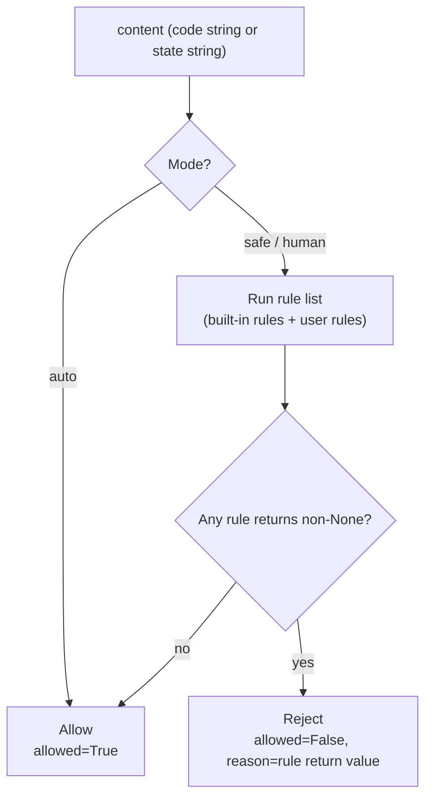

<!-- Generated by Formalin. Do not edit. Source: CONTEXT.md -->

# Gate

Safety gate module before action / state execution. Provides ActionGate (before code execution) and StateGate (before LLM call) as two independent gates.

Responsible for:
- ActionGate: checks action code before it enters Kernel.exec_operation()
- StateGate: checks state string before it enters Core.run()
- Three modes: auto (pass through directly), safe (rule checking), human (reserved)
- Built-in rule set (rules.py): intercepts high-risk filesystem and process operations
- add_rule / remove_rule: user-defined rule injection

Not responsible for:
- Code execution (handled by Kernel)
- LLM calls (handled by Core)
- Persistent storage of rules
- Modifying or transforming content that passes (only checks, no transformation)

## Design

Gate exists because both the code that Agent executes and the state sent to the LLM are untrusted content. Without any checking, Agent could write arbitrary files to the host, kill processes, or send large amounts of private data to the LLM. Gate is the only static defense on this path.

Why two independent gates instead of one? ActionGate performs text pattern matching on Python code, while StateGate performs structural checks (such as length budgets) on rendered prompt strings. The two types of rules differ; merging them would create unnecessary coupling.

The three modes exist for these reasons: auto is the default for development, zero overhead; safe is the production deployment mode; human is reserved for future human confirmation interactions (current behavior equals safe). **auto mode is an invariant** — any code changes must not introduce any rule execution overhead in auto mode.



rules.py defines the built-in rule set. Rules only intercept operations that are "almost certainly not reasonable Agent behavior": recursive deletion of root or user directories, system path writes, bulk process kills. It does not intercept ordinary file reads/writes, network requests, or third-party library imports — these are necessary operations for normal Agent work. Over-blocking is more harmful than under-blocking because it prevents Agent from completing tasks.

Another invariant of safe mode: **reject only, never modify**. Gate does not transform content (such as truncating an overly long state); modifying semantics is Cell's responsibility; Gate only reports whether content passes.



Gate and Cell relationship: Cell calls Gate.check(), decides whether to continue execution based on the returned allowed field; Gate does not directly reference Cell; the dependency is unidirectional.

## Public Interface

### class ActionGate

Safety gate before action code execution.

### class ActionGateResult

Gate check result.

### class StateGate

Safety gate before state string is sent to LLM.

### class StateGateResult

Gate check result.


## File Structure

```
__init__.py          gate — safety gate module before action / state execution.
action_gate.py       action_gate.py — safety gate before action execution.
rules.py             rules.py — built-in safety rule set.
state_gate.py        state_gate.py — gate before state is sent to LLM.
tests/
```

## Dependencies

- `vessal.ark.shell.hull.cell.gate.action_gate`
- `vessal.ark.shell.hull.cell.gate.rules`
- `vessal.ark.shell.hull.cell.gate.state_gate`


## Tests

- `test_gate.py` — tests/unit/test_gate.py — ActionGate / StateGate unit tests.
- `test_set_gate.py`

Run: `uv run pytest src/vessal/ark/shell/hull/cell/gate/tests/`


## Status

### TODO
- [ ] 2026-04-09: human mode implementation (interactive human confirmation)

### Known Issues
- 2026-04-09: StateGate currently has no built-in rules (built-in rules are reserved but not yet implemented); in safe mode only user-defined rules are run

### Active
None.
