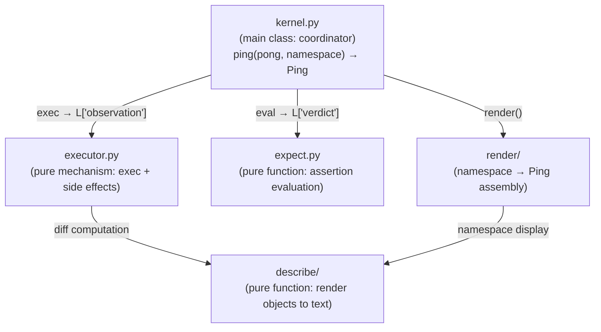
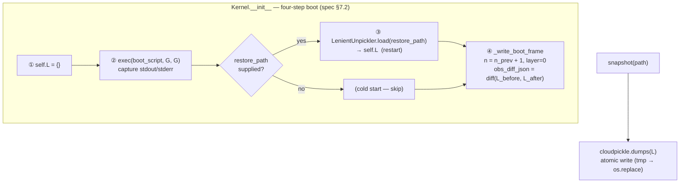

# Kernel

Agent execution kernel. Holds namespace dict, coordinates code execution, assertion evaluation, and state rendering; the complete determinant of Agent behavior.

Responsible for:
- Holding, initializing, snapshotting (cloudpickle), and restoring namespace dict
- Single-primitive frame execution: `ping(pong, namespace) -> Ping` (spec §1.2)
- Operation code execution (executor.py)
- expect assertion evaluation (expect.py)
- Signal collection (BaseSkill instances + SystemSkill + dict aggregation to L["signals"])
- Rendering namespace to Ping (render/renderer.py)

Not responsible for:
- Gate checking (handled by Gate)
- Frame log archiving (Cell calls kernel.ping(); _commit is triggered inside ping())
- LLM calls (handled by Core)
- HTTP communication (handled by Shell)

## Constraints

1. kernel.py must not exceed 420 lines
2. executor.py must not exceed 500 lines
3. expect.py must not exceed 250 lines
4. namespace dict is the sole source of Agent state; Kernel itself holds no runtime state beyond ns
5. evaluate_expect() never raises exceptions; all errors go into Verdict.failures
6. executor.py does not write _frame_log or construct FrameRecord (that is ping()'s responsibility via _commit)
7. All public interfaces must have complete docstrings and type annotations
8. describe/ and render/ are internal implementation sub-packages of Kernel and should not be directly imported from outside Kernel
9. On every cold start AND restart, Kernel writes a `layer=0` boot frame at `n = n_prev + 1`. `pong_operation` carries the actual boot script; `obs_stdout` captures Skill `__init__` prints; `obs_diff_json` is `json.dumps({k: repr(v) for k,v in L.items()})` over the restored L. Cold start produces `obs_diff_json = "{}"`. Spec §7.6.

## Design

Kernel runs in a Hull subprocess. The namespace dict lives in subprocess memory; exec(code, ns) executes in a thread pool thread (asyncio.to_thread), directly operating on the namespace dict in the same process. Skill instances (chat, tasks, etc.) are also in the same process; when LLM code calls chat.read(), it is a direct in-memory call, not cross-process. Database connections, file handles, and other non-serializable objects persist normally across frames. On subprocess crash, namespace is restored from snapshot via the four-step boot flow.

Kernel exists to encapsulate the Agent's "brain" as a snapshot-able, restorable unit. Its core equation is: `namespace dict = Agent's complete state`. All variables, functions, classes, historical frames, and configuration live in this dict. This means Kernel itself is stateless — it is merely the executor and renderer of the namespace, which can be serialized and restored at any time.

Why is executor a separate file rather than a Kernel method? executor.py is a pure mechanism layer (exec + side effect collection), depends on no other Kernel modules, and is extremely stable. Being a separate file allows it to be tested independently with clear boundaries. Similarly, expect.py and describe/ are pure-function subsystems, decoupled from Kernel.

The describe/ sub-package is responsible for rendering Python objects to text, supporting three detail levels: directory (summary line), diff (truncated display), pin (detailed observation). It is a shared dependency for executor's diff computation and renderer's namespace display. The render/ sub-package is responsible for assembling namespace into Ping (system_prompt + frame stream + signals); `prompt.py` maintains the SystemPromptBuilder's three-part concatenation (kernel protocol + SOUL + skill protocols); `_signal_render.py` reads L["signals"] (dict[(class_name, var_name, scope), payload]) and concatenates into Ping.state.signals; `_prompt_render.py` handles skill cognitive protocol collection and rendering (scanning _prompt() methods); this is the implementation of Kernel.render(). These two sub-packages are Kernel implementation details and should not be directly imported from outside.

snapshot/restore uses cloudpickle, supporting functions, classes, lambdas, and closures. The boot script (exec'd in step ②) loads all Skill modules into G before restore runs (step ③), so cloudpickle deserialization can resolve all module references without manual sys.path manipulation. Atomic writes (write temp file then os.replace) prevent file corruption from interrupted writes. On restart, `obs_diff_json` in the boot frame records every key in L that was loaded from the snapshot and differs from the pre-restore defaults; this is the recovery audit trail.

_frame_log invariants: frame records are constructed inside ping() via _commit(); max capacity _FRAME_LOG_MAX=200 frames. On schema version mismatch after restore, _frame_log is cleared to prevent old format frames from polluting new logic.

Kernel and adjacent component relationships: Cell calls `kernel.ping(pong, namespace) -> Ping` to complete single-frame execution; Gate intercepts at the Cell layer and does not enter Kernel. Core receives Ping (the return value of ping()) and returns Pong, which is then passed back into ping() on the next frame. Kernel does not reference Cell, Core, or Gate.

Known scale issue: kernel.py is close to the 400-line limit; describe/ + render/ together exceed 700 lines; total exceeds 1100 lines. The scale comes from the inherent complexity of namespace management; not splitting for now, but new features must be evaluated for extraction into sub-modules.

## Status

### TODO
- [ ] 2026-04-09: kernel.py refactoring evaluation — extract sub-modules if it exceeds 400 lines

### Known Issues
- 2026-04-09: snapshot restore may fail after module path changes (cloudpickle module references are bound to the path at serialization time)
- ~~2026-04-09: Constraint #8 violation — hull.py directly imports kernel.render.RenderConfig; pin/skill.py directly imports kernel.describe.render_value~~ [Fixed 2026-04-09: RenderConfig and render_value are now re-exported from kernel/__init__.py; external code updated to import from kernel package top level]

### Active
- 2026-04-13: L["_errors"] (list[ErrorRecord]) is initialized at boot; executor and Cell append at runtime/protocol errors. Frame outputs land in L["observation"] (Observation dataclass) and L["verdict"] (Verdict | None). _actual_tokens_in/_actual_tokens_out initialized to None, written by Cell with real values when API returns usage.
- 2026-04-28: Replaced multi-entry surface (prepare/step/exec_operation/eval_expect/update_signals/render/_commit_frame) with single primitive `ping(pong, namespace) -> Ping` (spec §1.2). Deleted _protected_keys, _stdout, _error, _diff, _verdict, _operation init keys.
- 2026-04-28 (PR4 complete): Kernel.__init__ takes `boot_script: str` as first positional arg. Hull synthesizes boot_script via compose_boot_script(). Removed _init_namespace/_init_L/_dropped_keys/_dropped_keys_context surface. Boot frame (spec §7.6) is now written on every cold start and restart.
