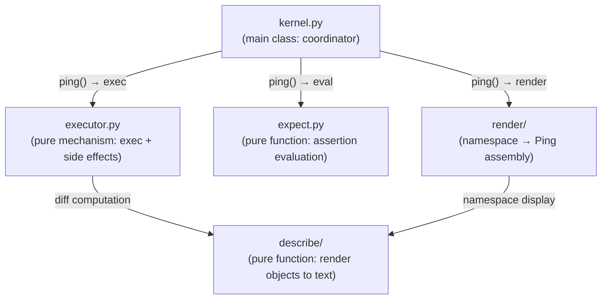
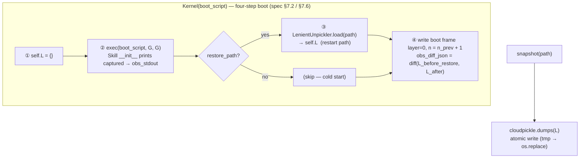

# Kernel

Agent execution kernel. Holds namespace dict, coordinates code execution, assertion evaluation, and state rendering; the complete determinant of Agent behavior.

Responsible for:
- Holding, initializing, snapshotting (cloudpickle), and restoring namespace dict
- Four-step boot on construction: `① empty L → ② exec(boot_script, G, G) → ③ optional restore → ④ write boot frame` (spec §7.2)
- Single entry point: ping(pong, namespace) → Ping (no exec when pong=None; exec+commit+render when pong=Pong)
- Operation code execution (→ executor.py)
- expect assertion evaluation (→ expect.py)
- Signal collection (BaseSkill instances + SystemSkill + dict aggregation to L["signals"])
- Rendering namespace to Ping (→ render/renderer.py)

Not responsible for:
- Gate checking (handled by Gate)
- Frame log archiving (handled by Cell; _commit_frame is triggered by Cell but executes within kernel.step())
- LLM calls (handled by Core)
- HTTP communication (handled by Shell)

## Design

Kernel runs in a Hull subprocess. The namespace dict lives in subprocess memory; exec(code, ns) executes in a thread pool thread (asyncio.to_thread), directly operating on the namespace dict in the same process. Skill instances (chat, tasks, etc.) are also in the same process; when LLM code calls chat.read(), it is a direct in-memory call, not cross-process. Database connections, file handles, and other non-serializable objects persist normally across frames. On subprocess crash, namespace is restored from snapshot via the four-step boot (restart path).

Kernel exists to encapsulate the Agent's "brain" as a snapshot-able, restorable unit. Its core equation is: `namespace dict = Agent's complete state`. All variables, functions, classes, historical frames, and configuration live in this dict. This means Kernel itself is stateless — it is merely the executor and renderer of the namespace, which can be serialized and restored at any time.

Why is executor a separate file rather than a Kernel method? executor.py is a pure mechanism layer (exec + side effect collection), depends on no other Kernel modules, and is extremely stable. Being a separate file allows it to be tested independently with clear boundaries. Similarly, expect.py and describe/ are pure-function subsystems, decoupled from Kernel.

The describe/ sub-package is responsible for rendering Python objects to text, supporting three detail levels: directory (summary line), diff (truncated display), pin (detailed observation). It is a shared dependency for executor's diff computation and renderer's namespace display. The render/ sub-package is responsible for assembling namespace into Ping (system_prompt + frame stream + signals); `prompt.py` maintains the SystemPromptBuilder's three-part concatenation (kernel protocol + SOUL + skill protocols); `_signal_render.py` reads L["signals"] (dict[(class_name, var_name, scope), payload]) and concatenates into Ping.state.signals; `_prompt_render.py` handles skill cognitive protocol collection and rendering (scanning _prompt() methods); this is the implementation of Kernel.render(). These two sub-packages are Kernel implementation details and should not be directly imported from outside.

snapshot/restore uses cloudpickle, supporting functions, classes, lambdas, and closures. The boot script (exec'd in step ②) loads all Skill modules into G before restore runs (step ③), so cloudpickle deserialization can resolve all module references. Atomic writes (write temp file then os.replace) prevent file corruption from interrupted writes. The boot frame's `obs_diff_json` records every key loaded from the snapshot that differs from the pre-restore defaults, providing the recovery audit trail.

_frame_log invariants: frame records are constructed inside kernel.ping() via the internal _commit helper; max capacity _FRAME_LOG_MAX=200 frames. On schema version mismatch after restore, _frame_log is cleared to prevent old format frames from polluting new logic.

Kernel and adjacent component relationships: Cell calls kernel.ping(pong, namespace) to complete single-frame execution; Gate intercepts at the Cell layer and does not enter Kernel. Core receives Ping (the output of kernel.ping(None, ns) or the next-Ping returned by kernel.ping(pong, ns)) and returns Pong, which is then passed back into kernel.ping(). Kernel does not reference Cell, Core, or Gate.

Known scale issue: kernel.py is close to the 400-line limit; describe/ + render/ together exceed 700 lines; total exceeds 1100 lines. The scale comes from the inherent complexity of namespace management; not splitting for now, but new features must be evaluated for extraction into sub-modules.

## Public Interface

### DEFAULT_CONFIG

Default RenderConfig instance used by Kernel when no explicit config is supplied.

### class ExecResult

Operation execution result.

### class Kernel

Agent execution kernel.

Constructor: `Kernel(boot_script: str, *, db_path: str | None = None, restore_path: str | None = None)`

Four-step boot on construction (spec §7.2):

| Step | Action |
|------|--------|
| ① | `self.L = {}` — initialize with system defaults |
| ② | `exec(boot_script, G, G)` — instantiate Skills; capture stdout/stderr |
| ③ | `LenientUnpickler.load(restore_path) → self.L` (restart only; skipped on cold start) |
| ④ | Write `layer=0` boot frame at `n = n_prev + 1`; `obs_diff_json = diff(L_before, L_after)` |

Primary entry point: `ping(pong: Pong | None, namespace: dict) -> Ping`

| pong value | Behavior |
|------------|----------|
| `None` | First call after boot: signal_scan + render only. No code executed, no frame committed. Returns initial Ping. |
| `Pong(...)` | Full frame: exec operation → `L["observation"]`, eval expect → `L["verdict"]`, signal_scan, `_commit` frame to `_frame_log`, render → return next Ping. |

### class RenderConfig

Renderer configuration.

### render_value(obj: object, detail_level: str) -> str

Renders a Python object to text at the specified detail level.

## Tests

- `test_compressed_history.py` — test_compressed_history — compressed history built-in signal tests.
- `test_executor.py` — tests/unit/test_executor.py — executor side-effect variables, diff, _ns_meta unit tests.
- `test_expect.py`
- `test_kernel.py`
- `test_namespace_accessor.py`
- `test_prompt.py` — test_prompt — SystemPromptBuilder unit tests.
- `test_prompt_protocol.py` — test_prompt_protocol.py — unit tests for _prompt() cognitive protocol.
- `test_renderer.py`
- `test_renderers.py`
- `test_signals.py` — test_signals — Kernel signal system: BaseSkill isinstance scan + aggregation to L["signals"] dict.

Run: `uv run pytest src/vessal/ark/shell/hull/cell/kernel/tests/`

## Status

### TODO
- [ ] 2026-04-09: kernel.py refactoring evaluation — extract sub-modules if it exceeds 400 lines

### Known Issues
- 2026-04-09: snapshot restore may fail after module path changes (cloudpickle module references are bound to the path at serialization time). Mitigated by PR4: boot script loads all modules into G before restore runs, so deserialization finds them in sys.modules.

### Active
- 2026-04-28 (PR4 complete): Kernel.__init__ now takes `boot_script: str` as first positional arg. Hull synthesizes it via `compose_boot_script()`. Removed `_init_namespace` / `_init_L` / `_dropped_keys` / `_dropped_keys_context` surface. Boot frame (spec §7.6) written on every cold start and restart.
