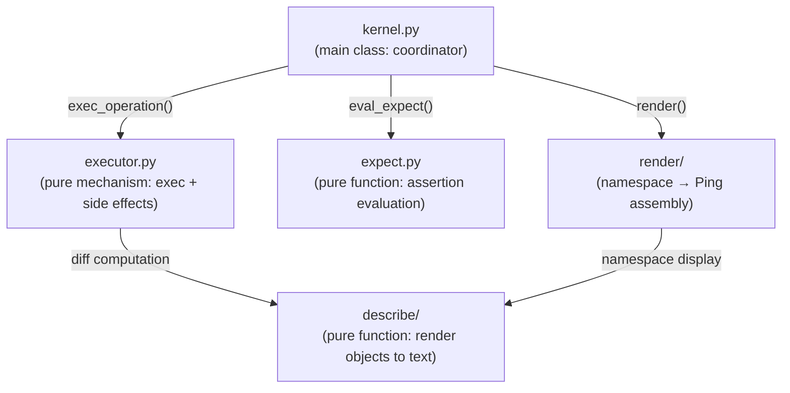
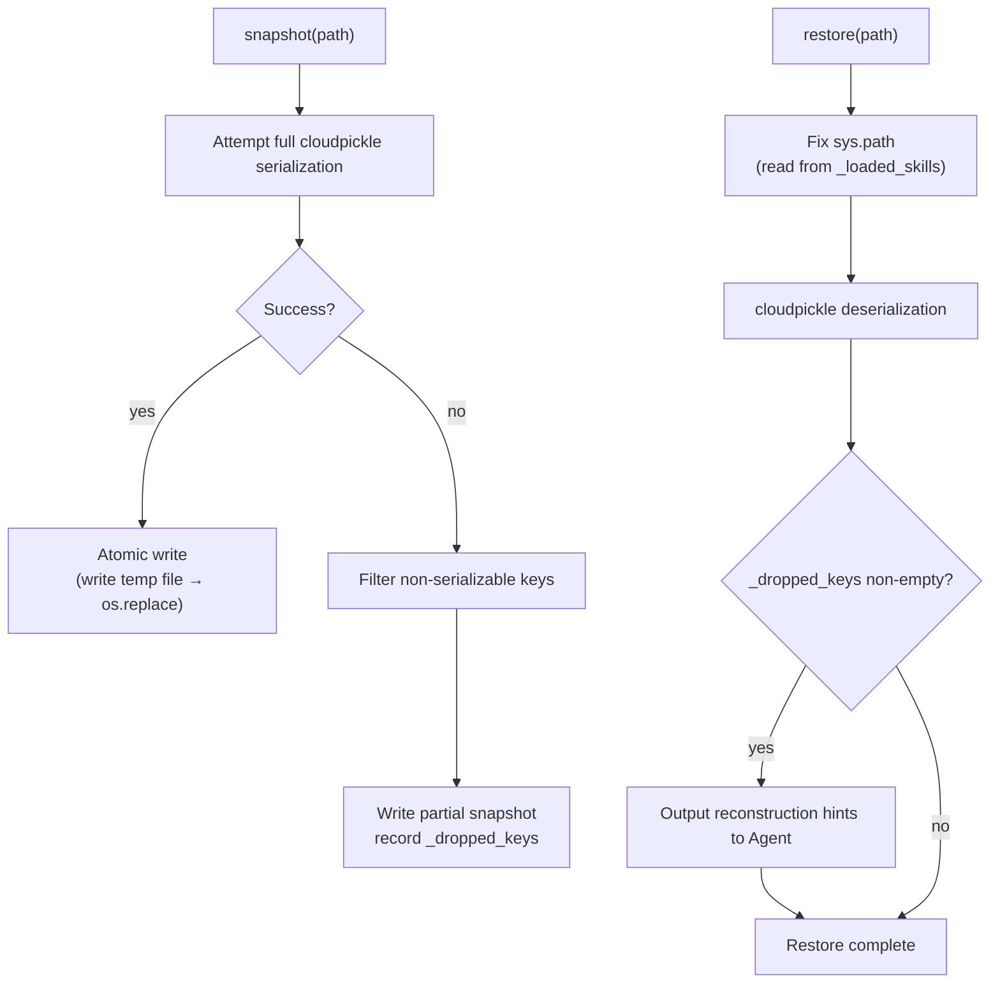

# Kernel

Agent execution kernel. Holds namespace dict, coordinates code execution, assertion evaluation, and state rendering; the complete determinant of Agent behavior.

Responsible for:
- Holding, initializing, snapshotting (cloudpickle), and restoring namespace dict
- Operation code execution (exec_operation → executor.py)
- expect assertion evaluation (eval_expect → expect.py)
- Signal collection (update_signals: BASE_SIGNALS + duck-typing scan)
- Rendering namespace to Ping (render → render/renderer.py)

Not responsible for:
- Gate checking (handled by Gate)
- Frame log archiving (handled by Cell; _commit_frame is triggered by Cell but executes within kernel.run())
- LLM calls (handled by Core)
- HTTP communication (handled by Shell)

## Design

Kernel runs in a Hull subprocess. The namespace dict lives in subprocess memory; exec(code, ns) executes in a thread pool thread (asyncio.to_thread), directly operating on the namespace dict in the same process. Skill instances (chat, tasks, etc.) are also in the same process; when LLM code calls chat.read(), it is a direct in-memory call, not cross-process. Database connections, file handles, and other non-serializable objects persist normally across frames. On subprocess crash, namespace is restored from snapshot; non-serializable objects are lost and recorded in _dropped_keys.

Kernel exists to encapsulate the Agent's "brain" as a snapshot-able, restorable unit. Its core equation is: `namespace dict = Agent's complete state`. All variables, functions, classes, historical frames, and configuration live in this dict. This means Kernel itself is stateless — it is merely the executor and renderer of the namespace, which can be serialized and restored at any time.

Why is executor a separate file rather than a Kernel method? executor.py is a pure mechanism layer (exec + side effect collection), depends on no other Kernel modules, and is extremely stable. Being a separate file allows it to be tested independently with clear boundaries. Similarly, expect.py and describe/ are pure-function subsystems, decoupled from Kernel.



The describe/ sub-package is responsible for rendering Python objects to text, supporting three detail levels: directory (summary line), diff (truncated display), pin (detailed observation). It is a shared dependency for executor's diff computation and renderer's namespace display. The render/ sub-package is responsible for assembling namespace into Ping (system_prompt + frame stream + signals); `prompt.py` maintains the SystemPromptBuilder's three-part concatenation (kernel protocol + SOUL + skill protocols); `_signal_render.py` handles signal section rendering (per-frame auxiliary signals); `_prompt_render.py` handles skill cognitive protocol collection and rendering (duck-type scanning of _prompt() methods); this is the implementation of Kernel.render(). These two sub-packages are Kernel implementation details and should not be directly imported from outside.

snapshot/restore uses cloudpickle, supporting functions, classes, lambdas, and closures. Before restore, sys.path is fixed first (reading parent_path from _loaded_skills), ensuring cloudpickle can find modules during deserialization. Atomic writes (write temp file then os.replace) prevent file corruption from interrupted writes. On full serialization failure, it degrades to filtering out non-serializable keys and saving, while writing the dropped key list to _dropped_keys and the original creation code (reverse-searched from _frame_log) to _dropped_keys_context. After restore, update_signals() calls the dropped_keys signal; if _dropped_keys is non-empty it outputs reconstruction hints to Agent.



_frame_log invariants: frame records are indirectly constructed by Cell via kernel.run(); _commit_frame handles FrameRecord assembly, but the append logic is inside kernel.py; max capacity _FRAME_LOG_MAX=200 frames. On schema version mismatch after restore, _frame_log is cleared to prevent old format frames from polluting new logic.

Kernel and adjacent component relationships: Cell calls Kernel.run() to complete single-frame execution; Gate intercepts at the Cell layer and does not enter Kernel. Core receives Ping (the output of Kernel.render()) and returns Pong, which is then passed into Kernel.run(). Kernel does not reference Cell, Core, or Gate.

Known scale issue: kernel.py is close to the 400-line limit; describe/ + render/ together exceed 700 lines; total exceeds 1100 lines. The scale comes from the inherent complexity of namespace management; not splitting for now, but new features must be evaluated for extraction into sub-modules.

## Public Interface

### DEFAULT_CONFIG

Default RenderConfig instance used by Kernel when no explicit config is supplied.

### class ExecResult

Operation execution result.

### class Kernel

Agent execution kernel.

### class RenderConfig

Renderer configuration.

### render_value(obj: object, detail_level: str) -> str

Renders a Python object to text at the specified detail level.


## File Structure

```
__init__.py          __init__.py — Kernel public interface: execution kernel and code execution result types.
describe/
executor.py          executor.py — Code execution engine: safely executes Agent-generated code in sandbox namespace.
expect.py            expect.py — expect assertion validation and evaluation: AST safety checking and per-assertion evaluation, returns Verdict.
kernel.py            kernel.py — Kernel main class: Agent execution kernel, holds namespace and coordinates rendering and execution.
render/
tests/
```

## Dependencies

- `vessal.ark.shell.hull.cell.kernel.describe`
- `vessal.ark.shell.hull.cell.kernel.describe.binary`
- `vessal.ark.shell.hull.cell.kernel.describe.callables`
- `vessal.ark.shell.hull.cell.kernel.describe.collections`
- `vessal.ark.shell.hull.cell.kernel.describe.instances`
- `vessal.ark.shell.hull.cell.kernel.describe.primitives`
- `vessal.ark.shell.hull.cell.kernel.executor`
- `vessal.ark.shell.hull.cell.kernel.expect`
- `vessal.ark.shell.hull.cell.kernel.kernel`
- `vessal.ark.shell.hull.cell.kernel.render`
- `vessal.ark.shell.hull.cell.kernel.render._frame_render`
- `vessal.ark.shell.hull.cell.kernel.render._prompt_render`
- `vessal.ark.shell.hull.cell.kernel.render._signal_render`
- `vessal.ark.shell.hull.cell.kernel.render.renderer`
- `vessal.ark.shell.hull.cell.kernel.render.signals`
- `vessal.ark.shell.hull.cell.protocol`
- `vessal.ark.util.logging`
- `vessal.ark.util.token_util`


## Tests

- `test_compressed_history.py` — test_compressed_history — compressed history built-in signal tests.
- `test_executor.py` — tests/unit/test_executor.py — executor side-effect variables, diff, _ns_meta unit tests.
- `test_expect.py`
- `test_kernel.py`
- `test_namespace_accessor.py`
- `test_prompt.py` — test_prompt — SystemPromptBuilder unit tests.
- `test_prompt_protocol.py` — test_prompt_protocol.py — unit tests for _prompt() cognitive protocol.
- `test_renderer.py`
- `test_renderers.py`
- `test_signal_ducktype.py` — Test that Kernel discovers signals via duck-typing, not isinstance.
- `test_signals.py` — test_signals — Kernel signal system: base signals + SkillBase isinstance scan.

Run: `uv run pytest src/vessal/ark/shell/hull/cell/kernel/tests/`


## Status

### TODO
- [ ] 2026-04-09: kernel.py refactoring evaluation — extract sub-modules if it exceeds 400 lines

### Known Issues
- 2026-04-09: snapshot restore may fail after module path changes (cloudpickle module references are bound to the path at serialization time)
- ~~2026-04-09: Constraint #8 violation — hull.py directly imports kernel.render.RenderConfig; pin/skill.py directly imports kernel.describe.render_value~~ [Fixed 2026-04-09: RenderConfig and render_value are now re-exported from kernel/__init__.py; external code updated to import from kernel package top level]

### Active
- 2026-04-13: _init_namespace() adds two namespace keys: _protected_keys (list of all keys at initialization time, executor uses this to restore builtins deleted by agent); _errors (list[ErrorRecord], executor and Cell append at runtime/protocol errors). _actual_tokens_in/_actual_tokens_out initialized to None, written by Cell with real values when API returns usage.
