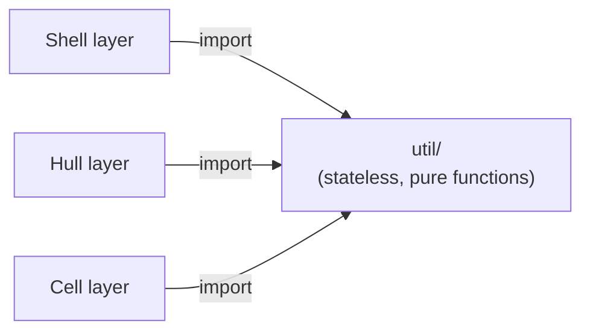

# Util

ARK shared utility layer. Provides stateless, pure-function general utilities for use by Cell, Hull, and Shell.

Responsible for:
- Token count estimation (token_util)
- Providing dependency-free basic computation capabilities to upper-layer components

Not responsible for:
- Observability and logging (in the logging/ subpackage)
- Any stateful logic
- Protocol details with Shell, Hull, or Cell

## Design

Util exists to break circular dependencies. If token estimation logic were written directly in Hull, Cell could not reuse it without reverse-depending on Hull; the same applies if written in Cell. By extracting stateless utilities into a separate Util layer, any upper-layer component can import directly, and the dependency direction always points downward.

Currently there is only one module: token_util.py. It deliberately avoids importing external libraries like tiktoken — precise counting is not a design goal of Vessal; byte-based estimation is safe enough for budget control. The algorithm (UTF-8 byte count / 4) is fully explained in the module docstring; future replacements only require changing the implementation while keeping the interface signature stable.

Alternative considered: placing token_util in Cell (since Cell is the first component to use it), but this would require Hull to import Cell to do context window management, which conflicts with the architectural dependency direction. Placing it in Util is the only solution that avoids circular dependencies.



Invariants: The result of every Util function call depends only on its arguments; it does not depend on external state and produces no side effects. This is the foundation of testability and portability.

Adjacent relationships: used by Hull for context window budget management, used by Cell for token metering. Util does not know who its callers are. The logging subsystem is in the logging/ subpackage, each independent.

## Public Interface

_No public interface declared._


## File Structure

```
__init__.py          __init__.py — Util subpackage public interface (currently no exports; modules imported directly as needed).
logging/  ARK observability subsystem. Provides four independent modules for frame log writing, reading, HTML viewer, tracing, and terminal output.
tests/
token_util.py        token_util.py — Token count estimation.
```

## Dependencies

- `vessal.ark.shell.hull.cell.protocol`
- `vessal.ark.util.logging.frame_logger`
- `vessal.ark.util.logging.tracer`


## Tests

- `test_token_util.py` — test_token_util.py — estimate_tokens unit tests.

Run: `uv run pytest src/vessal/ark/util/tests/`


## Status

### TODO
None.

### Known Issues
None.

### Active
None.
