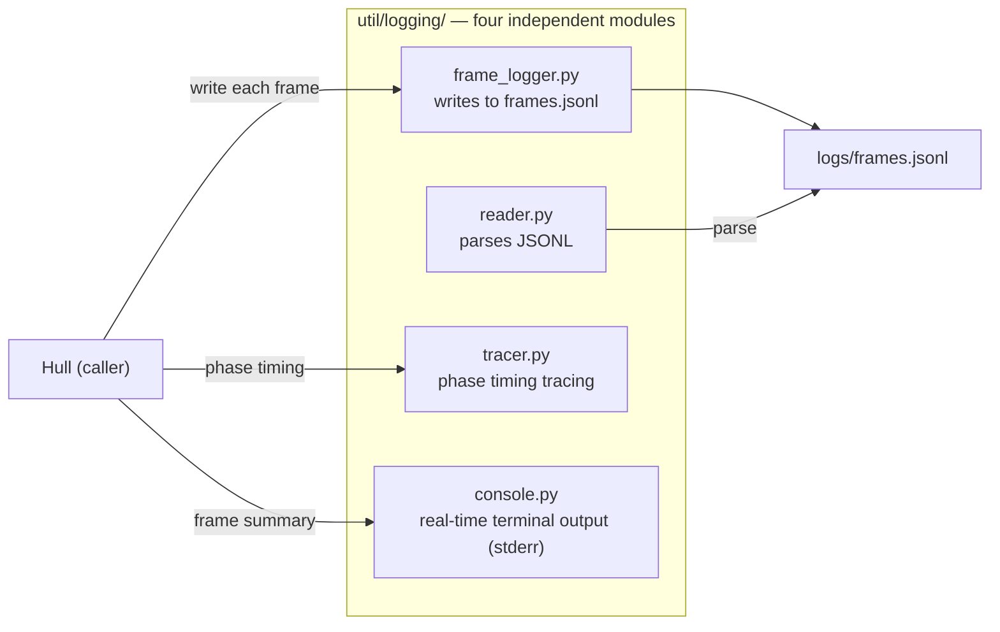
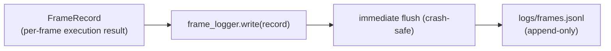

# Logging

ARK observability subsystem. Provides four independent modules for frame log writing, reading, tracing, and terminal output.

Responsible for:
- Frame log writing (frame_logger.py) — appends to a single frames.jsonl, continuous across runs
- Frame log reading (reader.py) — parses JSONL into a list of FrameRecords
- Execution phase tracing (tracer.py) — records phase entry/exit timestamps
- Real-time terminal output (console.py) — per-frame summary and run totals

Not responsible for:
- HTML frame visualization — retired with viewer.html; frame visualization is now owned by the Launcher's built-in frames view
- Markdown report generation (reporter.py deleted; replaced by HTML viewer)
- General utilities outside of logging (in the util/ parent package)
- Protocols with Shell, Hull, or Cell layers
- Configuration management (handled by Hull)

## Constraints

1. Does not directly import Shell, Hull, or Cell layer code (only allowed to import the FrameRecord protocol)
2. Persistence format must be JSONL (one record per line as JSON); no other formats allowed
3. All write operations must flush immediately after each write to prevent data loss on crash
4. The four modules have no lateral dependencies (frame_logger no longer depends on reporter); only standard library dependencies
5. All terminal output writes to sys.stderr; stdout is not polluted
6. All public functions must have complete docstrings and type annotations
7. No single file exceeds 400 lines

## Design

Logging exists to separate observability concerns from runtime logic. Hull's run() loop is only responsible for executing frames, not for understanding "what happened". Writing (frame_logger), reading (reader), tracing (tracer), and terminal display (console) are each independent and can be replaced independently.

JSONL is the only persistence format. Immediate flush after each write is the foundation of crash safety — frames written before a mid-execution Agent crash are not lost. All runs append to the same `logs/frames.jsonl`; per-run timestamped subdirectories are no longer created.

Invariants: All persisted data must be valid JSONL; calling write before open() on any write module must raise RuntimeError; terminal output writes only to stderr.

## Status

### TODO
None.

### Known Issues
None.

### Active
None.
