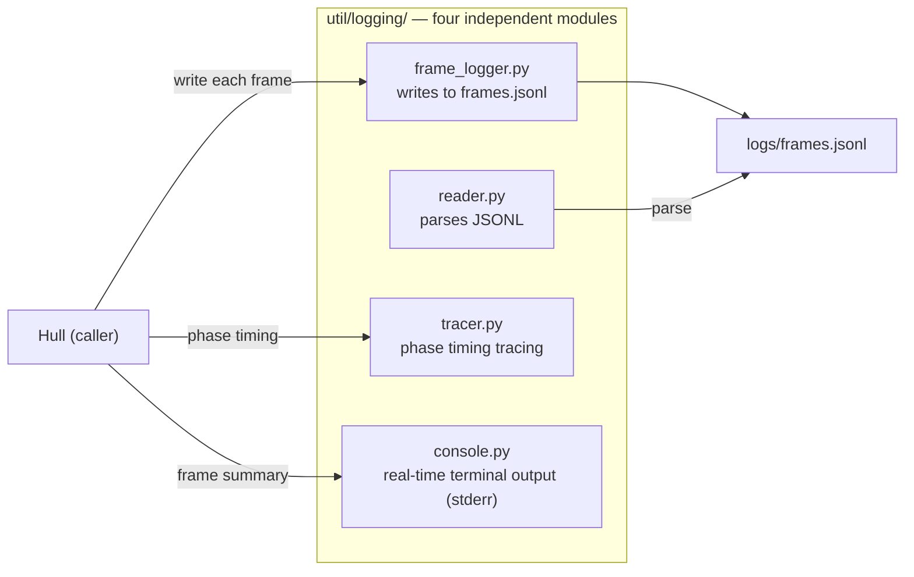
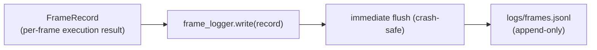

# Logging

ARK observability subsystem. Provides four independent modules for frame log writing, reading, tracing, and terminal output.

Responsible for:
- Frame log writing (frame_logger.py) — appends to a single frames.jsonl, continuous across runs
- Frame log reading (reader.py) — parses JSONL into a list of FrameRecords
- Execution phase tracing (tracer.py) — records phase entry/exit timestamps
- Real-time terminal output (console.py) — per-frame summary and run totals

Not responsible for:
- HTML frame visualization — retired; frame visualization is now owned by the Launcher's built-in frames view
- Markdown report generation (reporter.py deleted)
- General utilities outside of logging (in the util/ parent package)
- Protocols with Shell, Hull, or Cell layers
- Configuration management (handled by Hull)

## Design

Logging exists to separate observability concerns from runtime logic. Hull's run() loop is only responsible for executing frames, not for understanding "what happened". Writing (frame_logger), reading (reader), tracing (tracer), and terminal display (console) are each independent and can be replaced independently.



frame_logger.close() no longer generates report files (summary.md, detailed.md) and only closes the file handle.

JSONL is the only persistence format. Immediate flush after each write is the foundation of crash safety — frames written before a mid-execution Agent crash are not lost. All runs append to the same `logs/frames.jsonl`; per-run timestamped subdirectories are no longer created.



Invariants: All persisted data must be valid JSONL; calling write before open() on any write module must raise RuntimeError; terminal output writes only to stderr.

## Public Interface

### class FrameLogger

JSONL frame log writer. All runs append to the same frames.jsonl.

### class Tracer

Trace log manager.


## File Structure

```
__init__.py          __init__.py — Logging subpackage public interface: FrameLogger and Tracer.
console.py           console.py — Real-time terminal frame output formatting; writes per-frame summary and run totals to sys.stderr.
frame_logger.py      frame_logger.py — JSONL frame log writer; all runs append to the same frames.jsonl.
reader.py            reader.py — Canonical JSONL log reading; parses frame records written by FrameLogger.
tests/
tracer.py            tracer.py — Records Agent execution phase entry/exit timestamps; outputs to .trace.log file.
```

## Dependencies

- `vessal.ark.shell.hull.cell.protocol`
- `vessal.ark.util.logging.frame_logger`
- `vessal.ark.util.logging.tracer`


## Tests

- `test_console.py`
- `test_frame_logger.py`
- `test_log_reader.py`

Run: `uv run pytest src/vessal/ark/util/logging/tests/`


## Status

### TODO
None.

### Known Issues
None.

### Active
None.
