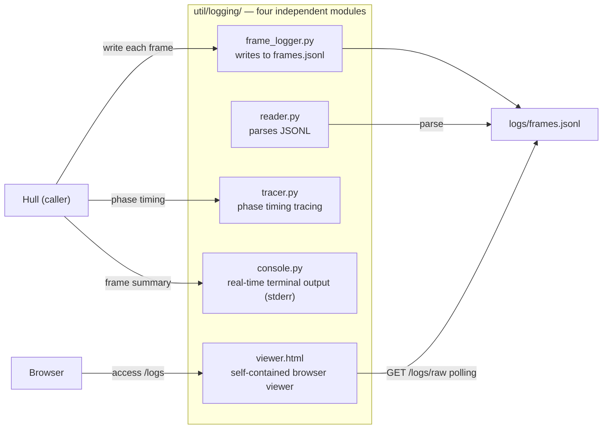
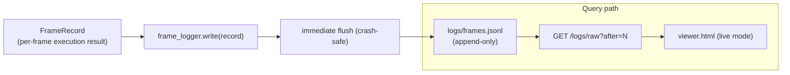

<!-- Generated by Formalin. Do not edit. Source: CONTEXT.md -->

# Logging

ARK observability subsystem. Provides four independent modules for frame log writing, reading, HTML viewing, tracing, and terminal output.

Responsible for:
- Frame log writing (frame_logger.py) — appends to a single frames.jsonl, continuous across runs
- Frame log reading (reader.py) — parses JSONL into a list of FrameRecords
- HTML viewer (viewer.html) — self-contained in-browser viewer supporting live mode and standalone file mode
- Execution phase tracing (tracer.py) — records phase entry/exit timestamps
- Real-time terminal output (console.py) — per-frame summary and run totals

Not responsible for:
- Markdown report generation (reporter.py deleted; replaced by HTML viewer)
- General utilities outside of logging (in the util/ parent package)
- Protocols with Shell, Hull, or Cell layers
- Configuration management (handled by Hull)

## Design

Logging exists to separate observability concerns from runtime logic. Hull's run() loop is only responsible for executing frames, not for understanding "what happened". Writing (frame_logger), reading (reader), HTML viewing (viewer.html), tracing (tracer), and terminal display (console) are each independent and can be replaced independently.



reporter.py was removed in v6 because Markdown reports are single-generation artifacts and do not support incremental viewing, live tracking, or filtering. The HTML viewer provides two functions via the `/logs` endpoint: live mode (polling `/logs/raw?after=N`) and standalone file mode (drag a local file:// JSONL into the browser). Both modes run in the browser with no build tools needed; viewer.html is the sole artifact.

frame_logger.close() no longer generates report files (summary.md, detailed.md) and only closes the file handle. The dependency chain has changed from "write → report" to "write → HTTP viewer"; frame_logger's close() no longer has side effects, making test verification simpler.

JSONL is the only persistence format. Immediate flush after each write is the foundation of crash safety — frames written before a mid-execution Agent crash are not lost. All runs append to the same `logs/frames.jsonl`; per-run timestamped subdirectories are no longer created. This keeps historical logs continuously queryable, and the `/logs/raw` endpoint always points to a fixed path.



viewer.html supports both v5 (no ping field) and v6 (with ping field) formats for backward compatibility. The debug view shows full Ping+Pong; the behavior view shows only Action + State signals + Observation; system_prompt is collapsed by default.

Invariants: All persisted data must be valid JSONL; calling write before open() on any write module must raise RuntimeError; terminal output writes only to stderr.

## Public Interface

### class FrameLogger

JSONL frame log writer. All runs append to the same frames.jsonl.

### class Tracer

Trace log manager.


## File Structure

```
__init__.py          __init__.py — Logging subpackage public interface: FrameLogger and Tracer.
console.py           console.py — Real-time terminal frame output formatting; writes per-frame summary and run totals to sys.stderr.
frame_logger.py      frame_logger.py — JSONL frame log writer; all runs append to the same frames.jsonl.
reader.py            reader.py — Canonical JSONL log reading; parses frame records written by FrameLogger.
tests/
tracer.py            tracer.py — Records Agent execution phase entry/exit timestamps; outputs to .trace.log file.
```

## Dependencies

- `vessal.ark.shell.hull.cell.protocol`
- `vessal.ark.util.logging.frame_logger`
- `vessal.ark.util.logging.tracer`


## Tests

- `test_console.py`
- `test_frame_logger.py`
- `test_log_reader.py`

Run: `uv run pytest src/vessal/ark/util/logging/tests/`


## Status

### TODO
None.

### Known Issues
None.

### Active
None.
