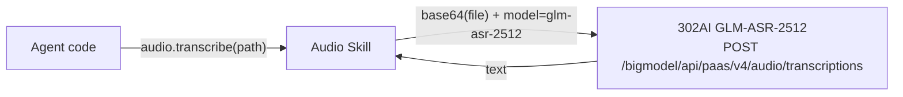

# Audio

Wrapper for the 302AI GLM-ASR-2512 speech transcription API. Agent transcribes audio files to text via audio.transcribe(). Primarily used for processing audio questions in GAIA evaluation.

Responsible for:
- Transcribing audio files to text (transcribe())
- Base64 encoding and uploading via HTTP

Not responsible for:
- Long audio slicing (the ≤30 second limit is enforced by the API)
- Real-time speech
- File format conversion

## Constraints

1. API key is read from environment variable `API_302AI_KEY`; error on call if not set
2. Raises FileNotFoundError when file does not exist
3. Raises ValueError when file > 25MB (enforced client-side)
4. HTTP errors include the API-returned body (up to 200 characters)
5. Returned text is automatically strip()ped

## Design

## Status

### TODO
None.

### Known Issues
None.

### Active
None.
