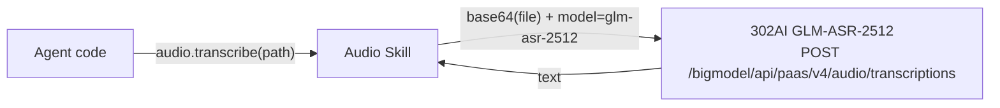

# Audio

Wrapper for the 302AI GLM-ASR-2512 speech transcription API. Agent transcribes audio files to text via audio.transcribe(). Primarily used for processing audio questions in GAIA evaluation.

Responsible for:
- Transcribing audio files to text (transcribe())
- Base64 encoding and uploading via HTTP

Not responsible for:
- Long audio slicing (the ≤30 second limit is enforced by the API)
- Real-time speech
- File format conversion

## Design



## Public Interface

### Skill

_Definition not found._


## File Structure

```
__init__.py          audio — audio-to-text Skill.
skill.py             Audio transcription via 302AI GLM-ASR-2512.
```

## Dependencies

- `vessal.ark.shell.hull.skill`


## Tests

_No test directory._


## Status

### TODO
None.

### Known Issues
None.

### Active
None.
