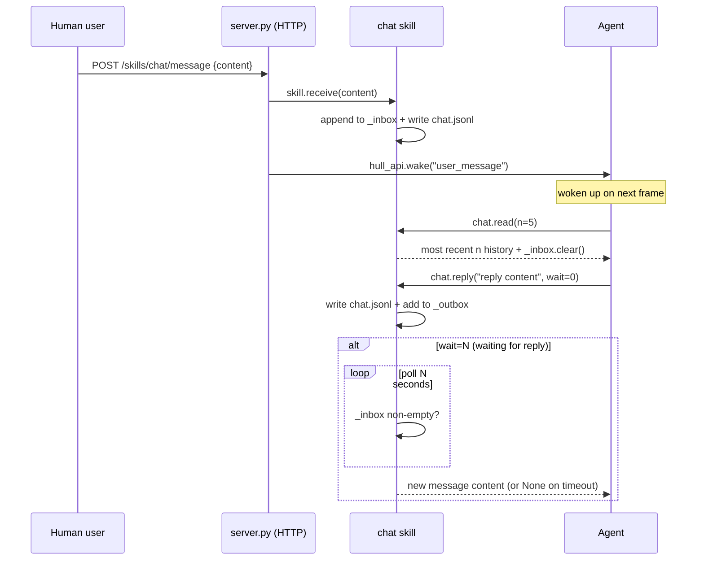

<!-- Generated by Formalin. Do not edit. Source: CONTEXT.md -->

# Chat

Bidirectional human-machine async communication Skill. Maintains inbox/outbox message queues, persists conversation history to a JSONL file, and reports unread message status to Agent each frame.

Responsible for:
- Receiving human messages from server.py (receive())
- Providing Agent an interface to read conversation history (read(n=5))
- Providing Agent an interface to send messages to humans with optional blocking wait for reply (reply(content, wait=0))
- Providing Shell an interface to drain replies (drain_outbox())
- Append-only persistence of conversation history to data/chat.jsonl

Not responsible for:
- HTTP transport (handled by the companion server.py server)
- Agent scheduling and wake-up (handled by Hull)
- Conversation history compression or summarization (handled by Cell)

## Design

Chat Skill exists to decouple asynchronous communication from Agent execution. Humans can send messages at unpredictable times, while Agent runs frame by frame. The inbox/outbox queues are a buffer layer that allows humans to send messages at any time without blocking Agent.

For shape, the Skill is a combination of pure in-memory queue and file persistence, without its own HTTP server. The HTTP entry point is provided by the companion server.py: in Hull-hosted mode, `start(hull_api, skill)` registers routes; _handle_inbox directly calls `skill.receive()` to deliver messages and wake Agent, bypassing file IPC.

API design: two public methods. `read(n=5)` returns the most recent n conversations (user + agent), clears inbox and unread_count, for Agent to read context before handling messages. `reply(content, wait=0)` sends an agent message; wait=0 does not wait; wait=N polls inbox for N seconds waiting for a human reply and returns the content (returns None on timeout).



Key invariant: _inbox.clear() after read() or reply() ensures reply(wait=N) does not misidentify old messages as new replies — the old inbox is cleared before reply, and polling only picks up messages newly delivered by receive().

Relationship with server.py: in Hull-hosted mode, server.py holds a reference to the Skill instance (injected via start()); receive() is the sole message delivery entry point, no longer requiring _sync_chat() file polling.

## Public Interface

### class Chat

Human bidirectional communication Skill.


## File Structure

```
__init__.py          chat — human interaction Skill.
server.py            chat Skill HTTP routes.
skill.py             chat Skill — human bidirectional communication.
tests/
```

## Dependencies

- `vessal.ark.shell.hull.hull_api`
- `vessal.ark.shell.hull.skill`


## Tests

- `test_chat.py` — test_chat — Chat Skill tests.
- `test_chat_server.py`
- `test_server_static.py` — test_server_static — chat server static file routing tests.

Run: `uv run pytest src/vessal/skills/chat/tests/`


## Status

### TODO
None.

### Known Issues
None.

### Active
None.
