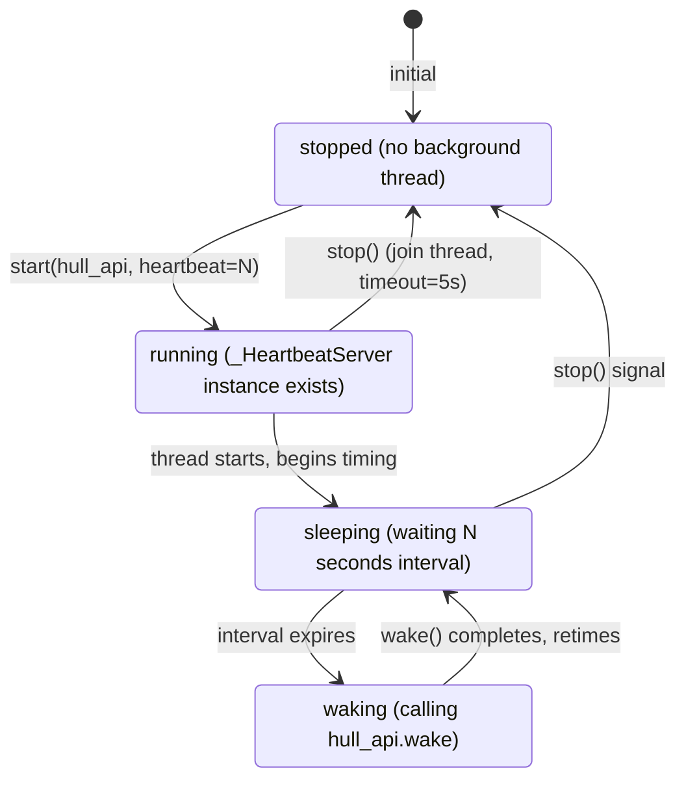

<!-- Generated by Formalin. Do not edit. Source: CONTEXT.md -->

# Heartbeat

Periodic timer wake-up Skill. Calls hull.wake("heartbeat") from a background thread at a configurable interval, preventing Agent from sleeping indefinitely when there are no external events.

Responsible for:
- Starting the background timer thread (server.py start())
- Periodically calling hull_api.wake("heartbeat")
- Cleanly stopping the timer thread (server.py stop())

Not responsible for:
- Executing any Agent logic (only wakes, does not execute)
- Managing Agent behavior after wake-up (handled by Hull/Cell)
- Configuration persistence (interval is passed in by Hull from hull.toml)

## Design

Heartbeat solves the "deadlock" scenario in Agent's event-driven model: Hull only wakes Agent when events arrive, but if there are no external events at all (user silence, all tasks blocked), Agent sleeps indefinitely, unable to perform proactive work (polling, periodic checks, maintenance tasks). Heartbeat serves as a time-driven fallback mechanism ensuring Agent is woken up at least once every N seconds.

Shape choice: server.py pattern (rather than embedded logic in skill.py). Heartbeat's core logic is a timer; it doesn't need SkillBase's frame signal mechanism, only a start/stop lifecycle. This is consistent with the Human Skill's server.py companion pattern; Hull automatically discovers and manages the lifecycle.



Using instance pattern rather than module-level thread objects ensures safe test isolation: each start() creates a new _HeartbeatServer instance; stop() destroys the old instance; no state leaks across tests.

The interval is passed in via the `[hull].heartbeat` config key in hull.toml, not hardcoded or from environment variables, keeping configuration centralized in one place. The default of 1800 seconds is based on the judgment that "Agent should not go more than 30 minutes without any proactive action".

Relationship with Hull: Hull calls server.start(hull_api), passing the hull_api reference; the heartbeat thread holds this reference and periodically calls wake(). Hull is responsible for routing heartbeat events to Cell for frame execution.

## Public Interface

### class Skill

Periodic heartbeat wake-up Skill, paired with server.py timer to prevent Agent from sleeping indefinitely.


## File Structure

```
__init__.py          heartbeat — periodic heartbeat wake-up Skill.
server.py            heartbeat server — heartbeat timer.
skill.py             heartbeat skill — periodic heartbeat wake-up.
```

## Dependencies

- `vessal.ark.shell.hull.hull_api`
- `vessal.ark.shell.hull.skill`


## Tests

_No test directory._


## Status

### TODO
- [ ] 2026-04-09: Write initial heartbeat Skill tests

### Known Issues
None.

### Active
None.
