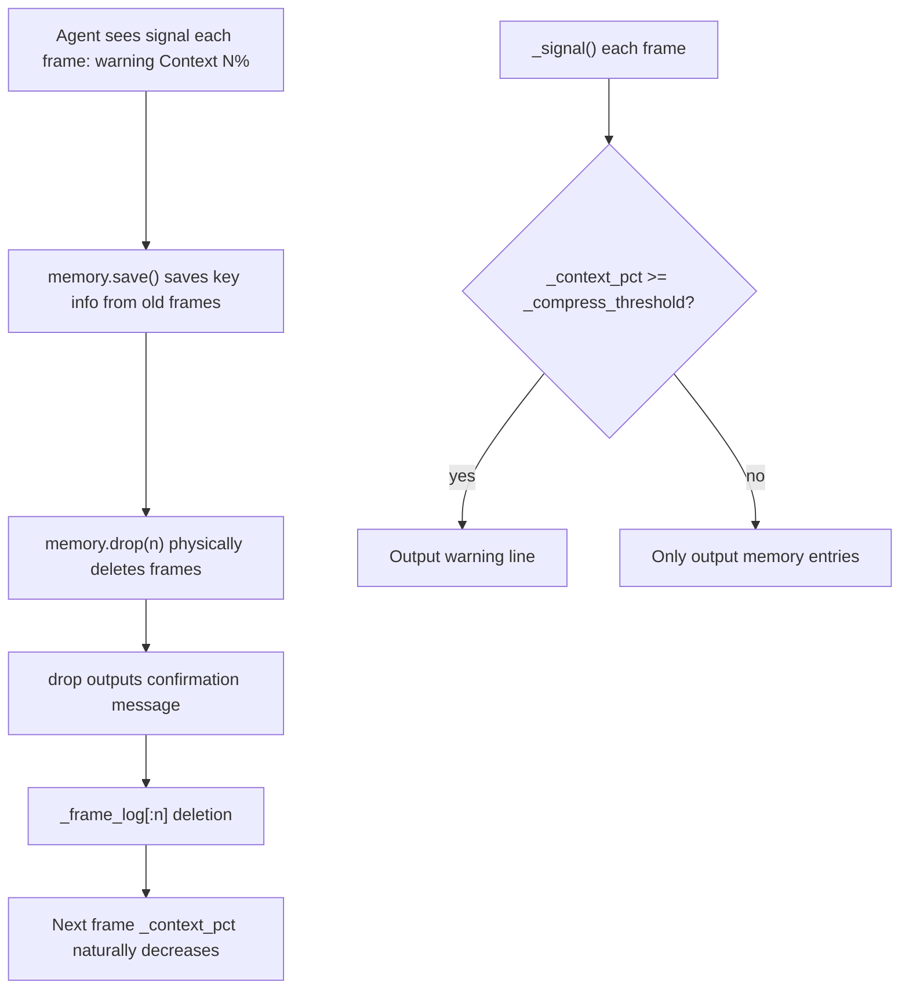
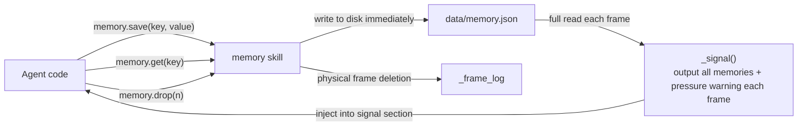

# Memory

File-persisted key-value memory. Agent stores cross-session memories via save(); all memories are displayed in signal each frame. Also monitors context pressure: when it exceeds a threshold, prompts Agent to summarize old frames and delete them.

**Core positioning: search replaces persistent context.** Information that doesn't need to be in context every frame should be stored in memory and retrieved when needed. This is Agent's proactive means of managing its own context.

Responsible for:
- Key-value storage (save/get/delete)
- Signal output of all memories each frame
- Context pressure signal (reads `_context_pct`; warns when it exceeds `_compress_threshold`)
- Physical frame deletion (drop(n): truncates oldest n frames from `_frame_log`)

Not responsible for:
- Search/retrieval (future optimization)
- Vectorization/embedding (future optimization)
- Automatic summarization (Agent manually summarizes with memory.save() then drop())

## Constraints

1. Storage file is data/memory.json, JSON format
2. save() must write to disk immediately
3. signal outputs all memories in full (key: value summary), no filtering
4. value can be any JSON-serializable object
5. drop(n) retains at least 1 frame; clearing the frame stream entirely is not allowed
6. drop(n) must output a confirmation message before executing deletion
7. signal threshold defaults to 50%, controlled by `_compress_threshold` namespace variable (configured via hull.toml [cell].compress_threshold)

## Design

Simplest approach: one JSON file stores all key-value pairs. Signal does a full dump.

Context pressure detection is implemented in `_signal()`: reads `_context_pct` (calculated after Kernel rendering), appends a warning line when it exceeds `_compress_threshold` (default 50), guiding Agent to use drop(n) to manage frame stream.

drop(n) directly operates on `_frame_log` (referenced from ns; Memory saves the ns reference on initialization). After physical deletion, the frame stream shortens; `_context_pct` naturally decreases on the next frame render. Cold storage (FrameLogger JSONL) is not affected.

## Status

### TODO
- [ ] 2026-04-10: Future addition of search/retrieval capability

### Known Issues
None.

### Active
None.
