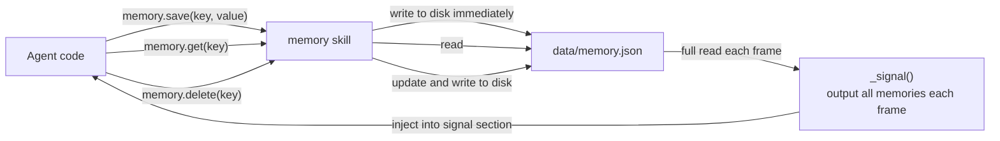

# Memory

File-persisted key-value memory. Agent stores cross-session memories via save(); all memories are displayed in signal each frame.

Responsible for:
- Key-value storage (save/get/delete)
- Signal output of all memories each frame

Not responsible for:
- Search/retrieval (future optimization)
- Vectorization/embedding (future optimization)

## Design

Simplest approach: one JSON file stores all key-value pairs. Signal does a full dump.
As the number of memory entries grows, the signal becomes long, but not optimizing at this stage —
wait until actual usage reveals a bottleneck before doing retrieval and truncation.



## Public Interface

### class Memory

Cross-session key-value memory. Agent calls save/get/delete to manage memory entries.


## File Structure

```
__init__.py          memory — cross-session key-value memory Skill.
skill.py             skill — Memory Skill implementation.
tests/
```

## Dependencies

- `vessal.ark.shell.hull.skill`


## Tests

- `test_memory.py` — test_memory — Memory Skill tests.

Run: `uv run pytest src/vessal/skills/memory/tests/`


## Status

### TODO
- [ ] 2026-04-10: Future addition of search/retrieval capability

### Known Issues
None.

### Active
None.
