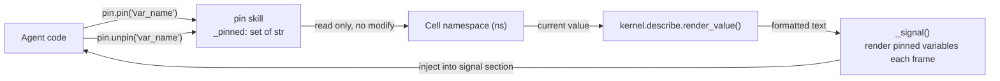

# Pin

Variable fixed-observation Skill. Adds specified namespace variable names to an observation list, rendering their current values to the Agent signal section each frame; read-only, no writes.

Responsible for:
- Adding variables to the observation list (pin())
- Removing variables from the observation list (unpin())
- Reading current values of pinned variables from namespace each frame and rendering them (_signal())

Not responsible for:
- Modifying any variable in namespace
- Variable value history recording or change detection
- Formatting logic (handled by kernel.describe.render_value())

## Design

Pin exists because Agent debugging needs the ability to "continuously watch a specific variable". Without Pin, Agent can only manually print variables each frame, or rely on Cell's full namespace rendering (too much noise). Pin provides a precise "variable window" — displaying only the variables Agent cares about.

The shape is extremely simple: a set stores variable names, a dict reference (ns) is used for reading values. No persistence, because the observation list is debugging state; it naturally disappearing at session end is reasonable. No change detection, because rendering the current value every frame is already sufficient for Agent to detect changes.

Rendering is delegated to `kernel.describe.render_value()`, maintaining rendering consistency with Cell, avoiding Pin and Cell producing different display formats for the same variable.

Invariant: ns reference is read-only. Any behavior that modifies ns violates Pin's boundary and should be placed in Agent code or other skills.

Relationship with Cell/Kernel: depends on kernel.describe.render_value for rendering, but does not depend on Cell itself. Relationship with Hull: participates in the frame loop via SkillBase protocol; _signal() output is injected into Agent system prompt.

## Public Interface

### class Pin

Variable fixed-observation Skill.

## Tests

- `test_pin_skill.py` — test_pin_skill — Pin Skill class-based API tests.

Run: `uv run pytest src/vessal/skills/pin/tests/`

## Status

### TODO
None.

### Known Issues
None.

### Active
None.
