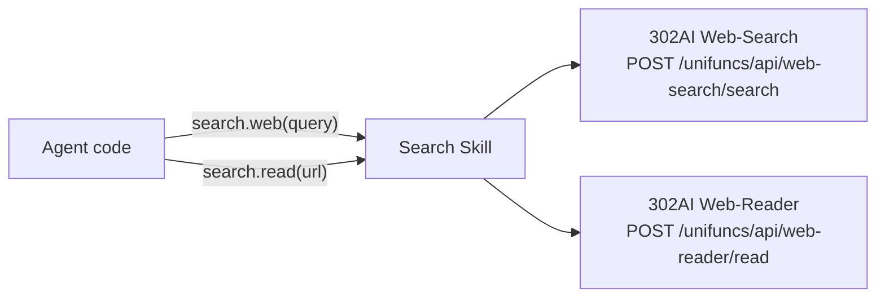

# Search

Wrapper for 302AI Web-Search and Web-Reader. Agent searches web pages via search.web() and reads full web page text via search.read(). Solves the 100% failure rate of DuckDuckGo in the mainland China network environment.

Responsible for:
- Web search (web-search API, returns [{name, url, snippet, summary}])
- Full web page text reading (web-reader API, returns markdown)

Not responsible for:
- Image search
- Pagination (count parameter controls single-request return count)
- Caching

## Constraints

1. API key is read from environment variable `API_302AI_KEY`; error on call if not set
2. Network errors (HTTPError/URLError) are wrapped in RuntimeError before being raised
3. web()'s `code` check uses default value 0 (`data.get("code", 0) != 0`)
4. Stateless: each call is independent, no caching, no persistent connections

## Design

## Status

### TODO
None.

### Known Issues
None.

### Active
None.
