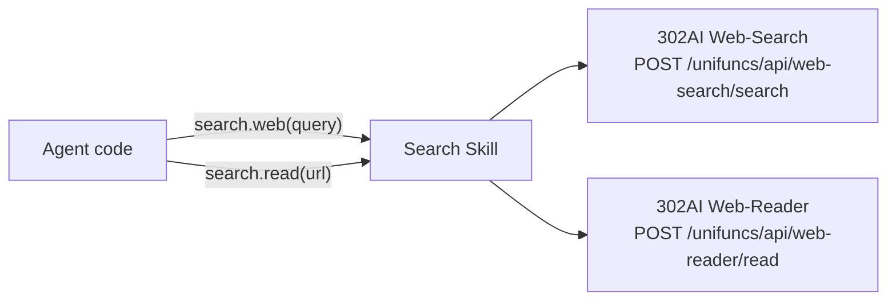

<!-- Generated by Formalin. Do not edit. Source: CONTEXT.md -->

# Search

Wrapper for 302AI Web-Search and Web-Reader. Agent searches web pages via search.web() and reads full web page text via search.read(). Solves the 100% failure rate of DuckDuckGo in the mainland China network environment.

Responsible for:
- Web search (web-search API, returns [{name, url, snippet, summary}])
- Full web page text reading (web-reader API, returns markdown)

Not responsible for:
- Image search
- Pagination (count parameter controls single-request return count)
- Caching

## Design



## Public Interface

### Skill

_Definition not found._


## File Structure

```
__init__.py          search — web search and web page reading Skill.
skill.py             Web search and page reading via 302AI API.
```

## Dependencies

- `vessal.ark.shell.hull.skill`


## Tests

_No test directory._


## Status

### TODO
None.

### Known Issues
None.

### Active
None.
