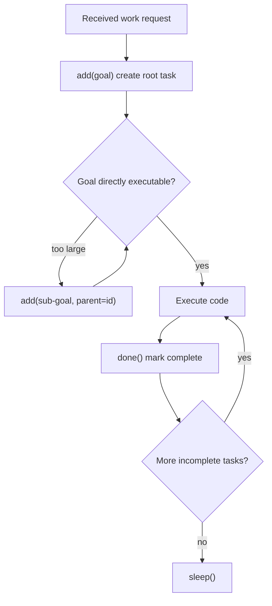

# Tasks

Hierarchical task tree management Skill. Tree structure + auto focus + minimal API.

Responsible for:
- Hierarchical task CRUD (add/done/remove/list)
- Automatic hierarchical ID assignment ("1", "1.1", "1.1.1")
- Auto-selection of current task (first incomplete leaf node)
- Pre-filling guidance tasks on wake-up
- Rendering task tree + current task each frame (_signal)
- Injecting cognitive protocol (_prompt, methodology only, no method names)

Not responsible for:
- Task persistence
- Dependencies (blocked_by, future version)
- Task assignment and scheduling

## Constraints

1. Only two valid statuses: active, done
2. add() must print feedback
3. done() must print feedback, including the next current task
4. remove() must cascade-delete all child tasks
5. _prompt() must not contain method signatures
6. Current task is automatically selected by the system; Agent does not set it manually
7. On wake-up with empty task list, guidance tasks are automatically pre-filled
8. ID sorting must use numeric sorting ("1.10" > "1.2"); lexicographic sorting is forbidden
9. add()/done()/remove() must sync ns["_current_task_id"] (read by event_loop._should_compress). _signal() is read-only; does not write to namespace.

## Design

### Map Philosophy

Agent's task tree is its map, and also its life. Any action Agent takes must follow the map — no action without a map. The map can be modified at any time, but must always exist.

### Theoretical Framework

Four theories support the design of Tasks:

**GTD (Getting Things Done)** — project/next-action separation. Root task = project (multi-step outcome), child task = next action (smallest executable step). Tasks forces Agent to build the project first, then decompose.

**HTN (Hierarchical Task Network)** — abstract→primitive lazy decomposition. Agent does not need to plan all sub-tasks at once; can discover them as it proceeds.

**Kanban WIP=1** — at most one in-progress task at any time. Claude Code, Codex both use this hard constraint.

**DFS/LIFO** — depth-first execution. Current task is always the deepest incomplete leaf. Automatically moves to the next one after completion.

### Hierarchical Numbering

ID format "1.2.3" — the 3rd sub-task of the 2nd sub-task of the 1st project. The ID itself encodes the hierarchy; structure is visible when copied anywhere. No tree connectors or special formatting needed.

### Auto Focus

Current task = the first leaf node with status != "done", sorted by number. Agent does not need to manually manage focus. After done(), the system automatically moves to the next one.

## Status

### TODO
None.

### Known Issues
None.

### Active
- 2026-04-13: tasks API redesign — cut from 6-method footgun to 4-method minimal API
