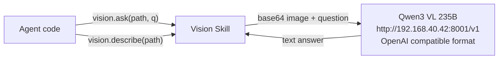

# Vision

Wrapper for Qwen3 VL 235B local server. Agent understands image content via vision.ask() and vision.describe(). Primarily used for reading charts and image questions in GAIA evaluation.

Responsible for:
- Image content description (describe())
- Question answering about images (ask())

Not responsible for:
- Video understanding
- Multi-image comparison
- URL images (must be downloaded to local filesystem first)

## Constraints

1. Image file must exist on local filesystem
2. Supports png/jpg/jpeg/gif/webp; other formats are treated as image/png
3. Uses lazy initialization: OpenAI client is created on first call
4. Backend address and api_key are configured via environment variables (VISION_BASE_URL, VISION_API_KEY)

## Design

## Status

### TODO
None.

### Known Issues
None.

### Active
None.
