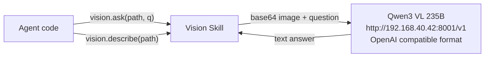

# Vision

Wrapper for Qwen3 VL 235B local server. Agent understands image content via vision.ask() and vision.describe(). Primarily used for reading charts and image questions in GAIA evaluation.

Responsible for:
- Image content description (describe())
- Question answering about images (ask())

Not responsible for:
- Video understanding
- Multi-image comparison
- URL images (must be downloaded to local filesystem first)

## Design



## Public Interface

### Skill

_Definition not found._


## File Structure

```
__init__.py          vision — image understanding Skill.
skill.py             Image understanding via Qwen3 VL.
```

## Dependencies

- `vessal.ark.shell.hull.skill`


## Tests

_No test directory._


## Status

### TODO
None.

### Known Issues
None.

### Active
None.
